# Delivery Management — Product UX Specification

**Applies to v5 (frozen) and v6 · canonical**

---

## About this specification

**What it is.** The one canonical description of what the Delivery Management product does,
written from the driver's point of view: what they are trying to achieve, what the product
lets them do, what it stops them doing, and what happens when the day does not go to plan.

**Scope.** Behaviour only. There are no implementation details here — no file names, no
component names, no data shapes, no internal routes.

**Source of truth.** The frozen `v5` build, exercised directly. Quoted copy is verbatim from
the product. Nothing here is proposed or aspirational. Where the product does something that
contradicts what it tells the driver, that is recorded as a **defect**, never described as a
design.

> The Delivery Management module is identical in **v5** and **v6**. v6 only frames it in the
> platform shell — sidebar on desktop, platform header on mobile. That adds no screens and
> changes no behaviour. This specification describes both.

### How to read it

**Part A is the product.** One master flow — *The Driver's Day* — organised by what the driver
is trying to achieve, with every major exception branching off the goal it interrupts. Then
the state model, then the four layers the interface is built from.

**Part B is the detail**, grouped under the same six goals. Each journey is documented
**exactly once**, and describes only what happens *inside* that screen — the connections
between screens live in the master flow and in the screen table at §4.1, and are not redrawn.

**Part C is the reference** — rules, validation, empty states, edge cases, defects — so that
nothing has to be repeated inside a journey. §30 proves the coverage.

### The four layers

Every element in this document is one of four things. The distinction matters, because they
behave differently and are tested differently.

| Layer | What it is | Inventory |
| --- | --- | --- |
| 🖥 **Screen** | Fills the display, has its own header and its own way back or forward | §4.1 — 23 of them |
| 🗂 **Sheet or panel** | Rises over the current screen, dims it, and returns to it. Never navigates | §4.2 — 11 of them |
| ✏️ **Inline interaction** | Changes the current screen in place. No overlay, no navigation | §4.3 |
| ⚙️ **System state** | The product enters it on its own, without the driver asking | §4.4 |

### Status markers

Used throughout, and never omitted where they apply.

| Marker | Meaning |
| --- | --- |
| 🛑 **BLOCKED** | A defect. The driver cannot complete this goal at all. See §27 |
| 🐞 **BUG** | A defect. The product behaves differently from what it tells the driver. See §27 |
| ⚪ **Not reachable** | Implemented and correct, but nothing in this cut leads to it. Not a defect. See §28 |
| — | Everything unmarked works as described |

---

### Terminology — one name per thing

These names are used throughout, without variation. Where the product's own on-screen wording
differs from the canonical name, the wording is quoted here and never used as a name.

| Canonical name | What it is | On-screen wording, where it differs |
| --- | --- | --- |
| **Route** | One day's work: a van-load of stock plus a list of shops | — |
| **Stop** | One shop on a route | — |
| **Delivery Queue** | The screen listing every stop on the route | Its back link on every child screen reads **"← Delivery Stops"**; the queue's own back link reads "← Routes" |
| **The stop screen** | The single screen a stop opens into. It has two faces — see below | — |
| **Book Order** | The stop screen's face when nothing is booked and the stop is not finished: a catalogue to sell from | — |
| **At Customer** | The stop screen's face when an order exists, or the stop is finished: goods to hand over, money to collect | — |
| **Stop Summary** | The read-back of a finished stop | — |
| **More Actions** | The sheet raised from Book Order and Stop Summary | — |
| **Outstanding** | Money the shop already owed before today | — |
| **Advance** | Credit the shop carries in from a previous over-payment | Shown in the queue as "Over Paid" / "Over Payment" |
| **Product Return** | The screen for taking goods back | — |
| **Manage Assets** | The screen for crates, trays and returnable packaging | — |
| **Settle Route** | The end-of-day checklist screen | — |
| **Route Intelligence** | The end-of-day score and breakdown screen | Its entry button on Settle Route reads **"🎉 View Route Summary →"**; the Home card button for a closed route reads **"View Summary →"** |
| **Reports** | The list of closed routes | — |

**Two names deliberately not used.** "Customer Queue" is not a product name and appears nowhere
in this document. **"Route Summary"** is not a screen: it is the button label that opens Route
Intelligence, and separately the heading of a figures block *on Pre-Start*. The screen is always
called **Route Intelligence**.

**One screen, two faces.** Book Order and At Customer are the same screen showing whichever
face fits the stop: **Book Order** when nothing is booked *and* the stop is not finished,
**At Customer** otherwise. This is why placing an order does not navigate — the screen repaints
as At Customer in place.

---

### Contents

**Part A — The product**
[1. Who it is for, and the six goals](#1-who-it-is-for-and-the-six-goals) ·
[2. The Driver's Day — the canonical master flow](#2-the-drivers-day--the-canonical-master-flow) ·
[3. The state model](#3-the-state-model) ·
[4. The four layers of the interface](#4-the-four-layers-of-the-interface)

**Part B — The journeys**
*Goal 1* [5. Home](#5-home) · [6. New Delivery](#6-new-delivery) · [7. Start of day](#7-start-of-day)
*Goal 2* [8. Delivery Queue](#8-delivery-queue) · [9. New Customer 🛑](#9-new-customer--blocked)
*Goal 3* [10. At Customer](#10-at-customer) · [11. Book Order](#11-book-order) · [12. Payment](#12-payment) · [13. Skip Stop](#13-skip-stop) · [14. Stop Summary](#14-stop-summary) · [15. More Actions](#15-more-actions) · [16. Product Return](#16-product-return) · [17. Manage Assets](#17-manage-assets)
*Goal 4* [18. Restock](#18-restock)
*Goal 5* [19. Settlement](#19-settlement)
*Goal 6* [20. Route Intelligence](#20-route-intelligence) · [21. Reports](#21-reports)

**Part C — Reference**
[22. Global interaction patterns](#22-global-interaction-patterns) ·
[23. Business rules](#23-business-rules) ·
[24. Validation, disabled and locked states](#24-validation-disabled-and-locked-states) ·
[25. Empty states](#25-empty-states) ·
[26. Edge cases and deliberate behaviours](#26-edge-cases-and-deliberate-behaviours) ·
[27. Defects — BLOCKED and BUG](#27-defects--blocked-and-bug) ·
[28. Not reachable in this cut](#28-not-reachable-in-this-cut) ·
[29. Deliberate non-features](#29-deliberate-non-features) ·
[30. Canonical UX coverage](#30-canonical-ux-coverage)

---
---

# Part A — The product

## 1. Who it is for, and the six goals

**Who uses it.** One person: the **delivery driver**. They load a van in the morning, drive a
fixed list of shops, sell and hand over goods, take money, handle whatever goes wrong at each
door, and at the end of the day account for every unit and every rupee they were trusted with.
It is used one-handed, standing at a shop counter.

**What it is for.** *Stopping the driver from skipping a step that matters.* A route cannot
start until stock and change money are recorded; a count that disagrees with expectation cannot
be submitted without a written explanation; and nothing consequential ever happens on a single
tap.

**The driver's day is six goals.** Everything in the product serves one of them.

| | Goal | In the driver's words | Part B |
| --- | --- | --- | --- |
| 1 | **Take charge of the van** | "Prove what I am carrying, in stock and in cash" | §5 – §7 |
| 2 | **Work the round** | "Get to every shop on my list" | §8 – §9 |
| 3 | **Serve one shop** | "Sell, hand over, get paid, and record what happened" | §10 – §17 |
| 4 | **Keep the van stocked** | "Go back for more when I run low" | §18 |
| 5 | **Account for the day** | "Hand back every unit and every rupee" | §19 |
| 6 | **Show what the day came to** | "See how I did, and prove it" | §20 – §21 |

---

## 2. The Driver's Day — the canonical master flow

This is the **only** master flow in this document. It is organised by goal, not by screen: the
spine is what the driver is trying to achieve, and every major exception branches sideways off
the goal it interrupts. Screens are named on each step (🖥) so the map ties back to §4.1, which
carries the screen-by-screen connections in full.

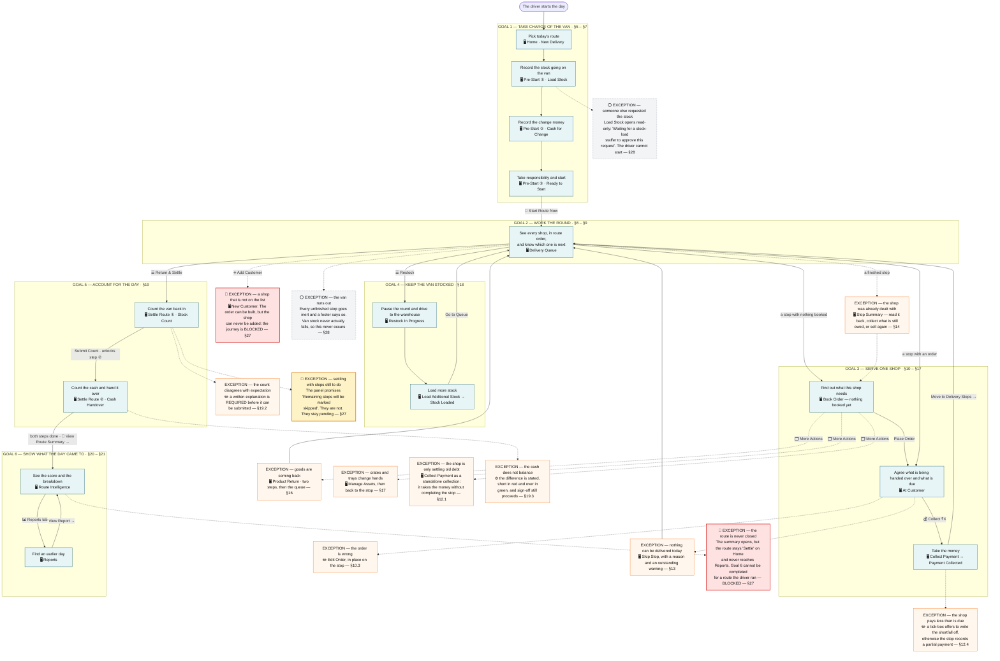
```mermaid
flowchart TD
    START(["The driver starts the day"]) --> A1

    subgraph G1["GOAL 1 — TAKE CHARGE OF THE VAN · §5 – §7"]
        direction TB
        A1["Pick today's route<br/>🖥 Home · New Delivery"]
        A2["Record the stock going on the van<br/>🖥 Pre-Start ① · Load Stock"]
        A3["Record the change money<br/>🖥 Pre-Start ② · Cash for Change"]
        A4["Take responsibility and start<br/>🖥 Pre-Start ③ · Ready to Start"]
        A1 --> A2 --> A3 --> A4
    end

    X1["⚪ EXCEPTION — someone else requested the stock<br/>Load Stock opens read-only: 'Waiting for a stock-load<br/>staffer to approve this request'. The driver cannot start — §28"]
    A2 -.-> X1

    subgraph G2["GOAL 2 — WORK THE ROUND · §8 – §9"]
        direction TB
        B1["See every shop, in route order,<br/>and know which one is next<br/>🖥 Delivery Queue"]
    end

    A4 -->|"🚀 Start Route Now"| B1

    X2["🛑 EXCEPTION — a shop that is not on the list<br/>🖥 New Customer. The order can be built, but the shop<br/>can never be added: the journey is BLOCKED — §27"]
    X3["⚪ EXCEPTION — the van runs out<br/>Every unfinished stop goes inert and a footer says so.<br/>Van stock never actually falls, so this never occurs — §28"]
    B1 -.->|"➕ Add Customer"| X2
    B1 -.-> X3

    subgraph G3["GOAL 3 — SERVE ONE SHOP · §10 – §17"]
        direction TB
        C1["Find out what this shop needs<br/>🖥 Book Order — nothing booked yet"]
        C2["Agree what is being handed over and what is due<br/>🖥 At Customer"]
        C3["Take the money<br/>🖥 Collect Payment → Payment Collected"]
        C1 -->|"Place Order"| C2
        C2 -->|"💰 Collect ₹X"| C3
    end

    B1 -->|"a stop with nothing booked"| C1
    B1 -->|"a stop with an order"| C2
    C3 -->|"Move to Delivery Stops →"| B1

    X4["EXCEPTION — the order is wrong<br/>✏️ Edit Order, in place on the stop — §10.3"]
    X5["EXCEPTION — nothing can be delivered today<br/>🖥 Skip Stop, with a reason and an outstanding warning — §13"]
    X6["EXCEPTION — goods are coming back<br/>🖥 Product Return · two steps, then the queue — §16"]
    X7["EXCEPTION — crates and trays change hands<br/>🖥 Manage Assets, then back to the stop — §17"]
    X8["EXCEPTION — the shop pays less than is due<br/>✏️ a tick-box offers to write the shortfall off,<br/>otherwise the stop records a partial payment — §12.4"]
    X9["EXCEPTION — the shop is only settling old debt<br/>🖥 Collect Payment as a standalone collection:<br/>it takes the money without completing the stop — §12.1"]
    X10["EXCEPTION — the shop was already dealt with<br/>🖥 Stop Summary — read it back, collect what is still<br/>owed, or sell again — §14"]

    C2 -.-> X4
    C2 -.-> X5
    C1 -.->|"🗂 More Actions"| X6
    C1 -.->|"🗂 More Actions"| X7
    C3 -.-> X8
    C1 -.->|"🗂 More Actions"| X9
    B1 -.->|"a finished stop"| X10
    X5 --> B1
    X6 --> B1
    X10 -.-> C1

    subgraph G4["GOAL 4 — KEEP THE VAN STOCKED · §18"]
        direction TB
        D1["Pause the round and drive to the warehouse<br/>🖥 Restock In Progress"]
        D2["Load more stock<br/>🖥 Load Additional Stock → Stock Loaded"]
        D1 --> D2
    end

    B1 -->|"☰ Restock"| D1
    D2 -->|"Go to Queue"| B1

    subgraph G5["GOAL 5 — ACCOUNT FOR THE DAY · §19"]
        direction TB
        E1["Count the van back in<br/>🖥 Settle Route ① · Stock Count"]
        E2["Count the cash and hand it over<br/>🖥 Settle Route ② · Cash Handover"]
        E1 -->|"Submit Count · unlocks step ②"| E2
    end

    B1 -->|"☰ Return &amp; Settle"| E1

    X11["EXCEPTION — the count disagrees with expectation<br/>✏️ a written explanation is REQUIRED before it can<br/>be submitted — §19.2"]
    X12["EXCEPTION — the cash does not balance<br/>⚙️ the difference is stated, short in red and over in<br/>green, and sign-off still proceeds — §19.3"]
    X13["🐞 EXCEPTION — settling with stops still to do<br/>The panel promises 'Remaining stops will be marked<br/>skipped'. They are not. They stay pending — §27"]
    E1 -.-> X11
    E2 -.-> X12
    E1 -.-> X13

    subgraph G6["GOAL 6 — SHOW WHAT THE DAY CAME TO · §20 – §21"]
        direction TB
        F1["See the score and the breakdown<br/>🖥 Route Intelligence"]
        F2["Find an earlier day<br/>🖥 Reports"]
        F1 -->|"📊 Reports tab"| F2
        F2 -->|"View Report →"| F1
    end

    E2 -->|"both steps done · 🎉 View Route Summary →"| F1

    X14["🛑 EXCEPTION — the route is never closed<br/>The summary opens, but the route stays 'Settle' on Home<br/>and never reaches Reports. Goal 6 cannot be completed<br/>for a route the driver ran — BLOCKED — §27"]
    F1 -.-> X14

    classDef goal fill:#e8f5f7,stroke:#1B6272,color:#111
    classDef exc fill:#fff7ed,stroke:#f97316,color:#111
    classDef blocked fill:#fee2e2,stroke:#dc2626,stroke-width:2px,color:#111
    classDef bug fill:#fef3c7,stroke:#d97706,stroke-width:2px,color:#111
    classDef unreach fill:#f3f4f6,stroke:#9ca3af,stroke-dasharray:4 3,color:#111
    class A1,A2,A3,A4,B1,C1,C2,C3,D1,D2,E1,E2,F1,F2 goal
    class X4,X5,X6,X7,X8,X9,X10,X11,X12 exc
    class X2,X14 blocked
    class X13 bug
    class X1,X3 unreach
```

---

## 3. The state model

Four things carry state through the day. This is all of it.

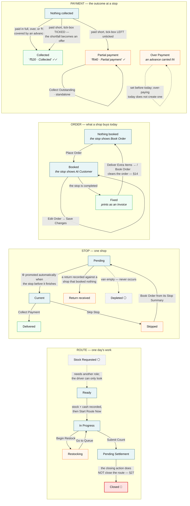
```mermaid
flowchart LR
    subgraph ROUTE["ROUTE — one day's work"]
        direction TB
        R1["Ready"]
        R2["Stock Requested ⚪"]
        R3["In Progress"]
        R4["Restocking"]
        R5["Pending Settlement"]
        R6["Closed 🛑"]
        R1 -->|"stock + cash recorded,<br/>then Start Route Now"| R3
        R3 -->|"Begin Restock"| R4
        R4 -->|"Go to Queue"| R3
        R3 -->|"Submit Count"| R5
        R5 -->|"the closing action does<br/>NOT close the route — §27"| R6
        R2 -.->|"needs another role;<br/>the driver can only look"| R1
    end

    subgraph STOP["STOP — one shop"]
        direction TB
        S1["Pending"]
        S2["Current"]
        S3["Delivered"]
        S4["Skipped"]
        S5["Return received"]
        S6["Depleted ⚪"]
        S1 -->|"⚙️ promoted automatically when<br/>the stop before it finishes"| S2
        S2 -->|"Collect Payment"| S3
        S2 -->|"Skip Stop"| S4
        S1 -->|"a return recorded against a<br/>shop that booked nothing"| S5
        S4 -->|"Book Order from its Stop Summary"| S1
        S1 -.->|"van empty — never occurs"| S6
    end

    subgraph ORDER["ORDER — what a shop buys today"]
        direction TB
        O1["Nothing booked<br/><i>the stop shows Book Order</i>"]
        O2["Booked<br/><i>the stop shows At Customer</i>"]
        O3["Fixed<br/><i>prints as an Invoice</i>"]
        O1 -->|"Place Order"| O2
        O2 -->|"Edit Order → Save Changes"| O2
        O2 -->|"the stop is completed"| O3
        O3 -->|"Deliver Extra Items → / Book Order<br/>clears the order — §14"| O1
    end

    subgraph PAY["PAYMENT — the outcome at a stop"]
        direction TB
        P0["Nothing collected"]
        P1["Collected<br/><i>'₹520 · Collected' ✓✓</i>"]
        P2["Partial payment<br/><i>'₹640 · Partial payment' ✓</i>"]
        P3["Over Payment<br/><i>an advance carried IN</i>"]
        P0 -->|"paid in full, over, or ₹0<br/>covered by an advance"| P1
        P0 -->|"paid short, tick-box LEFT unticked"| P2
        P0 -->|"paid short, tick-box TICKED —<br/>the shortfall becomes an offer"| P1
        P2 -->|"Collect Outstanding<br/>· standalone"| P2
        P3 -.->|"set before today; over-paying<br/>today does not create one"| P3
    end

    classDef ok fill:#e8f5f7,stroke:#1B6272,color:#111
    classDef good fill:#f0fdf4,stroke:#16a34a,color:#111
    classDef warn fill:#fff7ed,stroke:#f97316,color:#111
    classDef blocked fill:#fee2e2,stroke:#dc2626,stroke-width:2px,color:#111
    classDef unreach fill:#f3f4f6,stroke:#9ca3af,stroke-dasharray:4 3,color:#111
    class R1,R3,R5,S1,S2,O1,O2,P0 ok
    class S3,O3,P1 good
    class R4,S4,S5,P2,P3 warn
    class R6 blocked
    class R2,S6 unreach
```

**What the states mean to the driver**

| Thing | The rule that governs it |
| --- | --- |
| **Route** | Cannot start until stock **and** change money are recorded. Becomes Pending Settlement the moment the Stock Count is submitted — not when settlement is entered. Never reaches Closed in this cut (§27) |
| **Stop** | The driver never chooses who is next: finishing or skipping a stop promotes the next pending stop automatically. A skip is not final — the stop can be reopened and sold to |
| **Order** | Booking does not consume van stock, and neither does completing the stop (§27). Reopening a finished stop clears its order |
| **Payment** | Only the **outstanding** is carried debt. An underpaid order does not create new outstanding — it is recorded as a partial collection. A standalone collection takes money without completing the stop |

---

## 4. The four layers of the interface

### 4.1 🖥 Screens — 23

| # | Screen | Reached from | Leaves to | § |
| --- | --- | --- | --- | --- |
| 1 | Home | The app's entry point · 🏠 tab · 🏠 button on any in-route header | Any route's own next step · Reports | §5 |
| 2 | Pre-Start | A **Ready** route on Home | Load Stock · Cash for Change · Ready to Start | §7.1 |
| 3 | Load Stock | Pre-Start step ① · a **Stock Requested** route on Home ⚪ | Cash for Change | §7.2 |
| 4 | Cash for Change | Pre-Start step ② · Load Stock | Ready to Start | §7.3 |
| 5 | Ready to Start | Pre-Start step ③ · Cash for Change · Pre-Start when ① and ② are already done | Delivery Queue · Home | §7.4 |
| 6 | Delivery Queue | Ready to Start · an **In Progress** route on Home · every stop screen's back link | The stop screen · New Customer · Restock · Settle Route | §8 |
| 7 | **Book Order** *(stop screen)* | Tapping a stop with nothing booked · reopening a skipped or return-only stop | At Customer · More Actions | §11 |
| 8 | **At Customer** *(stop screen)* | Tapping a stop with an order · placing an order · reopening a delivered stop | Collect Payment · Skip Stop · Product Return · Manage Assets | §10 |
| 9 | New Customer 🛑 | ➕ Add Customer at the end of the Delivery Queue | Nowhere — the commit is blocked (§27) | §9 |
| 10 | Collect Payment | 💰 Collect at a stop · 💰 Collect Outstanding in More Actions · Stop Summary's primary action | Payment Collected | §12 |
| 11 | Payment Collected | Committing a collection | Delivery Queue | §12.5 |
| 12 | Skip Stop | Skip Stop → at At Customer | Delivery Queue | §13 |
| 13 | Stop Summary | Tapping any finished, skipped or return-received stop | Book Order · At Customer · Collect Payment · Product Return · Manage Assets | §14 |
| 14 | Product Return | More Actions · ↩ Return on a completed At Customer | Delivery Queue | §16 |
| 15 | Manage Assets | More Actions · 📦 Assets on a completed At Customer | Back to the stop it was opened from | §17 |
| 16 | Restock In Progress | ☰ Restock in the Delivery Queue · a **Restocking** route on Home | Load Additional Stock | §18 |
| 17 | Load Additional Stock | Restock In Progress | Stock Loaded | §18 |
| 18 | Stock Loaded | Committing a restock | Delivery Queue | §18 |
| 19 | Settle Route | ☰ Return & Settle · a **Pending Settlement** route on Home | Stock Count · Cash Handover · Route Intelligence | §19.1 |
| 20 | Stock Count | Settle Route step ① | Settle Route | §19.2 |
| 21 | Cash Handover | Settle Route step ②, once unlocked | Settle Route | §19.3 |
| 22 | Route Intelligence | Finishing settlement · a **Closed** route on Home · View Report → in Reports | Reports | §20 |
| 23 | Reports | 📊 Reports tab | Route Intelligence | §21 |

**Where a route card leads.** Home is the only screen that can open a route at any stage, and
which screen it opens is decided entirely by that route's status — never by which card was
tapped.

| Route status | Card button | Opens |
| --- | --- | --- |
| Ready | "Start Route →" | **Pre-Start** |
| Stock Requested ⚪ | "Review & Load →" | **Load Stock**, read-only |
| In Progress | "Continue →" | **Delivery Queue** |
| Restocking | "Load Stock →" | **Restock In Progress** |
| Pending Settlement | "Settle Route →" | **Settle Route** |
| Closed | "View Summary →" | **Route Intelligence** |
| *(via "+ New Delivery")* | "Start Delivery" | The chosen template's own next step, by the same table |

**The tab bar** — 🏠 Home · 🗺️ Routes · 📋 Follow-up · 📊 Reports · ← Back — appears on **Home,
Reports and Route Intelligence only**. Home and Reports navigate; ← Back steps back; Routes and
Follow-up raise a toast and do not navigate (§29).

### 4.2 🗂 Sheets and panels — 11

Each rises over the current screen, dims it, and returns to it. None of them navigates.

| Sheet or panel | Raised by | Left by | § |
| --- | --- | --- | --- |
| New Delivery modal | "+ New Delivery" on Home | Cancel · × · backdrop | §6 |
| Route actions menu | ☰ in the Delivery Queue header | Choosing an item · tapping ☰ again | §8.3 |
| Confirmation panel | Every consequential action | Its own worded back-out | §22.1 |
| More Actions | Book Order · Stop Summary | Backdrop · choosing an action | §15 |
| Offer Price | The ✎ beside any product price | "Set Offer Price →" / "Done" · "Reset to ₹X" · backdrop | §11.3 |
| Discount | The order-discount strip | "Done" · backdrop | §11.4 |
| Print Receipt | Payment Collected · Stop Summary | Cancel · backdrop | §12.6 |
| Add Currency | The + on the Cashbreak row in Cash Handover | Save Breakdown · backdrop | §19.3 |
| Export | "Export" on Route Intelligence | Close · Download · backdrop | §20.2 |
| "Go to home?" | The 🏠 button on any in-route header | Continue Working · Go to Home | §22.2 |
| Toast | WhatsApp share · the Routes and Follow-up tabs | Fades on its own | §29 |

### 4.3 ✏️ Inline interactions

These change the screen in place. Nothing rises, nothing navigates, and nothing is committed
until a confirmation panel says so.

| Interaction | Where | § |
| --- | --- | --- |
| Search fields, with a ✕ once typed in | Home · Delivery Queue · Load Stock · Book Order · Edit Order · New Customer · Product Return · Load Additional Stock · Reports | throughout |
| Status chips, and the date button | Home | §5 |
| − / + / typed quantity steppers, capped at the van's stock | Load Stock · Book Order · Edit Order · New Customer · Product Return · Offer Price | §23 |
| Typed quantity fields, uncapped | Load Additional Stock · Manage Assets · Stock Count · Add Currency | — |
| The ✎ price affordance on a product row | Book Order · New Customer | §11.3 |
| The order-discount strip | Book Order · New Customer | §11.4 |
| **Edit Order mode** — the order card becomes a working list | At Customer | §10.3 |
| The short-payment write-off tick-box | Collect Payment | §12.2 |
| Payment method and amount chips | Collect Payment · Cash for Change | §12.2 · §7.3 |
| Reason chips | Skip Stop · Product Return | §13 · §16 |
| Per-row "Match" buttons | Stock Count | §19.2 |
| The Expense block expanding, and its per-row ✏️ ✓ ✕ | Cash Handover | §19.3 |
| The Cashbreak row expanding and collapsing | Cash Handover | §19.3 |
| Collapsible summaries | Route Intelligence | §20.1 |
| The date-range calendar opening beneath its button | Reports | §21 |

### 4.4 ⚙️ System states

The product enters these on its own. The driver does not ask for them, and in most cases
cannot dismiss them.

| State | What the driver sees | § |
| --- | --- | --- |
| **Processing** | A green block replaces the whole confirmation panel — its message and "Please wait". Nothing is left to tap twice | §22.1 |
| **Auto-promotion** | Finishing or skipping a stop makes the next pending stop Current, with no prompt | §3 · §23 |
| **Auto-filled load quantities** | Load Stock opens pre-filled and says so in a green banner | §7.2 |
| **Advance applied** | An advance is spent against today's order before anything is due, and the Total Due line explains it | §10.2 |
| **Locked steps** | Pre-Start ② and ③, and Cash Handover, are Locked until what precedes them is done. Tapping one names the step that must come first | §7.1 · §19.1 |
| **Disabled actions** | Labelled with what is missing — "Add stock quantities to continue" — never greyed out silently | §24 |
| **Empty states** | A named message rather than a blank list | §25 |
| **Depleted van** ⚪ | Every unfinished stop goes inert and an amber footer explains why | §8.4 · §28 |
| **Amber lock hints** | Appear for a moment on a locked Pre-Start step, then clear themselves | §7.1 |
| **Toast** | One line, fading on its own | §4.2 |
| **"Generating report…"** | Preview and Download stay disabled until the file exists | §20.2 |
| **Failure** | ⚠️ "Failed to load routes", the reason, and a Retry button | §22.3 |

---
---

# Part B — The journeys

# Goal 1 — Take charge of the van

> *"Prove what I am carrying, in stock and in cash."* The product will not let the round begin
> until both are on record and the driver has accepted responsibility for them.

## 5. Home

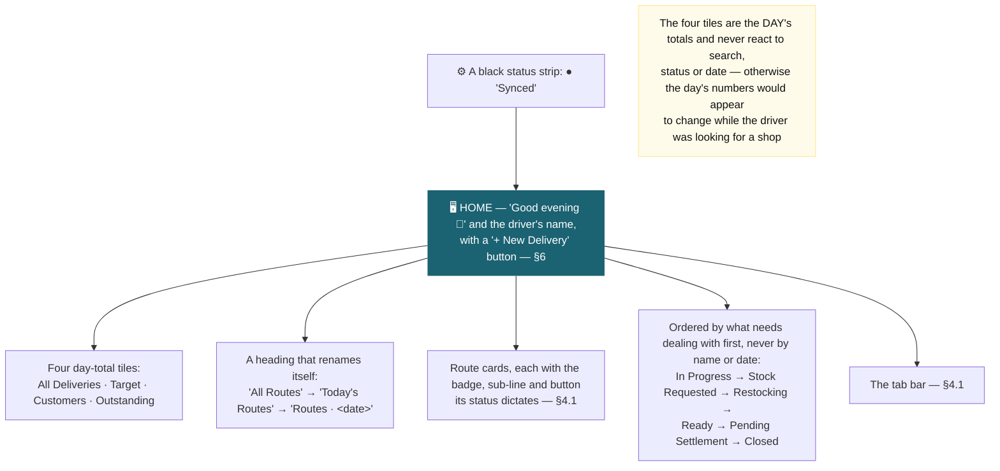
```mermaid
flowchart TD
    SYNC["⚙️ A black status strip: ● 'Synced'"]
    SYNC --> H["🖥 HOME — 'Good evening 👋' and the driver's name,<br/>with a '+ New Delivery' button — §6"]
    H --> T["Four day-total tiles:<br/>All Deliveries · Target · Customers · Outstanding"]
    H --> SEC["A heading that renames itself:<br/>'All Routes' → 'Today's Routes' → 'Routes · &lt;date&gt;'"]
    H --> CARDS["Route cards, each with the badge, sub-line and button<br/>its status dictates — §4.1"]
    H --> ORDER["Ordered by what needs dealing with first, never by name or date:<br/>In Progress → Stock Requested → Restocking →<br/>Ready → Pending Settlement → Closed"]
    H --> TABS["The tab bar — §4.1"]

    NOTE["The four tiles are the DAY's totals and never react to search,<br/>status or date — otherwise the day's numbers would appear<br/>to change while the driver was looking for a shop"]

    classDef home fill:#1B6272,color:#fff,stroke:none
    classDef note fill:#fffbeb,stroke:#fde68a,color:#111
    class H home
    class NOTE note
```

**Route cards, by status**

| State | Badge | Card sub-line | Extra |
| --- | --- | --- | --- |
| Ready | green "Ready" | "20 customers · ₹5,640 outstanding" | — |
| Stock Requested ⚪ | amber "Stock Requested" | "20 customers · Stock request pending" | — |
| In Progress | blue "In Progress" | "14/30 done · ₹14,320 collected" | A green progress bar |
| Restocking | amber "Restocking" | "14/30 done · Stock replenishment needed" | — |
| Pending Settlement | orange "Settle" | "25/25 done · Settle now" | — |
| Closed | grey "Closed" | "30/30 completed" | — |

### Narrowing the list

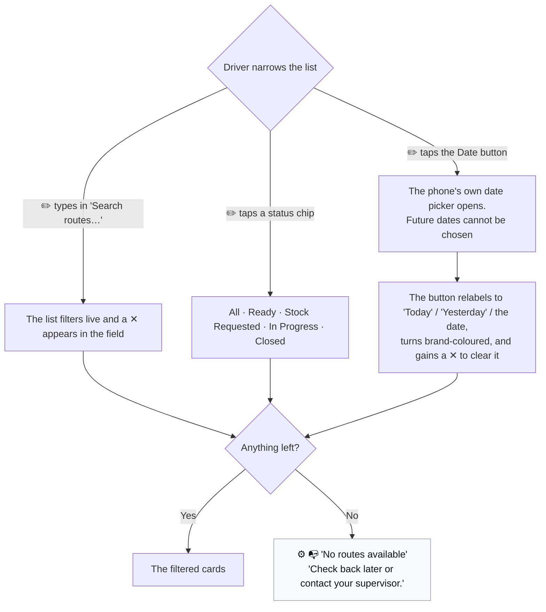
```mermaid
flowchart TD
    F{"Driver narrows the list"}
    F -->|"✏️ types in 'Search routes…'"| S["The list filters live and a ✕ appears in the field"]
    F -->|"✏️ taps a status chip"| C["All · Ready · Stock Requested · In Progress · Closed"]
    F -->|"✏️ taps the Date button"| D["The phone's own date picker opens.<br/>Future dates cannot be chosen"]
    D --> DL["The button relabels to 'Today' / 'Yesterday' / the date,<br/>turns brand-coloured, and gains a ✕ to clear it"]

    S --> R{"Anything left?"}
    C --> R
    DL --> R
    R -->|"Yes"| LIST["The filtered cards"]
    R -->|"No"| E["⚙️ 📭 'No routes available'<br/>'Check back later or contact your supervisor.'"]

    classDef empty fill:#f9fafb,stroke:#9ca3af,color:#111
    class E empty
```

---

## 6. New Delivery

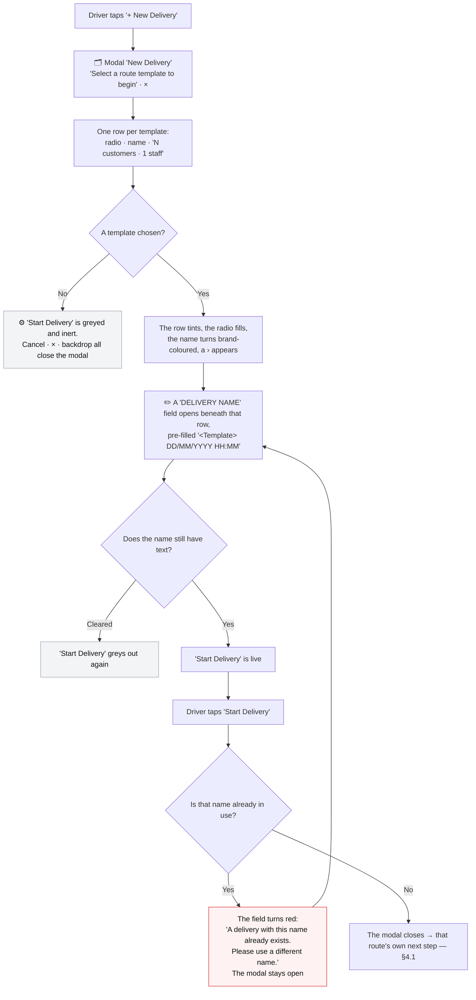
```mermaid
flowchart TD
    O["Driver taps '+ New Delivery'"] --> M["🗂 Modal 'New Delivery'<br/>'Select a route template to begin' · ×"]
    M --> ROWS["One row per template:<br/>radio · name · 'N customers · 1 staff'"]

    ROWS --> P{"A template chosen?"}
    P -->|"No"| D0["⚙️ 'Start Delivery' is greyed and inert.<br/>Cancel · × · backdrop all close the modal"]
    P -->|"Yes"| SEL["The row tints, the radio fills,<br/>the name turns brand-coloured, a › appears"]

    SEL --> NAME["✏️ A 'DELIVERY NAME' field opens beneath that row,<br/>pre-filled '&lt;Template&gt; DD/MM/YYYY HH:MM'"]
    NAME --> V{"Does the name still have text?"}
    V -->|"Cleared"| D1["'Start Delivery' greys out again"]
    V -->|"Yes"| ARM["'Start Delivery' is live"]

    ARM --> GO["Driver taps 'Start Delivery'"]
    GO --> DUP{"Is that name already in use?"}
    DUP -->|"Yes"| ERR["The field turns red:<br/>'A delivery with this name already exists.<br/>Please use a different name.'<br/>The modal stays open"]
    ERR --> NAME
    DUP -->|"No"| OUT["The modal closes → that route's own next step — §4.1"]

    classDef err fill:#fef2f2,stroke:#dc2626,color:#111
    classDef dis fill:#f3f4f6,stroke:#9ca3af,color:#111
    class ERR err
    class D0,D1 dis
```

---

## 7. Start of day

### 7.1 Pre-Start — three gates in a fixed order

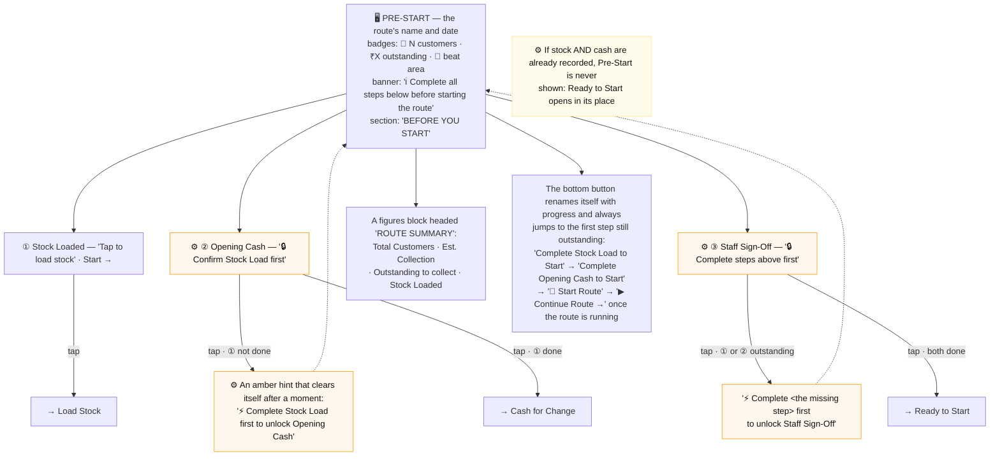
```mermaid
flowchart TD
    PS["🖥 PRE-START — the route's name and date<br/>badges: 👥 N customers · ₹X outstanding · 📍 beat area<br/>banner: 'ℹ️ Complete all steps below before starting the route'<br/>section: 'BEFORE YOU START'"]

    PS --> G1["① Stock Loaded — 'Tap to load stock' · Start →"]
    PS --> G2["⚙️ ② Opening Cash — '🔒 Confirm Stock Load first'"]
    PS --> G3["⚙️ ③ Staff Sign-Off — '🔒 Complete steps above first'"]

    G1 -->|"tap"| LS["→ Load Stock"]
    G2 -->|"tap · ① not done"| L1["⚙️ An amber hint that clears itself after a moment:<br/>'⚡ Complete Stock Load first to unlock Opening Cash'"]
    G2 -->|"tap · ① done"| CFC["→ Cash for Change"]
    G3 -->|"tap · ① or ② outstanding"| L2["'⚡ Complete &lt;the missing step&gt; first<br/>to unlock Staff Sign-Off'"]
    G3 -->|"tap · both done"| RTS["→ Ready to Start"]

    L1 -.-> PS
    L2 -.-> PS

    PS --> SUM["A figures block headed 'ROUTE SUMMARY':<br/>Total Customers · Est. Collection<br/>· Outstanding to collect · Stock Loaded"]
    PS --> CTA["The bottom button renames itself with progress and always<br/>jumps to the first step still outstanding:<br/>'Complete Stock Load to Start' → 'Complete Opening Cash to Start'<br/>→ '🚀 Start Route' → '▶ Continue Route →' once the route is running"]

    BYPASS["⚙️ If stock AND cash are already recorded, Pre-Start is never<br/>shown: Ready to Start opens in its place"]

    classDef lock fill:#fff7ed,stroke:#f59e0b,color:#111
    classDef note fill:#fffbeb,stroke:#fde68a,color:#111
    class L1,L2,G2,G3 lock
    class BYPASS note
```

A completed row shows a tick and **"Done ✓"**, with its subtitle replaced by the figure achieved
— "174 units · ₹13,920 est. value", "₹500 taken for change", "Route signed off ✓".

### 7.2 Load Stock

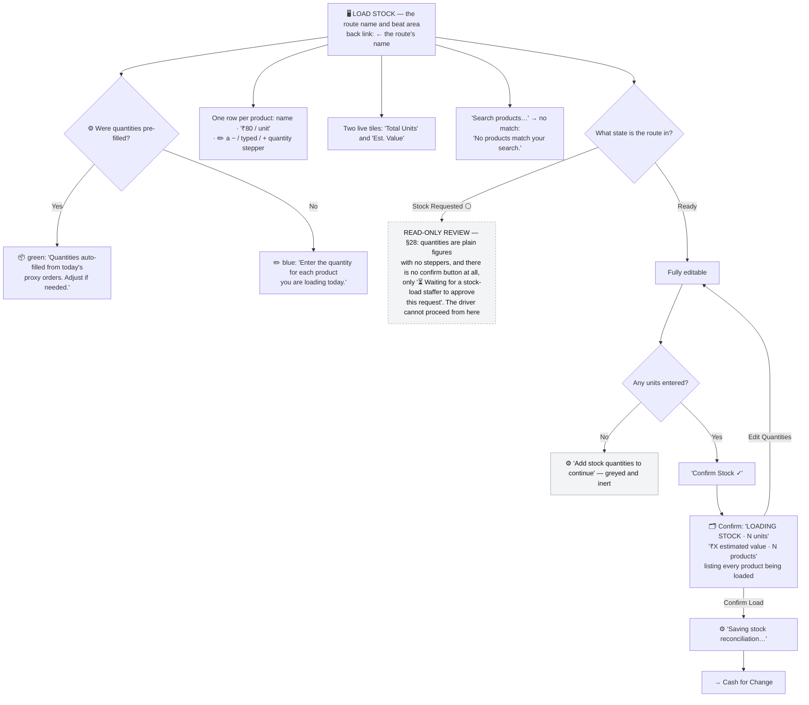
```mermaid
flowchart TD
    LS["🖥 LOAD STOCK — the route name and beat area<br/>back link: ← the route's name"]
    LS --> BAN{"⚙️ Were quantities pre-filled?"}
    BAN -->|"Yes"| B1["📦 green: 'Quantities auto-filled from today's<br/>proxy orders. Adjust if needed.'"]
    BAN -->|"No"| B2["✏️ blue: 'Enter the quantity for each product<br/>you are loading today.'"]

    LS --> ROWS["One row per product: name · '₹80 / unit'<br/>· ✏️ a − / typed / + quantity stepper"]
    LS --> TOT["Two live tiles: 'Total Units' and 'Est. Value'"]
    LS --> SRCH["'Search products…' → no match:<br/>'No products match your search.'"]

    LS --> MODE{"What state is the route in?"}
    MODE -->|"Stock Requested ⚪"| RO["READ-ONLY REVIEW — §28: quantities are plain figures<br/>with no steppers, and there is no confirm button at all,<br/>only '⏳ Waiting for a stock-load staffer to approve<br/>this request'. The driver cannot proceed from here"]
    MODE -->|"Ready"| ED["Fully editable"]

    ED --> G{"Any units entered?"}
    G -->|"No"| C0["⚙️ 'Add stock quantities to continue' — greyed and inert"]
    G -->|"Yes"| C1["'Confirm Stock ✓'"]

    C1 --> CP["🗂 Confirm: 'LOADING STOCK · N units'<br/>'₹X estimated value · N products'<br/>listing every product being loaded"]
    CP -->|"Edit Quantities"| ED
    CP -->|"Confirm Load"| PROC["⚙️ 'Saving stock reconciliation…'"] --> NEXT["→ Cash for Change"]

    classDef dis fill:#f3f4f6,stroke:#9ca3af,color:#111
    classDef unreach fill:#f3f4f6,stroke:#9ca3af,stroke-dasharray:4 3,color:#111
    class C0 dis
    class RO unreach
```

### 7.3 Cash for Change

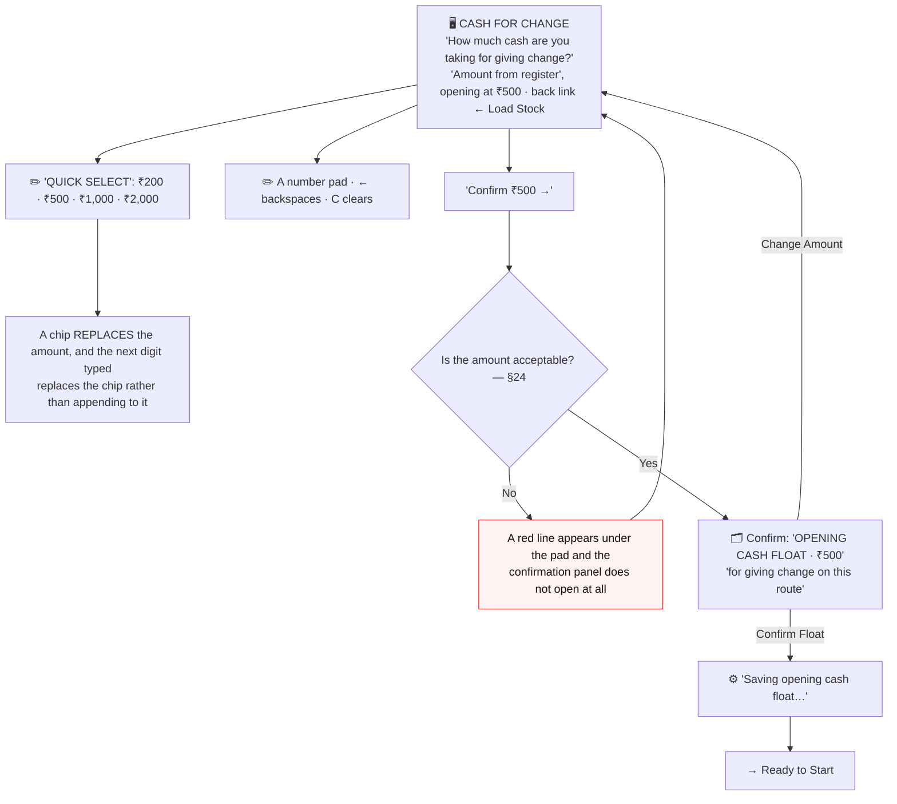
```mermaid
flowchart TD
    OC["🖥 CASH FOR CHANGE<br/>'How much cash are you taking for giving change?'<br/>'Amount from register', opening at ₹500 · back link ← Load Stock"]
    OC --> QS["✏️ 'QUICK SELECT': ₹200 · ₹500 · ₹1,000 · ₹2,000"]
    QS --> QSR["A chip REPLACES the amount, and the next digit typed<br/>replaces the chip rather than appending to it"]
    OC --> PAD["✏️ A number pad · ← backspaces · C clears"]

    OC --> CTA["'Confirm ₹500 →'"]
    CTA --> VAL{"Is the amount acceptable? — §24"}
    VAL -->|"No"| ERR["A red line appears under the pad and the<br/>confirmation panel does not open at all"]
    ERR --> OC
    VAL -->|"Yes"| CP["🗂 Confirm: 'OPENING CASH FLOAT · ₹500'<br/>'for giving change on this route'"]
    CP -->|"Change Amount"| OC
    CP -->|"Confirm Float"| PROC["⚙️ 'Saving opening cash float…'"] --> RTS["→ Ready to Start"]

    classDef err fill:#fef2f2,stroke:#dc2626,color:#111
    class ERR err
```

> Here, unlike at Collect Payment, validation runs on the **first** button — the confirmation
> panel never opens on an amount that cannot be accepted. See §26.

### 7.4 Ready to Start

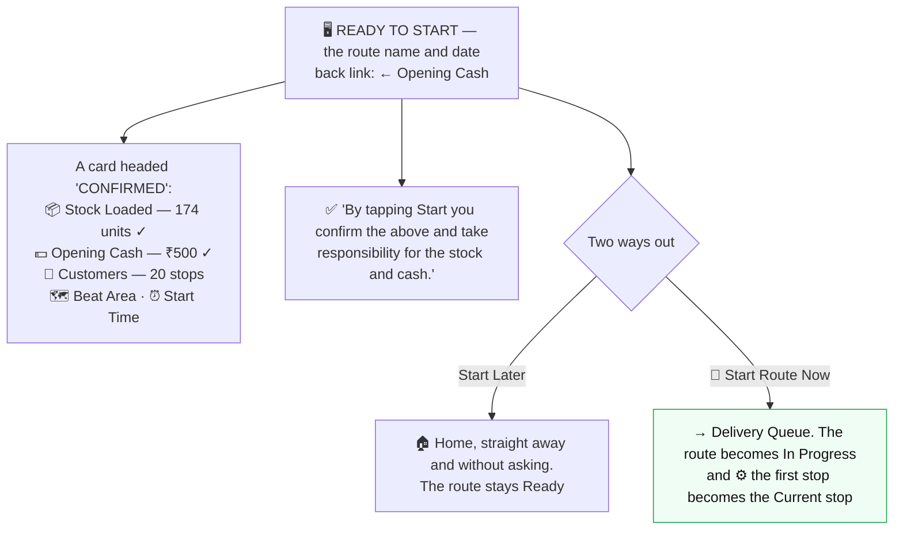
```mermaid
flowchart TD
    RTS["🖥 READY TO START — the route name and date<br/>back link: ← Opening Cash"]
    RTS --> CARD["A card headed 'CONFIRMED':<br/>📦 Stock Loaded — 174 units ✓<br/>💵 Opening Cash — ₹500 ✓<br/>👥 Customers — 20 stops<br/>🗺️ Beat Area · ⏰ Start Time"]
    RTS --> BAN["✅ 'By tapping Start you confirm the above and take<br/>responsibility for the stock and cash.'"]
    RTS --> OUT{"Two ways out"}
    OUT -->|"Start Later"| HOME["🏠 Home, straight away and without asking.<br/>The route stays Ready"]
    OUT -->|"🚀 Start Route Now"| Q["→ Delivery Queue. The route becomes In Progress<br/>and ⚙️ the first stop becomes the Current stop"]

    classDef good fill:#f0fdf4,stroke:#16a34a,color:#111
    class Q good
```

---

# Goal 2 — Work the round

> *"Get to every shop on my list."* The queue is the driver's list for the day: who is next,
> who is done, and who still owes.

## 8. Delivery Queue

### 8.1 The screen

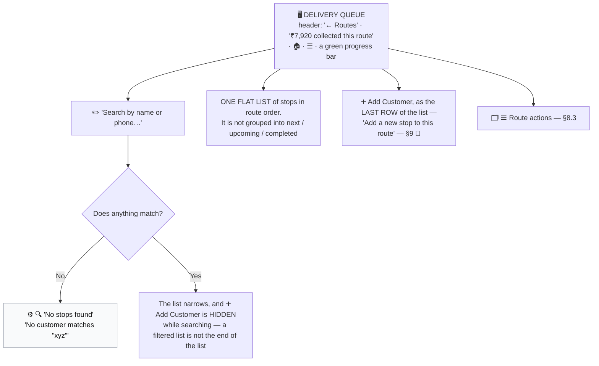
```mermaid
flowchart TD
    Q["🖥 DELIVERY QUEUE<br/>header: '← Routes' · '₹7,920 collected this route'<br/>· 🏠 · ☰ · a green progress bar"]
    Q --> SRCH["✏️ 'Search by name or phone…'"]
    Q --> LIST["ONE FLAT LIST of stops in route order.<br/>It is not grouped into next / upcoming / completed"]
    Q --> ADD["➕ Add Customer, as the LAST ROW of the list —<br/>'Add a new stop to this route' — §9 🛑"]
    Q --> MENU["🗂 ☰ Route actions — §8.3"]

    SRCH --> SR{"Does anything match?"}
    SR -->|"No"| SN["⚙️ 🔍 'No stops found'<br/>'No customer matches &quot;xyz&quot;'"]
    SR -->|"Yes"| FL["The list narrows, and ➕ Add Customer is HIDDEN<br/>while searching — a filtered list is not the end of the list"]

    classDef empty fill:#f9fafb,stroke:#9ca3af,color:#111
    class SN empty
```

**How each stop presents itself**

| State | Avatar | Sub-line | Right side | Tapping it opens |
| --- | --- | --- | --- | --- |
| Pending | initials, tinted by money | "⚠️ ₹720 outstanding" / "₹315 over payment" / the last outcome / "—" | grey dot | The stop screen |
| Current | brand initials | "⚠️ ₹720 outstanding", or "Current stop" | green → | The stop screen |
| Delivered — full | green ✓ | "₹520 · Collected" | ✓✓ green + time | Stop Summary |
| Delivered — partial | green ✓ | "₹640 · Partial payment" | single ✓ orange + time | Stop Summary |
| Delivered — carried advance | green ✓ | "₹315 · Over Payment" | ✓✓ green + time | Stop Summary |
| Skipped | grey − | "Skipped", in red | time only | Stop Summary |
| Return received | orange ↩ | "Return received", in orange | grey dot, or nothing once finished | Stop Summary |
| Depleted ⚪ | grey initials | "Stock depleted", in amber | — | **Nothing — the row is inert** |

### 8.2 Opening a stop

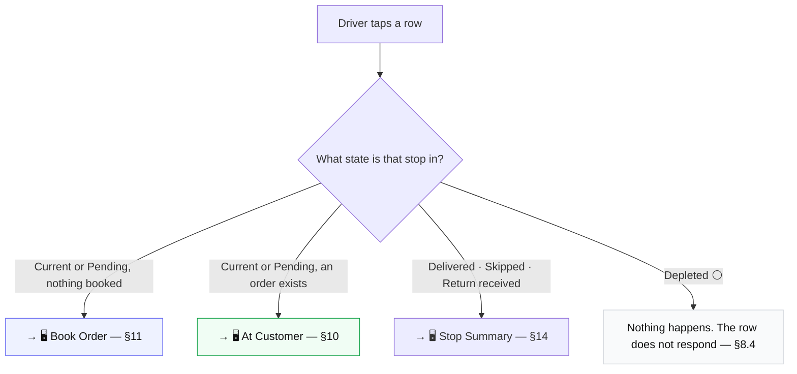
```mermaid
flowchart TD
    T["Driver taps a row"] --> S{"What state is that stop in?"}
    S -->|"Current or Pending, nothing booked"| BO["→ 🖥 Book Order — §11"]
    S -->|"Current or Pending, an order exists"| AC["→ 🖥 At Customer — §10"]
    S -->|"Delivered · Skipped · Return received"| SU["→ 🖥 Stop Summary — §14"]
    S -->|"Depleted ⚪"| N["Nothing happens. The row does not respond — §8.4"]

    classDef book fill:#eef2ff,stroke:#6366f1,color:#111
    classDef del fill:#f0fdf4,stroke:#16a34a,color:#111
    classDef dead fill:#f9fafb,stroke:#d1d5db,color:#111
    class BO book
    class AC del
    class N dead
```

### 8.3 The route actions menu

Two items. Neither navigates on its own — each raises a decision panel over the dimmed list.

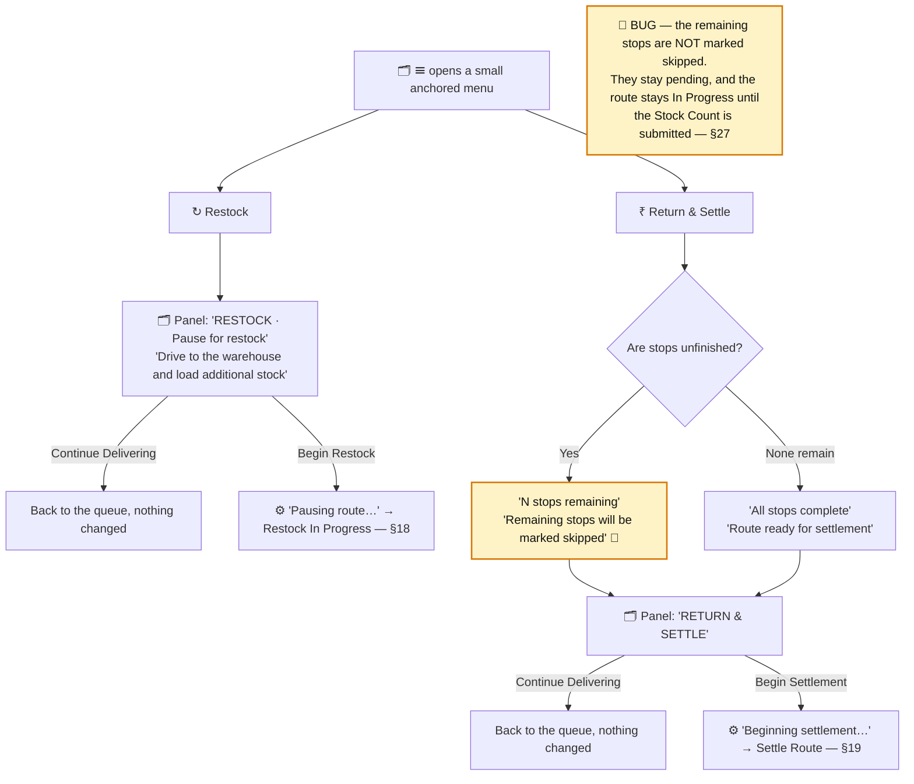
```mermaid
flowchart TD
    M["🗂 ☰ opens a small anchored menu"] --> M1["↻ Restock"]
    M --> M2["₹ Return &amp; Settle"]

    M1 --> P1["🗂 Panel: 'RESTOCK · Pause for restock'<br/>'Drive to the warehouse and load additional stock'"]
    P1 -->|"Continue Delivering"| Q1["Back to the queue, nothing changed"]
    P1 -->|"Begin Restock"| PR1["⚙️ 'Pausing route…' → Restock In Progress — §18"]

    M2 --> CNT{"Are stops unfinished?"}
    CNT -->|"Yes"| A["'N stops remaining'<br/>'Remaining stops will be marked skipped' 🐞"]
    CNT -->|"None remain"| B["'All stops complete'<br/>'Route ready for settlement'"]
    A --> P2["🗂 Panel: 'RETURN &amp; SETTLE'"]
    B --> P2
    P2 -->|"Continue Delivering"| Q2["Back to the queue, nothing changed"]
    P2 -->|"Begin Settlement"| PR2["⚙️ 'Beginning settlement…' → Settle Route — §19"]

    BUG["🐞 BUG — the remaining stops are NOT marked skipped.<br/>They stay pending, and the route stays In Progress until<br/>the Stock Count is submitted — §27"]

    classDef bug fill:#fef3c7,stroke:#d97706,stroke-width:2px,color:#111
    class A,BUG bug
```

### 8.4 When the van runs out ⚪

> ⚪ **Not reachable in this cut.** Van stock never decreases — see the BUG at §27 — so no
> product ever reaches zero availability and none of the states below can occur. The behaviour
> is documented because it is fully built, and because the restock journey (§18) exists to
> recover from it.

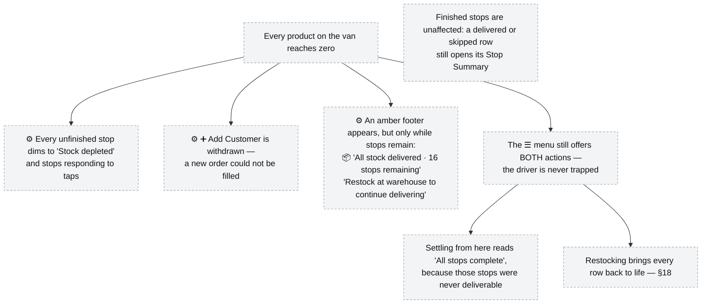
```mermaid
flowchart TD
    DEP["Every product on the van reaches zero"]
    DEP --> E1["⚙️ Every unfinished stop dims to 'Stock depleted'<br/>and stops responding to taps"]
    DEP --> E2["⚙️ ➕ Add Customer is withdrawn —<br/>a new order could not be filled"]
    DEP --> E3["⚙️ An amber footer appears, but only while stops remain:<br/>📦 'All stock delivered · 16 stops remaining'<br/>'Restock at warehouse to continue delivering'"]
    DEP --> E4["The ☰ menu still offers BOTH actions —<br/>the driver is never trapped"]
    E4 --> E5["Settling from here reads 'All stops complete',<br/>because those stops were never deliverable"]
    E4 --> E6["Restocking brings every row back to life — §18"]

    NOTE["Finished stops are unaffected: a delivered or skipped row<br/>still opens its Stop Summary"]

    classDef unreach fill:#f3f4f6,stroke:#9ca3af,stroke-dasharray:4 3,color:#111
    class DEP,E1,E2,E3,E4,E5,E6,NOTE unreach
```

---

## 9. New Customer 🛑 BLOCKED

> 🛑 **BLOCKED — the driver cannot add a shop.** Everything up to and including the confirmation
> panel behaves as drawn. "Add Customer →" then **always** fails on Owner Phone with *"Phone
> number is required"*, however valid the number typed: the panel closes, the field turns red,
> and no shop is created. Goal 2's "a shop that is not on my list" exception cannot be
> completed. Recorded at §27.

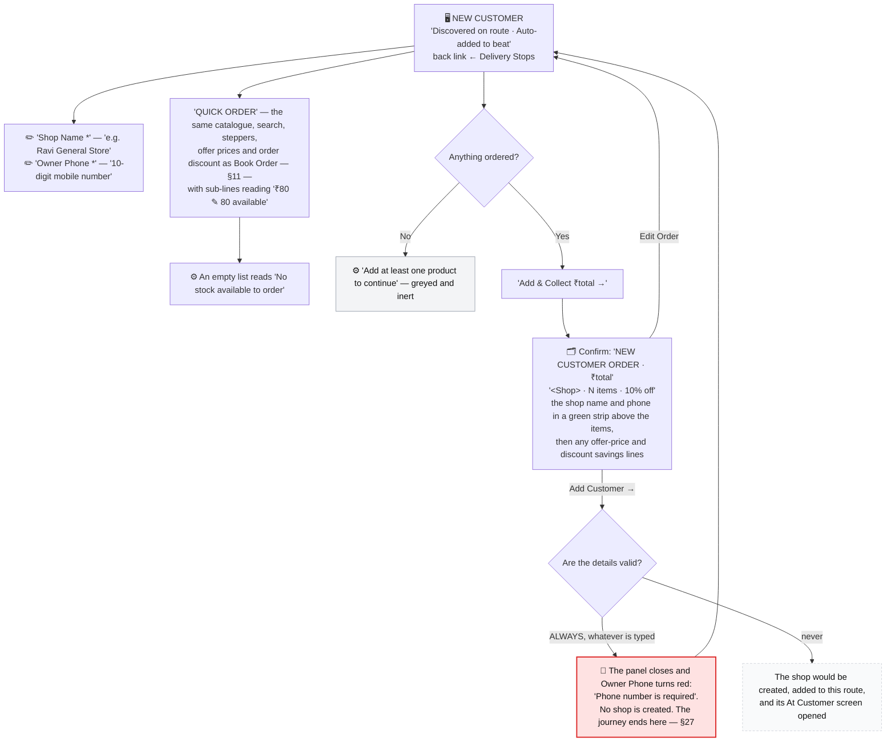
```mermaid
flowchart TD
    AC["🖥 NEW CUSTOMER<br/>'Discovered on route · Auto-added to beat'<br/>back link ← Delivery Stops"]
    AC --> F["✏️ 'Shop Name *' — 'e.g. Ravi General Store'<br/>✏️ 'Owner Phone *' — '10-digit mobile number'"]
    AC --> QO["'QUICK ORDER' — the same catalogue, search, steppers,<br/>offer prices and order discount as Book Order — §11 —<br/>with sub-lines reading '₹80 ✎ 80 available'"]
    QO --> EMPTY["⚙️ An empty list reads 'No stock available to order'"]

    AC --> G{"Anything ordered?"}
    G -->|"No"| C0["⚙️ 'Add at least one product to continue' — greyed and inert"]
    G -->|"Yes"| C1["'Add &amp; Collect ₹total →'"]

    C1 --> CP["🗂 Confirm: 'NEW CUSTOMER ORDER · ₹total'<br/>'&lt;Shop&gt; · N items · 10% off'<br/>the shop name and phone in a green strip above the items,<br/>then any offer-price and discount savings lines"]
    CP -->|"Edit Order"| AC
    CP -->|"Add Customer →"| VAL{"Are the details valid?"}

    VAL -->|"ALWAYS, whatever is typed"| ERR["🛑 The panel closes and Owner Phone turns red:<br/>'Phone number is required'.<br/>No shop is created. The journey ends here — §27"]
    ERR --> AC
    VAL -->|"never"| OK["The shop would be created, added to this route,<br/>and its At Customer screen opened"]

    classDef blocked fill:#fee2e2,stroke:#dc2626,stroke-width:2px,color:#111
    classDef dis fill:#f3f4f6,stroke:#9ca3af,color:#111
    classDef dead fill:#f9fafb,stroke:#d1d5db,stroke-dasharray:4 3,color:#111
    class ERR blocked
    class C0 dis
    class OK dead
```

---

# Goal 3 — Serve one shop

> *"Sell, hand over, get paid, and record what happened."* This is the goal the driver repeats
> twenty or thirty times a day, and the one with the most ways to go sideways: the order is
> wrong, the shop is shut, goods come back, crates change hands, the money is short, or the
> shop only wants to clear an old debt.

## 10. At Customer

### 10.1 The screen

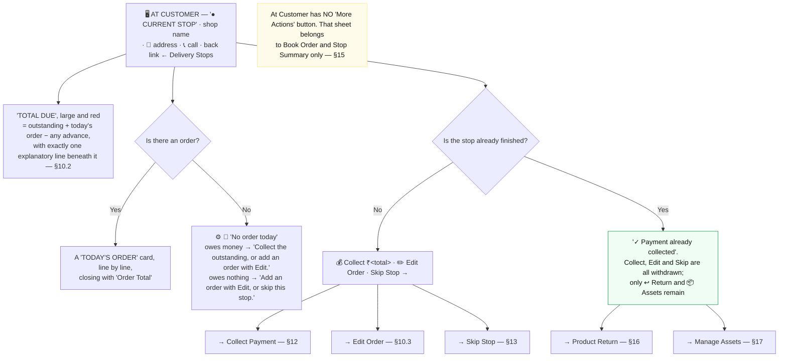
```mermaid
flowchart TD
    D["🖥 AT CUSTOMER — '● CURRENT STOP' · shop name<br/>· 📍 address · 📞 call · back link ← Delivery Stops"]
    D --> DUE["'TOTAL DUE', large and red<br/>= outstanding + today's order − any advance,<br/>with exactly one explanatory line beneath it — §10.2"]

    D --> ORD{"Is there an order?"}
    ORD -->|"Yes"| OC["A 'TODAY'S ORDER' card, line by line,<br/>closing with 'Order Total'"]
    ORD -->|"No"| NO["⚙️ 🧾 'No order today'<br/>owes money → 'Collect the outstanding, or add an order with Edit.'<br/>owes nothing → 'Add an order with Edit, or skip this stop.'"]

    D --> ST{"Is the stop already finished?"}
    ST -->|"No"| LIVE["💰 Collect ₹&lt;total&gt; · ✏️ Edit Order · Skip Stop →"]
    ST -->|"Yes"| DONE["'✓ Payment already collected'.<br/>Collect, Edit and Skip are all withdrawn;<br/>only ↩ Return and 📦 Assets remain"]

    LIVE --> P["→ Collect Payment — §12"]
    LIVE --> E["→ Edit Order — §10.3"]
    LIVE --> K["→ Skip Stop — §13"]
    DONE --> R2["→ Product Return — §16"]
    DONE --> A2["→ Manage Assets — §17"]

    NOTE["At Customer has NO 'More Actions' button. That sheet belongs<br/>to Book Order and Stop Summary only — §15"]

    classDef done fill:#f0fdf4,stroke:#16a34a,color:#111
    classDef note fill:#fffbeb,stroke:#fde68a,color:#111
    class DONE done
    class NOTE note
```

### 10.2 The Total Due line

Exactly one line sits under Total Due, chosen from four. It is how the driver explains the
figure to the shopkeeper — including why it can legitimately be ₹0.

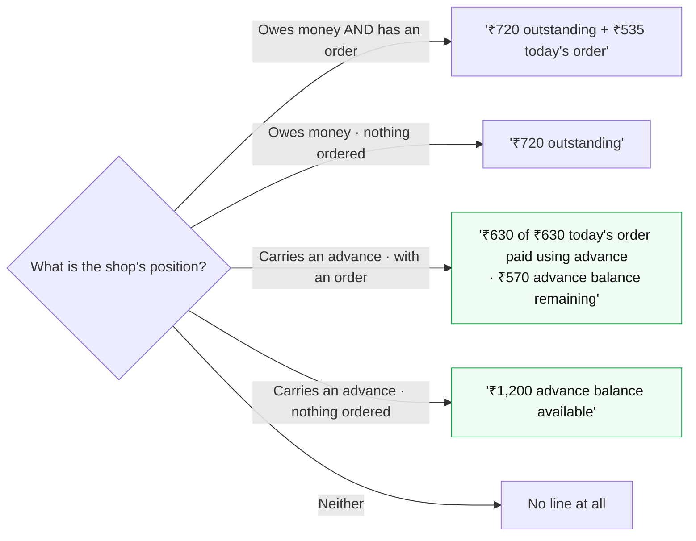
```mermaid
flowchart LR
    L{"What is the shop's position?"}
    L -->|"Owes money AND has an order"| L1["'₹720 outstanding + ₹535 today's order'"]
    L -->|"Owes money · nothing ordered"| L2["'₹720 outstanding'"]
    L -->|"Carries an advance · with an order"| L3["'₹630 of ₹630 today's order paid using advance<br/>· ₹570 advance balance remaining'"]
    L -->|"Carries an advance · nothing ordered"| L4["'₹1,200 advance balance available'"]
    L -->|"Neither"| L5["No line at all"]

    classDef good fill:#f0fdf4,stroke:#16a34a,color:#111
    class L3,L4 good
```

### 10.3 Edit Order — *"the order is wrong"*

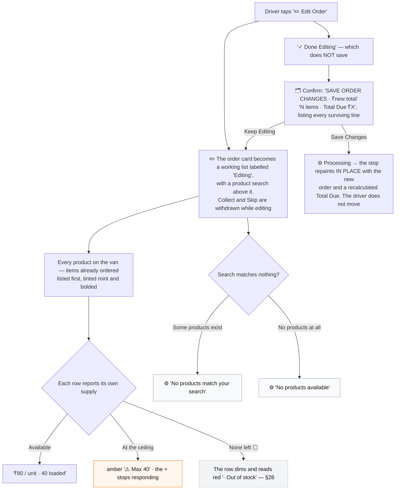
```mermaid
flowchart TD
    E["Driver taps '✏️ Edit Order'"] --> MODE["✏️ The order card becomes a working list labelled 'Editing',<br/>with a product search above it.<br/>Collect and Skip are withdrawn while editing"]
    MODE --> LIST["Every product on the van — items already ordered<br/>listed first, tinted mint and bolded"]

    LIST --> RS{"Each row reports its own supply"}
    RS -->|"Available"| S1["'₹80 / unit · 40 loaded'"]
    RS -->|"At the ceiling"| S2["amber '⚠️ Max 40' · the + stops responding"]
    RS -->|"None left ⚪"| S3["The row dims and reads red '· Out of stock' — §28"]

    MODE --> SR{"Search matches nothing?"}
    SR -->|"Some products exist"| SE1["⚙️ 'No products match your search'"]
    SR -->|"No products at all"| SE2["⚙️ 'No products available'"]

    E --> DONE["'✓ Done Editing' — which does NOT save"]
    DONE --> CP["🗂 Confirm: 'SAVE ORDER CHANGES · ₹new total'<br/>'N items · Total Due ₹X', listing every surviving line"]
    CP -->|"Keep Editing"| MODE
    CP -->|"Save Changes"| PROC["⚙️ Processing → the stop repaints IN PLACE with the new<br/>order and a recalculated Total Due. The driver does not move"]

    classDef cap fill:#fff7ed,stroke:#f97316,color:#111
    classDef empty fill:#f9fafb,stroke:#9ca3af,color:#111
    classDef unreach fill:#f3f4f6,stroke:#9ca3af,stroke-dasharray:4 3,color:#111
    class S2 cap
    class SE1,SE2 empty
    class S3 unreach
```

---

## 11. Book Order

### 11.1 The catalogue

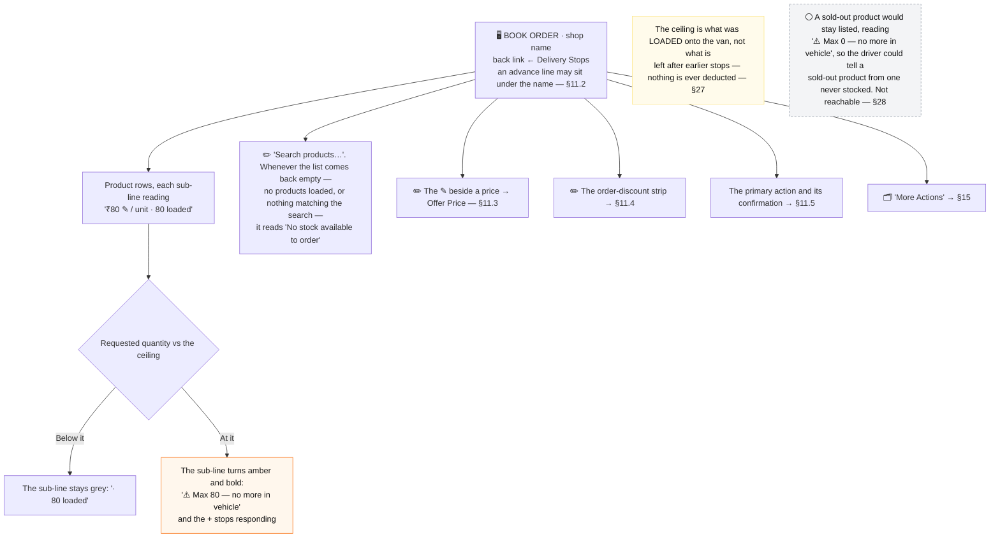
```mermaid
flowchart TD
    B["🖥 BOOK ORDER · shop name<br/>back link ← Delivery Stops<br/>an advance line may sit under the name — §11.2"]
    B --> ROW["Product rows, each sub-line reading<br/>'₹80 ✎ / unit · 80 loaded'"]
    ROW --> CAP{"Requested quantity vs the ceiling"}
    CAP -->|"Below it"| OK["The sub-line stays grey: '· 80 loaded'"]
    CAP -->|"At it"| MAX["The sub-line turns amber and bold:<br/>'⚠️ Max 80 — no more in vehicle'<br/>and the + stops responding"]

    CEIL["The ceiling is what was LOADED onto the van, not what is<br/>left after earlier stops — nothing is ever deducted — §27"]

    SOLD["⚪ A sold-out product would stay listed, reading<br/>'⚠️ Max 0 — no more in vehicle', so the driver could tell a<br/>sold-out product from one never stocked. Not reachable — §28"]

    B --> SRCH["✏️ 'Search products…'. Whenever the list comes back empty —<br/>no products loaded, or nothing matching the search —<br/>it reads 'No stock available to order'"]
    B --> PRICE["✏️ The ✎ beside a price → Offer Price — §11.3"]
    B --> DISC["✏️ The order-discount strip → §11.4"]
    B --> CTA["The primary action and its confirmation → §11.5"]
    B --> MORE["🗂 'More Actions' → §15"]

    classDef cap fill:#fff7ed,stroke:#f97316,color:#111
    classDef note fill:#fffbeb,stroke:#fde68a,color:#111
    classDef unreach fill:#f3f4f6,stroke:#9ca3af,stroke-dasharray:4 3,color:#111
    class MAX cap
    class CEIL note
    class SOLD unreach
```

### 11.2 The advance line

A shop that over-paid on a previous visit carries an **advance**. Book Order states it under the
shop name, and the wording changes as the basket fills.

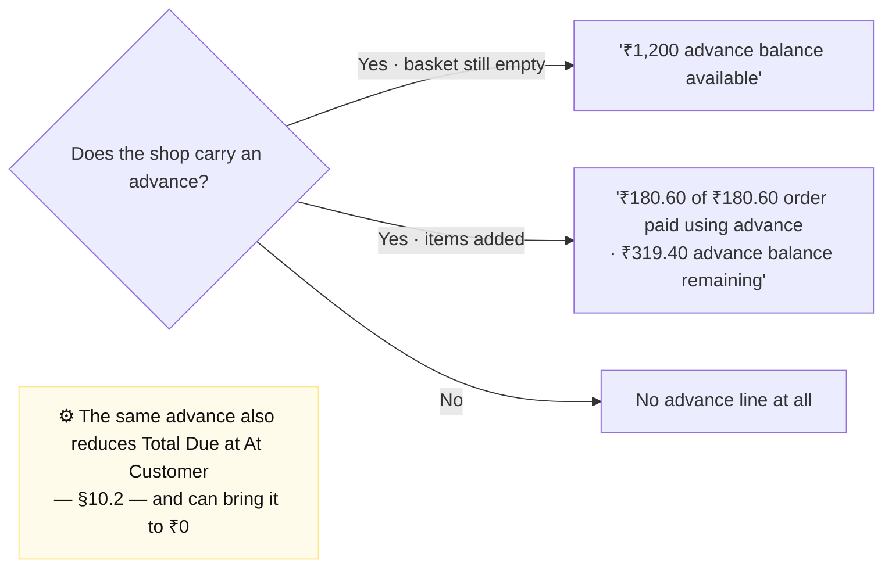
```mermaid
flowchart LR
    A{"Does the shop carry an advance?"}
    A -->|"Yes · basket still empty"| A1["'₹1,200 advance balance available'"]
    A -->|"Yes · items added"| A2["'₹180.60 of ₹180.60 order paid using advance<br/>· ₹319.40 advance balance remaining'"]
    A -->|"No"| A3["No advance line at all"]

    NOTE["⚙️ The same advance also reduces Total Due at At Customer<br/>— §10.2 — and can bring it to ₹0"]
    classDef note fill:#fffbeb,stroke:#fde68a,color:#111
    class NOTE note
```

### 11.3 Offer Price — repricing one product

The same sheet serves Book Order and New Customer.

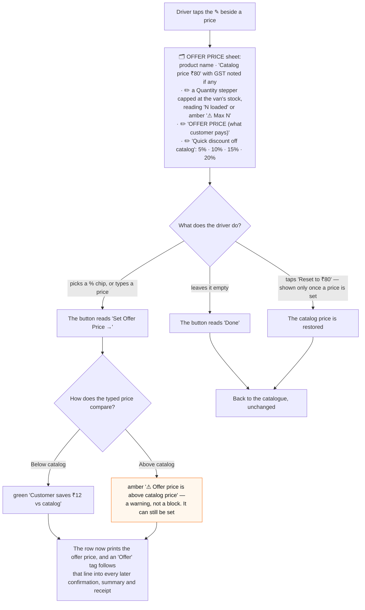
```mermaid
flowchart TD
    P["Driver taps the ✎ beside a price"] --> S["🗂 OFFER PRICE sheet:<br/>product name · 'Catalog price ₹80' with GST noted if any<br/>· ✏️ a Quantity stepper capped at the van's stock,<br/>reading 'N loaded' or amber '⚠ Max N'<br/>· ✏️ 'OFFER PRICE (what customer pays)'<br/>· ✏️ 'Quick discount off catalog': 5% · 10% · 15% · 20%"]

    S --> C{"What does the driver do?"}
    C -->|"picks a % chip, or types a price"| SET["The button reads 'Set Offer Price →'"]
    C -->|"leaves it empty"| DONE["The button reads 'Done'"]
    C -->|"taps 'Reset to ₹80' — shown only once a price is set"| RESET["The catalog price is restored"]

    SET --> FB{"How does the typed price compare?"}
    FB -->|"Below catalog"| FB1["green 'Customer saves ₹12 vs catalog'"]
    FB -->|"Above catalog"| FB2["amber '⚠ Offer price is above catalog price' —<br/>a warning, not a block. It can still be set"]

    FB1 --> OUT["The row now prints the offer price, and an 'Offer' tag follows<br/>that line into every later confirmation, summary and receipt"]
    FB2 --> OUT
    DONE --> BACK["Back to the catalogue, unchanged"]
    RESET --> BACK

    classDef cap fill:#fff7ed,stroke:#f97316,color:#111
    class FB2 cap
```

### 11.4 Order discount — discounting the whole basket

The same sheet and the same strip serve Book Order and New Customer.

```mermaid
flowchart TD
    D["Driver taps the strip: '% Add order discount ›'"] --> S["🗂 DISCOUNT sheet — 'DISCOUNT · optional'"]
    S --> TYP{"✏️ Two types, chosen by a toggle"}
    TYP -->|"'% Percent'"| T1["quick chips 2% · 3% · 5% · 10%,<br/>or 'Or type custom % amount'"]
    TYP -->|"'₹ Fixed'"| T2["quick chips ₹10 · ₹25 · ₹50 · ₹100,<br/>or 'Or type custom ₹ amount'"]

    T1 --> LIVE["Once something is discounted the sheet totals it live:<br/>Subtotal → Discount (10%) −₹120 → Order Total,<br/>and a '✕ Clear' appears in its header"]
    T2 --> LIVE
    LIVE -->|"Done"| STRIP["The strip now reports the saving,<br/>with a ✕ beside it to clear the order discount"]

    STRIP --> W{"What has been applied?"}
    W -->|"Order discount only"| W1["'10% off · saves ₹120' — 'tap to change'"]
    W -->|"Offer prices only"| W2["'2 offer prices · saves ₹X' — 'tap to add order discount'"]
    W -->|"Both"| W3["'Mixed discounts · saves ₹X'"]

    AVAIL["On BOOK ORDER the strip is inert until at least one item is<br/>selected. On NEW CUSTOMER it is always live"]

    classDef note fill:#fffbeb,stroke:#fde68a,color:#111
    class AVAIL note
```

### 11.5 Placing the order

```mermaid
flowchart TD
    G{"Anything selected?"}
    G -->|"No"| C0["⚙️ 'Select items to place order' — greyed and inert.<br/>The discount strip is inert too"]
    G -->|"Yes"| C1["'Confirm Order · ₹total'"]

    C1 --> CP["🗂 Confirm: 'CONFIRMING ORDER · ₹total'<br/>'for &lt;Shop&gt; · N items · 10% off'<br/>listing every line with its Offer tag"]
    CP -->|"Edit Order"| BACK["Back to the catalogue, basket intact"]
    CP -->|"Place Order"| PROC["⚙️ 'Placing order…'"]
    PROC --> OUT["The SAME screen repaints as At Customer — §10 —<br/>now carrying a Total Due. Nothing navigates"]

    STOCK["🐞 Placing an order does not reduce van stock, and neither<br/>does completing the stop. Van stock only ever goes UP —<br/>initial load, restock, and returns — §27"]

    classDef dis fill:#f3f4f6,stroke:#9ca3af,color:#111
    classDef bug fill:#fef3c7,stroke:#d97706,stroke-width:2px,color:#111
    class C0 dis
    class STOCK bug
```

---

## 12. Payment

### 12.1 Two kinds of collection

The same screen serves both, and it says which one it is in its back link.

```mermaid
flowchart TD
    K{"Where was Collect Payment reached from?"}
    K -->|"💰 Collect ₹X, the primary button at a stop"| K1["ORDINARY STOP PAYMENT<br/>· settles the outstanding PLUS today's order<br/>· completes the stop<br/>· back link reads '← Customer'"]
    K -->|"💰 Collect Outstanding in More Actions,<br/>or the primary action on a Stop Summary"| K2["STANDALONE COLLECTION —<br/>the 'only settling old debt' exception<br/>· settles ONLY the carried outstanding<br/>· does NOT complete the stop<br/>· back link reads '← Delivery Stops'<br/>· returns to the queue, not to the shop"]

    classDef a fill:#f0fdf4,stroke:#16a34a,color:#111
    classDef b fill:#eef2ff,stroke:#6366f1,color:#111
    class K1 a
    class K2 b
```

### 12.2 Entering the amount

```mermaid
flowchart TD
    P["🖥 COLLECT PAYMENT · shop name<br/>'Total Due' shown very large.<br/>This screen carries no 🏠 button"]
    P --> M["✏️ 'PAYMENT METHOD': 💵 Cash | 📱 UPI — Cash by default"]

    P --> PRE{"✏️ Amount chips"}
    PRE -->|"Something is due"| PR1["Up to two round part-amounts below the total,<br/>plus a '₹600 Full' chip for the exact figure"]
    PRE -->|"Nothing is due"| PR2["₹500 · ₹2,000 · ₹5,000,<br/>and the pad opens at ₹0"]

    P --> PAD["✏️ A number pad. The pre-filled total is REPLACED by the<br/>first digit typed, never appended to.<br/>← backspaces · C clears"]

    P --> SHORT{"Is the amount below what is due?"}
    SHORT -->|"Yes"| TICK["✏️ A green tick-box appears BEFORE confirming:<br/>'₹315 will be adjusted as offer.'<br/>'Customer outstanding will remain ₹0.'"]
    SHORT -->|"No"| NOTICK["No tick-box"]

    P --> CTA["'✅ Collect ₹600 Cash' → §12.3"]
```

### 12.3 Confirming, and what validation does

```mermaid
flowchart TD
    CTA["Driver taps '✅ Collect ₹600 Cash'"] --> CP["🗂 Confirm: 'COLLECTING CASH · ₹600'<br/>'from &lt;Shop&gt;'"]
    CP -->|"Change Amount"| BACK["Back to the pad, the amount intact"]
    CP -->|"Collect Payment"| VAL{"Is the amount acceptable? — §24"}

    VAL -->|"No"| ERR["The confirmation panel CLOSES again and a red line<br/>appears under the number pad"]
    ERR --> BACK
    VAL -->|"Yes"| PROC["⚙️ 'Recording payment collection…'"]
    PROC --> OUT["→ the outcome — §12.4"]

    NOTE["Validation runs on the panel's commit, not on the first button:<br/>the driver sees what they are about to do before being told<br/>it is wrong. Cash for Change does the opposite — §26"]

    classDef err fill:#fef2f2,stroke:#dc2626,color:#111
    classDef note fill:#fffbeb,stroke:#fde68a,color:#111
    class ERR err
    class NOTE note
```

### 12.4 Every payment outcome — including *"the shop pays less"*

```mermaid
flowchart TD
    A{"How much was taken, against what was due?"}

    A -->|"Exactly the full amount"| F["✅ 'Payment Collected!'<br/>Queue row: '₹520 · Collected' · ✓✓ green"]
    A -->|"MORE than due"| O["Accepted without complaint.<br/>✅ 'Payment Collected!' · ✓✓ green"]
    A -->|"₹0, because an advance covers the order"| Z["✅ 'Payment Collected!' for ₹0.<br/>Allowed at a stop; blocked on a standalone collection"]
    A -->|"LESS than due"| S["The green tick-box from §12.2 decides it"]

    S --> T{"Did the driver tick it?"}
    T -->|"Ticked"| WO["The shortfall is written off as an offer.<br/>✅ 'Payment Collected!' · the shop owes nothing"]
    T -->|"Left unticked"| PT["✅ 'Partial Payment Collected!'<br/>'₹220 outstanding remaining'<br/>Queue row: '₹100 · Partial payment' · single ✓ orange"]

    F --> NEXT
    O --> NEXT
    Z --> NEXT
    WO --> NEXT
    PT --> NEXT["⚙️ On an ORDINARY stop payment the stop completes and the next<br/>pending stop automatically becomes the Current stop.<br/>The driver never chooses who is next.<br/>A STANDALONE collection completes nothing"]

    CARRIED["A shop that CARRIES an advance in from a previous visit shows<br/>'₹315 · Over Payment' in the queue instead of 'Collected'.<br/>Over-paying today does not create a visible advance on that stop"]

    classDef good fill:#f0fdf4,stroke:#16a34a,color:#111
    classDef part fill:#fff7ed,stroke:#f97316,color:#111
    classDef note fill:#fffbeb,stroke:#fde68a,color:#111
    class F,O,WO,Z good
    class PT,S part
    class CARRIED note
```

### 12.5 Payment Collected

```mermaid
flowchart TD
    S["🖥 A full-screen green confirmation: a tick, the title,<br/>the amount, then '&lt;Method&gt; · &lt;Shop Name&gt;'<br/>and '₹220 outstanding remaining' when there is any"]
    S --> SHARE["'Share receipt with customer?'"]
    SHARE --> W["📲 WhatsApp → ⚙️ toast 'Invoice sent to customer'.<br/>Offered ONLY after a completed stop payment,<br/>never after a standalone collection"]
    SHARE --> PRN["🖨 Print Receipt → the Print Receipt sheet — §12.6"]
    S --> BACK["'Move to Delivery Stops →' → the Delivery Queue"]

    classDef good fill:#f0fdf4,stroke:#16a34a,color:#111
    class S good
```

### 12.6 The Print Receipt sheet

Reachable from Payment Collected and from any Stop Summary with an order.

```mermaid
flowchart TD
    SHEET["🗂 🖨 PRINT RECEIPT sheet"]
    SHEET --> T["✏️ 'PRINTER TYPE': 🖥 USB | 📶 Bluetooth"]
    SHEET --> DEV["'PRINTER DEVICE': 'No printer connected',<br/>and a 'Connect USB Printer' / 'Connect Bluetooth Printer'<br/>button that follows the chosen type"]
    DEV --> NC["⚙️ No printer can connect in this cut. The footer reads<br/>'Connect a printer above to enable printing'<br/>and '🖨 Print' stays disabled — §29"]
    SHEET --> SZ["✏️ 'PAPER SIZE': 58mm (2 inch) | 80mm (3.2 inch).<br/>Changing it RE-FLOWS the preview to the new width,<br/>and the preview header pill states the size"]

    SHEET --> WHAT{"What is printed?"}
    WHAT -->|"A completed stop"| I1["'Invoice' — Date · Customer · Bill No · Payment,<br/>an item table, then Sub Total · Discount ·<br/>Total Amount · Old Balance · Write Off · Total Received"]
    WHAT -->|"A standalone collection"| I2["'Payment Receipt' — the same header block,<br/>but NO bill number and NO item table"]

    SHEET --> CL["'Cancel' or the backdrop closes it"]

    classDef dis fill:#f3f4f6,stroke:#9ca3af,color:#111
    class NC dis
```

---

## 13. Skip Stop

*The exception: "nothing can be delivered today."*

```mermaid
flowchart TD
    SK["🖥 'Why no delivery?' · back link ← &lt;Shop Name&gt;"]
    SK --> RE["✏️ 'SELECT REASON' — six chips:<br/>🔒 Shop Closed · 🚶 Owner Away · 📦 Fully Stocked<br/>· 🙅 Refused · ⏰ Will Order Later · ❓ Other"]
    RE --> PRESEL["⚙️ The FIRST reason is already selected,<br/>so the driver is never blocked from moving on"]

    SK --> OWE{"Does the shop owe money?"}
    OWE -->|"Yes"| WARN["⚠️ '&lt;Shop&gt; has ₹720 outstanding.<br/>This will be added to follow-up list.'"]
    OWE -->|"No"| NOWARN["No banner"]

    SK --> NOTE["✏️ 'Note (optional)' — free text, 'Add a note...'"]
    SK --> CTA["'Skip This Stop'"]

    CTA --> CP["🗂 Confirm: 'SKIP CONFIRMATION · 🔒 Shop Closed'<br/>context: '⚠ ₹720 outstanding will be tracked',<br/>or 'No delivery for &lt;Shop&gt; today'<br/>with any note quoted underneath"]
    CP -->|"Change Reason"| SK
    CP -->|"Skip Stop"| PROC["⚙️ 'Syncing delivery attempt…'"]
    PROC --> OUT["→ the Delivery Queue. The row dims and is marked 'Skipped'<br/>in red, and ⚙️ the next pending stop becomes the Current stop"]

    RECOVER["A skipped stop is NOT final — it can be reopened and sold to<br/>from its Stop Summary — §14"]

    classDef warn fill:#fff7ed,stroke:#f97316,color:#111
    classDef note fill:#fffbeb,stroke:#fde68a,color:#111
    class WARN warn
    class RECOVER,PRESEL note
```

---

## 14. Stop Summary

*The exception: "the shop was already dealt with."*

```mermaid
flowchart TD
    SS["🖥 STOP SUMMARY — opened by tapping any finished row<br/>back link ← Delivery Stops"]
    SS --> K{"How did the stop end?"}

    K -->|"Paid in full"| A["'✓✓ FULLY COLLECTED · 13:40', green<br/>'COLLECTED ₹520'"]
    K -->|"Part paid"| B["'✓ PARTIAL PAYMENT', orange<br/>'COLLECTED ₹100' and '₹220 outstanding'"]
    K -->|"Skipped"| C["'− SKIPPED', grey · 'Reason: Shop Closed'<br/>and an 'Outstanding balance' figure if any"]
    K -->|"Return only"| D["'↩ RETURN RECEIVED', orange<br/>'Products returned by this customer are recorded below.'"]

    A --> ORD["A 'TODAY'S ORDER' card with a 🖨 Print button — §12.6 —<br/>every line, and an Order Total"]
    B --> ORD
    C --> NOORD["No order card"]
    D --> NOORD

    SS --> RET{"Were any returns recorded for this shop?"}
    RET -->|"Yes"| RETC["An '↩ RETURNS' rule, then one card per return:<br/>'Return 1 · 14:07', listing 'Mixture (500g) × 2 — returned'"]
    RET -->|"No"| NORET["No returns section"]

    SS --> MORE["🗂 'More Actions' — §15"]

    classDef good fill:#f0fdf4,stroke:#16a34a,color:#111
    classDef part fill:#fff7ed,stroke:#f97316,color:#111
    class A good
    class B,C,D part
```

### The primary action, and where it lands

```mermaid
flowchart TD
    P{"What does this stop still need?"}
    P -->|"Money is still owed — part paid,<br/>or skipped with an outstanding"| P1["'💰 Collect Outstanding · ₹220'<br/>→ a standalone collection — §12.1"]
    P -->|"Nothing owed, the shop is on record,<br/>and the van still has stock"| P2["'Deliver Extra Items →'<br/>— or 'Book Order' when the stop was skipped<br/>or is return-only"]
    P -->|"There is no shop record ⚪"| P3["'💰 Collect Payment'<br/>→ a standalone collection — §28"]

    P2 --> RE{"The stop reopens with its order cleared —<br/>which face it shows depends on its state"}
    RE -->|"Skipped · it returns to Pending"| B1["🖥 Book Order — a second sale is possible"]
    RE -->|"Return-only · still Pending"| B1
    RE -->|"Already Delivered · it stays Delivered"| B2["🐞 BUG — a dead end.<br/>🖥 At Customer opens in its completed state: 🧾 'No order today'<br/>· 'Add an order with Edit, or skip this stop.' — while Edit has<br/>been withdrawn — plus '✓ Payment already collected' and<br/>only ↩ Return and 📦 Assets. Nothing can be booked — §27"]

    classDef bug fill:#fef3c7,stroke:#d97706,stroke-width:2px,color:#111
    classDef unreach fill:#f3f4f6,stroke:#9ca3af,stroke-dasharray:4 3,color:#111
    class B2 bug
    class P3 unreach
```

---

## 15. More Actions

One sheet, raised from **Book Order** and **Stop Summary** only. It shows just the groups that
apply to that stop, and every item leaves the sheet for another screen. It is how three of
Goal 3's exceptions are reached.

```mermaid
flowchart TD
    M["🗂 'More Actions' sheet"]

    M --> F{"FINANCIAL"}
    F -->|"On Book Order, always"| F1["'💰 Collect Outstanding · ₹720' when money is owed,<br/>otherwise '💰 Collect Payment' → §12.1"]
    F -->|"On Stop Summary, only when the primary action<br/>is NOT already Collect Outstanding and the<br/>shop can still be sold to"| F2["'💰 Collect Payment' → §12.1"]

    M --> DEL{"DELIVERY — Stop Summary only"}
    DEL -->|"Part paid, and the van has stock"| D1["'🚚 Deliver Extra Items →'"]
    DEL -->|"Skipped or return-only, still owes money,<br/>and the van has stock"| D2["'📋 Book Order'"]
    DEL -->|"Otherwise"| D3["The group is omitted entirely"]

    M --> R["RETURNS — '📦 Product Return ›' → §16"]
    M --> A["ASSETS — '🗂️ Manage Assets ›' → §17"]

    NOTE["Returns and Assets appear whenever the stop has a shop on record.<br/>The sheet is dismissed by its backdrop or by choosing an action"]

    classDef note fill:#fffbeb,stroke:#fde68a,color:#111
    class NOTE note
```

---

## 16. Product Return

*The exception: "goods are coming back."*

Two deliberate steps: pick the items, then say why.

```mermaid
flowchart TD
    R["🖥 PRODUCT RETURN<br/>'Items returned by the customer re-enter your vehicle stock'<br/>back link ← &lt;Shop Name&gt;"]
    R --> S1["STEP 1 — ✏️ a searchable product list.<br/>Every row starts at 'Not returned' with − / + steppers,<br/>and becomes '↩ 2 units returned · ₹160' once chosen.<br/>⚙️ An empty list reads 'No products match your search.'"]

    S1 --> G1{"Anything selected?"}
    G1 -->|"No"| C0["⚙️ 'Select items being returned' — greyed and inert"]
    G1 -->|"Yes"| C1["'Select Return Reason · 1 unit · ₹80 →'<br/>— the label carries the running count and value"]

    C1 --> S2["STEP 2 — 🗂 a panel over the dimmed list: 'RETURN REASON'<br/>'Why is the customer returning these items?'<br/>🔴 Damaged · ⏰ Expired · 📦 Unsold · ❌ Wrong Product<br/>and an optional note"]
    S2 -->|"'← Cancel'"| S1

    S2 --> G2{"Reason chosen?"}
    G2 -->|"No"| C2["⚙️ 'Select a reason above' — greyed and inert"]
    G2 -->|"Yes"| C3["'Confirm Reason →'"]

    C3 --> CP["🗂 Confirm: 'PRODUCT RETURN · 1 Unit · ₹80'<br/>'1 product · Damaged', listing what goes back on the van,<br/>with the chosen reason repeated in an amber strip"]
    CP -->|"'Edit items'"| S1
    CP -->|"'Edit' on the reason strip"| S2
    CP -->|"'↩ Record Return'"| PROC["⚙️ 'Recording return…'"]

    PROC --> O1["① The goods go back on the van and can be<br/>sold again at a later stop the same day"]
    PROC --> O2["② A shop that had booked nothing becomes a<br/>'Return received' stop in the queue"]
    PROC --> O3["③ The return is listed on that shop's Stop Summary"]
    PROC --> Q["→ the Delivery Queue, not back to the stop"]

    classDef dis fill:#f3f4f6,stroke:#9ca3af,color:#111
    class C0,C2 dis
```

---

## 17. Manage Assets

*The exception: "crates and trays change hands."*

```mermaid
flowchart TD
    A["🖥 MANAGE ASSETS<br/>'Crates, trays &amp; returnable packaging'<br/>back link ← &lt;Shop Name&gt;"]
    A --> H{"Does the shop hold anything?"}
    H -->|"Yes"| H1["'Customer currently holds 6 crate — large, 2 bread tray.'"]
    H -->|"No"| H2["⚙️ 'No assets on record for this customer yet.'<br/>and every −Taking field is dimmed —<br/>there is nothing to take back"]

    A --> T["✏️ An 'ASSET MOVEMENT' table:<br/>ASSET · HELD · +GIVING (green) · −TAKING (red)<br/>over five fixed assets — Crate — Large · Crate — Small<br/>· Bread Tray · Insulated Ice Box · Plastic Pallet"]

    T --> M{"Any movement entered?"}
    M -->|"No"| C0["⚙️ 'Save Asset Update →' — greyed and inert"]
    M -->|"Yes"| PRE["A green panel states the outcome as a sentence:<br/>'After this visit — updated balance:<br/>Crate — Large: 6 + 2 = 8 · Bread Tray: 2'"]

    PRE --> CTA["'Save Asset Update →'"]
    CTA --> CP["🗂 Confirm: 'ASSET UPDATE · 3 Units Moved'<br/>'2 assets · &lt;Shop&gt;', each line tagged Give or Take<br/>with its resulting balance: '+2 → 8'"]
    CP -->|"Edit"| A
    CP -->|"Confirm"| PROC["⚙️ Processing → back to the stop it was opened from,<br/>with the balances updated"]

    CP --> NC{"Was the screen opened without a shop, by link?"}
    NC -->|"Yes"| ERR["The panel closes and a red message appears above the button:<br/>'Missing customer for this action —<br/>go back and reopen it from the queue.'"]

    classDef err fill:#fef2f2,stroke:#dc2626,color:#111
    classDef dis fill:#f3f4f6,stroke:#9ca3af,color:#111
    class ERR err
    class C0,H2 dis
```

---

# Goal 4 — Keep the van stocked

> *"Go back for more when I run low."* Restock is a pause, not an end: the round holds where it
> is, the driver drives back, takes on more stock, and resumes.

## 18. Restock

```mermaid
flowchart TD
    RIP["🖥 RESTOCK IN PROGRESS — the route name · a '🔄 Paused' pill<br/>banner: 'Delivery paused · En route to warehouse'<br/>counters: DELIVERED · PENDING · COLLECTED<br/>card: 🏭 'Drive to warehouse'"]

    RIP --> W{"Are any stops still waiting?"}
    W -->|"Yes"| W1["'STOPS WAITING FOR YOU' — every waiting shop,<br/>with its outstanding in orange where it owes"]
    W -->|"No"| W2["⚙️ The list is omitted entirely"]

    RIP --> CTA["'📦 Load Additional Stock' — the only action on the screen"]
    CTA --> RL["🖥 LOAD ADDITIONAL STOCK · a 'Restock #1' pill · ✏️ a search.<br/>Five columns: PRODUCT · LOADED · DELIVERED · ON TRUCK · ADD NOW,<br/>with ADD NOW a typed field, not a stepper.<br/>A green strip totals it live: 'Total additional units: +0 units'"]

    RL --> G{"Any units added?"}
    G -->|"No"| C0["⚙️ 'Confirm Restock' — greyed and inert"]
    G -->|"Yes"| C1["'Confirm Restock · N Units'"]

    C1 --> CP["🗂 Confirm: 'RESTOCK #1 · N units'<br/>'₹X estimated value · N products', listing them,<br/>then 'N stops waiting' and 'N units available after load'"]
    CP -->|"Edit Quantities"| RL
    CP -->|"Confirm Load"| PROC["⚙️ 'Loading additional stock…'"]

    PROC --> OK["🖥 STOCK LOADED — 'Stock loaded successfully'<br/>'Restock #1 confirmed. Your route is ready to continue.'<br/>a pill: '16 stops waiting · Resuming delivery'<br/>and a detail list: Restock event · Units added · Available now · Time"]
    OK --> BACK["'Go to Queue' → the Delivery Queue, with the route<br/>running again — §8"]

    classDef dis fill:#f3f4f6,stroke:#9ca3af,color:#111
    classDef good fill:#f0fdf4,stroke:#16a34a,color:#111
    class C0 dis
    class OK good
```

> Restock adds to van stock, and van stock is never reduced (§27). In practice the driver's
> reason for restocking — running out — cannot arise in this cut (§28), but the journey itself
> works end to end and is reachable at any time from the ☰ menu.

---

# Goal 5 — Account for the day

> *"Hand back every unit and every rupee."* Two steps, in order, neither skippable. This is the
> goal the whole product is shaped around.

## 19. Settlement

### 19.1 The checklist

```mermaid
flowchart TD
    S["🖥 SETTLE ROUTE · the route name.<br/>It has NO back link — settlement is entered deliberately"]
    S --> TILES["Four tiles: Delivered · Skipped · Collected · Outstanding"]
    S --> STEPS["'COMPLETE ALL STEPS' — exactly two driver-facing steps:<br/>📦 Stock Count — 'Verify remaining stock'<br/>💵 Cash Handover — 'Count and hand over cash'"]

    STEPS --> ST{"⚙️ Each step shows its own state"}
    ST -->|"Available"| A["'Start →'"]
    ST -->|"Finished"| B["'Done ✓', inert"]
    ST -->|"Not yet reachable"| C["'Locked', greyed. Cash Handover stays Locked<br/>until Stock Count has been submitted"]

    A --> SC["→ Stock Count — §19.2"] --> S
    A --> CH["→ Cash Handover — §19.3"] --> S

    S --> ALL{"Are both steps done?"}
    ALL -->|"No"| NOCTA["⚙️ There is NO bottom action at all —<br/>the two steps are the only way forward"]
    ALL -->|"Yes"| CTA["'🎉 View Route Summary →'"]
    CTA --> RI["🛑 It opens Route Intelligence but does NOT close the route.<br/>The route stays Pending Settlement — §27"]

    classDef lock fill:#f3f4f6,stroke:#9ca3af,color:#111
    classDef blocked fill:#fee2e2,stroke:#dc2626,stroke-width:2px,color:#111
    class C,NOCTA lock
    class RI blocked
```

### 19.2 Stock Count

```mermaid
flowchart TD
    SC["🖥 STOCK COUNT — 'Count what's left in the vehicle'<br/>back link ← Settlement<br/>banner: 📱 'Expected return is auto-calculated.<br/>Enter actual count to verify.'"]
    SC --> T["A table: PRODUCT · LOADED · EXPECTED · ACTUAL.<br/>Every numeric column carries a quantity AND its value,<br/>and a TOTAL row sums each column live"]
    T --> SCROLL["The table is wider than the phone: it scrolls sideways<br/>while the product-name column stays pinned"]
    T --> MATCH["✏️ Every row has a 'Match' button that fills that row<br/>with its expected figure"]

    T --> ENTRY{"Does a count differ from expected?"}
    ENTRY -->|"Yes"| RED["That field turns red on a pink background"]
    ENTRY -->|"No"| OKF["The field stays brand-coloured"]

    SC --> G{"Has every row been counted?"}
    G -->|"No"| C0["⚙️ 'Enter all counts to continue' — greyed and inert"]
    G -->|"Yes"| C1["'Confirm Stock Count ✓' → the gate below"]

    classDef err fill:#fef2f2,stroke:#dc2626,color:#111
    classDef dis fill:#f3f4f6,stroke:#9ca3af,color:#111
    class RED err
    class C0 dis
```

**The discrepancy gate** — *"the count disagrees with expectation"*

```mermaid
flowchart TD
    C1["Driver taps 'Confirm Stock Count ✓'"] --> CP{"Any discrepancies?"}
    CP -->|"None"| P1["🗂 'STOCK COUNT · All counts match'<br/>'Ready to submit'"]
    CP -->|"Some"| P2["🗂 'STOCK COUNT · 2 discrepancies'<br/>'Review and explain before submitting',<br/>an amber list — '· Mixture: expected 20, got 18 (2 missing)'<br/>or '(2 excess)' — and ✏️ a REQUIRED explanation box"]

    P2 --> EXP{"Has an explanation been written?"}
    EXP -->|"No"| BLOCK["⚙️ 'Submit Count' is disabled and<br/>'Required before confirming' appears under the box"]
    EXP -->|"Yes"| LIVE["'Submit Count' becomes live"]

    P1 --> DONE
    LIVE --> DONE["→ Settle Route. The step reads 'Done ✓',<br/>Cash Handover unlocks, and the route becomes<br/>Pending Settlement at this moment"]
    CP -->|"Edit Count"| BACK["Back to the table, counts intact"]

    classDef err fill:#fef2f2,stroke:#dc2626,color:#111
    classDef dis fill:#f3f4f6,stroke:#9ca3af,color:#111
    class P2 err
    class BLOCK dis
```

### 19.3 Cash Handover

```mermaid
flowchart TD
    CH["🖥 CASH HANDOVER — 'Count your cash before handing over'<br/>back link ← Settlement"]
    CH --> SUM["A 'SUMMARY' card: Opening Cash (change) · Cash Collected<br/>· UPI Collected · Expense · Cashbreak<br/>· Cash to Hand Over"]
    CH --> CNT["✏️ 'Actual Cash Counted' — typed, or filled by the<br/>Add Currency sheet"]
    CNT --> DIFF{"⚙️ Counted against expected — 'the cash does not balance'"}
    DIFF -->|"Equal"| D0["A 'Difference' row reads '₹0 ✓' in green"]
    DIFF -->|"Over"| D1["'+₹120' in green — an overage is not an error"]
    DIFF -->|"Short"| D2["'₹120' in red on a pink panel.<br/>Sign-off still proceeds"]
    CH --> PER["✏️ 'Delivery Person *' — required.<br/>'Enter delivery person's name (min. 3 chars)'.<br/>One or two characters turns the field red"]

    CH --> G{"Ready to sign off?"}
    G -->|"Nothing counted"| G1["⚙️ 'Count cash to continue' — inert"]
    G -->|"No name, or fewer than 3 characters"| G2["⚙️ 'Enter delivery person name to continue' — inert"]
    G -->|"Both present"| G3["'Confirm Cash Handover'"]

    G3 --> CP["🗂 Confirm: 'CASH HANDOVER · ₹4,340 counted'<br/>'✓ Matches expected · delivery person: &lt;name&gt;'<br/>or '⚠ −₹120 discrepancy · delivery person: &lt;name&gt;'"]
    CP -->|"Recount Cash"| BACK["Back to the screen, figures intact"]
    CP -->|"Sign Off"| PROC["⚙️ 'Finalising cash handover…'"]
    PROC --> DONE["→ Settle Route, the step now 'Done ✓'"]

    classDef dis fill:#f3f4f6,stroke:#9ca3af,color:#111
    classDef err fill:#fef2f2,stroke:#dc2626,color:#111
    class G1,G2 dis
    class D2 err
```

**Expenses** — the Expense row in the summary

```mermaid
flowchart TD
    E["✏️ Tapping 'Expense' expands the block"] --> CATS["The organisation's own categories:<br/>Route Bhatta · Toll Recharge · Police · Diesel,<br/>plus any the driver adds with +"]
    CATS --> ROW{"Each row, once settled"}
    ROW -->|"✏️"| ED["Edit its name and its amount"]
    ROW -->|"✓"| FIN["Finish editing that row"]
    ROW -->|"✕"| RM["Remove it. A required category keeps its slot<br/>and cannot be removed"]
    E --> AT["⚙️ 📎 Attach a document — inert until a row is being edited,<br/>and inert in this cut regardless — §29"]
    CATS --> TOT["The block closes with a 'Total Expenses' line,<br/>shown as a negative in red"]
    TOT --> EFF["⚙️ Expenses come out of the float first, so Cash to Hand Over<br/>falls by the same amount, never below ₹0"]

    classDef dis fill:#f3f4f6,stroke:#9ca3af,color:#111
    class AT dis
```

**Counting the notes** — the Cashbreak row

```mermaid
flowchart TD
    D["✏️ The 'Cashbreak' row"] --> ST{"Has a breakdown been saved yet?"}
    ST -->|"No"| OPEN["Tapping the row, or its +, opens the sheet"]
    ST -->|"Yes"| TOG["Tapping the row expands and collapses the saved count;<br/>the + reopens the sheet"]

    OPEN --> SHEET["🗂 'Add Currency' sheet — CURRENCY · QTY · AMOUNT<br/>for ₹500 · 200 · 100 · 50 · 20 · 10,<br/>with a running Total row and a large Total panel below"]
    SHEET --> ADD["✏️ 'Add note value' + 'Add Field' adds a row for any other note.<br/>'Add Field' is dimmed until a value is typed"]
    SHEET --> SAVE["'Save Breakdown' closes the sheet and writes the total<br/>into 'Actual Cash Counted'"]
```

---

# Goal 6 — Show what the day came to

> *"See how I did, and prove it."* One screen scores the day and breaks it down; another keeps
> the history. 🛑 In this cut a route the driver actually ran never reaches that history — §27.

## 20. Route Intelligence

### 20.1 The screen

```mermaid
flowchart TD
    RI["🖥 ROUTE INTELLIGENCE · route name · date · an 'Export' button.<br/>Three ways in: finishing settlement · a Closed route card on Home<br/>· 'View Report →' in Reports"]
    RI --> SCORE["A score ring — '91 / 100' — with a band beneath it:<br/>80+ 'Excellent Beat' · 50–79 'Good Beat'<br/>· below 50 'Needs Attention'"]
    RI --> PERF["'PERFORMANCE' — four measures with bars:<br/>Coverage · Productivity · Collection · Avg Time / Stop"]

    RI --> HL{"'HIGHLIGHTS' — only the ones that apply"}
    HL --> H1["✅ '₹315 over payment collected'"]
    HL --> H2["⚠️ '₹2,440 left outstanding'"]
    HL --> H3["⏭️ '2 stops skipped'"]
    HL --> H4["⚙️ If none apply, the whole block is omitted"]

    RI --> ACC["✏️ Collapsible summaries, each opening and closing on its own"]
    ACC --> A1["STOPS SUMMARY — '20 delivered · 2 skipped'<br/>CUSTOMER · DELIVERED · RETURNED · ASSET GIVEN · ASSET TAKEN.<br/>A skipped row is greyed and tagged 'Skipped'"]
    ACC --> A2["STOCK SUMMARY — '196 loaded · 178 delivered · 18 returned'<br/>PRODUCT · LOADED · DELIVERED · RETURN,<br/>each with a quantity and its value, closing with a TOTAL row"]
    ACC --> A3["ASSET MOVEMENT — ⚙️ present ONLY if assets actually moved"]
    ACC --> A4["EXPENSE SUMMARY — each expense with its 'SETTLED' stamp<br/>and 'No documents attached'; ⚙️ empty it reads<br/>'No expense details recorded'"]
    ACC --> A5["COLLECTION SUMMARY — Amount Collected · Outstanding Amount<br/>· and an 'Over Payment' line only when there is one"]

    RI --> EX["🗂 'Export' → §20.2"]
    RI --> TABS["The tab bar is present, with Reports one tap away"]
```

### 20.2 Export

```mermaid
flowchart TD
    EX["'Export' on Route Intelligence"] --> SHEET["🗂 A bottom sheet: '📊 Route Analytics Report'"]
    SHEET --> GEN["⚙️ 'Generating report…'<br/>'This can take a few seconds'.<br/>Preview and Download are both DISABLED meanwhile"]
    GEN --> RDY["'Report ready', with the file name"]
    RDY --> P["'Preview' — opens the report"]
    RDY --> D["'Download' — saves it and closes the sheet"]
    SHEET --> C["'Close' — available at any time"]

    classDef dis fill:#f3f4f6,stroke:#9ca3af,color:#111
    class GEN dis
```

---

## 21. Reports

```mermaid
flowchart TD
    R["🖥 REPORTS — 'Completed route reports'.<br/>No back link; it is reached by its tab.<br/>Two tiles: 'REPORTS' and 'COLLECTED'"]
    R --> HEAD["A 'Report history' heading, then the controls"]
    HEAD --> SRCH["✏️ 'Search reports…'"]
    HEAD --> SORT["✏️ A sort control: Newest first · Oldest first<br/>· Name A–Z · Name Z–A"]
    HEAD --> DATE["✏️ A date-range button reading 'All dates' until set"]

    DATE --> CAL["A calendar opens beneath the button"]
    CAL --> R1["Future dates are greyed and cannot be chosen"]
    CAL --> R2["On the current month there is NO next-month arrow<br/>at all — not a greyed one. Step back and it returns"]
    CAL --> PICK["Pick a start — the calendar STAYS OPEN and the button reads<br/>'10 Aug 2026 - '. Pick an end — it closes and the list filters.<br/>Picking a date before the start restarts the range"]
    PICK --> LBL["The button reads '10 Aug 2026 - 20 Aug 2026',<br/>turns brand-coloured, and gains a ✕ to clear the range"]

    R --> LIST{"Do any reports match?"}
    LIST -->|"Nothing closed yet"| E1["⚙️ 📊 'No completed reports yet'<br/>'Reports will appear here after a route is closed.'"]
    LIST -->|"Filters exclude everything"| E2["⚙️ 🔍 'No reports match'<br/>'Try another search or date.' with a 'Clear filters' button"]
    LIST -->|"Yes"| CARDS["One card per closed route: name · date · '22/22 completed'<br/>· a 'Final' badge · COLLECTED and OUTSTANDING<br/>· a 'View Report →' button"]

    E2 --> CLR["'Clear filters' resets the search AND the date range"]
    CARDS --> OPEN["'View Report →' → Route Intelligence — §20"]

    BLOCKED["🛑 Only routes that were already closed appear here.<br/>A route the driver ran and settled never arrives — §27"]

    classDef empty fill:#f9fafb,stroke:#9ca3af,color:#111
    classDef blocked fill:#fee2e2,stroke:#dc2626,stroke-width:2px,color:#111
    class E1,E2 empty
    class BLOCKED blocked
```

---
---

# Part C — Reference

## 22. Global interaction patterns

### 22.1 Confirm → process → outcome

Nothing consequential happens on one tap. This pattern governs every commit in the product; the
journeys in Part B show only what their own panel says.

```mermaid
flowchart LR
    CTA["Driver taps the primary action"] --> PANEL["🗂 A confirmation panel rises. The screen behind dims and<br/>stops responding. The panel names the action, states the<br/>amount or count, gives one line of context, and usually<br/>lists the exact items affected"]
    PANEL -->|"The worded back-out"| CTA
    PANEL -->|"The commit"| PROC["⚙️ A green processing block REPLACES the whole panel —<br/>its message and 'Please wait'. Nothing is left to tap twice"]
    PROC --> OUT["The app navigates, or repaints the same screen with the result"]

    classDef p fill:#fff7ed,stroke:#f97316,color:#111
    class PANEL p
```

**Back-out labels are always specific to the action**, never a generic "Cancel":

| Action | Back-out | Commit |
| --- | --- | --- |
| Loading stock · Restocking | Edit Quantities | Confirm Load |
| Opening cash float | Change Amount | Confirm Float |
| Booking an order | Edit Order | Place Order |
| Saving order edits | Keep Editing | Save Changes |
| Collecting payment | Change Amount | Collect Payment |
| Skipping a stop | Change Reason | Skip Stop |
| Adding a shop 🛑 | Edit Order | Add Customer → |
| Recording a return | Edit items *(and "Edit" on the reason strip)* | ↩ Record Return |
| Moving assets | Edit | Confirm |
| Beginning restock / settlement | Continue Delivering | Begin Restock / Begin Settlement |
| Submitting the stock count | Edit Count | Submit Count |
| Handing over cash | Recount Cash | Sign Off |

### 22.2 Leaving a route mid-way

```mermaid
flowchart LR
    H["The 🏠 button on any in-route header"] --> D["🗂 'ROUTE DELIVERY'<br/>'Go to home?'<br/>'Your current route progress is saved.'"]
    D -->|"Continue Working"| BACK["Stays exactly where it was"]
    D -->|"Go to Home"| HOME["🏠 Home"]

    NOTE["'Start Later' on Ready to Start and the 🏠 tab go home directly,<br/>without asking. Only the 🏠 button asks.<br/>Collect Payment and Reports carry no 🏠 button"]
    classDef note fill:#fffbeb,stroke:#fde68a,color:#111
    class NOTE note
```

### 22.3 Failure and loading

**Failure.** If a screen cannot be shown, the product says so and offers a way out rather than
going blank: **⚠️ "Failed to load routes"**, the reason underneath, and a **Retry** button.

**Loading.** There are no skeleton screens. The only two loading states a driver ever sees are
the **processing block** inside a confirmation panel and **"Generating report…"** in the export
sheet. Everything else paints immediately.

---

## 23. Business rules

### Sequencing

1. A route cannot start until stock is loaded **and** change money is recorded.
2. Tapping a locked step names the step that must come first, rather than doing nothing.
3. Cash Handover stays locked until Stock Count has been submitted.
4. A route becomes Pending Settlement when the Stock Count is submitted — not when settlement is
   entered.
5. Until both settlement steps are complete, Settle Route shows no bottom action at all.
6. Completing or skipping a stop automatically promotes the next pending stop to Current. The
   driver never chooses who is next. A standalone collection promotes nobody.

### Money

7. **Total Due = outstanding + today's order − any advance**, and one line under the figure
   always says which of those applies.
8. Over-payment is always accepted, and the stop completes normally.
9. A shortfall is a decision, not an accident: paying less than due surfaces a tick-box offering
   to write the difference off as an offer.
10. A standalone collection may not be ₹0. An ordinary stop payment may be, when an advance
    already covers the order.
11. Only the **outstanding** is carried debt. An underpaid order does not create new outstanding
    — the outcome is recorded as a partial collection instead.
12. Opening cash is capped at ₹50,000.
13. An advance is carried **in** from a previous visit. Over-paying today does not create a
    visible advance on that stop.
14. Expenses come out of the float before the cash to hand over, and that figure never goes
    below ₹0.

### Stock

15. A quantity can never exceed the van's ceiling for that product — not by stepper, not by
    typing. **The ceiling is what was loaded, not what is left** (§27).
16. Van stock only ever increases: the initial load, a restock, and returns. Neither booking an
    order nor completing a stop reduces it (§27).
17. Returned goods go back on the van immediately and can be sold at a later stop the same day.
18. Sold-out products would stay visible in every catalogue, carrying a warning rather than
    disappearing (§28).
19. Expected return at settlement is derived, not entered; every row offers a "Match" button.
20. A discrepancy cannot be submitted unexplained.

### Interaction

21. Nothing consequential happens on one tap.
22. Back-out labels are specific to the action.
23. Disabled buttons are labelled with what is missing rather than greyed out silently.
24. A pre-filled amount is replaced by the first digit typed, never appended to.
25. Day totals on Home ignore search, status and date.
26. Leaving a route by the 🏠 button asks first, and says that progress is saved.

---

## 24. Validation, disabled and locked states

### Validation messages the driver can see

| Field | Message |
| --- | --- |
| Delivery name | "A delivery with this name already exists. Please use a different name." |
| Opening cash | "Amount is required" · "Amount must be a non-negative number" · "Opening cash cannot exceed ₹50,000" |
| Payment | "Amount is required" · "Amount must be a non-negative number" · "Amount must be greater than ₹0" *(standalone collections only)* |
| Shop name | "Shop name is required" · "Shop name must be at least 3 characters" |
| Owner phone 🛑 | "Phone number is required" — **shown on every attempt, whatever is typed (§27)** |
| A new shop's order | "At least one product must be ordered" |
| Stock count | "Required before confirming" — a written explanation before a discrepancy can be submitted |
| Delivery person | Required, at least 3 characters. The field turns red at one or two |
| Assets reached without a shop | "Missing customer for this action — go back and reopen it from the queue." |

### Every disabled control, and what unlocks it

| Where | The control reads | Unlocked by |
| --- | --- | --- |
| New Delivery | "Start Delivery" | A template chosen **and** a non-empty name |
| Load Stock | "Add stock quantities to continue" | At least one unit |
| Load Stock, read-only ⚪ | *(no confirm button exists)* | Nothing — the request awaits another role |
| Book Order | "Select items to place order" | At least one product |
| Book Order | The order-discount strip | At least one product selected |
| New Customer | "Add at least one product to continue" | At least one product |
| Product Return, step 1 | "Select items being returned" | At least one item |
| Product Return, step 2 | "Select a reason above" | A reason chosen |
| Manage Assets | "Save Asset Update →" | At least one give or take |
| Manage Assets | Every −Taking field | The shop holding something |
| Restock | "Confirm Restock" | At least one unit |
| Stock Count | "Enter all counts to continue" | Every row counted |
| Stock Count panel | "Submit Count" | An explanation for the discrepancy |
| Cash Handover | "Count cash to continue" | An amount counted |
| Cash Handover | "Enter delivery person name to continue" | A name of 3+ characters |
| Cash Handover | The 📎 expense attachment | An expense row being edited — and inert even then (§29) |
| Add Currency sheet | "Add Field" | A note value typed |
| Print sheet | "🖨 Print" | A printer connecting — never possible in this cut (§29) |
| Export sheet | "Preview" / "Download" | Report generation finishing |
| Any catalogue | The + stepper | Room below the van's ceiling for that product |
| Pre-Start | Steps ② and ③ | Completing the step above |
| Settle Route | Step ②, "Locked" | Submitting the stock count |
| Settle Route | *(no bottom action)* | Completing both steps |

### Locked states that explain themselves

| Where | Message |
| --- | --- |
| Pre-Start, Opening Cash | "🔒 Confirm Stock Load first"; on tap, "⚡ Complete Stock Load first to unlock Opening Cash" |
| Pre-Start, Staff Sign-Off | "🔒 Complete steps above first"; on tap, "⚡ Complete &lt;step&gt; first to unlock Staff Sign-Off" |
| Stock Count panel | "Required before confirming" |
| Print sheet | "Connect a printer above to enable printing" |

---

## 25. Empty states

| Screen | Trigger | Message |
| --- | --- | --- |
| Home | No routes match the search, status or date | 📭 "No routes available" — "Check back later or contact your supervisor." |
| Delivery Queue | Search matches nothing | 🔍 "No stops found" — "No customer matches 'xyz'" |
| Load Stock | Search matches nothing | "No products match your search." |
| Book Order · New Customer | The list is empty for any reason — nothing loaded, or nothing matching the search | "No stock available to order" |
| Edit Order | Search matches nothing | "No products match your search" |
| Edit Order | No products at all | "No products available" |
| At Customer | Nothing ordered | 🧾 "No order today", with the right next step named |
| Product Return | The list is empty for any reason | "No products match your search." |
| Manage Assets | The shop holds nothing | "No assets on record for this customer yet." |
| Restock In Progress | No stops waiting | The waiting list is omitted entirely |
| Route Intelligence | Nothing to highlight | The Highlights block is omitted |
| Route Intelligence | No assets moved | The Asset Movement summary is omitted |
| Route Intelligence | No expenses recorded | "No expense details recorded" |
| Reports | Nothing closed yet | 📊 "No completed reports yet" |
| Reports | Filters exclude everything | 🔍 "No reports match" + "Clear filters" |

---

## 26. Edge cases and deliberate behaviours

Intentional, and confirmed against the frozen build. Recorded because each is easy to get wrong.
Defects are **not** here — they are at §27.

| Behaviour | Why it is this way |
| --- | --- |
| **Placing an order does not navigate** — the same screen repaints as At Customer | Book Order and At Customer are two faces of one screen, so there is nowhere to navigate to |
| **The advance line rewords as the basket fills** | The driver must be able to explain a ₹0 Total Due to the shopkeeper |
| **A standalone collection prints a "Payment Receipt"** — no bill number, no item table — where a completed stop prints a full "Invoice" | There is no order behind a standalone collection to itemise |
| **WhatsApp sharing is offered only after a completed stop payment** | Same reason — there is no invoice to send |
| **Book Order says "· 80 loaded" where New Customer says "80 available"** | The two screens word the same fact differently |
| **The order-discount strip is inert on Book Order until an item is chosen, but always live on New Customer** | An inherited difference between the two screens |
| **Payment validation runs on the panel's commit; opening-cash validation runs on the first button** | At a shop counter the driver should see what they are about to do before being told it is wrong; at the depot the amount is simply wrong and there is nothing to review |
| **An offer price above the catalog price is warned about, not blocked** | "⚠ Offer price is above catalog price" — the driver may have a reason |
| **The Stock Count table scrolls sideways** while the product name stays pinned | Known friction, retained deliberately to match the reference |
| **"✓ Done Editing" does not save** — it opens a confirmation | Leaving edit mode and committing a change are different intentions |
| **Recording a return lands on the queue**, not back on the stop | The return is finished business |
| **A skipped stop can be reopened and sold to** from its Stop Summary | A skip is a record of one attempt, not a verdict on the day |
| **The driver sees two settlement steps, not three** | A third step exists in the route's record but has no driver-facing screen; a visible step that could never be actioned would be a dead end |
| **A short cash count does not block sign-off** | The difference is stated and signed for; refusing the handover would strand the driver |
| **"Book Order" and "No stock available to order" share one empty message** | The screen has a single empty state for an empty list, whatever emptied it |
| **No next-month arrow on the current month** in the Reports calendar — not a greyed one | Future dates are meaningless for a history of completed routes |
| **The Reports date range reads "10 Aug 2026 - 20 Aug 2026"** — day, short month, year, plain hyphen — with a trailing hyphen while only the start is picked | It is the picker's own format, not the long-form date used elsewhere |
| **Printer types are USB and Bluetooth only** | There is no third option in this cut |

---

## 27. Defects — BLOCKED and BUG

**These are not UX decisions.** Each was reproduced directly against the frozen build.

### 🛑 BLOCKED — a goal the driver cannot complete

| # | Defect | What actually happens | Goal affected |
| --- | --- | --- | --- |
| B1 | **A new shop can never be added** | New Customer builds the shop and the order correctly, and the confirmation panel is right. "Add Customer →" then always fails on **Owner Phone** with *"Phone number is required"*, however valid the number typed: the panel closes, the field turns red, nothing is created. The At Customer screen it would have opened is therefore also unreachable | Goal 2 — §9 |
| B2 | **A route the driver ran is never closed** | With both settlement steps done, "🎉 View Route Summary →" opens Route Intelligence — but the route stays **Pending Settlement**. Its card on Home still reads "Settle", it never appears in Reports, and the day's work has no permanent record. Only routes that were already closed appear in Reports | Goal 6 — §19.1 · §21 |

### 🐞 BUG — the product does not do what it says

| # | Defect | What actually happens | Consequence |
| --- | --- | --- | --- |
| G1 | **Van stock is never consumed** | Neither booking an order nor completing a stop reduces what is on the van. Availability only ever increases — initial load, restock, and returns | Every product's ceiling is the quantity originally loaded, not what is left. A driver can promise more units across the day than the van holds. It also makes the entire depleted-van journey unreachable (§28) |
| G2 | **"Remaining stops will be marked skipped" is not true** | The Return & Settle panel states it, and the driver commits on that basis. The remaining stops stay **pending** — they are neither skipped nor closed | The route can be settled and its summary read while stops are still open. Route Intelligence's coverage figures count them as never attempted |
| G3 | **"Deliver Extra Items →" on a delivered stop is a dead end** | It reopens the stop at At Customer in its completed state, which reads 🧾 *"No order today"* and *"Add an order with Edit, or skip this stop."* while Edit has been withdrawn, alongside *"✓ Payment already collected"*. Nothing can be booked, and the only way out is back | Only **Skipped** and **return-only** stops actually reopen into Book Order. A second sale to a shop that already paid is impossible |

---

## 28. Not reachable in this cut

Built and correct, but nothing in this cut leads to them. Not defects — recorded so that nobody
tests for them or assumes they are missing.

| What | Why it cannot be reached |
| --- | --- |
| **The Stock Requested route state**, and Load Stock's read-only review with "⏳ Waiting for a stock-load staffer to approve this request" | No route carries this status, and nothing in the driver's hands creates one. Approving it belongs to another role |
| **The depleted van** — inert stops, "Stock depleted" rows, the amber footer, the withdrawn Add Customer, and "All stops complete" wording that follows from it (§8.4) | Availability never falls, because van stock is never consumed — BUG G1 |
| **"⚠️ Max 0 — no more in vehicle"** in Book Order | Same cause. "⚠️ Max 80" — the ceiling at the loaded quantity — *is* reachable |
| **"· Out of stock"** in Edit Order, and the dimmed "Out of stock" row in New Customer | Same cause. Every ordered product is on the van, and no product reaches zero |
| **Stop Summary's "💰 Collect Payment" fallback** | It appears only when a stop has no shop on record, or the van is empty. Neither occurs |

---

## 29. Deliberate non-features

| Feature | What the user sees |
| --- | --- |
| **Routes** tab | Toast: "Routes tab — not in this prototype". Nothing navigates |
| **Follow-up** tab | Toast: "Follow-up tab — not in this prototype" |
| **Printer connection** | Always "No printer connected". The receipt preview is fully functional; printing is not |
| **Expense attachment** | The 📎 control is inert. It also stays disabled until an expense row is being edited |
| **Customer Closure** | A settlement step that is never shown to the driver; it completes silently |

---

## 30. Canonical UX coverage

Every user-facing element in the product, and where it is documented. Each appears in exactly
one place.

### By goal

| Goal | Screens | Exceptions covered |
| --- | --- | --- |
| 1 — Take charge of the van | Home · New Delivery · Pre-Start · Load Stock · Cash for Change · Ready to Start | Stock requested by another role ⚪ · duplicate delivery name · locked steps · opening-cash validation |
| 2 — Work the round | Delivery Queue · New Customer 🛑 | A shop not on the list 🛑 · the van running out ⚪ · a search matching nothing |
| 3 — Serve one shop | Book Order · At Customer · Collect Payment · Payment Collected · Skip Stop · Stop Summary · Product Return · Manage Assets | The order is wrong · the shop is shut · goods come back · crates change hands · the shop pays short · the shop over-pays · the shop only clears old debt · a ₹0 due covered by an advance · revisiting a finished stop · a delivered stop's dead end 🐞 |
| 4 — Keep the van stocked | Restock In Progress · Load Additional Stock · Stock Loaded | Nothing waiting · a restock cancelled from the queue panel |
| 5 — Account for the day | Settle Route · Stock Count · Cash Handover | The count disagrees · the cash is short or over · expenses · denominations · settling with stops open 🐞 |
| 6 — Show what the day came to | Route Intelligence · Reports | Nothing to highlight · no assets moved · no expenses · nothing closed yet · filters excluding everything · the route never closing 🛑 |

### By layer

| Layer | Inventory | § |
| --- | --- | --- |
| 🖥 Screens | All 23, with what reaches each and where each leaves to | §4.1 |
| 🗂 Sheets and panels | All 11, with what raises and dismisses each | §4.2 |
| ✏️ Inline interactions | Search, chips, steppers, typed fields, edit mode, tick-box, accordions, calendars | §4.3 |
| ⚙️ System states | Processing, auto-promotion, auto-fill, advance applied, locks, disabled actions, empty states, hints, toast, generation, failure | §4.4 |

### Rules and states preserved

| Rule | § |
| --- | --- |
| Route · Stop · Order · Payment lifecycles | §3 |
| Confirmation → processing → outcome, on every commit | §22.1 |
| Action-specific back-out labels | §22.1 |
| Locked steps that name what must come first | §7.1 · §19.1 · §24 |
| Empty states, every one | §25 |
| Depleted van, and recovery through restock ⚪ | §8.4 · §18 · §28 |
| Advance carried in, and a ₹0 Total Due | §10.2 · §11.2 · §12.4 |
| Partial payment, and the write-off tick-box | §12.2 · §12.4 |
| Returns re-entering van stock, and return-only stops | §16 |
| Restock pausing and resuming a route | §18 |
| Edit Order, and "Done Editing" not saving | §10.3 |
| Settlement gating: Cash Handover locked, no closing action until both steps are done | §19.1 |
| Leaving a route mid-way | §22.2 |
| Failure and loading | §22.3 |
| Every disabled and locked control | §24 |
| Every defect, marked 🛑 BLOCKED or 🐞 BUG | §27 |
| Everything built but not reachable, marked ⚪ | §28 |
| Deliberate non-features | §29 |
