# Target-State Product UX Blueprint — Delivery, End to End

**Input:** *Delivery Management — Requirement Fitment Analysis* (55 requirements)
**Basis:** the actual v6 modules in this repository, read screen by screen
**Purpose:** turn 55 tickets into **one business journey** that each module can then be implemented against.
**Status:** blueprint only. No product code changed, no screen redesigned.

---

## How to read this document

| Part | What it is |
| --- | --- |
| **Part A** | What the repository actually contains, and the eight places it disagrees with the fitment map |
| **Part B** | **The target-state journey** — thirteen stages, end to end, across every module. This is the new core |
| **Part C** | The requirement-by-requirement assessment, preserved in full |
| **Part D** | The decision layer — the seven product decisions in full, and the ten foundations |
| **Part E** | What v6 should become — three buckets |
| **Part F** | Validation — every requirement traced to a stage, an owner and a status; every recommendation label audited |
| **Part G** | **Product decisions required before implementation** — D1–D7 in review order |

### The one distinction that governs everything here

> ### Requirement owner ≠ implementation-ready
>
> **Owner** answers *"which module makes this decision?"* It is architectural and stable. It does not
> change because something is hard, late, or blocked.
>
> **Readiness** answers *"can we build it now?"* It is a status that moves as foundations land.
>
> A requirement can be **correctly owned and completely unbuildable**. Requirement 19 is unambiguously
> owned by vehicle planning *and* is 🔵 blocked because no vehicle master exists. Requirement 7 is owned by
> Delivery Management *and* is 🟢 buildable today. Conflating the two is what produces the failure this
> blueprint exists to prevent: a requirement gets pushed into whichever module happens to be ready, and
> Delivery Management slowly becomes the planning system.

**Status model** *(implementation readiness)* — 🟢 Implement now · 🟡 Needs solutioning ·
🔵 Cross-module dependency · ⚫ Backend/data · 🔴 Conflict / product decision · ⚪ Already covered

### Decision labels — fact, recommendation, and open question are never the same thing

| Label | Meaning | Who owns it |
| --- | --- | --- |
| ✅ **Agreed** | Already decided. Binding. Implement against it | Product |
| 💡 **Recommended** | A proposed direction with reasoning. **Not approved. Not a requirement** | Claude — this document |
| ❓ **Open** | Requires a product decision before design or build can proceed | Product |
| *(unlabelled)* | **Fact** — observed in the repository or stated in the requirements | — |

> **Nothing in this document is approved.** Every D1–D7 recommendation carries 💡 and every decision
> carries **Decision = ❓ OPEN** until Product records otherwise in §G. A 💡 recommendation must never be
> read as a product rule, quoted into a spec, or built against. Where a diagram shows a 💡 branch, the
> other branches remain equally live.
>
> As a **label**, ✅ appears exactly twice in this document — on the **module-ownership rule** and on the
> **Stage ❺ output rule**, both of which came from the brief rather than from this analysis. Elsewhere a
> ✅ inside a Mermaid diagram is a completion tick on a terminal *state* node ("✅ STATE — …"), not a
> decision label. The word "recommend" also appears as **product vocabulary** in requirements 27 and 28,
> where the system recommends staff — that is a feature name, not a Claude recommendation.

**Module ownership rule** ✅ *(agreed — from the brief)* — a requirement belongs to the module where the
**decision** is made, never to the module where the value happens to be visible. Delivery Management remains **the driver execution
experience**: it takes an approved run, helps the staff execute each stop, captures what actually
happened, and closes the operational record. It does not plan.

---
---

# Part A — What the repository actually contains

## A.1 Each module as it stands today

| Module | What it actually does | What it does **not** do |
| --- | --- | --- |
| **Sales Orders** | Order list, status workflow *(Inprogress → Dispatch Created → Delivered / Skipped)*, cart lines with `price`, a single `tax` %, qty, line total; `paymentMethod` of **COD / Credit / UPI**; `measurement` (packaging unit) per line; fulfilment chain; **Invoice action with A4 and Thermal print**; and a **3-step "Create Delivery" wizard** | Steps 2 *(Assign Staff)* and 3 *(Review & Name)* are **not built** — step 1 ends in an alert. No eligibility concept, no weight, no CGST/SGST split |
| **Route Planning** | **"Delivery Templates" only** — `Name · Customers · Staff`, add/edit/delete, plus a hint showing which other template a customer or staff member is already on | **No sequence, vehicle, weight, capacity, load plan, geography, dates or orders.** It is a grouping list, not a planner |
| **Delivery Management** | The driver's execution app — 23 screens, fully specified in `delivery-management-ux-flow.md`: Load Stock, **Cash for Change (amount only)**, Delivery Queue, the stop screen, Collect Payment, Skip, Returns, Assets, Restock, Settle Route, Stock Count, **Cash Handover with an "Add Currency" denomination sheet**, Route Intelligence, Reports, thermal receipt | No reference back to a Sales Order *(it mints its own `FB/<date>/<route>/<seq>` bill number)*. **No role or permission model at all.** No customer coordinates |
| **Live Delivery Tracking** | **Admin/supervisor monitoring** — Leaflet map, per-stop lat/lng, planned vs actual, exceptions, call & message the driver, reassign a stop | Not driver-facing. No navigation. Its coordinates are **invented seed data**, not master data |
| **Customer Management** | B2B + Retail customers: Customer Code, Name, Email, **Phone (the only required field)**, Opening Balance, GST type & number, Billing and Shipping Address + State + **PIN Code**; Catalog; Stock Audit | No credit terms, no payment terms, no coordinates, no beat/area |
| **Product Master** | Products with unit, base unit, conversion, **packaging tiers**, price, one tax rate; Categories with a real `parent`/`children` hierarchy and a **"Show subcategories"** toggle | **No weight.** No cold-chain flag |
| **Catalog** | Catalogue builder with a **"By Category" mode** that selects every product under a category | — |
| **Workforce Management** | Staff with Name, Phone, Email and **one** sub-role; roles are **creatable**. Existing: Admin, Delivery, *Delivery Superwiser*, Salesman, DEFAULT | No area/ZIP/beat. One staff member holds **one global** role — no per-delivery role assignment |
| **Finance** | Customer Receivables — invoiced, collected, **outstanding, advance**, per-order items, payments with **method**, Send Payment Reminders | No denominations. No CGST/SGST |
| **Logistic Returns** | Returnable-asset ledger per customer, FORWARD/REVERSE history, warehouse stock | — |

## A.2 Eight corrections to the fitment map

| # | The map says | The repository shows | Consequence for the journey |
| --- | --- | --- | --- |
| **C1** | 12 requirements *(18–23, 26, 39–44)* are owned by **Route Planning**; Delivery Management "consumes" the result | Route Planning is a name + customers + staff list. **There is nothing to consume** | Stages 3 and 5 of the journey are **net-new capability**, not consumption. Treating them as owned upstream leaves them unbuilt by everyone |
| **C2** | Create Delivery → Assign Staff is upstream of Workforce / Route Planning | **Create Delivery already exists, inside Sales Orders**, as a 3-step wizard with steps 2–3 stubbed | Stages 2, 4 and 6 are **finishing an existing wizard**, not inventing a planner |
| **C3** | Req 8 *(navigate)* belongs to Live Delivery Tracking — "DM should launch it" | Live Tracking is an **admin** screen. No driver navigation exists anywhere | Navigation is a **driver** capability → Stage 7, consuming coordinates from Stage 0 |
| **C4** | Req 24 *(ZIP)* is a Customer Management change | **PIN Code (Billing) and (Shipping) already exist** | ⚪ Already covered. Build nothing |
| **C5** | Reqs 5 and 6 are Product Master work | Categories already expand; **Catalog already selects all products under a category** | ⚪ Already covered. Build nothing |
| **C6** | Reqs 9 and 10 are both "extend Delivery Management" | **Cash Handover already captures denominations.** Cash for Change captures an amount only | Req 9 is a cheap **component reuse**; req 10 is a **decision (D4)**, not a build |
| **C7** | Req 11 is "consume the selected route" | Sales Orders' Create Delivery is **order-first**; Delivery Management's New Delivery modal is **route-first** | 🔴 A product decision (**D1**) sits at the head of the journey |
| **C8** | Reqs 52–55 — "DM respects the permission result" | Delivery Management has **no permission model** and **actively gives every driver an Offer Price sheet and a discount sheet** | 🔴 Not a pass-through. A live feature must be withdrawn or gated (**D2**) |

## A.3 Defects that sit under the journey

Reproduced against the frozen build, documented in `delivery-management-ux-flow.md` §27. They are listed
here because requirements depend on them, not as new scope.

| Defect | Distorts |
| --- | --- |
| 🛑 **The route is never closed** — settlement completes but the route stays *Pending Settlement* and never reaches Reports | Stages 10, 11, 12. Reqs 29, 30, 31 cannot be demonstrated end to end |
| 🛑 **New Customer cannot be added** | Stage 8's "a shop not on the list" exception |
| 🐞 **Van stock is never consumed** | Stages 5, 7, 9. Load planning against remaining capacity is meaningless |
| 🐞 **"Remaining stops will be marked skipped" is not true** | Stages 10, 12. The record is incomplete for unattempted stops |
| 🐞 **The receipt always prints `Discount ₹0`** | Stage 11. The invoice work starts from a document that misstates the order |

---
---

# Part B — The target-state journey

## B.0 The spine

One business journey, thirteen stages, seven modules. Each arrow is a **handoff with a payload**. The
stage numbers are used throughout the rest of this document.

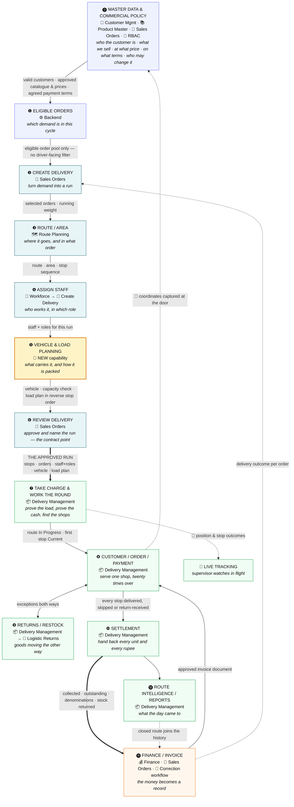

### Where the seven decisions and ten foundations land

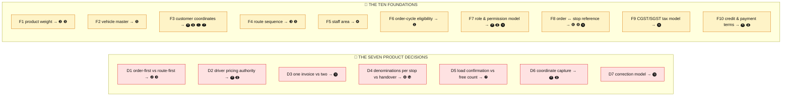

### Coverage of the journey by the 55 requirements

Four stages carry **no requirement at all**. That is a finding, not an omission on our side: the
requirement set does not describe a complete delivery business.

| Stage | Requirements landing here | Note |
| --- | ---: | --- |
| ⓿ Master data & policy | 12 | |
| ❶ Eligible Orders | 5 | |
| ❷ Create Delivery | 3 | |
| ❸ Route / Area | 2 | |
| ❹ Assign Staff | 7 | |
| ❺ Vehicle & Load Planning | 9 | |
| ❻ **Review Delivery** | **0** | ⚠️ No requirement describes approving a run. The handoff contract is undefined |
| ❼ Take charge & the round | 4 | |
| ❽ Customer / Order / Payment | 5 | |
| ❾ **Returns / Restock** | **0** | ⚠️ Fully built today and entirely untouched by the requirements. **Must not regress** |
| ❿ **Settlement** | **0** | ⚠️ Traversed by reqs 9, 10, 29–31 but owned by none. The route-close defect sits here |
| ⓫ Finance / Invoice | 8 | |
| ⓬ **Route Intelligence / Reports** | **0** | ⚠️ Where reqs 29–31 are *proved*, but no requirement covers it |

---

## Stage ⓿ — Master data & commercial policy

> **Actor:** Store admin, sales manager, catalogue owner
> **Goal:** *"Make sure a customer, a product and a price are trustworthy before anyone sells anything."*
> **Owns:** 👤 Customer Management · 📚 Product Master · 🛒 Sales Orders · 🔐 Platform RBAC
> **Receives from:** — · **Hands off to:** ❶ Eligible Orders

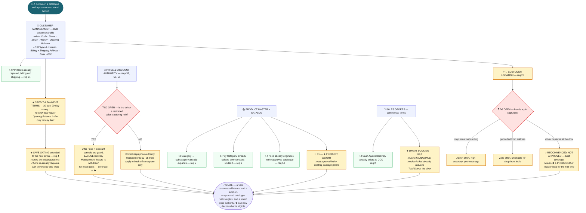

**Decisions & recommendations.**
❓ **D2 — OPEN.** *Fact:* Delivery Management has no permission model and gives every driver price and
discount control. 💡 *Recommended:* take this at policy level here, not at build time in Stage ❽. Full
options at §D.2.
❓ **D6 — OPEN.** 💡 *Recommended:* driver-captured at the door — the only option that reaches full
coverage without an onboarding project, and Stage ❽ already opens every shop once. **Not approved.**

**Resulting state / data.** A customer with terms, address, PIN and coordinates. A catalogue with weights.
An order payment-term vocabulary. A stated price authority.

**Alternate paths.** A customer saved without coordinates is still valid — Stage ❼ falls back to an
address-string hand-off. A customer without credit terms defaults to the existing behaviour.

| Reused from existing UX | Newly designed |
| --- | --- |
| The customer drawer and its **required-field pattern** *(Phone, with inline error + toast)* | Credit/payment-terms block; coordinate capture; the terms-completeness gate |
| **PIN Code** fields, billing and shipping | Product weight field on Product Master |
| Product **packaging tiers**; the Category hierarchy; Catalog's **By Category** mode | A permission model — none exists in any mockup |
| The **advance** mechanic *(exactly what a 50%-at-booking payment needs)* | — |

| # | Requirement | Owner | Status |
|---:|---|---|---|
| 1 | Credit options — 30/20 days | Customer Management | 🟡 |
| 2 | Payment option — Cash Against Delivery | Sales Orders | ⚪ |
| 3 | Payment option — 50% at booking | Sales Orders | 🟡 |
| 4 | Mandatory terms before save | Customer Management | 🟡 |
| 5 | Category → subcategories | Product Master | ⚪ |
| 6 | Category selects all products beneath | Catalog | ⚪ |
| 24 | Address includes ZIP | Customer Management | ⚪ |
| 25 | Address includes location/GPS | Customer Management | 🟡 |
| 52 | Sales staff cannot change prices | Platform RBAC | 🔴 |
| 53 | Sales staff cannot apply discounts | Platform RBAC | 🔴 |
| 54 | Prices from approved list | Product Master | ⚪ |
| 55 | Changes restricted to Management/Marketing | Platform RBAC | 🔵 |

**Decisions here:** D2, D6 · **Foundations here:** F1, F3, F7, F10

---

## Stage ❶ — Eligible Orders

> **Actor:** nobody — this stage is invisible by design
> **Goal:** *"Only orders that belong to this cycle reach the planner."*
> **Owns:** ⚙️ Backend · **Receives from:** ⓿ · **Hands off to:** ❷ Create Delivery

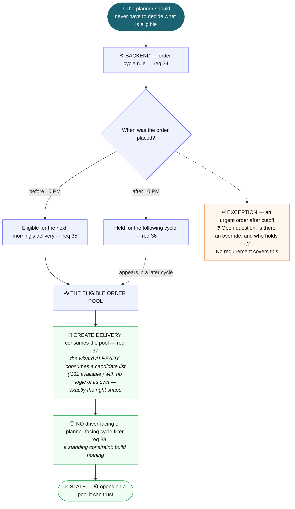

**Decisions & recommendations.** None. This is the one group the fitment map got exactly right: it is a
backend rule and must not become a UI filter.

**Resulting state / data.** A candidate pool. Nothing else changes.

**Alternate paths.** An urgent post-cutoff order has no described path. Flagged as an open question.

| Reused | Newly designed |
| --- | --- |
| **Create Delivery's existing candidate-list consumption** — it already takes a list and shows a count | The eligibility rule itself, and the pool that feeds the list |

| # | Requirement | Owner | Status |
|---:|---|---|---|
| 34 | 10 PM cutoff handled from backend | Backend | ⚫ |
| 35 | Before 10 PM → next morning | Backend | ⚫ |
| 36 | After 10 PM → next cycle | Backend | ⚫ |
| 37 | Create Delivery receives only eligible orders | Sales Orders | 🔵 |
| 38 | No additional UI filter | Product rule | ⚪ |

**Decisions here:** — · **Foundations here:** F6

---

## Stage ❷ — Create Delivery

> **Actor:** Distribution planner
> **Goal:** *"Turn last night's demand into a run I can hand to a driver."*
> **Owns:** 🛒 Sales Orders · **Receives from:** ❶ · **Hands off to:** ❸ Route / Area

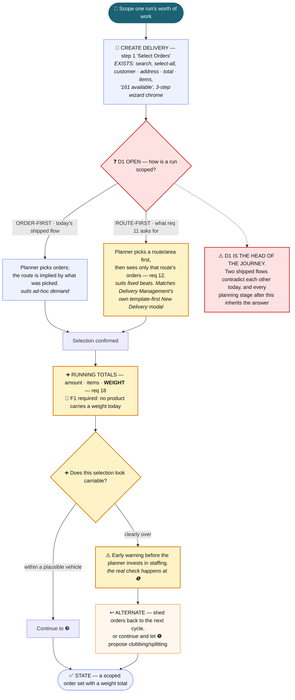

**Decisions & recommendations.**
❓ **D1 — OPEN. The single highest-leverage decision in this document.** *Fact:* two shipped flows
already contradict each other. 💡 *Recommended:* support **both**, with route-first as the default and
order-first retained for ad-hoc runs — but **only** if both converge on one approved-run object at Stage
❻. Shipping two entry models that produce different objects is the situation we are already in.
**Not approved** — full options, UX impact and risks at §D.2.

**Resulting state / data.** A named set of orders with a weight total and an implied or chosen route.

| Reused | Newly designed |
| --- | --- |
| **The whole step-1 selection pattern** — search, select-all, per-row customer/address/total/items | A route/area entry point *(if D1 = route-first)* |
| The **3-step wizard chrome**, already built and consistent | The running weight total |
| The candidate-count chip *("161 available")* | An early carriability warning |

| # | Requirement | Owner | Status |
|---:|---|---|---|
| 11 | The route should be selected/defined first | Product decision — Sales Orders vs Route Planning | 🔴 |
| 12 | Show the customers/orders belonging to the selected route | Sales Orders *(driver half ⚪ covered by the Delivery Queue)* | 🔴 |
| 18 | Calculate total weight after selecting orders | Sales Orders | 🔵 |

**Decisions here:** D1 · **Foundations here:** F1

---

## Stage ❸ — Route / Area

> **Actor:** Distribution planner
> **Goal:** *"Put these stops in a sensible geographic order."*
> **Owns:** 🗺️ Route Planning · **Receives from:** ❷ · **Hands off to:** ❹ Assign Staff

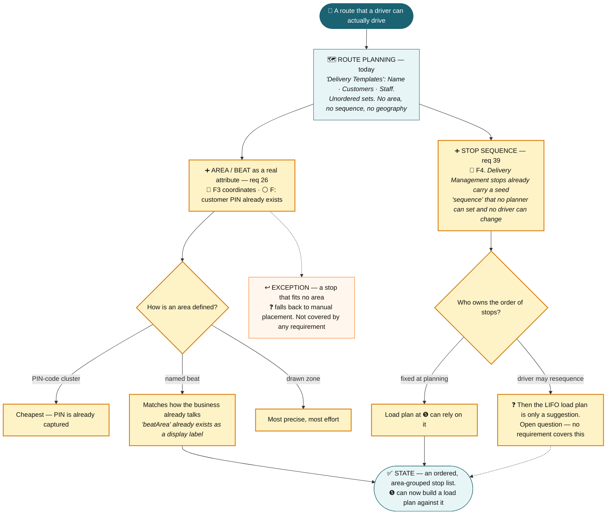

**Decisions & recommendations.** Two **stage-level** open questions, subordinate to D1 and not part of
the D1–D7 register.
❓ *How is an area defined?* 💡 *Recommended:* **named beat** — the vocabulary already exists
(`beatArea` appears as a label in both Delivery Management and Live Tracking) and matches how the
business speaks.
❓ *Who owns the order of stops?* 💡 *Recommended:* **fixed at planning**, so Stage ❺'s load plan means
something; driver resequencing can follow later as an explicit deviation. **Neither is approved.**

**Resulting state / data.** An ordered stop list with an area label.

| Reused | Newly designed |
| --- | --- |
| The Route Planning template list and its **"already assigned to X" conflict hint** | Area/beat as a real attribute rather than a label |
| Customer **PIN Code**, already captured | Stop sequencing, and any resequencing rules |
| The `beatArea` vocabulary already used in two modules | Geographic grouping |

| # | Requirement | Owner | Status |
|---:|---|---|---|
| 26 | Customers grouped by location/area | Route Planning | 🔵 |
| 39 | Loading should consider route sequence | Route Planning *(sequence)* → ❺ *(load order)* | 🔵 |

**Decisions here:** — *(D1 constrains the entry)* · **Foundations here:** F3, F4

---

## Stage ❹ — Assign Staff

> **Actor:** Distribution planner
> **Goal:** *"Put the right people on this run, in the right roles."*
> **Owns:** 👥 Workforce *(taxonomy)* → 🛒 Create Delivery step 2 *(assignment)*
> **Receives from:** ❸ · **Hands off to:** ❺ Vehicle & Load Planning

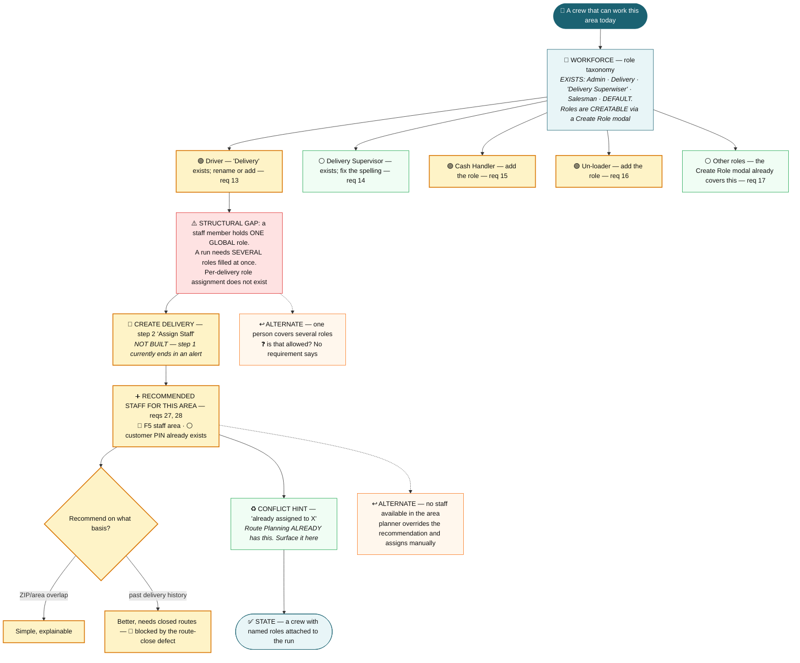

**Decisions & recommendations.** *Fact:* the role taxonomy is 🟢 today — three roles to add and one
spelling to fix — while the **assignment surface** is one unbuilt wizard step.
💡 *Recommended:* build step 2 with manual assignment first and add the area recommendation once F5
lands; the requirement splits cleanly into a buildable half and a blocked half. **Not approved** — it is
a sequencing proposal, not a product decision, and no D-decision gates it.

**Resulting state / data.** Staff with per-run roles attached to the run.

| Reused | Newly designed |
| --- | --- |
| The **Create Role modal** — roles are already user-creatable | Create Delivery step 2 itself |
| Route Planning's **assignment-conflict hint** *(already serves req 28)* | Per-delivery, multi-role assignment |
| Customer **PIN Code** for area matching | Staff area/beat attribute; the recommendation |

| # | Requirement | Owner | Status |
|---:|---|---|---|
| 13 | Staff assignment supports Driver | Workforce | 🟢 |
| 14 | Staff assignment supports Delivery Supervisor | Workforce | ⚪ |
| 15 | Staff assignment supports Cash Handler | Workforce | 🟢 |
| 16 | Staff assignment supports Un-loader | Workforce | 🟢 |
| 17 | Staff assignment supports other roles | Workforce | ⚪ |
| 27 | Recommend staff by area/ZIP at Assign Staff | Sales Orders *(step 2)* | 🔵 |
| 28 | Recommendation reduces incorrect assignment | Sales Orders | 🔵 |

**Decisions here:** — · **Foundations here:** F5

---

## Stage ❺ — Vehicle & Load Planning ⚠️ new capability

> **Actor:** Distribution planner / warehouse supervisor
> **Goal:** *"Choose a vehicle that fits, and pack it so the driver can work forwards."*
> **Owns:** 🚛 **A capability no module holds today** — 💡 *recommended:* Distribution & Logistics
> **Receives from:** ❹ · **Hands off to:** ❻ Review Delivery

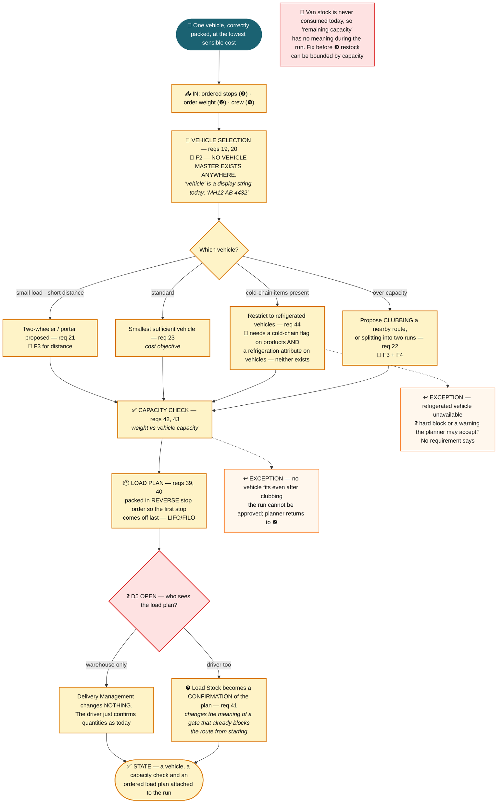

**Decisions & recommendations.** *Fact:* this stage is **nine requirements with no home, no data and no
UX anywhere in v6.** ✅ *Agreed, from the brief:* its output goes to Create Delivery, **never to Delivery
Management as a screen.** 💡 *Recommended:* place it in Distribution & Logistics beside Route Planning
and expose it as a wizard step — **placement is not approved.**
❓ **D5 — OPEN**, taken here but felt at Stage ❼. 💡 *Recommended:* warehouse-only first, so Delivery
Management changes nothing, with driver confirmation as a later deliberate change to a gate.

**Resulting state / data.** A vehicle, a capacity verdict, and an ordered load plan.

| Reused | Newly designed |
| --- | --- |
| Nothing. **This stage has no existing UX anywhere in v6** | Vehicle master; capacity and refrigeration checks; the selection policy; route clubbing; the load plan and its ordering |

| # | Requirement | Owner | Status |
|---:|---|---|---|
| 19 | Select suitable vehicle by capacity | Vehicle & Load Planning *(new)* | 🔵 |
| 20 | Vehicle selection considers load and distance | Vehicle & Load Planning | 🔵 |
| 21 | Two-wheeler/porter for small load, short distance | Vehicle & Load Planning | 🔵 |
| 22 | Club nearby routes when over capacity | Vehicle & Load Planning | 🔵 |
| 23 | Single vehicle to reduce operating cost | Vehicle & Load Planning | 🔵 |
| 40 | Loading considers LIFO/FILO | Vehicle & Load Planning | 🔵 |
| 42 | Loading considers weight | Vehicle & Load Planning | 🔵 |
| 43 | Loading considers vehicle capacity | Vehicle & Load Planning | 🔵 |
| 44 | Loading considers refrigeration capacity | Vehicle & Load Planning | 🔵 |

**Decisions here:** D5 · **Foundations here:** F1, F2, F3, F4

---

## Stage ❻ — Review Delivery ⚠️ no requirement covers this

> **Actor:** Distribution planner
> **Goal:** *"Approve this run and hand it over."*
> **Owns:** 🛒 Sales Orders *(Create Delivery step 3)* · **Receives from:** ❺ · **Hands off to:** ❼

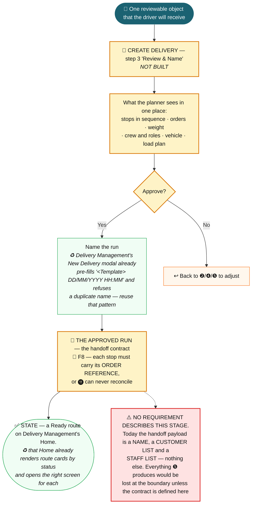

**Decisions & recommendations.** *Fact:* today's handoff payload is a name, a customer list and a staff
list, so everything Stages ❸–❺ produce evaporates at the module boundary. *Fact:* no requirement
describes this stage.
💡 *Recommended:* treat the approved-run contract as a **first-class deliverable of this programme**
even though no requirement asks for it. **Not approved** — this is a scope proposal for Product to
accept or reject.

**Resulting state / data.** The approved run: stops in sequence, order references, crew and roles, vehicle,
load plan. This is what Delivery Management opens.

| Reused | Newly designed |
| --- | --- |
| Delivery Management's **run-naming pattern** — pre-filled name, duplicate-name refusal | Create Delivery step 3 |
| Delivery Management's **Home route cards**, which already open the right screen per status | The approved-run contract and its payload |

| # | Requirement | Owner | Status |
|---:|---|---|---|
| — | **No requirement lands here.** The handoff contract is undefined | Sales Orders | ⚠️ gap |

**Decisions here:** — · **Foundations here:** F8

---

## Stage ❼ — Take charge & work the round

> **Actor:** Driver *(with Un-loader at the depot)*
> **Goal:** *"Prove what I am carrying, then get to every shop on my list."*
> **Owns:** 📦 Delivery Management · **Receives from:** ❻ · **Hands off to:** ❽

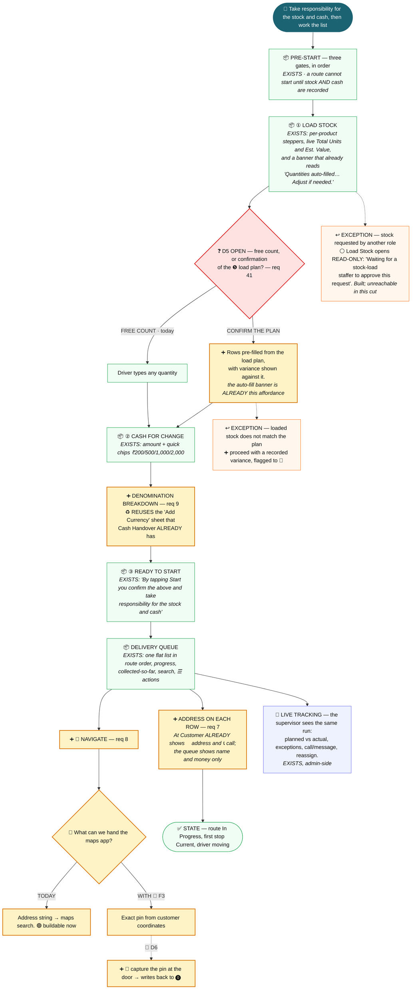

**Decisions & recommendations.**
❓ **D5 — OPEN**, decided at ❺ and felt here: it determines whether Load Stock changes at all.
❓ **D6 — OPEN**, felt here: this is where a driver-captured pin would be taken.
*Fact:* requirements 7 and 9 are the two cheapest items in the programme — one adds an existing field to
an existing row, the other reuses an existing sheet — and neither is gated by any open decision.

**Resulting state / data.** Route In Progress, stock and float on record with denominations, first stop
Current.

| Reused | Newly designed |
| --- | --- |
| **Pre-Start's three gates** and the responsibility banner | Denomination capture *at Cash for Change* — component reused, placement new |
| **Load Stock** in full, including the auto-fill *"Adjust if needed"* affordance | A variance view against the load plan *(only if D5 = driver sees it)* |
| The **"Add Currency" denomination sheet** from Cash Handover | Address on the queue row |
| **At Customer's** address + call block | A Navigate hand-off; optional pin capture |
| The **Delivery Queue** and Live Tracking's supervisor view | — |

| # | Requirement | Owner | Status |
|---:|---|---|---|
| 7 | See customer route/location during delivery | Delivery Management | 🟢 |
| 8 | Navigate between customers | Delivery Management | 🔵 *(🟢 for address fallback)* |
| 9 | Denominations when cash is allotted to staff | Delivery Management | 🟢 |
| 41 | Loading considers product quantity | Delivery Management | 🟡 |

**Decisions here:** D5, D6 · **Foundations here:** F3

---

## Stage ❽ — Customer / Order / Payment

> **Actor:** Driver, at the shop counter
> **Goal:** *"Sell, hand over, take the money correctly, and record what happened."*
> **Owns:** 📦 Delivery Management · **Receives from:** ❼ · **Hands off to:** ❾ / ❿

```mermaid
flowchart TD
    G(["🎯 Settle this shop's goods and money in one visit"]) --> S

    S{"What is this stop?"}
    S -->|"an order was booked upstream"| AC["📦 AT CUSTOMER<br/><i>EXISTS: Total Due = outstanding + order − advance,<br/>with one explaining line</i>"]
    S -->|"nothing booked"| BO["📦 BOOK ORDER — the catalogue at the door<br/><i>EXISTS</i>"]

    BO --> D2{"❓ D2 OPEN — may this driver change the price?<br/>reqs 52, 53, 55"}
    D2 -->|"TODAY — unrestricted"| PR1["✎ Offer Price sheet per product + order-discount sheet.<br/>NO permission check exists"]
    D2 -->|"RESTRICTED"| PR2["➕ Controls hidden or read-only.<br/>Price comes from the approved catalogue — ⚪ req 54<br/><i>optional: 'Request offer price' for approval</i>"]
    PR1 --> AC
    PR2 --> AC

    AC --> TERM{"➕ What did the order agree? — ⓿ reqs 1, 2, 3<br/>🧱 F10"}
    TERM -->|"Cash Against Delivery"| T1["Collect in full now"]
    TERM -->|"Credit 30/20 days"| T2["➕ Collect nothing or part;<br/>the balance ages in ⓫"]
    TERM -->|"50% paid at booking"| T3["➕ Today's due already reduced<br/>♻️ reuses the ADVANCE mechanic"]

    T1 --> PAY
    T2 --> PAY
    T3 --> PAY["📦 COLLECT PAYMENT<br/><i>EXISTS: Cash | UPI, amount chips, number pad</i>"]

    PAY --> D4{"❓ D4 OPEN — capture denominations here? — req 10"}
    D4 -->|"PER STOP"| DN1["➕ six more fields on the most repeated,<br/>most time-pressured screen in the product"]
    D4 -->|"AT HANDOVER ONLY"| DN2["⚪ Already covered at ❿ by the 'Add Currency' sheet"]

    DN1 --> OUT
    DN2 --> OUT{"How much was taken?"}
    OUT -->|"in full · more than due · ₹0 covered by advance"| O1["✅ Payment Collected"]
    OUT -->|"less than due"| O3["✏️ Tick-box — write the shortfall off as an offer,<br/>or record a Partial payment.<br/>🔴 is a write-off a discount? → D2"]

    O1 --> DONE
    O3 --> DONE["📦 Stop completes · ⚙️ next pending stop becomes Current"]

    DONE --> SAVE["⚪ AUTOMATICALLY SAVED — reqs 29, 30, 31<br/>date/time · final order lines · payment outcome<br/>🧱 F8 — no order reference exists on a stop today"]
    SAVE --> LOCK["🟡 DELIVERED STOP IS LOCKED — req 32<br/><i>today Collect, Edit and Skip are simply withdrawn;<br/>there is no role model to lock 'for normal users'</i>"]
    LOCK --> END(["✅ STATE — stop delivered, recorded and locked"])

    ALT["↩️ EXCEPTIONS → ❾"]
    ALT2["↩️ 🛑 a shop not on the list — Add Customer is BLOCKED today"]
    AC -.-> ALT
    S -.-> ALT2

    classDef goal fill:#1B6272,color:#fff,stroke:none
    classDef dm fill:#f0fdf4,stroke:#16a34a,color:#111
    classDef new fill:#fef3c7,stroke:#d97706,stroke-width:2px,color:#111
    classDef dec fill:#fee2e2,stroke:#dc2626,stroke-width:2px,color:#111
    classDef alt fill:#fff7ed,stroke:#f97316,color:#111
    classDef blocked fill:#fee2e2,stroke:#dc2626,stroke-width:2px,color:#111
    class G goal
    class AC,BO,PAY,O1,O3,DONE,SAVE,DN2,PR1 dm
    class PR2,T2,T3,DN1,TERM,LOCK new
    class D2,D4 dec
    class ALT alt
    class ALT2 blocked
    class END dm
```

**Decisions & recommendations.**
❓ **D2 — OPEN**, decided at ⓿ and *enforced here*. *Fact:* this is the screen where a live capability
would be withdrawn, which is why it cannot be deferred to build time.
❓ **D4 — OPEN.** 💡 *Recommended:* **handover only** — the financial intent is already satisfied at
Stage ❿, and per-stop capture adds six fields to the fastest, most repeated screen in the product.
**Not approved.**

**Resulting state / data.** Per stop: completion time, final order lines, payment amount and method,
write-off, outstanding, advance. Locked.

| Reused | Newly designed |
| --- | --- |
| The two-faced stop screen; **Total Due and its four explaining lines** *(a fifth covers booking payments)* | Term-aware collection behaviour |
| The **advance** mechanic — already exactly what a 50%-at-booking payment needs | Permission gating on Offer Price and discounts — **a withdrawal, not an addition** |
| The write-off tick-box; auto-promotion of the next stop | An explicit, role-aware locked state |
| The **completed-stop state** as the basis for locking | An order reference on the stop |

| # | Requirement | Owner | Status |
|---:|---|---|---|
| 10 | Denominations when collecting from customers | Delivery Management | 🟡 |
| 29 | Save delivery date/time on Delivered | Delivery Management | ⚪ |
| 30 | Save final order details | Delivery Management | ⚪ *(caveat: 🛑 route never closes)* |
| 31 | Save payment details | Delivery Management | ⚪ |
| 32 | Delivered order locked for normal users | Delivery Management | 🟡 |

**Decisions here:** D2 *(enforced)*, D4, D6 *(pin capture)* · **Foundations here:** F7, F8, F10

---

## Stage ❾ — Returns / Restock ⚠️ no requirement covers this

> **Actor:** Driver · **Goal:** *"Handle goods moving the other way, and refill without losing the round."*
> **Owns:** 📦 Delivery Management → 🔄 Logistic Returns · **Receives from:** ❽ · **Hands off to:** ❽ / ❿

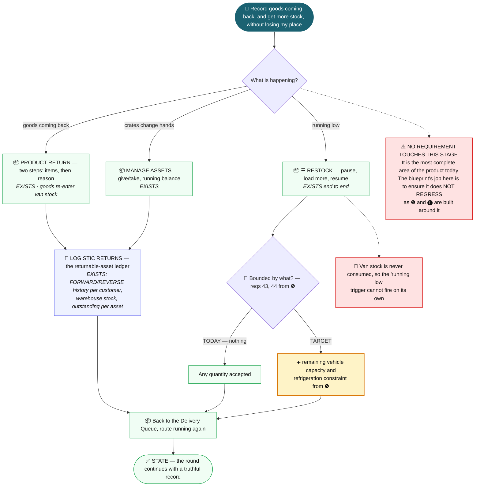

**Decisions & recommendations.** No D-decision lands here. 💡 *Recommended:* an explicit
**no-regression guard** — this stage is complete and unrequested, and is the most likely casualty of
building Stage ❺ around it. **Not approved**; it is a proposed programme constraint.

| Reused | Newly designed |
| --- | --- |
| **Product Return, Manage Assets and the whole Restock journey** — all built and specified | A capacity limit on restock quantities *(from ❺)* |
| The **Logistic Returns ledger**, already carrying FORWARD/REVERSE history | A link from a driver-recorded return into that ledger |

| # | Requirement | Owner | Status |
|---:|---|---|---|
| — | **No requirement lands here.** Protect from regression | Delivery Management | ⚪ |

**Decisions here:** — · **Foundations here:** —

---

## Stage ❿ — Settlement ⚠️ no requirement owns this

> **Actor:** Driver, with the Cash Handler · **Goal:** *"Hand back every unit and every rupee, provably."*
> **Owns:** 📦 Delivery Management · **Receives from:** ❽/❾ · **Hands off to:** ⓫ / ⓬

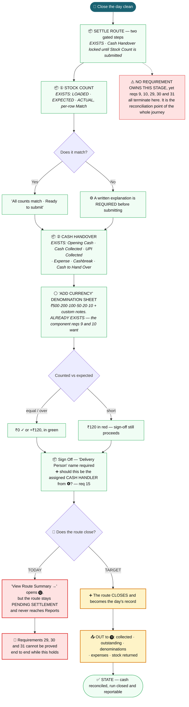

**Decisions & recommendations.** ❓ **D4 — OPEN**; its answer terminates here.
*Fact:* requirements 29, 30 and 31 depend on a record that never becomes final. 💡 *Recommended:* fix the
route-close defect **before** any invoice or reporting work. **Not approved** — a sequencing proposal.

| Reused | Newly designed |
| --- | --- |
| **Almost all of it** — the gated two-step checklist, the discrepancy gate, expenses, the difference display, sign-off | The route actually closing |
| The **"Add Currency" denomination sheet** | Posting denominations to Finance |
| — | Cash-handler identity on sign-off, drawn from ❹ |

| # | Requirement | Owner | Status |
|---:|---|---|---|
| — | **No requirement lands here.** Reqs 9, 10, 29–31 terminate here | Delivery Management | ⚠️ gap |

**Decisions here:** D4 *(terminates)* · **Foundations here:** F8

---

## Stage ⓫ — Finance / Invoice

> **Actor:** Accounts, and the customer receiving a document
> **Goal:** *"Give the customer the right document, keep receivables true, and fix mistakes safely."*
> **Owns:** 💰 Finance · 🛒 Sales Orders · 🔐 Correction workflow · **Receives from:** ❿

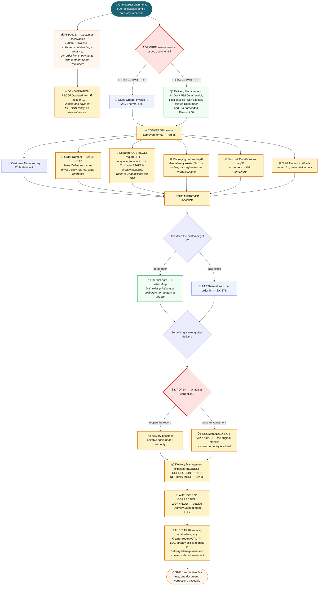

**Decisions & recommendations.**
❓ **D3 — OPEN.** 💡 *Recommended:* **two documents, one data source** — a counter receipt and a tax
invoice do different jobs, but both must render from the same order, tax treatment and numbers.
❓ **D7 — OPEN.** 💡 *Recommended:* **adjustment, not reopen** — it matches how Finance already works and
gives Delivery Management no new editable state. **Neither is approved** — see §D.2.

| Reused | Newly designed |
| --- | --- |
| Sales Orders' **Invoice → A4 / Thermal** action | The approved format; CGST/SGST; T&C; amount in words |
| Delivery Management's **receipt line renderer** and WhatsApp share | An order reference on the driver's copy |
| The Finance **receivables ledger**, including `advance` | Denominations on the Finance record |
| Delivery Management's **per-route activity log** as the audit foundation | The correction request, its approval, and a visible trail |

| # | Requirement | Owner | Status |
|---:|---|---|---|
| 33 | Corrections require authorisation + audit trail | Cross-module / Authorization | 🟡 |
| 45 | Invoice follows the approved format | Sales Orders | 🔴 |
| 46 | Invoice includes Order Number | Sales Orders | 🔵 |
| 47 | Invoice includes Customer Name | Sales Orders | ⚪ |
| 48 | Invoice includes separate CGST/SGST | Sales Orders + Finance | 🔵 |
| 49 | Invoice includes packaging unit | Sales Orders | 🟢 |
| 50 | Invoice includes Terms & Conditions | Sales Orders | 🟡 |
| 51 | Invoice includes Total Amount in Words | Sales Orders | 🟢 |

**Decisions here:** D3, D7 · **Foundations here:** F7, F8, F9

---

## Stage ⓬ — Route Intelligence / Reports ⚠️ no requirement covers this

> **Actor:** Driver, and the distribution manager · **Goal:** *"See what the day came to, and prove it."*
> **Owns:** 📦 Delivery Management · **Receives from:** ❿

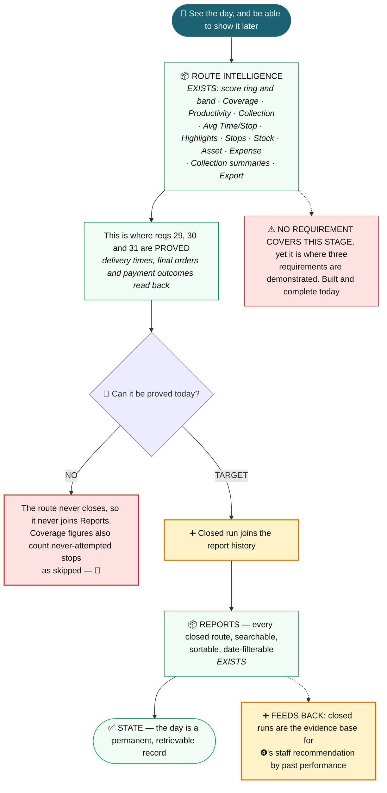

| Reused | Newly designed |
| --- | --- |
| **All of it** — Route Intelligence and Reports are complete | Nothing, once the route-close defect is fixed |

| # | Requirement | Owner | Status |
|---:|---|---|---|
| — | **No requirement lands here.** Reqs 29–31 are *proved* here | Delivery Management | ⚠️ gap |

**Decisions here:** — · **Foundations here:** —

---
---

# Part C — Requirement-by-requirement assessment

Preserved in full. **Ownership is architectural; status is readiness.** The two are independent — see the
framing box at the top of this document.

### Group A — Customer, commercial terms and catalogue (1–6) · Stage ⓿

| # | Requirement | Primary Module | Other Modules Touched | Existing UX / Capability | Status | Required Change | Dependencies | Open Product Question |
|---|---|---|---|---|---|---|---|---|
| 1 | Credit options may include 30 / 20 days credit | Customer Management | Sales Orders · Finance · Delivery Management | Customer form has GST, addresses, PIN, **Opening Balance** — no credit terms. Finance tracks `outstanding` and `advance` but no due date | 🟡 | Add a credit-terms field, and define what it *does* downstream | Req 4 | Does a credit term change what the driver may collect at the door, or is it only a receivables-ageing input? |
| 2 | Payment option may include Cash Against Delivery | Sales Orders | Delivery Management | Orders already carry **COD / Credit / UPI** | ⚪ | None. Naming only | — | Delivery Management ignores the order's payment method and always offers Cash \| UPI. Should the term constrain the driver? |
| 3 | Payment option may include 50% at order booking | Sales Orders | Delivery Management · Finance | No part-payment-at-booking. Delivery Management **has an advance** that reduces Total Due; Finance tracks `advance` | 🟡 | Capture a booking payment; carry it into the stop as an advance | Req 2 | Does a booking payment behave exactly like today's advance? |
| 4 | All mandatory terms completed before save | Customer Management | — | Save-gating exists — **Phone is the only required field** | 🟡 | Extend the existing required-field pattern | Req 1 | Which terms are mandatory, and B2B only? |
| 5 | Clicking a category displays its subcategories | Product Master | — | **Already expands** — "Show subcategories" toggle + expandable rows | ⚪ | None | — | — |
| 6 | Category checkbox selects all products beneath | Catalog | Product Master | **"By Category" mode already selects every product under a category** | ⚪ | None functionally; the affordance is a button, not a checkbox | — | Is a literal checkbox required? |

### Group B — Location, navigation, visibility (7, 8, 24, 25, 26) · Stages ⓿ ❸ ❼

| # | Requirement | Primary Module | Other Modules Touched | Existing UX / Capability | Status | Required Change | Dependencies | Open Product Question |
|---|---|---|---|---|---|---|---|---|
| 7 | Staff see the customer route/location during delivery | **Delivery Management** | Customer Management | **At Customer already shows 📍 address + 📞 call.** The Queue shows name and money only | 🟢 | Add the address to the Queue row and Stop Summary | — | Address, map position, or both? |
| 8 | The route helps staff navigate between customers | **Delivery Management** | Customer Management · Live Tracking | **Nothing exists.** Live Tracking is an admin map — correction **C3** | 🔵 | A Navigate action handing off to the phone's maps app | Req 25 for a pin; address fallback is 🟢 today | External maps hand-off, or in-app turn-by-turn? |
| 24 | Address includes ZIP/postal code | Customer Management | — | **PIN Code (Billing) and (Shipping) already exist** — correction **C4** | ⚪ | None | — | Should PIN become mandatory? *(req 4)* |
| 25 | Address includes location/GPS | Customer Management | Delivery Management · Live Tracking · Route Planning | No coordinates on any customer. Live Tracking's are **invented seed data** | 🟡 | Coordinates on the profile + a capture method | — | **D6** — map pin, geocode, or driver-captured at the door? |
| 26 | Customers grouped by location/area | Route Planning | Customer Management | Templates are **unordered sets**. `beatArea` exists only as a display label | 🔵 | Area/beat as a real attribute, then grouping | Req 24 ⚪ *(covered)*, req 25 🟡 *(open)* | PIN cluster, named beat, or drawn zone? |

### Group C — Route, staff, vehicle, load planning (11–23, 27, 28, 39–44) · Stages ❷ ❸ ❹ ❺

> Correction **C1**: none of this can be "consumed from Route Planning" — it plans nothing.
> Correction **C2**: the home is the unfinished **Create Delivery** wizard plus a new load-planning step.

| # | Requirement | Primary Module | Other Modules Touched | Existing UX / Capability | Status | Required Change | Dependencies | Open Product Question |
|---|---|---|---|---|---|---|---|---|
| 11 | The route should be selected/defined first | **Product decision** — Sales Orders vs Route Planning | Delivery Management | **Two flows disagree** — Create Delivery is order-first; Delivery Management's New Delivery modal is route-first | 🔴 | Choose one entry model; make both honour it | — | **D1.** Order-first suits ad-hoc demand; route-first suits fixed beats |
| 12 | Show customers/orders belonging to the selected route | Sales Orders | Delivery Management | Driver half **⚪ covered** by the Delivery Queue. Create Delivery shows a flat 161-candidate list with **no route filter** | 🔴 | Filter candidates by route — after D1 | Req 11 | — |
| 13 | Staff assignment supports Driver | Workforce | Sales Orders *(step 2)* | Role **"Delivery"** exists; roles are creatable | 🟢 | Rename or add "Driver" | Req 27 for the UI | Is "Delivery" the same as "Driver"? |
| 14 | Staff assignment supports Delivery Supervisor | Workforce | Sales Orders | **"Delivery Superwiser"** exists *(live tenant spelling)* | ⚪ | Fix the spelling | — | — |
| 15 | Staff assignment supports Cash Handler | Workforce | Sales Orders · Finance | Not present; Create Role modal exists | 🟢 | Add the role | — | Does a Cash Handler sign off Cash Handover? It asks for free text today |
| 16 | Staff assignment supports Un-loader | Workforce | Sales Orders | Not present | 🟢 | Add the role | — | — |
| 17 | Staff assignment supports other roles | Workforce | — | **Roles are already creatable** | ⚪ | None | — | — |
| 18 | Calculate total weight after selecting orders | Sales Orders | Product Master | **No weight attribute on any product.** Create Delivery totals amount and items only | 🔵 | Weight in Product Master; total in Create Delivery | F1 | Weight per selling unit or base unit? |
| 19 | Select a suitable vehicle by capacity | **Vehicle & Load Planning** *(new)* | Sales Orders | **No vehicle master.** "Vehicle" is a display string | 🔵 | Vehicle master + selection | F1 | Which module owns fleet? Nothing does |
| 20 | Vehicle selection considers load and distance | Vehicle & Load Planning | Customer Management | Nothing | 🔵 | Distance needs coordinates | F1, F2, F3 | — |
| 21 | Two-wheeler/porter for small load, short distance | Vehicle & Load Planning | — | Nothing; no vehicle types | 🔵 | Types + selection policy | F2, F3 | Hard rule or overridable recommendation? |
| 22 | Club nearby routes when over capacity | Vehicle & Load Planning | Route Planning | Nothing. Templates are static independent sets | 🔵 | Multi-route optimisation + a clubbed-run representation | F2, F3, F4 | Are the templates merged, or does a run reference both? |
| 23 | Single vehicle to reduce operating cost | Vehicle & Load Planning | — | Nothing | 🔵 | Cost objective | F2 | Optimise cost or delivery-window adherence? |
| 27 | Recommend staff by area/ZIP at Assign Staff | Sales Orders *(step 2)* | Workforce · Customer Management | **Step 2 not built.** Staff have no area. Customer PIN exists. Route Planning's conflict hint is reusable | 🔵 | Staff area, then a ranked recommendation | F5 | ZIP overlap, past history, or both? |
| 28 | Recommendation reduces incorrect assignment | Sales Orders | Workforce | The **conflict hint** already prevents part of this | 🔵 | Outcome of 27 + surface the hint | Req 27 | — |
| 39 | Loading considers route sequence | Route Planning | Vehicle & Load Planning · Delivery Management | **No sequence.** Delivery Management stops carry a seed `sequence` nobody can set or change | 🔵 | Sequencing, then a derived load order | F4 | Fixed at planning, or may the driver resequence? |
| 40 | Loading considers LIFO/FILO | Vehicle & Load Planning | Delivery Management | Nothing | 🔵 | A load plan ordered against the sequence | F4 | **D5** — does the driver see a loading order at all? |
| 41 | Loading considers product quantity | **Delivery Management** | Sales Orders | **Load Stock already captures quantity**, with a planned-quantity affordance: *"Quantities auto-filled… Adjust if needed."* | 🟡 | Bind the pre-fill to a real plan; decide on deviation | F4 | **D5** — confirmation of a plan, or a free count? |
| 42 | Loading considers weight | Vehicle & Load Planning | Product Master | Nothing | 🔵 | Consumes req 18 | F1 | — |
| 43 | Loading considers vehicle capacity | Vehicle & Load Planning | — | Nothing | 🔵 | Consumes req 19 | F2 | — |
| 44 | Loading considers refrigeration capacity | Vehicle & Load Planning | Product Master | **No cold-chain flag, no refrigeration attribute** | 🔵 | Both attributes + a constraint check | F2 | Hard exclusion or warning? |

### Group D — Order eligibility (34–38) · Stage ❶

| # | Requirement | Primary Module | Other Modules Touched | Existing UX / Capability | Status | Required Change | Dependencies | Open Product Question |
|---|---|---|---|---|---|---|---|---|
| 34 | 10 PM cutoff handled from backend | Backend | — | No cutoff concept | ⚫ | Backend rule. **UI consumes** the candidate pool | — | — |
| 35 | Orders before 10 PM eligible next morning | Backend | Sales Orders | None | ⚫ | Backend | Req 34 | — |
| 36 | Orders after 10 PM move to next cycle | Backend | Sales Orders | None | ⚫ | Backend | Req 34 | Should the order list show which cycle it fell into? |
| 37 | Create Delivery receives only eligible orders | Sales Orders | Backend | Already consumes a **candidate list** with no logic of its own — the right shape | 🔵 | Point it at the eligible pool | F6 | — |
| 38 | No additional UI filter | Product rule | Sales Orders · Delivery Management | Search only; **no cycle filter today** | ⚪ | **Build nothing.** A standing constraint | — | — |

### Group E — Delivery execution and completion (9, 10, 29–33) · Stages ❼ ❽ ⓫

| # | Requirement | Primary Module | Other Modules Touched | Existing UX / Capability | Status | Required Change | Dependencies | Open Product Question |
|---|---|---|---|---|---|---|---|---|
| 9 | Denominations when cash is allotted to staff | **Delivery Management** | Finance | **Cash for Change captures an amount only.** Cash Handover **already has a full denomination sheet** | 🟢 | **Reuse the Add Currency sheet** on Cash for Change | — | Must the breakdown reconcile exactly to the float? |
| 10 | Denominations when collecting from customers | **Delivery Management** | Finance | **Half covered** — captured once at Cash Handover. Collect Payment captures amount + method | 🟡 | Decide the level of capture first | Req 9 | **D4.** Is a note-by-note count realistic at a shop counter? |
| 29 | Save delivery date/time on Delivered | **Delivery Management** | — | **⚪ Covered** — `completedAt` is stamped and read back | ⚪ | None | — | — |
| 30 | Save the final order details | **Delivery Management** | Sales Orders | **⚪ Covered in-session.** But the route never closes *(🛑)*, so the record never becomes final | ⚪ *(caveat)* | None in UX | Route-close defect, F8 | Should the delivery write back to the Sales Order? **No stop↔order reference exists** |
| 31 | Save the payment details | **Delivery Management** | Finance | **⚪ Covered** — amount, method, write-off, partial and advance outcomes | ⚪ | None | — | Does Finance receive this or re-derive it? |
| 32 | Delivered order locked for normal users | **Delivery Management** | Platform RBAC | **Implicitly covered** — a completed stop withdraws its actions. But **there is no role model** | 🟡 | Make the lock explicit and role-aware | F7 | Who is a "normal user"? Delivery Management has one user with all rights |
| 33 | Corrections require authorisation + audit trail | Cross-module / Authorization | Delivery Management · Sales Orders · Finance | **No correction workflow, no audit UI.** A per-route `activityLog` **data hook already exists**, unsurfaced | 🟡 | Delivery Management exposes **"Request Correction"** only | Req 32, F7 | **D7.** What may be corrected, and does it reopen or adjust? |

### Group F — Invoice and financial document (45–51) · Stage ⓫

| # | Requirement | Primary Module | Other Modules Touched | Existing UX / Capability | Status | Required Change | Dependencies | Open Product Question |
|---|---|---|---|---|---|---|---|---|
| 45 | Invoice follows the approved sample format | Sales Orders | Delivery Management · Finance | **Two documents exist and differ.** Sales Orders: A4/Thermal. Delivery Management: its own 58/80mm receipt titled "Invoice", with a minted bill number and *(🐞)* a hardcoded `Discount ₹0` | 🔴 | Decide the canonical document, then converge | Reqs 46–51 | **D3.** One document, or two rendering from one source? |
| 46 | Invoice includes Order Number | Sales Orders | Delivery Management | Sales Orders **⚪ has it**. Delivery Management prints an unrelated `FB/...` bill number | 🔵 | Carry the order reference onto the stop | F8 | — |
| 47 | Invoice includes Customer Name | Sales Orders | Delivery Management | **⚪ Both have it** | ⚪ | None | — | — |
| 48 | Invoice includes separate CGST/SGST | Sales Orders | Finance · Product Master | **One tax rate only.** Customer **state is captured**, which decides the split | 🔵 | Line-level tax split, then both documents | F9 | Is IGST in scope? |
| 49 | Invoice includes packaging unit | Sales Orders | Product Master · Delivery Management | **Data exists** — `measurement` on orders, packaging tiers in Product Master. The driver's receipt line prints no unit | 🟢 *(SO)* / 🔵 *(DM)* | Add the unit to the invoice line | — | — |
| 50 | Invoice includes Terms & Conditions | Sales Orders | — | **No T&C content or field anywhere** | 🟡 | A store-level setting, then render | — | Store-wide, per-customer, or per-term? |
| 51 | Invoice includes Total Amount in Words | Sales Orders | Delivery Management | Not present in either; **all data exists** | 🟢 | Presentation only | — | On a 32/48-character thermal receipt too? |

### Group G — Price and discount authority (52–55) · Stages ⓿ ❽

> Correction **C8.** Delivery Management has **no permission model** and **actively gives the driver price
> and discount control** — an Offer Price sheet per product and an order-discount sheet. This is a live
> conflict, not a pass-through.

| # | Requirement | Primary Module | Other Modules Touched | Existing UX / Capability | Status | Required Change | Dependencies | Open Product Question |
|---|---|---|---|---|---|---|---|---|
| 52 | Sales-capturing staff cannot change prices | Platform RBAC | Sales Orders · **Delivery Management** | **No role gating anywhere.** Any driver can reprice any line, and the offer follows into every summary and receipt | 🔴 | Decide whether the driver is restricted; gate the Offer Price sheet | F7 | **D2.** Is booking at the shop door "sales order capture"? |
| 53 | Sales-capturing staff cannot apply/modify discounts | Platform RBAC | Sales Orders · **Delivery Management** | Same; the discount strip is on Book Order and New Customer | 🔴 | Gate the discount sheet | F7 | Same as 52. **The write-off tick-box is also a discretionary discount** |
| 54 | Prices come from the approved price list | Product Master | Sales Orders · Delivery Management | **⚪ Already true** — Delivery Management even labels it *"Catalog price ₹80"* with *"Reset to ₹80"* | ⚪ *(🔴 tie-in)* | None, **except** Offer Price overrides it | Req 52 | — |
| 55 | Price/discount changes restricted to Management/Marketing | Platform RBAC | Sales Orders · Delivery Management | No RBAC in any mockup | 🔵 | A permission model, then gate three surfaces | F7 | Is there an approval path — the driver *requests*, someone approves? |

### Assessment summary

| Status | Count | Requirements |
| --- | ---: | --- |
| ⚪ **Already covered** | 12 | 2, 5, 6, 14, 17, 24, 29, 30, 31, 38, 47, 54 *(30, 54 with caveats)* |
| 🟢 **Implement now** | 7 | 7, 9, 13, 15, 16, 49, 51 |
| 🟡 **Needs solutioning** | 9 | 1, 3, 4, 10, 25, 32, 33, 41, 50 |
| 🔵 **Cross-module dependency** | 19 | 8, 18–23, 26, 27, 28, 37, 39, 40, 42, 43, 44, 46, 48, 55 |
| ⚫ **Backend/data** | 3 | 34, 35, 36 |
| 🔴 **Conflict — product decision** | 5 | 11, 12, 45, 52, 53 |
| | **55** | |

**Genuinely Delivery Management's own: 9** — 7, 8, 9, 10, 32, 41, plus the ⚪ trio 29, 30, 31.
**Should NOT be built in Delivery Management: 46.**

---
---

# Part D — The decision layer

## D.1 Decision register — at a glance

Seven decisions gate this programme. **All seven are ❓ OPEN.** Nothing below is approved; the
Recommended column is Claude's proposed direction with reasoning, not a product rule. Sequencing for
review is in §G.

| # | Decision | Taken at | Felt at | 💡 Recommended option | Blocks | Decision |
| --- | --- | :---: | :---: | --- | --- | :---: |
| **D1** | Order-first or route-first delivery creation? | ❷ | ❷ ❸ | Support both, converging on one approved-run object at ❻ | 11, 12, 26, 39 | ❓ **OPEN** |
| **D2** | Is the driver a restricted sales-capturing role? | ⓿ | ❽ | Restrict, with a request-and-approve path for offers | 52–55, 32, 33 | ❓ **OPEN** |
| **D3** | One invoice, or two documents? | ⓫ | ❽ ⓫ | Two documents, one data source | 45–51 | ❓ **OPEN** |
| **D4** | Denominations per stop, or at handover? | ❽ | ❽ ❿ | Handover only | 10 | ❓ **OPEN** |
| **D5** | Load Stock — plan confirmation, or free count? | ❺ | ❼ | Warehouse-only load plan first | 40, 41 | ❓ **OPEN** |
| **D6** | How are customer coordinates captured? | ⓿ | ❼ ❽ | Driver-captured at the door | 8, 25, 26 | ❓ **OPEN** |
| **D7** | What is a post-delivery correction? | ⓫ | ❽ ⓫ | Post an adjustment; do not reopen | 33 | ❓ **OPEN** |

## D.2 The seven decisions in full

Each decision below separates three things: **fact** (observed in the repository), 💡 **recommendation**
(proposed, not approved) and ❓ **open** (needs Product). *Decision* stays ❓ OPEN until recorded in §G.

---

### D1 — Order-first or route-first delivery creation? ❓ OPEN

| | |
| --- | --- |
| **Why it matters** | *Fact:* two shipped flows already contradict each other. Sales Orders' Create Delivery is **order-first**; Delivery Management's New Delivery modal is **route-first**. Every planning stage after ❷ inherits the answer, and requirement 11 asks for route-first while the live wizard does the opposite. This is the head of the journey — deciding it late invalidates Stages ❸–❻ |
| **💡 Recommended option** | **Support both, converging on one approved-run object at ❻.** Route-first as the default entry for fixed beats; order-first retained for ad-hoc demand. The non-negotiable half of the recommendation is the convergence, not the duality |
| **Alternative(s)** | **A — Route-first only.** Matches requirement 11 literally. **B — Order-first only.** Matches the shipped wizard and today's `deliveryCandidates` shape |
| **Dependencies** | None to decide. F4 *(route sequence)* and F3 *(coordinates)* are needed to *build* route-first well |
| **Decision** | ❓ **OPEN** |

| Option | UX impact | Module impact | Risks / trade-offs |
| --- | --- | --- | --- |
| 💡 **Both, converging at ❻** | Planner chooses an entry mode at ❷. Two paths, one review screen at ❻ | Sales Orders *(both entries + step 3)*, Route Planning *(route as an entry object)*, Delivery Management *(unchanged — it already opens whatever run it is given)* | Most build. Two entries can drift apart again unless ❻ is genuinely the single contract. **Mitigation: build ❻ first** |
| **A — Route-first only** | Planner picks a route/area, then sees only its orders — req 12 becomes literal | Route Planning becomes the entry point; the shipped order-first wizard is withdrawn | Ad-hoc demand outside any route has no path. Withdraws a live flow |
| **B — Order-first only** | Today's flow, finished. Requirement 11 is formally rejected | Sales Orders only. Route Planning stays a grouping list | Cheapest and closest to what exists — but contradicts a stated requirement, and route/area grouping (26) loses its natural home |

---

### D2 — Is the driver a restricted sales-capturing role? ❓ OPEN

| | |
| --- | --- |
| **Why it matters** | *Fact:* Delivery Management has **no permission model at all**, and actively gives every driver an Offer Price sheet (with 5/10/15/20% quick chips) and an order-discount sheet (% or ₹). *Fact:* the write-off tick-box at Collect Payment is also discretionary money. Requirements 52–55 say sales-capturing staff may not change price or discount. If booking an order at a shop counter **is** sales capture, a live capability must be withdrawn for most users — that is a commercial and change-management decision, not an engineering one |
| **💡 Recommended option** | **Restrict, with a request-and-approve path.** Gate Offer Price, order discount and write-off behind a permission. Where the driver needs commercial flexibility, let them *request* an offer price for approval rather than apply one. This preserves the field capability without giving away price authority |
| **Alternative(s)** | **A — Restrict outright.** No approval path; the controls simply disappear for restricted roles. **B — Do not restrict the driver.** Requirements 52–55 apply to back-office capture only; the driver keeps price authority |
| **Dependencies** | **F7 (role & permission model)** to enforce. The *decision* needs nothing |
| **Decision** | ❓ **OPEN** |

| Option | UX impact | Module impact | Risks / trade-offs |
| --- | --- | --- | --- |
| 💡 **Restrict + request/approve** | Driver sees catalogue price with a "Request offer price" action; an approver resolves it. Write-off tick-box becomes permissioned | Delivery Management *(gate three surfaces)*, Sales Orders, Platform RBAC, plus a new approval queue | Largest build. An approval round-trip at a shop counter may be too slow — needs a field test before commitment |
| **A — Restrict outright** | Offer Price and discount controls disappear for the driver. Simplest screen | Delivery Management + RBAC only | Removes real negotiating capability at the door. Likely field resistance; may drive off-system discounting |
| **B — Do not restrict** | Nothing changes in Delivery Management | Sales Orders + RBAC only | Cheapest, but 52–55 are then only half-met, and price authority stays with the least-supervised role |

---

### D3 — One invoice, or two documents? ❓ OPEN

| | |
| --- | --- |
| **Why it matters** | *Fact:* two documents already exist. Sales Orders prints an Invoice (A4 / Thermal); Delivery Management prints its **own** 58/80 mm receipt, also titled "Invoice", with a locally minted bill number unrelated to the order — and *(🐞)* a hardcoded `Discount ₹0`. Requirement 45 asks for one approved format. Seven requirements (45–51) depend on which document that is |
| **💡 Recommended option** | **Two documents, one data source.** Keep a driver's counter receipt and a commercial tax invoice as separate artefacts — they do different jobs at different moments — but render both from the same order, the same tax treatment and the same numbers |
| **Alternative(s)** | **A — One document.** Delivery Management stops rendering its own receipt and prints the Sales Orders invoice. **B — Keep both independent.** Formally accept that the counter receipt is not a tax document |
| **Dependencies** | **F8 (order ↔ stop reference)** — without it the driver's copy cannot carry an order number. **F9 (CGST/SGST)** for req 48 |
| **Decision** | ❓ **OPEN** |

| Option | UX impact | Module impact | Risks / trade-offs |
| --- | --- | --- | --- |
| 💡 **Two documents, one source** | Counter receipt stays thermal and terse; the tax invoice carries CGST/SGST, T&C and amount in words. Both show the same order number and totals | Sales Orders *(canonical renderer)*, Delivery Management *(consumes the data, keeps its own layout)*, Finance | Two layouts to keep in step. Needs a shared numbers contract or they drift — which is exactly today's failure |
| **A — One document** | The driver prints the full tax invoice on 58/80 mm paper | Delivery Management loses its receipt renderer entirely | A 32-character-wide tax invoice with T&C is barely legible. High regression risk to a working screen |
| **B — Both independent** | Nothing changes | None | Requirement 45 is not met. Two documents keep disagreeing, as they do today |

---

### D4 — Denominations per stop, or at handover? ❓ OPEN

| | |
| --- | --- |
| **Why it matters** | *Fact:* Cash Handover **already captures denominations** in an "Add Currency" sheet (₹500·200·100·50·20·10 plus custom notes). *Fact:* Collect Payment captures amount and method only. Requirement 10 asks for capture "when staff collects cash from customers" — which may already be satisfied at the handover level, or may mean per-stop. The cost difference is large: Collect Payment is the fastest, most repeated, most time-pressured screen in the product |
| **💡 Recommended option** | **Handover only.** Treat requirement 10 as satisfied by the existing Cash Handover sheet, and post the breakdown to Finance from there |
| **Alternative(s)** | **A — Per stop.** Capture a note breakdown at every collection. **B — Per stop, optional.** Offer it as a collapsed affordance the driver may skip |
| **Dependencies** | None to decide. Posting to Finance needs a Finance denomination field |
| **Decision** | ❓ **OPEN** |

| Option | UX impact | Module impact | Risks / trade-offs |
| --- | --- | --- | --- |
| 💡 **Handover only** | No change to Collect Payment. Denominations captured once, at end of day | Delivery Management *(none)*, Finance *(new field)* | Cannot reconcile a shortfall to a specific stop. If the financial intent really is per-collection, this under-delivers req 10 |
| **A — Per stop** | Six extra fields on the highest-frequency screen; every collection slows | Delivery Management *(Collect Payment redesign)*, Finance | Real risk drivers stop using it accurately, producing worse data than not capturing at all |
| **B — Per stop, optional** | A collapsed row the driver may open | Delivery Management, Finance | Optional capture yields partial data, which is often harder to reconcile than none |

---

### D5 — Load Stock: plan confirmation, or free count? ❓ OPEN

| | |
| --- | --- |
| **Why it matters** | *Fact:* Load Stock is a free count today, but already shows a planned-quantity affordance — *"Quantities auto-filled from today's proxy orders. Adjust if needed."* *Fact:* it is one of three gates that block a route from starting. Requirement 41 says loading should consider product quantity; requirement 40 adds LIFO/FILO. Whether the driver sees the load plan decides **whether Delivery Management changes at all** in this programme |
| **💡 Recommended option** | **Warehouse-only load plan first.** Stage ❺ produces the plan for the loading bay; Delivery Management continues as a free count. Driver confirmation becomes a later, deliberate change to a gate |
| **Alternative(s)** | **A — Driver confirms the plan.** Load Stock pre-fills from the plan and shows variance. **B — Driver confirms and cannot deviate.** The plan is binding |
| **Dependencies** | **F4 (route sequence)** for the load order; Stage ❺ must exist at all. 🐞 van stock is never consumed today, so variance cannot be reconciled during the run |
| **Decision** | ❓ **OPEN** |

| Option | UX impact | Module impact | Risks / trade-offs |
| --- | --- | --- | --- |
| 💡 **Warehouse-only first** | **No change to Delivery Management.** The plan lives in the loading bay | Vehicle & Load Planning only | The driver cannot vouch for what was loaded against the plan; variance surfaces only at settlement |
| **A — Driver confirms** | Load Stock rows pre-fill from the plan with variance shown; the existing auto-fill banner already *is* this affordance | Vehicle & Load Planning + Delivery Management | Changes the meaning of a gate that already blocks the route. Needs care — this gate is a control, not a form |
| **B — Binding, no deviation** | The driver cannot proceed on a mismatch | Both, plus an exception path | A driver blocked at 6 a.m. by a data error cannot work. Needs an override, which reopens the question |

---

### D6 — How are customer coordinates captured? ❓ OPEN

| | |
| --- | --- |
| **Why it matters** | *Fact:* no customer record carries coordinates. *Fact:* Live Tracking's lat/lng are **invented seed data**, not master data. Four requirements (8, 20, 25, 26) depend on real coordinates, and coverage — not accuracy — is what determines whether navigation and distance-aware planning are usable |
| **💡 Recommended option** | **Driver-captured at the door.** The driver confirms the pin on first delivery. Stage ❽ already opens every shop once, so coverage approaches 100% within one cycle — and it makes Delivery Management a **producer** of master data for the first time, which is a deliberate widening of its role |
| **Alternative(s)** | **A — Map pin at onboarding.** Admin drops a pin when the customer is created. **B — Geocode from the address.** Derive coordinates from the existing address + PIN |
| **Dependencies** | **F3** is the foundation this decision shapes. Option 💡 also depends on **D1/D6 sequencing** only in that Stage ❽ must ship first |
| **Decision** | ❓ **OPEN** |

| Option | UX impact | Module impact | Risks / trade-offs |
| --- | --- | --- | --- |
| 💡 **Driver-captured at the door** | A confirm-pin prompt on first delivery to a shop | **Delivery Management writes to Customer Management** — a new direction of data flow; Customer Management *(field + provenance)* | Widens Delivery Management's role beyond execution. Needs a light, skippable interaction or it becomes a chore. Data quality depends on the driver standing in the right place |
| **A — Map pin at onboarding** | A map picker in the customer drawer | Customer Management only | Cleanest ownership, but coverage is poor — existing customers are never revisited, and onboarding slows |
| **B — Geocode from address** | Invisible to everyone | Customer Management + a geocoding service | Zero effort, but unreliable for shop-front addresses in dense Indian markets. Silent wrong pins are worse than none |

---

### D7 — What is a post-delivery correction? ❓ OPEN

| | |
| --- | --- |
| **Why it matters** | *Fact:* there is no correction workflow and no audit UI anywhere. *Fact:* Delivery Management already keeps a per-route **activity log as data**, never surfaced — a reusable audit foundation. Requirement 33 requires authorisation and an audit trail; requirement 32 requires delivered orders to be locked. The shape of a correction decides whether Delivery Management gains any new editable state at all |
| **💡 Recommended option** | **Post an adjustment; do not reopen.** The original delivery record stands permanently; a correcting entry is added against it. Delivery Management exposes **"Request Correction"** and nothing more |
| **Alternative(s)** | **A — Reopen under authority.** An authorised user unlocks the delivery and edits it in place. **B — Cancel and re-record.** Void the delivery and capture a fresh one |
| **Dependencies** | **F7 (RBAC)** for authorisation; **D2** for who is authorised; **D3** for which document is corrected |
| **Decision** | ❓ **OPEN** |

| Option | UX impact | Module impact | Risks / trade-offs |
| --- | --- | --- | --- |
| 💡 **Adjustment, not reopen** | Driver taps "Request Correction"; the record stays locked. Correction happens in an authorised back-office workflow with a visible trail | Delivery Management *(one new entry point)*, Finance *(adjustment entries)*, a new correction workflow, RBAC | Two entries where users may expect one corrected figure. Reporting must present net position clearly |
| **A — Reopen under authority** | The delivered stop becomes editable again for authorised users | Delivery Management gains new editable state; RBAC; audit | Directly weakens req 32's lock. Every reopened record is a new reconciliation risk |
| **B — Cancel and re-record** | The delivery is voided and redone | Delivery Management, Sales Orders, Finance | Cleanest audit story, worst operational story — a full re-entry for a one-digit error |

## D.3 The ten foundations, and what they unblock

| # | Foundation | Owner | Unblocks stages | Unblocks requirements |
| --- | --- | --- | --- | --- |
| **F1** | **Product weight** per unit, agreeing with existing packaging tiers | Product Master | ❷ ❺ | 18, 42 |
| **F2** | **Vehicle master** — type, capacity, refrigeration | Distribution & Logistics *(new)* | ❺ ❾ | 19–23, 43, 44 |
| **F3** | **Customer coordinates** | Customer Management | ⓿ ❸ ❺ ❼ | 8, 20, 25, 26 |
| **F4** | **Route sequence** | Route Planning | ❸ ❺ | 26, 39, 40, 41 |
| **F5** | **Staff area / beat** | Workforce Management | ❹ | 27, 28 |
| **F6** | **Order-cycle eligibility** | Backend | ❶ | 34–37 |
| **F7** | **Role & permission model** | Platform | ⓿ ❽ ⓫ | 32, 33, 52–55 |
| **F8** | **Sales Order ↔ delivery stop reference** | Sales Orders ↔ Delivery Management | ❻ ❽ ❿ ⓫ | 30, 46, and all invoice work |
| **F9** | **CGST/SGST tax model** *(customer state already exists)* | Sales Orders + Finance | ⓫ | 48 |
| **F10** | **Customer credit / payment terms** | Customer Management + Sales Orders | ⓿ ❽ | 1, 3, 4 |

## D.4 Wave 0 — the defects that sit under the journey

Not new scope. Requirements 29–31 and 41–44 sit directly on top of these, and no amount of new UX
compensates for a route that never closes or van stock that is never consumed.

| Defect | Stage | Must be fixed before |
| --- | --- | --- |
| 🛑 The route is never closed | ❿ | Any work on ⓫ or ⓬ |
| 🐞 Van stock is never consumed | ❺ ❼ ❾ | Reqs 41–44 mean anything |
| 🐞 "Remaining stops marked skipped" is untrue | ❿ | Reqs 29, 30 can be trusted |
| 🛑 New Customer cannot be added | ❽ | The discovered-shop exception works |
| 🐞 Receipt prints `Discount ₹0` | ⓫ | Reqs 45–51 start from a correct document |

---
---

# Part E — What v6 should become

## Bucket 1 — Can extend existing UX now

*Fact-based, not recommended: every row below is 🟢 or ⚪ in §F.1, gated by no open decision and no
missing foundation. Each reuses a pattern the product already has.*

| Stage | Requirement | The extension | Reuses |
| --- | --- | --- | --- |
| ❼ | **7** — location during delivery | Address on the Delivery Queue row and Stop Summary | At Customer's existing 📍 address + 📞 call block |
| ❼ | **9** — denominations on the cash float | Denomination capture at Cash for Change | **The "Add Currency" sheet Cash Handover already has** |
| ❼ | **8** *(partial)* — navigate | Address-string hand-off to the phone's maps app | The stop screen's existing address |
| ❹ | **13, 15, 16** — Driver, Cash Handler, Un-loader | Add three roles | The **Create Role modal**, already user-facing |
| ❹ | **14** — Delivery Supervisor | Fix the "Superwiser" spelling | — |
| ⓫ | **49** — packaging unit on the invoice | Add the unit to the line | `measurement` on orders; packaging tiers in Product Master |
| ⓫ | **51** — total amount in words | Presentation only | The existing invoice renderer |
| ❶ | **38** — no eligibility filter | **Build nothing.** Record as a standing constraint | — |

**Close as already covered — build nothing:** 2, 5, 6, 17, 24, 29, 31, 47, 54.

## Bucket 2 — Needs product/UX solutioning first

*Valid requirements whose behaviour is undefined. Each is blocked on an ❓ **OPEN** decision, not on a
dependency. Nothing here can be estimated until §G is resolved.*

| Decision | Then design | Requirements | Stage |
| --- | --- | --- | --- |
| **D1** | The delivery-creation entry model, and Create Delivery steps 2–3 | 11, 12 | ❷ ❸ |
| **D2** | Permission gating for Offer Price, order discount and the write-off tick-box | 52, 53, 55, 32 | ⓿ ❽ |
| **D3** | The canonical invoice, and whether Delivery Management renders it | 45, 46, 50 | ⓫ |
| **D4** | Where denominations are captured | 10 | ❽ ❿ |
| **D5** | Load Stock as plan confirmation | 40, 41 | ❺ ❼ |
| **D6** | Coordinate capture | 25 | ⓿ ❽ |
| **D7** | The correction model and its audit surface | 33 | ⓫ |
| — | Credit and payment terms, and their effect at the door | 1, 3, 4 | ⓿ ❽ |
| — | **The approved-run contract at ❻** — no requirement describes it, and without it everything ❸–❺ produces is lost at the boundary | *(gap)* | ❻ |

## Bucket 3 — Needs new capability or foundation first

*Correctly owned, correctly specified, and not buildable until something else exists. **Owner ≠
implementation-ready:** every row here has a settled owner and a blocked status.*

| Foundation / capability | Then build | Requirements | Stage |
| --- | --- | --- | --- |
| **F6** backend eligibility | Point Create Delivery's candidate list at the eligible pool | 34–37 | ❶ |
| **F1** product weight | Running weight total in Create Delivery | 18, 42 | ❷ ❺ |
| **F3** customer coordinates | Pin-accurate navigation; distance-aware planning; area grouping | 8, 20, 26 | ⓿ ❸ ❺ ❼ |
| **F5** staff area | Staff recommendation at Assign Staff | 27, 28 | ❹ |
| **F4** route sequence | Sequenced stops, and a load order derived from them | 39, 40 | ❸ ❺ |
| **F7** RBAC | The explicit locked state; the authorised correction path | 32, 33, 52–55 | ⓿ ❽ ⓫ |
| **F8** order ↔ stop reference | Order number on the driver's copy; write-back on delivery | 30, 46 | ❻ ❽ ⓫ |
| **F9** tax model | CGST/SGST on both documents | 48 | ⓫ |
| **F2 🚛 VEHICLE & LOAD PLANNING** — an entire capability no module owns | Vehicle proposal, capacity and refrigeration limits, route clubbing, the load plan | **19–23, 43, 44** | ❺ |

> **The single largest gap is Stage ❺.** *Fact:* nine requirements have no home, no data and no UX
> anywhere in v6. ✅ *Agreed, from the brief:* its output goes to Create Delivery, **never to Delivery
> Management as a screen.** 💡 *Recommended, not approved:* place it in Distribution & Logistics beside
> Route Planning and expose it as a wizard step.

## What Delivery Management should remain

> **Take the approved run, help the staff execute each stop, capture what actually happened, collect and
> record the money and goods, and close the operational delivery record.**

| Requirement | Work | Bucket |
| --- | --- | --- |
| 7 | Address on the queue and stop | 1 |
| 9 | Denominations on the cash float *(reuse)* | 1 |
| 8 | Navigate hand-off | 1 *(partial)* → 3 |
| 10 | Denominations at collection *(if D4 says per-stop)* | 2 |
| 32 | An explicit, role-aware locked state | 2 → 3 |
| 33 | **"Request Correction" — the entry point only** | 2 → 3 |
| 41 | Load Stock as plan confirmation *(if D5 says so)* | 2 → 3 |

**Everything else Delivery Management consumes.** In particular, nothing from Stages ❷–❻ should create a
planning surface inside the driver's app.

---
---

# Part F — Validation

## F.1 Every requirement has exactly one stage, one owner and one status

Verified programmatically: **55 requirements mapped · 0 duplicated · 0 missing.**

| # | Requirement | Stage | Primary owner | Status |
|---:|---|:---:|---|:---:|
| 1 | Credit options — 30/20 days | ⓿ | Customer Management | 🟡 |
| 2 | Payment — Cash Against Delivery | ⓿ | Sales Orders | ⚪ |
| 3 | Payment — 50% at booking | ⓿ | Sales Orders | 🟡 |
| 4 | Mandatory terms before save | ⓿ | Customer Management | 🟡 |
| 5 | Category → subcategories | ⓿ | Product Master | ⚪ |
| 6 | Category selects all products beneath | ⓿ | Catalog | ⚪ |
| 7 | Location during delivery | ❼ | **Delivery Management** | 🟢 |
| 8 | Navigate between customers | ❼ | **Delivery Management** | 🔵 |
| 9 | Denominations — cash allotted | ❼ | **Delivery Management** | 🟢 |
| 10 | Denominations — cash collected | ❽ | **Delivery Management** | 🟡 |
| 11 | Route selected/defined first | ❷ | Product decision | 🔴 |
| 12 | Show the route's customers/orders | ❷ | Sales Orders | 🔴 |
| 13 | Role — Driver | ❹ | Workforce | 🟢 |
| 14 | Role — Delivery Supervisor | ❹ | Workforce | ⚪ |
| 15 | Role — Cash Handler | ❹ | Workforce | 🟢 |
| 16 | Role — Un-loader | ❹ | Workforce | 🟢 |
| 17 | Role — others | ❹ | Workforce | ⚪ |
| 18 | Total weight after selecting orders | ❷ | Sales Orders | 🔵 |
| 19 | Vehicle by capacity | ❺ | Vehicle & Load Planning | 🔵 |
| 20 | Vehicle by load and distance | ❺ | Vehicle & Load Planning | 🔵 |
| 21 | Two-wheeler/porter preference | ❺ | Vehicle & Load Planning | 🔵 |
| 22 | Club nearby routes | ❺ | Vehicle & Load Planning | 🔵 |
| 23 | Single vehicle, lowest cost | ❺ | Vehicle & Load Planning | 🔵 |
| 24 | Address includes ZIP | ⓿ | Customer Management | ⚪ |
| 25 | Address includes GPS | ⓿ | Customer Management | 🟡 |
| 26 | Customers grouped by area | ❸ | Route Planning | 🔵 |
| 27 | Recommend staff by area/ZIP | ❹ | Sales Orders *(step 2)* | 🔵 |
| 28 | Reduce incorrect assignment | ❹ | Sales Orders | 🔵 |
| 29 | Save delivery date/time | ❽ | **Delivery Management** | ⚪ |
| 30 | Save final order details | ❽ | **Delivery Management** | ⚪ |
| 31 | Save payment details | ❽ | **Delivery Management** | ⚪ |
| 32 | Lock the delivered order | ❽ | **Delivery Management** | 🟡 |
| 33 | Authorised correction + audit | ⓫ | Cross-module / Authorization | 🟡 |
| 34 | 10 PM cutoff in backend | ❶ | Backend | ⚫ |
| 35 | Before 10 PM → next morning | ❶ | Backend | ⚫ |
| 36 | After 10 PM → next cycle | ❶ | Backend | ⚫ |
| 37 | Create Delivery gets eligible orders | ❶ | Sales Orders | 🔵 |
| 38 | No additional UI filter | ❶ | Product rule | ⚪ |
| 39 | Loading considers route sequence | ❸ | Route Planning | 🔵 |
| 40 | Loading considers LIFO/FILO | ❺ | Vehicle & Load Planning | 🔵 |
| 41 | Loading considers quantity | ❼ | **Delivery Management** | 🟡 |
| 42 | Loading considers weight | ❺ | Vehicle & Load Planning | 🔵 |
| 43 | Loading considers capacity | ❺ | Vehicle & Load Planning | 🔵 |
| 44 | Loading considers refrigeration | ❺ | Vehicle & Load Planning | 🔵 |
| 45 | Approved invoice format | ⓫ | Sales Orders | 🔴 |
| 46 | Invoice — Order Number | ⓫ | Sales Orders | 🔵 |
| 47 | Invoice — Customer Name | ⓫ | Sales Orders | ⚪ |
| 48 | Invoice — CGST/SGST split | ⓫ | Sales Orders + Finance | 🔵 |
| 49 | Invoice — packaging unit | ⓫ | Sales Orders | 🟢 |
| 50 | Invoice — Terms & Conditions | ⓫ | Sales Orders | 🟡 |
| 51 | Invoice — amount in words | ⓫ | Sales Orders | 🟢 |
| 52 | No price change by capture staff | ⓿ | Platform RBAC | 🔴 |
| 53 | No discount change by capture staff | ⓿ | Platform RBAC | 🔴 |
| 54 | Prices from approved list | ⓿ | Product Master | ⚪ |
| 55 | Changes restricted to Mgmt/Marketing | ⓿ | Platform RBAC | 🔵 |

## F.2 Ownership distribution — the strictness check

| Owner | Count | Requirements |
| --- | ---: | --- |
| Sales Orders *(incl. Create Delivery)* | 13 | 2, 3, 12, 18, 27, 28, 37, 45, 46, 47, 49, 50, 51 |
| **Delivery Management** | 9 | 7, 8, 9, 10, 29, 30, 31, 32, 41 |
| **Vehicle & Load Planning** *(does not exist)* | 9 | 19, 20, 21, 22, 23, 40, 42, 43, 44 |
| Workforce Management | 5 | 13, 14, 15, 16, 17 |
| Customer Management | 4 | 1, 4, 24, 25 |
| Product Master / Catalog | 3 | 5, 6, 54 |
| Backend | 3 | 34, 35, 36 |
| Platform RBAC | 3 | 52, 53, 55 |
| Route Planning | 2 | 26, 39 |
| Product decision / rule | 2 | 11, 38 |
| Cross-module / Authorization | 1 | 33 |
| Sales Orders + Finance | 1 | 48 |
| | **55** | |

**Strictness check passed.** Delivery Management owns **9 of 55**, and every one is the driver executing
a stop — never planning one. The fitment map claimed 8 and named req 12, whose driver-facing half is
already the Delivery Queue. Two requirements moved **into** Delivery Management on the evidence of what
the other modules actually are — req 8 from Live Tracking *(an admin screen with no navigation)* and
req 10 from Finance *(no denomination field exists there)* — and req 41 moved in because Load Stock is
the only place a loaded quantity is confirmed. Nine requirements moved **out**, to a module that does not
yet exist.

## F.3 Journey-coverage check

Every requirement has a target-state journey. Four stages have none — recorded as findings, not omissions.

| Check | Result |
| --- | --- |
| Requirements with a stage | **55 / 55** |
| Requirements duplicated across stages | **0** |
| Requirements without an owner | **0** |
| Requirements without a status | **0** |
| Journey stages with no requirement | **4** — ❻ Review Delivery · ❾ Returns/Restock · ❿ Settlement · ⓬ Route Intelligence |
| Requirements reassigned from the fitment map | **8** — into Delivery Management: 8, 10, 41 · out of it: 12 *(planner half)* · closed as already covered: 5, 6, 24 · re-homed to a new module: the Stage ❺ set |
| Requirements whose owner exists only as a proposal | **9** — all of Stage ❺ |

---
---

# Part G — Product decisions required before implementation

**Seven decisions. All ❓ OPEN. Nothing else in this document can be estimated until they are resolved.**

This section contains only D1–D7, ordered for sequential review. The order is by **dependency first,
blast radius second**: a decision that constrains another comes before it, and among independent
decisions the one affecting the most requirements and the most live UX comes first.

## G.1 Dependency order

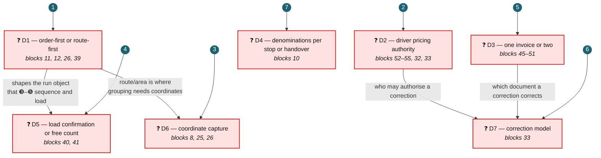

## G.2 Review order

| Order | # | The question Product must answer | 💡 Recommended | Why here in the order | Blocks | Decision |
| :---: | --- | --- | --- | --- | --- | :---: |
| **1** | **D1** | Is a delivery scoped **order-first or route-first**? | Both, converging on one approved-run object at ❻ | **Head of the journey.** No dependencies, and Stages ❸–❻ all inherit the answer. Deciding it late invalidates the most work | 11, 12, 26, 39 | ❓ **OPEN** |
| **2** | **D2** | Is the driver a **restricted sales-capturing role**? | Restrict, with a request-and-approve path | Largest **live-UX** blast radius — it may withdraw a shipped Delivery Management capability. Independent of D1, and needed before any RBAC work | 52–55, 32, 33 | ❓ **OPEN** |
| **3** | **D6** | How are **customer coordinates** captured? | Driver-captured at the door | F3 is a long-lead foundation with four dependents, and the recommended option changes what Delivery Management is *for*. Shaped by D1's route/area work | 8, 25, 26 | ❓ **OPEN** |
| **4** | **D5** | Does the driver **confirm a load plan** or count freely? | Warehouse-only load plan first | Decides **whether Delivery Management changes at all** in this programme. Shaped by D1, because the load order derives from the run's stop sequence | 40, 41 | ❓ **OPEN** |
| **5** | **D3** | **One invoice, or two documents?** | Two documents, one data source | Gates seven requirements and must precede D7. Independent of D1/D2 | 45–51 | ❓ **OPEN** |
| **6** | **D7** | What **is** a post-delivery correction? | Post an adjustment; do not reopen | Depends on **D2** *(who may authorise)* and **D3** *(which document is corrected)*. Cannot sensibly be taken before either | 33 | ❓ **OPEN** |
| **7** | **D4** | Denominations **per stop or at handover**? | Handover only | Smallest blast radius — one requirement, one screen, no dependencies. Safe to decide last | 10 | ❓ **OPEN** |

## G.3 What each decision unlocks once taken

| # | Once decided, this becomes designable | And these requirements can be estimated |
| --- | --- | --- |
| **D1** | Create Delivery steps 2–3; Stage ❸ route/area; the ❻ approved-run contract | 11, 12, 26, 39 |
| **D2** | Permission gating across three Delivery Management surfaces; the explicit locked state | 52, 53, 55, 32 |
| **D6** | The F3 coordinate foundation, and pin-accurate navigation | 8, 25, 26 |
| **D5** | The load plan's audience, and whether Load Stock changes | 40, 41 |
| **D3** | The canonical invoice and its content requirements | 45, 46, 48, 49, 50, 51 |
| **D7** | The correction workflow and its audit surface | 33 |
| **D4** | Denomination capture placement | 10 |

## G.4 Recording a decision

When Product decides, change that decision's **Decision** cell in §D.1, §D.2 and §G.2 from
❓ **OPEN** to ✅ **Agreed**, and state the chosen option. Until all three read ✅ for a given decision,
it remains open and **must not be built against** — a 💡 recommendation is not an approval.

**Not in this register.** Three smaller open questions surfaced in Part B and are deliberately excluded,
because they are stage-level design choices subordinate to D1 rather than programme-level decisions:
how an area is defined *(Stage ❸)*, who owns the order of stops *(Stage ❸)*, and whether the approved-run
contract is in scope at all *(Stage ❻)*. The last of these is a **scope** proposal for Product to accept
or reject, not a design choice.
