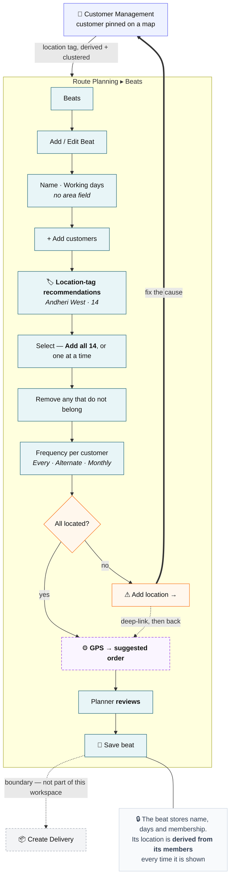
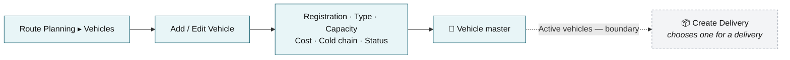
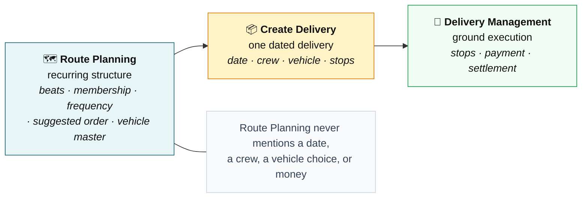

# Route Planning — final target UX and implementation plan

**Revision 2.** Supersedes revision 1 of this file and
[`route-planning-ux-flow.md`](route-planning-ux-flow.md), which still shows a **Today** tab and a
**Proposals** tab. Both are withdrawn — see §7.

**Module purpose:** plan and manage recurring delivery beats, and the vehicle master, **before**
execution. Route Planning is not a live-delivery workspace.

**Status:** design only. No code changed in this pass. Every "today" statement was read off the
repository during this pass, not remembered.

---

## 🔒 Locked rule

> **A Beat's name is user-defined. Its location is derived from its members.**

| The Beat stores | The Beat never stores |
| --- | --- |
| Name · working days · membership *(customer id + frequency)* · the computed order | area · locality · location tag · coordinates · any geographic taxonomy |

Customer location is owned by **B2B Customer Management**. Location tags are **system-generated from
customer GPS**. Route Planning **consumes** those tags to recommend and group customers, and uses the
**GPS of the selected customers** to compute the suggested order. Where a beat's location is displayed it
is **computed at render from its members** — it is never a field, never edited, and never persisted.

---

# 0. Two corrections to the previous audit

Both found by re-reading the code rather than trusting revision 1.

| | Revision 1 said | Actually |
| --- | --- | --- |
| **C1** | *"Route Planning has no `.page-head`, unlike `/finished-goods`"* — logged as problem P8 | `.page-head` in `/finished-goods` is **mobile-only** (`display:none`, shown under `max-width:768px`) because its topbar hides the title there. The distribution module **keeps `.page-title` in the topbar at every width**, so it needs no page-head at all. **P8 withdrawn — there is nothing to fix** |
| **C2** | *"a scrolling chip row must be added"* | `.chip-scroll` **already exists** in this module's own mobile CSS: `@media (max-width:768px){ .chip-scroll{ display:flex; overflow-x:auto } }`. The location-tag row is a reuse, not a build |

---

# 1. Final product UX

Two subtabs. Nothing else.

```
Route Planning
├── Beats      — recurring territories: who, how often, in what order
└── Vehicles   — the reusable vehicle master
```

## 1.1 The workspace question

> **"How should this recurring territory be delivered?"**

Everything on screen exists to move the planner along one path:

```
find customers → group by their location tags → define the beat → set frequency
              → review the system's order → save
```

## 1.2 Beats — list

```
┌────────────────────────────────────────────────┐
│  Andheri West Beat                     ✎   🗑   │
│  Mon, Thu · 14 shops · Andheri West +1         │
│  ⚠ 2 need location                             │
└────────────────────────────────────────────────┘
```

Two lines, and a third **only when something is broken**. That warning is the entire reason this is a
workspace and not a table: it surfaces the one condition that silently degrades sequencing, without
costing a screen.

Desktop table: **Beat · Days · Shops · Status · Actions** — coverage sits under the name inside the Beat
cell, as the customer card already does with `phone · area`. **No Coverage column.**

### Coverage is derived, not stored

`Andheri West +1` is computed at render: the distinct location tags of this beat's members, most common
first, the rest counted. Nothing is written to the beat.

It earns its line twice over — it tells two similarly-named beats apart, and **a beat spanning four or
five tags is a planning smell**, usually two beats wearing one name. Neither signal is available from the
name alone.

⚠️ Revision 2 removed this on the argument that the name already says it. **Reversed:** the name says
what the planner *called* it, coverage says where the members *are*, and the two drift — which is exactly
the drift worth seeing. It is derived either way, so it carries no taxonomy.

## 1.3 Beat editor

```
Name *          Andheri West Beat
Days            [S] [M] [T] [W] [T] [F] [S]

Customers                                    + Add customers
┌──────────────────────────────────────────────────────┐
│ 1   Ravi General Store        Andheri West   Every ▾ │
│ 2   Sai Kirana Bhandar        Andheri West   Every ▾ │
│ 3   Noor General Store        Andheri West   Alt   ▾ │
│ …                                                    │
│ ⚠   Verma Super Store         Add location →         │
└──────────────────────────────────────────────────────┘
                                          Recalculate ↻
```

**Three fields and no fourth: Name · Working days · Customers.** Frequency is a property of a
membership, not of the beat; the numbers are the system's order.

**Nothing on this form is geographic.** The location tag beside each customer is *that customer's* tag,
read from Customer Management for recognition. It is not editable here and it is not stored on the beat.
There is no Area field, and there is no field the planner could use to invent one.

**Why Days survives the cut.** Frequency is meaningless without a base cadence — *"alternate visits"* of
what? The beat says which days the territory is worked; the customer's frequency says which of those
visits they are on. Days is the only way "alternate" has a referent.

## 1.4 Add Customers — location tags as recommendations

This is the screen the module turns on.

```
┌────────────────────────────────────────────────────┐
│ 🔍 Search                                           │
│ 🏷 Andheri West 14   🏷 Juhu 9   🏷 Versova 6  …    │   ← scrolls, location tags only
├────────────────────────────────────────────────────┤
│                                Add all 14 ⊕        │   ← only while a tag is selected
│ ☑ Ravi General Store                                │
│ ☑ Sai Kirana Bhandar                                │
│ ☐ Meena Kirana                    ⚠ no location     │
│ ☐ Sharma Provision                on 2 beats        │
└────────────────────────────────────────────────────┘
│ Selected (9)                                        │
│ Ravi General Store ✕   Sai Kirana ✕   …             │
└────────────────────────────────────────────────────┘
```

### The rule that keeps this honest

> **A location tag recommends. It never governs membership.**

Choosing *Andheri West* and tapping **Add all 14** copies fourteen customers in as fourteen explicit
memberships. It does **not** bind the beat to the tag. A customer tagged *Andheri West* tomorrow does not
join this beat, and one who moves out of it does not leave. The planner decides; the tag only makes
deciding fast.

Three consequences, all deliberate:

1. **No tag is stored on the beat.** Storing "this beat is the Andheri West tag" would be Area under
   another name, and would make membership implicit.
2. **Remove is always available** — from the row, from the Selected list, and from the beat editor.
   A recommendation the planner cannot decline is a rule.
3. **Location tags only** in the chip row. Ordinary tags (`normal`, `regular`) are commercial
   segmentation and answer nothing about where a van should drive.

## 1.5 Frequency

One select per customer row. Three values:

| Value | Meaning |
| --- | --- |
| **Every** | Every visit of this beat — the default, so most rows are never touched |
| **Alternate** | Every second visit |
| **Monthly** | Once a month |

❌ No custom frequencies, no per-customer calendars. If a shop needs a different rhythm it belongs to a
second beat — cheaper than a scheduling engine.

## 1.6 Location readiness

> **When a location is missing, fix the location. Never ask the planner to place the stop.**

```
⚠   Verma Super Store                    Add location →
```

Deep-links to that customer in Customer Management with the location sheet open. On return the beat
re-sequences. The customer **stays in the beat** — an unlocated shop is still a shop to be served; it
simply sits unsequenced at the end until it has a pin.

The beat row's *"⚠ 2 need location"* is the same signal one level up, so the planner sees it without
opening anything.

❌ No map in Route Planning. ❌ No address fields. The geography model is consumed, never copied.

## 1.7 Suggested order

**Input:** the members' `lat`/`lng`. **Output:** a numbered order. **Recomputed** whenever membership
changes or any member's location changes.

Method: nearest-neighbour from the depot, then a 2-opt pass. For 10–30 stops in one locality that is
instant and within a few percent of optimal — well inside the noise of real traffic.

### No drag-and-drop — the case

1. **The driver already ignores order.** Delivery Management's queue is flat and every stop is tappable
   (`RD.action("queue-select")` opens whichever is tapped). A hand-tuned order has no authority where it
   is used.
2. **Its consumers cannot use the precision.** Sequence feeds the warehouse pick order and the office
   ETA. Both want *roughly right, always present*.
3. **A wrong order is a wrong location.** Dragging hides that defect permanently, inside one beat, where
   nothing else can see it. §1.6 fixes the cause.
4. **It would not survive.** The next delivery inherits the order actually walked.

Non-geographic constraints — *opens at 11*, *market shut Wednesday* — are **not modelled in v1**. The
driver reorders on the road. If proven necessary the answer is a per-member **visit late** flag, never
drag-and-drop. ❓Open-2.

## 1.8 Vehicles

```
┌──────────────────────────────────────────────┐
│  MH 12 AB 4432                        ✎   🗑  │
│  Tempo · 1,200 kg · ₹18/km                   │
└──────────────────────────────────────────────┘
```

Editor — six fields, each consumed by Create Delivery:

| Field | Why it exists |
| --- | --- |
| **Registration** * | Identity. The only required field |
| **Type** | Two-wheeler / Three-wheeler / Tempo / Truck — suitability for a small, short round *(req 21)* |
| **Capacity** | kg. What a load is checked against *(req 19, 43)* |
| **Cost** | ₹/km. The objective when choosing between vehicles *(req 23)* |
| **Cold chain** | Toggle. A hard constraint for chilled goods *(req 44)* |
| **Status** | Active / Inactive. Off-road vehicles stop being offered |

❌ Not here: driver assignment, today's load, fuel, service history, insurance, GPS device. None of them
help *plan*, and each is a different product.

⚠️ **Capacity is inert today.** No product in v6 carries a weight, so nothing can compute a load to check
against it. Still correct to capture — it is master data and Create Delivery needs it — but it does
nothing until req 18 lands.

---

# 2. Screen and interaction definitions

### 2.1 Beats — list

| | |
| --- | --- |
| **Purpose** | Which beats exist, how big, how often, and is anything broken |
| **User** | Planner / owner |
| **Content** | Search · rows *(name, days, shop count, **derived coverage**, readiness warning)* |
| **Primary** | **Add Beat** |
| **Secondary** | Edit · Delete · Search |
| **Empty** | *"No beats yet."* + **Add Beat** |
| **Error** | Delete blocked while referenced by a delivery → name what references it |
| **Mobile** | ♻️ `.cards` below 768 px · ♻️ sticky **Add Beat** bar · coverage truncates with an ellipsis on the meta line · warning takes its own line |

### 2.2 Beat editor

| | |
| --- | --- |
| **Purpose** | Define a recurring territory |
| **User** | Planner |
| **Content** | Name · day chips · customer list *(order no., name, the customer's own location tag, frequency, readiness)* — **no beat-level location field** |
| **Primary** | **Save** |
| **Secondary** | **+ Add customers** · **Recalculate ↻** · remove a customer · Cancel |
| **Empty** | No customers → *"No customers yet"* + **Add customers**; the order block does not render |
| **Error** | Name blank → inline. Nothing else blocks saving — an incomplete beat is still useful |
| **Mobile** | ♻️ Full-width drawer. Row goes two-line: number + name + tag, then frequency + remove |

### 2.3 Add Customers

| | |
| --- | --- |
| **Purpose** | Find customers by where they are |
| **User** | Planner |
| **Content** | Search · **location-tag chips with counts** · customer rows *(name, readiness, "on N beats")* · Selected list |
| **Primary** | **Add all N** while a tag is selected; otherwise per-row selection |
| **Secondary** | Search · clear tag · remove from Selected |
| **Empty** | No match → *"No customers match"* · no customers at all → link to Customer Management · **no location tags yet** → chips row hidden, search still works |
| **Error** | — selection cannot fail |
| **Mobile** | ♻️ Existing multi-select panel · ♻️ `.chip-scroll` for the tag row |

### 2.4 Frequency

| | |
| --- | --- |
| **Purpose** | Which visits of this beat a customer is on |
| **User** | Planner |
| **Content** | One select per row: Every · Alternate · Monthly |
| **Primary** | — inline; saves with the beat |
| **Secondary** | — |
| **Empty / Error** | — |
| **Mobile** | Select sits on the row's second line |

### 2.5 Location readiness

| | |
| --- | --- |
| **Purpose** | Make an unlocated customer visible and fixable at source |
| **User** | Planner |
| **Content** | ⚠ row in the customer list · count on the beat row |
| **Primary** | **Add location →** — deep-links to that customer, location sheet open |
| **Secondary** | Remove from the beat |
| **Empty** | All located → nothing renders |
| **Error** | Target customer deleted → *"Customer no longer exists"* + remove |
| **Mobile** | Warning on its own line; action is a full-width tap target |

### 2.6 Suggested order

| | |
| --- | --- |
| **Purpose** | Show the order the system suggests, for the planner to **review** |
| **User** | Planner |
| **Content** | Numbered list · unsequenced customers grouped at the end |
| **Primary** | **Recalculate ↻** |
| **Secondary** | — ❌ deliberately no reorder control |
| **Empty** | Fewer than 2 located customers → block hidden |
| **Error** | None located → *"Add locations to order this beat"* |
| **Mobile** | Number as a leading badge. No horizontal scroll |

### 2.7 Vehicles — list

| | |
| --- | --- |
| **Purpose** | Which vehicles are available to plan with |
| **User** | Planner / owner |
| **Content** | Search · rows *(registration, type, capacity, cost, cold chain, status)* |
| **Primary** | **Add Vehicle** |
| **Secondary** | Edit · Delete · Search |
| **Empty** | *"No vehicles yet."* + **Add Vehicle** |
| **Error** | Delete blocked while referenced by a delivery → say which |
| **Mobile** | ♻️ `.cards`; capacity and cost share one meta line |

### 2.8 Vehicle editor

| | |
| --- | --- |
| **Purpose** | Maintain one vehicle's planning attributes |
| **User** | Planner / owner |
| **Content** | Registration * · Type · Capacity (kg) · Cost (₹/km) · Cold chain · Status |
| **Primary** | **Save** |
| **Secondary** | Cancel |
| **Error** | Registration blank or duplicate → inline; capacity/cost non-numeric → inline |
| **Mobile** | ♻️ Full-width drawer, one field per row |

---

# 3. Flows

## 3.1 Beats



## 3.2 Vehicles



## 3.3 Boundary



---

# 4. Requirement traceability

## 4.1 Solved here

| Req | UX element |
| --- | --- |
| **26** Customers grouped by location/area | §1.4 — location-tag recommendations in the picker, plus derived coverage on the beat row. **The grouping lives on the customer; the beat only consumes it** |
| **39** Loading considers route sequence | §1.7 suggested order, stored on the beat |
| **11** Route defined first | Beats are the entry point to Create Delivery |
| **12** Show the route's customers | Beat membership |
| **19** Vehicle by capacity | Vehicle master · Capacity |
| **21** Two-wheeler / porter | Vehicle master · Type |
| **23** Single vehicle to cut cost | Vehicle master · Cost |
| **44** Refrigeration | Vehicle master · Cold chain |

## 4.2 Enabled here, finished elsewhere

| Req | Route Planning supplies | Finished by |
| --- | --- | --- |
| **20** Vehicle by load and distance | Capacity, cost, order | Create Delivery |
| **22** Club nearby routes over capacity | Beat geography and order | Create Delivery |
| **27, 28** Staff by area | The beat's customers and their tags | Create Delivery *(crew is chosen there)* |
| **40** LIFO / FILO | The order to invert | Warehouse pick list |
| **42, 43** Load by weight / capacity | Vehicle capacity | Create Delivery — ⚠️ blocked on req 18 |

## 4.3 Explicitly not Route Planning

| Req | Owner |
| --- | --- |
| **7, 8, 25** location capture, navigation, GPS | Customer Mgmt · Delivery Mgmt |
| **9, 10, 29–31** cash, denominations, delivery record | Delivery Management |
| **1–4, 45–51** terms, invoice, documents | Customer Mgmt · Sales Orders · Finance |
| **13–17** staff roles | Workforce |
| **18** product weight | Product Master |
| **32, 33, 52–55** locking, audit, price authority | Platform RBAC |
| **34–38** order cutoff and eligibility | Backend · Sales Orders |

---

# 5. Current UX → target UX

| Aspect | Today | Target |
| --- | --- | --- |
| **Concept** | "Delivery Template" — a name and two id arrays | **Beat** — a recurring territory |
| **Subtabs** | One: Delivery Templates | Two: **Beats** · **Vehicles** |
| **Customers** | Private 24-name seed, `{id,name,phone}` | Real registry, with location tag and GPS |
| **Discovery** | Search by name only | **Location-tag recommendations with counts** + search |
| **Cadence** | none | Beat **working days** |
| **Frequency** | none | Per customer: Every · Alternate · Monthly |
| **Order** | none | **System-generated from GPS** |
| **Missing location** | invisible | ⚠ on the row and in the beat, **Add location →** |
| **Staff** | `staffs[]` on the template | ❌ removed — crew belongs to a delivery |
| **Beat geography** | none | ❌ **still none, by rule.** Coverage is derived from members at render; nothing geographic is stored on a beat |
| **Vehicles** | none anywhere in v6 | Vehicle master |
| **Names** | carry a timestamp — *"route1 - 11 Aug 2026 12:57"* | Plain names; a beat is not a run |
| **Downstream** | `createOnTheMoveRoute()` drops the customers | Beat membership reaches Create Delivery intact |

---

# 6. Implementation plan

## 6.0 The dependency that gates phases 1–5

Route Planning must read the **real** customer registry; today it has its own seed with no geography.

**Recommended:** a read-only adapter in this module —

```
readCustomers() → localStorage["fb-discovery-customers-v1"].b2b
                  falling back to the Customer module's inline seed
```

Read-only, one key, no writes, no second geography model. **Rejected:** a new shared store *(too large
for one module's need)*; copying the data *(that is the current disease)*.

⚠️ One change needed in Customer Management: a **deep-link param** (`?customer=<id>`) opening the drawer
with the location sheet, for §1.6. Precedent exists — `stock-audit.html?customer=<id>`.

⚠️ Location tags are identified by the shipped `locationTagSet()` rule — *a tag is a location tag if it
is some customer's `area`*. Route Planning applies the same rule; it does not invent a marker.

## 6.0b The Beat object — the shape the rule produces

```js
{
  id,
  name,                 // user-defined, the only text on a beat
  days: [1, 4],         // working days, 0 = Sunday
  members: [            // ordered — the index IS the suggested order
    { customerId, frequency }   // "every" | "alternate" | "monthly"
  ]
}
```

**Four keys.** No `area`, no `locality`, no `tag`, no `lat`/`lng`, no `region`. Coverage and the order
are both computed from `members` by reading those customers out of the registry — the beat holds a list
of ids and nothing about where they are.

If a future change wants geography on a beat, it is this shape that has to be argued with first.

## 6.1 Phases

| # | Change | Current file | Reuse | New | Depends | Verification |
| --- | --- | --- | --- | --- | --- | --- |
| **1** | Read the real customer registry | `assets/data.js`, `app.js § screenRoutePlanning` | `mountMultiSelect` | `readCustomers()` | — | Picker lists real customers with tags; the private seed is gone |
| **2** | Template → **Beat**: rename, add working days, drop `staffs[]`, **add no area field** | `app.js § routeForm`, `data.js` | `drawer`, day chips | Beat object *(§6.0b)* | 1 | Beat saves with days; no staff on a territory; **the saved object has exactly the four keys in §6.0b**; nav says **Beats** |
| **3** | **Location-tag recommendations** in Add Customers | `app.js § mountMultiSelect` | ♻️ `.chip-scroll` *(already in this module)* · `chipsHTML` shape from Customer Mgmt · `wireAssignBadge` | Tag row + **Add all N** | 1 | Chips show `tag · count`, location tags only; Add all adds explicit members; removing one leaves the rest |
| **4** | Membership + frequency, **and derived coverage on the beat row** | `app.js § routeForm`, list renderer | `mountMultiSelect` | Member list · `coverageOf(beat)` | 2, 3 | Frequency persists; "on N beats" intact; coverage matches the members' tags and **changes when membership changes, with nothing written to the beat** |
| **5** | Location readiness + deep-link | `app.js` list + editor | `.pcard`, chips | Readiness derivation | 1 + CM deep-link | ⚠ shows in both places; link opens the right customer; return re-sequences |
| **6** | **Suggested order** | `app.js § routeForm` | — | `sequenceMembers()` | 4, 5 | Stable, sane order for a known cluster; unlocated at the end; **Recalculate** re-derives |
| **7** | **Vehicles** subtab | `app.js`, `data.js` | `drawer`, `.pcard`, `confirmDelete`, `.subtabs` | Vehicle object + screens | — *(independent)* | CRUD round-trips; Active/Inactive filters |

Phases 1–6 are one chain. **Phase 7 is independent** — build it first or in parallel.

⚠️ **No responsive phase.** Route Planning already switches table→cards at 768 px and already has a
sticky mobile bar; `.page-head` is not needed here (§0/C1).

## 6.2 Verification, every phase

375 × 812 and desktop · no horizontal overflow · cards below 768 px, table above · sticky action bar ·
all 28 platform destinations clean · Customer Management and Delivery Management untouched apart from
the one deep-link param.

---

# 7. Removed from the previous proposal

| Removed | Why |
| --- | --- |
| **Beat "Area" field** *(stored / editable)* | Location lives on the customer and produces a tag. A beat-level area is a second taxonomy and a second thing to maintain |
| **Area column** on the beats list | No dedicated column. ⚠️ **Derived coverage** now sits under the beat name instead — computed at render, never stored |
| **Today tab** *(in `route-planning-ux-flow.md`)* | Execution. Route Planning is pre-execution only |
| **Due today** | Same |
| **Send to driver** | Create Delivery owns committing to a day |
| **Change driver / Edit stops / Request a stop** | Live-run controls. Delivery Management |
| **Add a second run** | A run is not a Route Planning object |
| **Proposals tab** | Depends on execution feedback. Not in this module's ownership list |
| **Run states on the beat row** *(Due · Sent · In progress · Closed)* | All execution states |
| **Staff on a beat** | Crew belongs to a delivery, not a territory. Already stale in the seed: 16 templates, 6 staff, arbitrary pairings |
| **`.page-head` work** | Not needed — the topbar keeps its title at every width here (§0/C1) |
| **Ordinary tags in the picker chips** | `normal` / `regular` are commercial segmentation; they answer nothing about where a van drives |

---

# 8. Product boundary

| | **Route Planning** | **Create Delivery** | **Delivery Management** |
| --- | --- | --- | --- |
| **Owns** | Beats · membership · frequency · system-generated order · **vehicle master**. Groups customers **by consuming** location tags — owns no geography | One dated delivery: date, crew, **which vehicle**, which stops | Everything from the moment it starts |
| **Decides** | Which customers are a territory, how often, in what order | Whether a delivery happens and who takes it | What actually happened |
| **Never** | a date · a crew · a vehicle choice · an order · anything live · **any stored area, locality, tag or coordinate on a beat** | territory membership · vehicle master data | beat membership · master data without a human |
| **Reads** | customer GPS, location tag, address | beats, vehicle master, customers | the delivery it was handed |
| **Writes** | beats, memberships, vehicles | deliveries | execution outcomes |

**The line:** Route Planning describes what *recurs*. Create Delivery commits to a *day*. Delivery
Management records what *happened*. A control naming a date belongs to the second; one naming money or a
stop belongs to the third.

---

# 9. Open

| # | Question | Recommendation |
| --- | --- | --- |
| **1** | Does a beat need a default crew? | **No.** Crew is a Create Delivery decision, and a stored crew field rots — the current seed proves it |
| **2** | Do non-geographic constraints *(opens at 11)* need modelling? | **Not in v1.** The driver reorders on the road. If proven, a per-member **visit late** flag — never drag-and-drop |
| **3** | Capacity in kg, crates, or both? | **kg alone.** Two axes double the master data and neither is consumable until product weight exists |
| **4** | Should **Beats** replace "Route Planning" in the platform nav? | Yes, once phase 2 lands |
| **5** | Who owns the warehouse pick list that consumes the order? | Unowned. Not Route Planning — flag before phase 6 ships |
