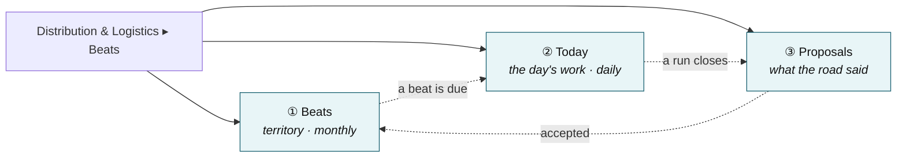
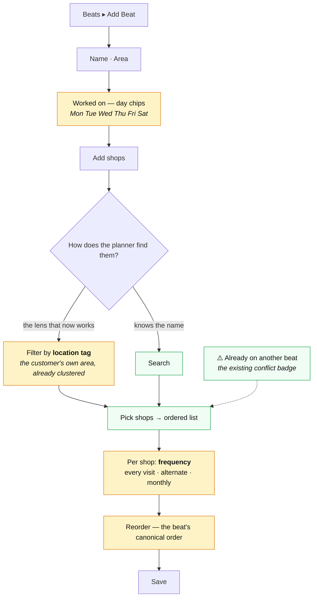
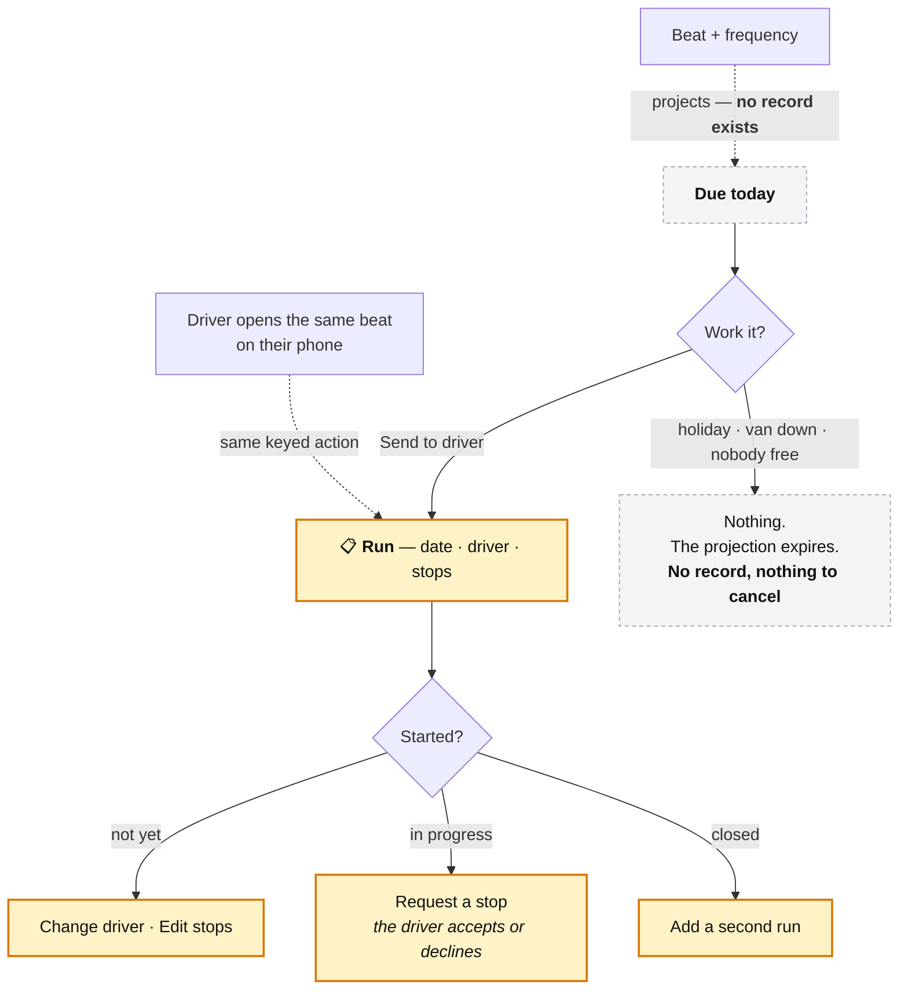
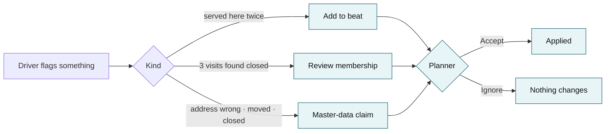
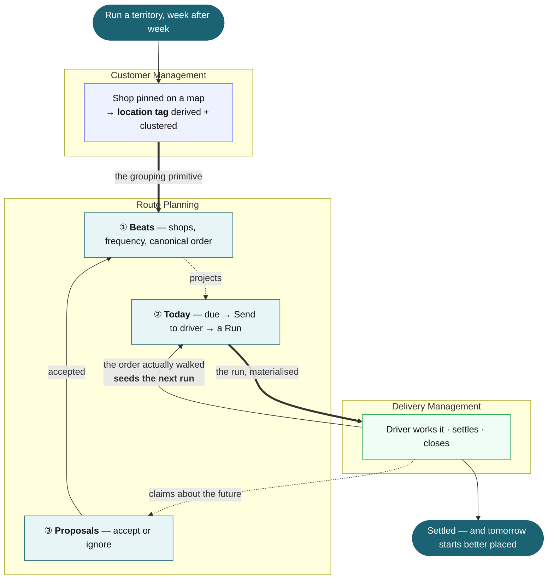

> ## ⚠️ SUPERSEDED
>
> This document shows a **Today** tab and a **Proposals** tab. Both were withdrawn: Route Planning is
> pre-execution only, and committing to a day belongs to Create Delivery.
>
> Current design: **[`route-planning-target-ux-and-plan.md`](route-planning-target-ux-and-plan.md)**
> — Beats and Vehicles only. Kept for the reasoning it records, not as a specification.

# Route Planning — product UX flow

**Scope:** the Route Planning module only. The operating model it implements is frozen in
[`three-module-target-ux-v6.md`](three-module-target-ux-v6.md); this document is the screens and the
flows through them.

**Grounded in:** the module as it stands in the tree today, and the customer contract that Customer
Management now actually ships. Every "today" statement below was read off the code, not remembered.

---

## 1. Where the module stands today

One subtab — **Delivery Templates** — over a four-column table *(Name · Customers · Staff · Actions)*
and one drawer with **three fields**:

```
Route Name *          text
Customers             multi-select
Staff Members         multi-select
```

`{ id, name, customers[], staffs[], created }` is the entire object.

There is **no date, no schedule, no order, no vehicle, no area, no run**. A template is an unordered set
of names, so it cannot produce a day's work, and nothing downstream reads it. Its customer list is also
its own 24-name seed, unrelated to the customer registry.

The one good idea already there and worth keeping: the **"already in N templates" conflict badge** in the
customer multi-select.

---

## 2. What changed upstream, and why it matters here

Customer Management now ships a real location contract. This is not proposed — it is in the tree:

| Field | What it is | What Route Planning does with it |
| --- | --- | --- |
| `lat` / `lng` | Coordinates from a map pin. Never displayed | Sorting, sequencing, distance |
| `area` | A **location tag**, derived from the pin and clustered onto the nearest tagged customer within 2 km | **The grouping primitive.** This is what makes a beat buildable |
| `tags[]` | The location tag rides here, alongside ordinary tags | Filter and count, using the chips that already exist |
| `shipDetail` / `landmark` | "Shop 14", "Opposite the grain market gate" | Passed through to the driver, not shown here |
| `creditDays` / `paymentTerm` | Commercial terms | Not used here. Finance and Sales Orders |

**The consequence:** grouping by locality is now possible without Route Planning inventing anything.
Area names are already clustered and already deduplicated, so a "group by area" lens is a filter over
data that exists rather than a taxonomy someone has to maintain.

---

## 3. The three jobs, and nothing else

| Job | Cadence | Screen |
| --- | --- | --- |
| Decide **which shops are a territory** | monthly | **Beats** |
| Decide **whether today's round happens, and who takes it** | daily, in seconds | **Today** |
| Decide **what the road reported** | whenever | **Proposals** |

Anything else that has ever been proposed for this module — vehicle capacity, load planning, route
optimisation, navigation — is **§10**.

---

## 4. Screen map

Three subtabs on the existing shell. No new page, no new nav entry.



---

## 5. Flow — build a beat

The planner's monthly job. One drawer, reusing the multi-select that is already there.



**Why frequency sits on the shop and not the beat:** one territory carries several rhythms — two
supermarkets twice a week, twelve kirana once. Putting the schedule only on the beat would force cloning
the territory to express the second rhythm, and a cloned territory is two membership lists to maintain.
The beat says *which days it is worked*; the shop says *which of those visits it is on*.

**Multi-beat is normal, not an error.** A large account served on two circuits is one membership row
each. The conflict badge informs; it does not block.

---

## 6. Flow — send today's work

The daily job. It has to survive being done on a phone, standing next to the van, in under ten seconds.



### The rule the whole screen rests on

> **One beat + one date = at most one run.** Whoever acts second **joins** the first one's run.
> A genuine second round is explicit and gets its own sequence number.

Without it the planner and the driver each open one, the van is loaded twice, and the day's cash
reconciles against nothing. *Send to driver* and the driver's own *Start ‹beat›* are the same action from
two surfaces.

### Row states

| State | Row shows | Actions |
| --- | --- | --- |
| Due, no run | *N shops due · last worked Thu 28 Aug* | **Send to driver** |
| Sent, not started | *Ajay · not started* | **Change driver** · **Edit stops** |
| In progress | *Ajay · 8 / 22* | **Request a stop** |
| Closed | *Closed 17:42* | **Add a second run** |

**Nothing generates a run on a schedule.** Auto-generation makes six records on a public holiday that
someone must then cancel, and *cancelled* becomes the most common status in the system. A projection
costs nothing and leaves nothing behind.

---

## 7. Flow — proposals

What the road reported. Nothing waits on this queue; an ignored proposal costs nothing, because the shop
was still served and still paid.



**Repetition, not confidence, is the gate.** A shop served once is not territory; a shop shut once is not
closed. The proposal is only raised on the second service or the third closed visit, so a single unusual
day never reaches this queue.

**Suspend, never delete.** A shop that has closed has its *membership* suspended. The customer, its
history and its receivables survive.

---

## 8. End to end



---

## 9. Screen detail

Follows `/finished-goods` for structure and responsive behaviour: page head, search, chip row, cards
below 768px, table above, sticky bottom action bar on mobile.

### ① Beats

| | |
| --- | --- |
| **List** | Beat · Area · Worked on · Shops · actions. Cards on mobile |
| **Row state** | *Due today* or *Run today* chip, so the daily question is answerable from this screen too |
| **Drawer** | Name · Area · day chips · shop list with per-shop frequency and reorder |
| **Not here** | Vehicle, capacity, distance, cost, a map |

### ② Today

| | |
| --- | --- |
| **Due today** | One card per beat with due members and no run. *N shops due · last worked …* |
| **Today's runs** | One card per run: crew, progress, stop count, where the stop order came from |
| **Order provenance** | *"Order from Thu 28 Aug"* or *"Beat order"* — one line, plus **Reset to beat order** |
| **Not here** | A calendar, a week view, a Gantt, a map of the day |

### ③ Proposals

| | |
| --- | --- |
| **Card** | What is claimed · which shop · which beat · what the driver said |
| **Contested values** | Both shown — on file and proposed. A proposal the planner cannot compare is one they will rubber-stamp |
| **Actions** | Accept · Ignore |

---

## 10. What Route Planning must not become

❌ Route optimisation · ❌ navigation · ❌ vehicle master, capacity or load planning · ❌ a day board with
a calendar · ❌ a geographic hierarchy — the location tag is flat and derived · ❌ a second customer list ·
❌ auto-generated runs · ❌ a place to edit a customer.

**Sequence deserves its own note.** It is stored on the run and inherited from the order the last run was
actually walked, with the untouched tail keeping its previous order. It is **not** learned statistically,
and it is **not** dragged into place daily by the planner. Its consumers are the warehouse pick list and
the office ETA — not the driver, who already taps stops in any order they like.

---

## 11. Build order

| | Slice | Why here |
| --- | --- | --- |
| **1** | Beat's members become today's stops | The one change that makes this module load-bearing. No new screen |
| **2** | Today tab: due → Send to driver → Run, on the `(beat, date, seq)` key | The daily job |
| **3** | Frequency per shop · canonical order · day chips | Makes "due" mean something narrower than "everyone" |
| **4** | Proposals | Only worth building once runs are closing |
| **5** | Locality lens in the shop picker | Cheap now that the location tag exists |

---

## 12. Open

| | Question |
| --- | --- |
| **1** | Does a beat need an **owner/usual crew** stored, or is *"has driven this beat N×"* from run history enough? *(Recommendation: derive it — a stored crew field rots.)* |
| **2** | Should **Beats** replace "Route Planning" in the nav, or sit under it? |
| **3** | Who owns the **warehouse pick list** that consumes sequence — this module, Inventory, or a new surface? |

---

*Model: [`three-module-target-ux-v6.md`](three-module-target-ux-v6.md). Customer contract: shipped, see
`v6/modules/foodbridge-customer-mockup/v1/screens/customers/customers.js`.*
