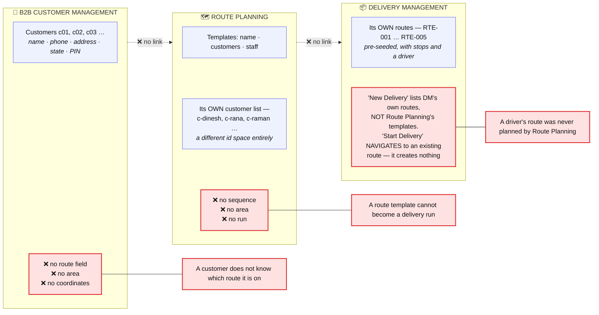
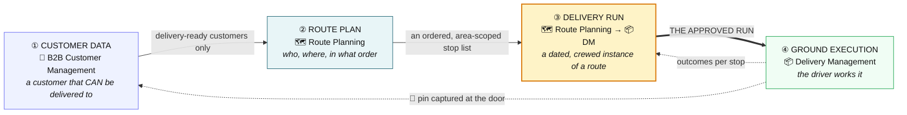
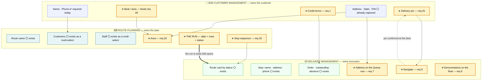
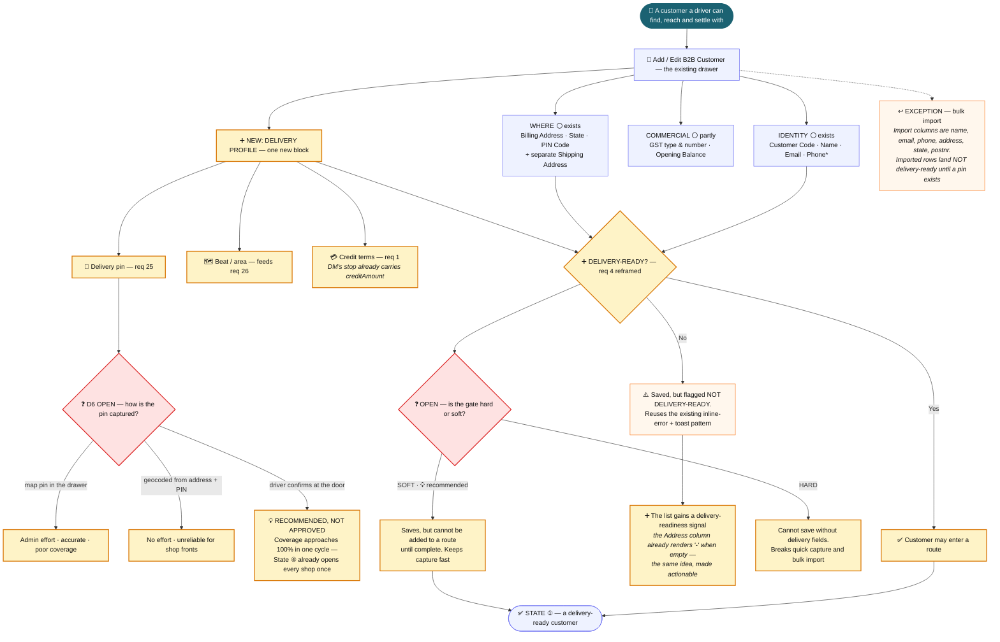
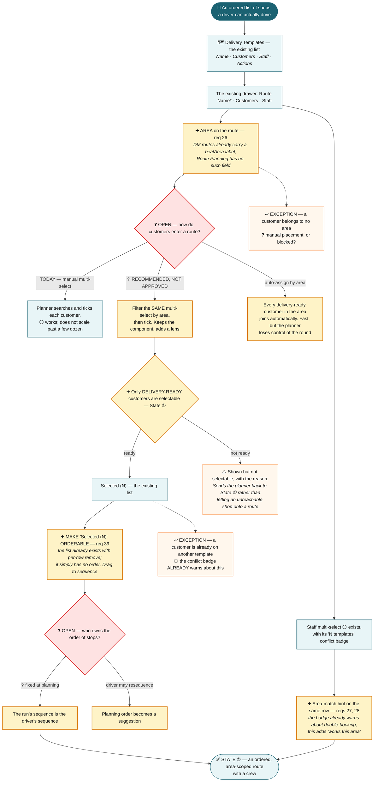
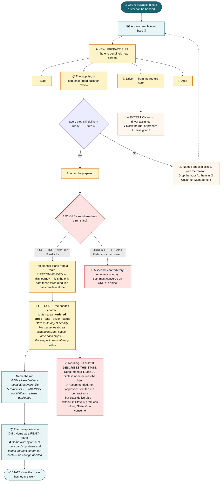
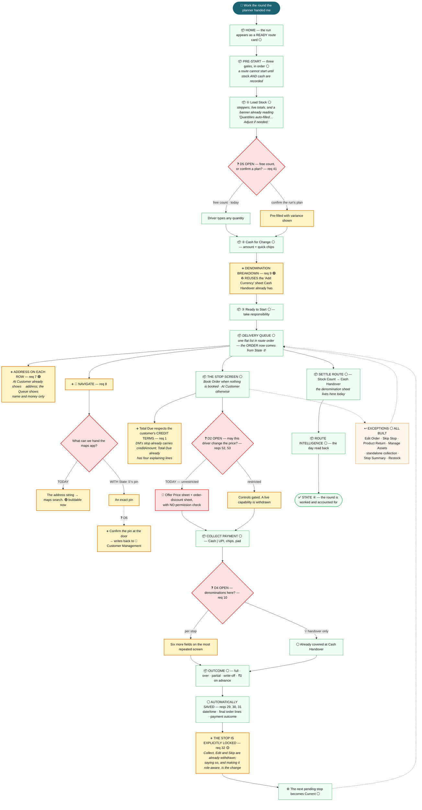
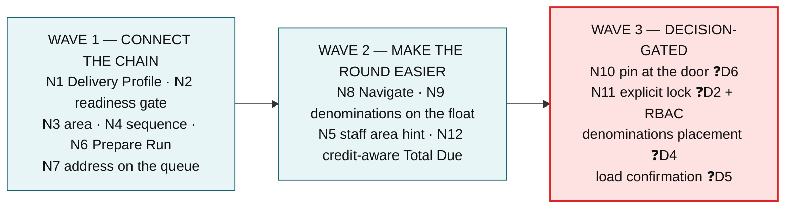

# Customer → Route → Run → Ground

**A product model for three modules: B2B Customer Management · Route Planning · Delivery Management**

**Scope:** only these three. Other modules appear only where a dependency must be explained.
**Purpose:** establish a clean product model before any v6 change.
**Status:** model only. No product code changed, nothing implemented.

**Status key** — 🟢 Can extend existing UX now · 🟡 Can extend, needs product/UX solutioning ·
🔵 Needs a new capability inside these modules · ⚪ Already covered · 🔴 Conflicts with current UX

**Label key** — ✅ Agreed *(from the brief)* · 💡 Recommended *(proposed, not approved)* · ❓ Open

---

## 1. What the three modules actually are today

### 1.1 B2B Customer Management

| | |
| --- | --- |
| **Screen** | A single list: **Name · Email · Phone · Address · Catalog · Actions** |
| **Address column** | `address + state + PIN` joined, rendering "-" when empty |
| **Row actions** | Offers · Send Campaign · Edit · Delete |
| **Toolbar** | Import · Export · Download Sample |
| **The drawer** | GST Type & Number · Customer Code · Name · Email · **Phone\*** · Opening Balance · Billing Address · State (Billing) · **PIN Code (Billing)** · *"use billing as shipping"* · Shipping Address · State · **PIN Code (Shipping)** · notify |
| **Validation** | **Phone is the only required field.** Inline error + toast, a pattern that already works |
| **Bulk capture contract** | Import/Sample columns: `name, email, phone, address, state, postnr` |
| **What it does not hold** | No coordinates · no beat/area · no credit or payment terms · no delivery window · no site contact · **no link to any route** |

### 1.2 Route Planning

| | |
| --- | --- |
| **Screen** | One tab — **"Delivery Templates"**. Table: **Name · Customers · Staff · Actions**, newest first, searchable |
| **The drawer** | **Route Name\*** · Customers *(multi-select)* · Staff Members *(multi-select)* |
| **The multi-select** | Search, checkbox list, a **"N templates" conflict badge** showing where else that customer or staff member is already assigned, and a **"Selected (N)"** list with per-row remove |
| **What it does not hold** | No **sequence** — the Selected list is unordered · no **area** · no date · no vehicle · no orders · no load · no schedule · **no run** |

### 1.3 Delivery Management

The driver's execution app — 23 screens, fully specified in `delivery-management-ux-flow.md`.

| | |
| --- | --- |
| **A route carries** | name · **beatArea** · scheduledDate · status · driver · stops · collected/outstanding totals |
| **A stop carries** | customer *(name, phone, **address**, GST, **creditAmount**)* · order lines · outstanding · advance |
| **The journey** | Home → Pre-Start *(Load Stock · Cash for Change · Ready to Start)* → Delivery Queue → the stop screen → Collect Payment → Settle Route → Route Intelligence |
| **What it does not hold** | No coordinates · no role/permission model · no reference to a Sales Order · **no way to create a run** |

### 1.4 The finding that reframes everything

> ## The three modules are not connected. At all.

**Three facts, each verified in the repository:**

1. **B2B Customer Management and Route Planning do not share a customer.** The master holds `c01, c02, c03…`; Route Planning holds its own `c-dinesh, c-rana, c-raman…`. Different id spaces, different records.
2. **Route Planning cannot produce anything Delivery Management can open.** A template is a name plus two unordered sets. Delivery Management opens routes it was seeded with.
3. **Neither module can create a delivery run.** Route Planning creates templates. Delivery Management's "Start Delivery" validates the name, then navigates to a route that already exists.

> **The missing object is the run.** Not a screen, not a field — the thing that turns *"these customers, in this area, in this order, with this crew, on this date"* into something a driver can be handed. Every requirement in this journey either feeds that object or consumes it.

---

## 2. Requirement filter

55 requirements, filtered against one test: **can this requirement participate in
*capture customer info for delivery → plan the route → execute on ground*, using only these three
modules?**

**21 in · 34 out.** The full assessment of all 55 lives in
`delivery-requirements-solution-assessment.md`; this document does not restate it.

### A — Requirements that belong in this journey

| # | Requirement | Best-fit module | Existing UX to extend | What changes | Status | Dependency |
|---:|---|---|---|---|:---:|---|
| **4** | All mandatory terms completed before the customer can be saved | B2B Customer | The customer drawer's **required-field pattern** *(Phone, inline error + toast)* | The gate widens from "Phone" to "everything delivery needs" — see §3.1 | 🟡 | ❓ which fields are mandatory |
| **24** | Address includes ZIP/postal code | B2B Customer | **PIN Code (Billing) and (Shipping)** | Nothing. Already captured, already shown in the Address column | ⚪ | — |
| **25** | Address includes location/GPS | B2B Customer | The address block in the drawer | A delivery pin on the customer record | 🔵 | ❓ how it is captured *(D6)* |
| **1** | Credit options — 30 / 20 days | B2B Customer | Opening Balance sits next to where terms belong. DM's stop already carries `creditAmount` | A credit-terms field that the driver's Total Due can respect | 🟡 | ❓ what it does at the door |
| **11** | The route should be selected/defined first | Route Planning | The template list | The template becomes the entry point for preparing a run | 🔴 | ❓ **D1** — conflicts with Sales Orders' order-first Create Delivery |
| **12** | Show the customers/orders belonging to the selected route | Route Planning + DM | Template drawer shows customers; DM's Queue shows stops | The customer half is nearly covered; the **orders** half is Sales Orders and stays outside | 🟡 | Req 11 |
| **26** | Customers grouped by location/area | Route Planning | The template drawer | An **Area** on the route, and area-filtered customer selection | 🔵 | Req 24 ⚪, req 25 |
| **39** | Loading should consider route sequence | Route Planning | **The "Selected (N)" list** — it exists, it just isn't ordered | Make it orderable. Sequence is the product of this change | 🔵 | — |
| **27** | Recommend staff by delivery area / ZIP | Route Planning | **The staff multi-select's "N templates" conflict badge** — the same row, a second hint | An area-match hint beside each staff member | 🔵 | Staff area *(Workforce)* |
| **28** | The recommendation reduces incorrect assignment | Route Planning | The same conflict badge — **it already does half of this** | Surface it during run preparation, not only template editing | 🔵 | Req 27 |
| **7** | Staff see the customer route/location during delivery | Delivery Management | **At Customer already shows 📍 address + 📞 call.** The Queue row shows name and money only | Address on the Queue row and Stop Summary | 🟢 | — |
| **8** | The route helps staff navigate between customers | Delivery Management | The stop screen's address block | A **Navigate** action handing off to the phone's maps app | 🟡 | Address string works now; a pin needs req 25 |
| **9** | Denominations when cash is allotted to staff | Delivery Management | **The "Add Currency" sheet Cash Handover already has** | Reuse that sheet at Cash for Change | 🟢 | — |
| **10** | Denominations when collecting from customers | Delivery Management | The same sheet | Placement, not construction | 🟡 | ❓ **D4** — per stop, or handover only |
| **29** | Save the delivery date/time on Delivered | Delivery Management | `completedAt`, stamped and read back on the Queue row and Stop Summary | Nothing | ⚪ | — |
| **30** | Save the final order details | Delivery Management | Stop Summary's order card; Route Intelligence's summaries | Nothing in UX | ⚪ | 🛑 the route never closes |
| **31** | Save the payment details | Delivery Management | Amount, method, write-off, partial and advance outcomes are all captured | Nothing | ⚪ | — |
| **32** | The delivered order is locked for normal users | Delivery Management | A completed stop already withdraws Collect, Edit and Skip | Make the lock explicit and state why | 🟡 | RBAC *(outside)* |
| **41** | Loading should consider product quantity | Delivery Management | **Load Stock**, and its banner *"Quantities auto-filled… Adjust if needed."* | Bind the pre-fill to the run's plan | 🟡 | ❓ **D5** |
| **52** | Sales-capturing staff cannot change prices | *owner outside* | **DM's Offer Price sheet** — every driver can reprice any line | The conflict is inside this journey even though the rule is not | 🔴 | ❓ **D2**, RBAC |
| **53** | Sales-capturing staff cannot apply discounts | *owner outside* | **DM's order-discount sheet and write-off tick-box** | Same | 🔴 | ❓ **D2**, RBAC |

**Distribution:** 🟢 2 · 🟡 7 · 🔵 5 · ⚪ 4 · 🔴 3 — **21 total**

### B — Requirements that should explicitly stay outside

| Requirements | Why they cannot be solved by these three modules |
| --- | --- |
| **2, 3** *(COD, 50% at booking)* | Commercial payment terms are defined on the **order**. Delivery Management executes the resulting state |
| **5, 6, 54** *(category, subcategory, approved price list)* | **Product Master / Catalog.** Nothing to do with customer capture, route or execution |
| **13–17** *(Driver, Supervisor, Cash Handler, Un-loader, other roles)* | The **role taxonomy is Workforce's**. Route Planning's staff multi-select *consumes* it — adding a role is a Workforce change, not a change to this journey |
| **18** *(total weight)* | Needs a **product weight** attribute in Product Master, and totals an **order** selection in Sales Orders |
| **19–23, 40, 42, 43, 44** *(vehicle, capacity, distance, clubbing, cost, LIFO, weight, refrigeration)* | Needs a **vehicle master** that exists in no module, plus product weight. **Nine requirements of pure new foundation** — see the note below |
| **33** *(authorised correction + audit)* | Needs RBAC and a separate approval workflow. Delivery Management's only in-scope part would be a "Request Correction" entry point |
| **34–38** *(10 PM cutoff, eligibility, no UI filter)* | A **backend** rule feeding Sales Orders. Explicitly must not become a UI filter |
| **45–51** *(invoice format, order number, CGST/SGST, packaging unit, T&C, amount in words)* | The **commercial document** belongs to Sales Orders and Finance |
| **55** *(price changes restricted to Management/Marketing)* | **Platform RBAC.** Requirements 52 and 53 appear in list A only because the *conflict* is inside Delivery Management |

> **On 19–23 and 42–44.** These are genuinely part of *preparing a run*, so they are journey-adjacent
> rather than irrelevant. They are excluded because a vehicle master exists nowhere in v6 and product
> weight lives in Product Master — **no UX change across these three modules can deliver them.** Adding
> them here would make the change set large and dependent, which is the opposite of what this model is
> for. They belong to a Vehicle & Load Planning capability, sequenced after this journey works.

---

## 3. The target-state journey

Four states, three modules, one chain.

### 3.0 What flows between the modules

---

### 3.1 State ① — A customer that can be delivered to

> **Actor:** store admin · **Goal:** *"Capture enough about this shop that a driver can actually find it
> and settle with it."*

**The product question this state answers:** *what must be true before a customer may enter a route?*

**Minimum customer information for delivery** — the contract State ② depends on:

| Field | Today | Needed for |
| --- | --- | --- |
| Name, Phone | ⚪ Phone is already required | Identifying and calling the shop — DM's stop already shows 📞 |
| Address, State, **PIN** | ⚪ all three exist | Finding the shop; grouping by area *(req 26)* |
| **Delivery pin** | ❌ | Navigation *(req 8)*, distance, accurate area grouping |
| **Beat / area** | ❌ | Which route this customer belongs to *(req 26)* |
| **Credit terms** | ❌ | What the driver may collect *(req 1)* |

---

### 3.2 State ② — The route plan

> **Actor:** distribution planner · **Goal:** *"Decide who is on this route, and in what order."*

**Minimum route information** — the contract State ③ depends on:

| Field | Today | Needed for |
| --- | --- | --- |
| Route name | ⚪ exists, required | Identifying the route |
| Customers | ⚪ exists as an unordered set | Who is on the round |
| Staff | ⚪ exists as an unordered set | Who works it |
| **Area** | ❌ | Grouping *(26)*, staff suggestion *(27)* |
| **Sequence** | ❌ | The order the driver drives *(39)* |

---

### 3.3 State ③ — The delivery run, and the handoff

> **Actor:** distribution planner · **Goal:** *"Turn this route into today's work and hand it to a driver."*
>
> **This is the missing object.** Route Planning makes templates; Delivery Management opens pre-seeded
> routes. Neither can create a run.

**What the driver receives** — and how much of it Delivery Management can already hold:

| The run carries | DM's route object today |
| --- | --- |
| Route name | ⚪ `name` |
| Area | ⚪ `beatArea` |
| Date | ⚪ `scheduledDate` |
| Driver | ⚪ `driver` |
| Status | ⚪ `status` — Ready / In Progress / … |
| Stops with name, phone, address | ⚪ all present on the stop's customer |
| **Ordered** stops | ❌ a `sequence` exists in seed data that no planner can set |
| **Delivery pin per stop** | ❌ needs State ① |

---

### 3.4 State ④ — Ground execution

> **Actor:** driver · **Goal:** *"Work the round, settle each shop, account for the day."*
>
> This state is **already built end to end.** The changes below are three small extensions, not a redesign.

---

## 4. The answers

### C — The target-state end-to-end UX flow

States ①–④ above. In one line each:

1. **① Customer data** — a customer becomes *delivery-ready* when it has an address, a PIN, a pin on the map and a beat. Not delivery-ready means not selectable for a route.
2. **② Route plan** — a route gains an **area** and an **ordered** stop list, chosen from delivery-ready customers, with an area hint on staff.
3. **③ Delivery run** — a route plus a date plus a driver becomes a **run**: the object that does not exist today and that everything else waits on.
4. **④ Ground execution** — Delivery Management opens the run as a Ready route and works it unchanged, plus three small extensions: address on the queue, Navigate, denominations on the float.

### D — Existing UX we can reuse

| Reuse this | For | Requirement |
| --- | --- | --- |
| The customer drawer's **required-field pattern** *(Phone, inline error, toast)* | The delivery-readiness gate | 4 |
| **PIN Code (Billing / Shipping)** | Area grouping | 24 ⚪, 26 |
| The **Address column's "-" when empty** | The delivery-readiness signal on the list | 4 |
| The customer **multi-select** — search, checkbox, Selected(N) | Area-filtered selection | 26 |
| The **"N templates" conflict badge** | Staff area hint — *it already does half of req 28* | 27, 28 |
| The **"Selected (N)" list** with per-row remove | Make it orderable → sequence | 39 |
| DM's **route object** — name, beatArea, scheduledDate, status, driver, stops | The run contract; the shape already exists | 11, 12 |
| DM's **Home route cards by status** | Receiving the run — no change needed | 11 |
| DM's **New Delivery naming** — pre-fill + duplicate refusal | Naming the run | 11 |
| DM's **"Add Currency" denomination sheet** | Denominations on the cash float | 9, 10 |
| **At Customer's** 📍 address + 📞 call block | Address on the Queue row; Navigate | 7, 8 |
| DM's **Total Due** and its four explaining lines | A fifth line for credit terms | 1 |
| DM's **completed-stop state** | The explicit lock | 32 |
| DM's **Load Stock** auto-fill banner | Plan confirmation | 41 |
| **All DM exceptions** — Edit Order, Skip, Return, Assets, Restock, Stop Summary | Nothing changes | — |

### E — New UX / capabilities required

| # | New capability | Module | Size | Serves |
| --- | --- | --- | --- | --- |
| **N1** | **Delivery Profile block** — pin, beat/area, credit terms | B2B Customer | Small — one drawer section | 1, 25, 26 |
| **N2** | **Delivery-readiness gate + list signal** | B2B Customer | Small — reuses the validation pattern | 4 |
| **N3** | **Area on a route**, and area-filtered customer selection | Route Planning | Small — one field, one filter on an existing component | 26 |
| **N4** | **Orderable Selected(N) list** → stop sequence | Route Planning | Small — the list exists, it needs an order | 39 |
| **N5** | **Area hint on the staff multi-select** | Route Planning | Small — a second badge on an existing row | 27, 28 |
| **N6** | **"Prepare Run"** — route + date + driver → a run | Route Planning → DM | **Medium — the only new screen** | 11, 12 |
| **N7** | **Address on the Queue row** | Delivery Management | Small | 7 |
| **N8** | **Navigate action** on a stop | Delivery Management | Small | 8 |
| **N9** | **Denominations at Cash for Change** | Delivery Management | Small — reuses an existing sheet | 9 |
| **N10** | **Pin capture at the door** → writes to Customer Management | Delivery Management | Medium — new data direction | 25 |
| **N11** | **Explicit locked state** | Delivery Management | Small, but needs RBAC | 32 |
| **N12** | **Credit-terms-aware Total Due** | Delivery Management | Small | 1 |

### F — The smallest sensible implementation sequence

**The critical question was: what is the smallest coherent change set that solves the largest useful
subset?** The answer is **six changes — N1, N2, N3, N4, N6, N7 — which connect the chain and solve
13 of the 21 in-journey requirements.** Everything else is optional on top.

| Wave | Changes | Solves | Why this order |
| :---: | --- | --- | --- |
| **1** | N1, N2, N3, N4, N6, N7 | **1 *(field)*, 4, 7, 11, 12, 24 ⚪, 25 *(field)*, 26, 29 ⚪, 30 ⚪, 31 ⚪, 39** — **13** | **Connects Customer → Route → Run → Ground for the first time.** Five of the six are extensions of existing components; only N6 is a new screen. Nothing here is blocked on a decision except D1, and route-first is the only path these three modules can complete alone |
| **2** | N8, N9, N5, N12 | **8, 9, 27, 28** — **4** | Pure quality-of-life on a chain that already works. N9 reuses an existing sheet; N5 adds a badge to an existing row. N8 ships with the address string and improves when N10 lands |
| **3** | N10, N11, and the placement of denominations and load confirmation | **10, 32, 41, 52, 53** — **5** | **Every one is gated on an open decision** — D6, D2, D4, D5 — or on RBAC, which is outside these three modules. Building any of them before the decision is rework |

**What Wave 1 does not need:** a vehicle master, product weight, RBAC, backend eligibility, order
references, or any change to Sales Orders, Finance, Workforce, Product Master or Live Tracking.

**What Wave 1 does need Product to decide:** ❓ **D1** — if delivery creation must stay order-first in
Sales Orders, then N6 belongs there instead, and these three modules cannot complete the journey alone.
💡 *Recommended, not approved:* let Route Planning own run preparation for route-based delivery, and
require that any order-first path produce **the same run object**.

---

## 5. Open questions this model raises

| # | Question | Where it bites | Label |
| --- | --- | --- | --- |
| Q1 | Is the delivery-readiness gate **hard** *(cannot save)* or **soft** *(cannot route)*? | State ① | ❓ Open — 💡 soft |
| Q2 | How is the delivery pin captured — admin, geocode, or driver at the door? | State ①, ④ | ❓ **D6** — 💡 driver |
| Q3 | Is an area a **PIN cluster**, a **named beat**, or a **drawn zone**? | State ② | ❓ Open — 💡 named beat, since `beatArea` already exists as vocabulary in DM |
| Q4 | Does the planner fix the stop order, or may the driver resequence? | State ②, ④ | ❓ Open — 💡 fixed at planning |
| Q5 | Can a run be prepared with no driver assigned? | State ③ | ❓ Open |
| Q6 | Does Route Planning own run preparation, or Sales Orders? | State ③ | ❓ **D1** |
| Q7 | What does a credit term actually change at the door? | State ①, ④ | ❓ Open |
| Q8 | May the driver set offer prices and discounts? | State ④ | ❓ **D2** — a live DM capability is at stake |

> **Nothing in this document is approved.** Every 💡 is a proposed direction with reasoning, not a
> product rule. D1, D2, D4, D5 and D6 are the same decisions registered in
> `delivery-requirements-solution-assessment.md` Part G, and remain ❓ OPEN there.
