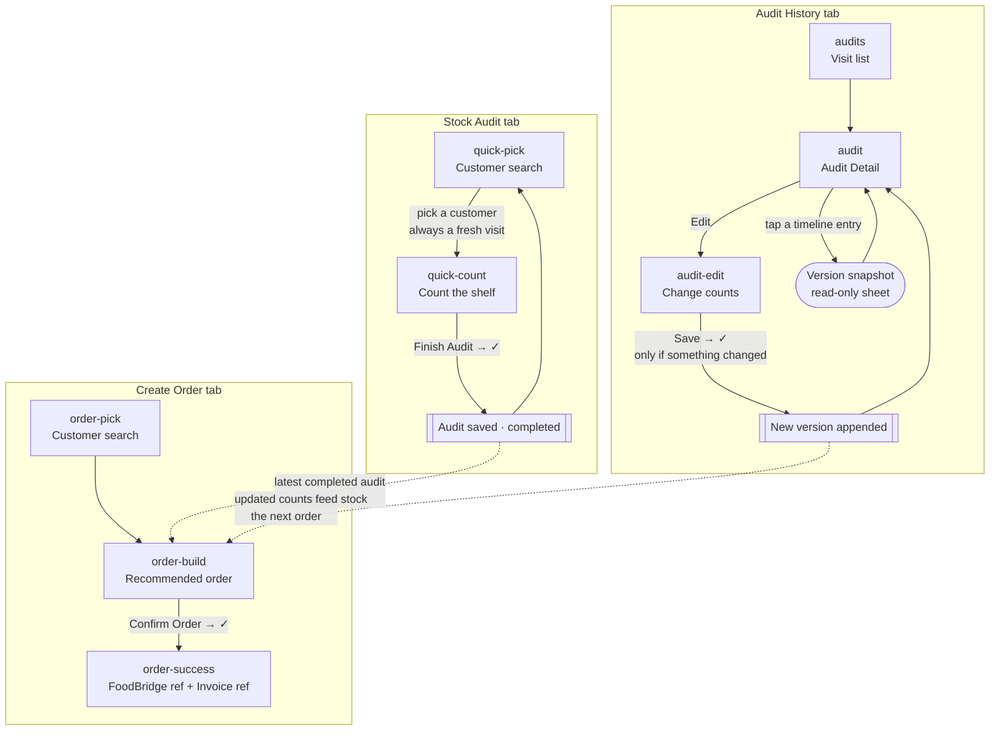
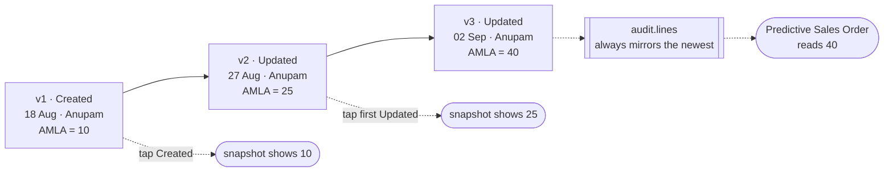
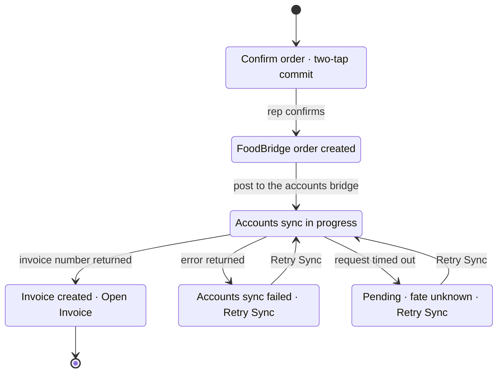
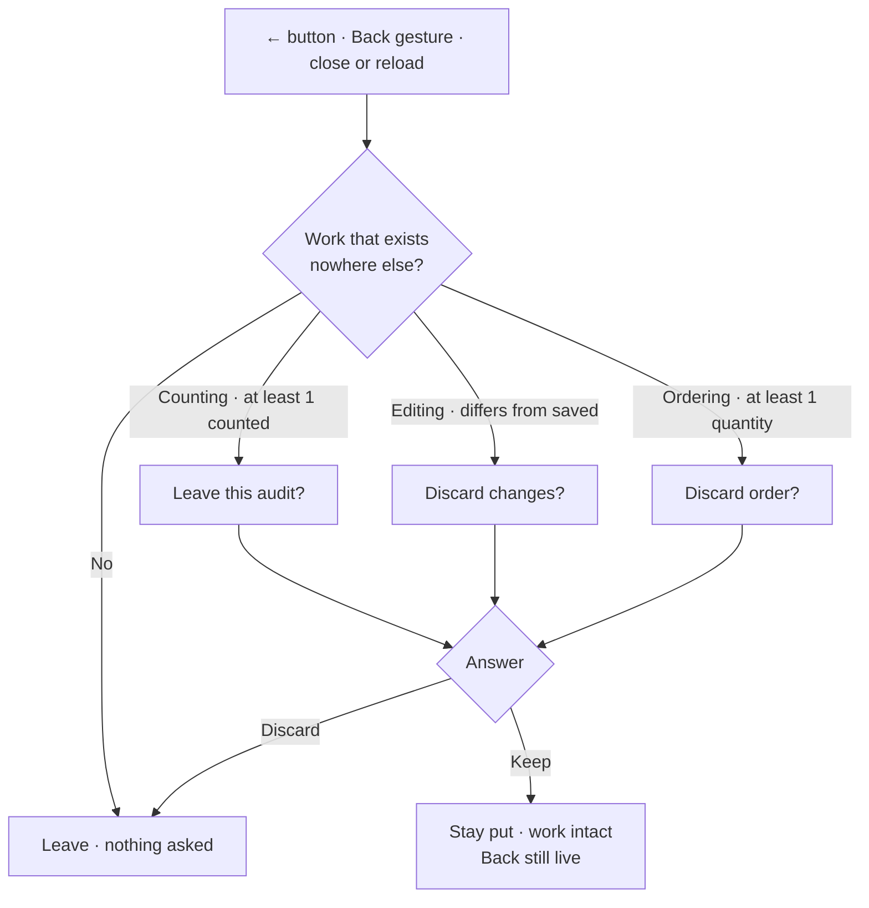

# FoodBridge v4 — Stock Audit & Health: end-to-end UX flow

The complete journey a salesperson walks, screen by screen, with the rules
each screen enforces and what it writes down.

Everything below describes the **v4** cut only, as built in
`v4/modules/foodbridge-customer-mockup/v3/screens/customers/`. (The `v3` in
that path is the *module's* own version folder, nested inside `v4` — not the
repo's frozen `v3/`.)

**Run it:** `foodbridge-v4` launch config → <http://localhost:8003> → open
`/modules/foodbridge-customer-mockup/v3/screens/customers/stock-audit.html`.

---

## 1. The shape of the app

Three tabs in a fixed bottom nav, present on every screen:

| Tab | Entry screen | Purpose |
| --- | --- | --- |
| 🧾 **Stock Audit** | Customer search | Count what is on a customer's shelf |
| 🛒 **Create Order** | Customer search | Turn the latest count into a sales order |
| 🗂️ **Audit History** | Visit list | Read, and correct, past visits |

Eight views in one client-side router. Every view is also a browser history
entry, so the phone's Back gesture walks the flow instead of leaving the page.



**The actor** is a single hard-coded demo user — `Anupam`, Sales Executive.
There is no login. Every record written stamps this name.

**The catalogue** is 86 products, 40 customers, 5 seeded past audits across 4
customers. All 86 products carry the base unit **`Pc`**.

---

## 2. Units — the one concept to read first

A rep facing sealed cases counts **cases**, not pieces. Every product's base
unit opens onto the pack sizes it actually travels in:

```
Pc  ──►  Tray (12 Pc)  ──►  Carton (144 Pc)
```

The rep picks the unit on the row and types the number they can see. The
record stores **both**: `countQty` × `countUnit` as keyed, and `physical`
converted to base units. Everything downstream — coverage, stock-out risk,
the ordering basis — reads `physical`, so the one scale never drifts.

> `3 Tray` is stored as `countQty: 3, countUnit: "Tray", physical: 36`.

---

## 3. Stock Audit — counting a shelf

### 3.1 Customer search (`quick-pick`)

- Search-first. There is **no full customer list** — the box must be tapped
  before anything appears.
- Untouched → empty state. Focused with no query → the first 5 A–Z as a
  bounded preview. Typed → live search across all 40.
- Picking a customer **always starts a fresh visit.** Any half-finished draft
  under that customer is cleared, not offered back.

### 3.2 Counting (`quick-count`)

One screen. The search box **is** the add affordance — there is no separate
"add product" step here.

```
←  Bohagi Store                                   1 / 1 counted
   ▔▔▔▔▔▔▔▔▔▔▔▔▔▔▔▔▔▔▔▔▔▔▔▔▔▔▔▔▔▔▔▔▔▔▔▔▔▔▔▔▔▔▔▔▔▔
   🔍 Search product name or SKU…

   Selected products
   ┌──────────────────────────────────────────────┐
   │ TURMERIC - FINGER          ┌──┬────┬──┐      │
   │ [Pc ⌄]  SKU 4053220…       │ −│  7 │ +│  🗑  │
   │                            │  │ Pc │  │      │
   └──────────────────────────────────────────────┘

                     [ Finish Audit ]
```

**The row.** Product name; below it the unit picker then the SKU; a stepper
whose middle cell carries the number with its unit underneath; a trash icon.
Tapping the **product name** opens its detail sheet. A row with a quantity
goes green — border, number and unit together.

**Empty ≠ zero.** An untouched stepper is blank, not `0`. Blank means nobody
verified this line; `0` means the rep looked and there were none. Coverage
counts only the lines actually touched.

**Removing** asks inside the row — the ✓/✗ pair replaces the stepper in
place. No dialog.

**Finishing** is a two-tap commit in the footer: `Finish Audit` → `Finish this
audit?` with ✓/✗, reporting coverage. Counting nothing and pressing Finish is
an *exit*, not a completion, so it raises the leave confirmation instead.

On save: one audit record, status `completed`, `Audit saved — N products
checked.`, and the rep lands back on a fresh customer search.

---

## 4. Audit History — reading and correcting a visit

### 4.1 The list (`audits`)

Every visit, newest first, searchable by customer or note, sortable
newest/oldest, paged with "Load more". One row per audit — an updated audit
does **not** get extra badges or a revision count.

### 4.2 Audit Detail (`audit`)

A **view** screen. There is no large call-to-action.

```
←  Giriraj Store                          18 Aug · 10:05 am

Products                                            Edit
┌──────────────────────────────────────────────────────┐
│ BAMBOO SHOOTS PICKLE …                     3 Tray (36 Pc) │
│ SKU 405322000007538481                                │
└──────────────────────────────────────────────────────┘

Audit timeline
●  18 Aug · 10:05 am
│  Anupam · Created
●  27 Aug · 01:42 pm
   Anupam · Updated
```

- **Edit** is a quiet text action in the *Products* heading row — attached to
  the thing it edits, not a sticky bottom button.
- **Counts** read in the words they were taken in: `3 Tray (36 Pc)`.
- **Audit timeline** is oldest-first, a dot and a thread, no cards. Every
  entry is tappable.

### 4.3 A timeline entry → version snapshot

Tapping an entry opens a **bottom sheet** showing what the audit looked like
*at that moment*, rendered from that version's stored `lines` — never
recomputed from the current state.

```
Created
18 Aug · 10:05 am · Anupam

Products
BAMBOO SHOOTS PICKLE …                              10 Pc
AMLA PICKLE (1000 gm) …                              1 Pc
                     [ Close ]
```

Read-only. Opening it writes nothing. The list scrolls inside the sheet.

### 4.4 Edit Audit (`audit-edit`)

The counting screen again, minus the parts that only make sense on a live
visit — no progress bar, no outcome.

The rep can **change a quantity**, **change a unit**, **add a product**
(footer `+ Add Product`, or just type in the search box), and **remove a
product** (same in-row ✓/✗).

`Save` is a two-tap commit: `Save changes?` with ✓/✗.

**If nothing changed, Save writes nothing** — no version, no timeline entry,
no toast — and simply returns. A question with no wrong answer is not asked.

---

## 5. Versioning — how an audit remembers

An audit is a **stack of versions**, newest last. `audit.lines` always mirrors
the newest one.

```jsonc
{
  "id": "aud-c11-2",
  "status": "completed",
  "at": "2026-08-18T10:05:00Z",   // the VISIT date — an update never moves it
  "lines": [ /* … always the current version … */ ],
  "versions": [
    { "id": "aud-c11-2-v1", "action": "created", "at": "…", "by": "Anupam",
      "prev": null,            "lines": [ /* AMLA = 10 */ ] },
    { "id": "aud-c11-2-v2", "action": "updated", "at": "…", "by": "Anupam",
      "prev": "aud-c11-2-v1",  "lines": [ /* AMLA = 25 */ ] }
  ]
}
```



Three consequences worth stating plainly:

1. **Nothing is overwritten.** The 05 Aug count still sits in `versions[0]`
   after the 27 Aug update.
2. **Everything downstream keeps working unchanged.** Coverage, health and
   Predictive Order all read `audit.lines`, which is simply always current.
3. **The visit date never moves.** An update corrects what the 18 Aug visit
   found; it does not relocate the visit to today. That is what keeps Audit
   History's ordering stable.

Audits written before versioning existed are migrated on read into a single
`created` version.

---

## 6. Create Order — the predictive sales order

### 6.1 Customer (`order-pick`)
Same search-first pattern as Stock Audit.

### 6.2 Build (`order-build`)

The engine reads **the latest completed audit** as the current stock position
and combines it with order history. Abandoned visits, incomplete audits and
unsaved edits are ignored — only a saved, completed version counts.

> An audit updated from `AMLA = 10` to `25` makes Predictive Order use **25**.

The history is the tenant's **real** trading record (see `order-history.js`),
and the engine asks two separate questions of it:

| Question | Evidence | Rule |
| --- | --- | --- |
| **Whether** to propose the product | how many of the last **6** orders included it | on fewer than half, it is left off |
| **How much** | mean quantity across the last **3** orders that contained it | `max(0, expected − counted stock)` |

A product held back by that floor is not hidden work — the rep can search the
catalogue and add it like any other. There is no "same period last year"
term: measured against the real history it made the recommendation worse, not
better.

Each row shows the recommended quantity, a unit picker and a stepper. The
counted stock is **not** on the row — it has already been subtracted to reach
the recommendation, and repeating it there gave the rep a second number to
reconcile against the only one they can act on. It stays on the record, and
on the product's detail sheet, which is where it answers a question the rep
actually asked. `Stock + history ⓘ` opens "How this was calculated" —
which inputs were available, which were not, and two admissions the engine
makes about itself when they apply: that the customer's history is out of
date (with how long since they last ordered), and how many occasional buys
the floor kept off the order.

`Confirm Order` is a two-tap commit: `Confirm order?` + `N products · N units
· FoodBridge → Accounts`.

### 6.3 Result (`order-success`)

Two references, each with its own state:

```
FoodBridge   FB-SO-26-08-S2E3-001            Created
Invoice      SO-00214                        Created
```

| State | Heading | Footer |
| --- | --- | --- |
| In flight | `Accounts sync in progress` | `Done` (disabled) |
| Created | `Order Created` | `Open Invoice` · `Done` |
| Failed / unresolved | `Order Created` + reason line | `Retry Sync` · `Done` |



The FoodBridge order is created **first and independently**; the accounts sync
is a second step that can fail without taking the order with it. `Retry Sync`
re-syncs the existing order — it can never create a second one.

---

## 7. Losing work — the rules

Three screens hold work that exists nowhere else. Each guards it **identically
on every exit route**: the ← button, the phone's Back gesture, and closing or
reloading the tab.

| Screen | Guard | Fires when |
| --- | --- | --- |
| `quick-count` | **Leave this audit?** | ≥ 1 product counted |
| `audit-edit` | **Discard changes?** | edits differ from the saved version |
| `order-build` | **Discard order?** | ≥ 1 line has a quantity |



These are **small centred modals**, not bottom sheets — the rep did not ask
for them and the screen is waiting on an answer. (Sheets stay sheets for
things the rep *asked* to see: product details, version snapshots, "How this
was calculated".)

Two rules that matter as much as the dialog:

- **It only asks when there is something to lose.** A visit with nothing
  counted, or an edit reverted to its saved value, leaves silently. Asking
  about nothing trains people to dismiss the prompt that matters.
- **Back keeps working.** Cancelling replaces the consumed history entry, so
  the rep stays exactly where they were with Back still live and their count
  intact.

On tab close or reload the browser's own "Leave site?" dialog is raised. A
page teardown cannot run a custom dialog — that wording is the browser's, not
ours.

> **Known gap:** after a reload the in-progress draft is *not* restored. Counts
> are written to `localStorage` as they are typed, but the resume-draft flow
> was deliberately cut from this version, so nothing reads them back. The
> guard prevents the accidental reload; it does not undo a confirmed one.

---

## 8. Product details — available everywhere

Any product name (or a search result's thumbnail, which carries a small ⓘ)
opens a bottom sheet: picture, full untruncated name, SKU, category,
sub-category, base unit, system stock, and the pack ladder with its
multipliers.

One contextual line adapts to where it was opened from:

| Opened from | Shows |
| --- | --- |
| Counting row | `Counted this visit — 3 Tray (36 Pc)` / `Not counted yet` / `Not found` |
| Order row | `On this order — 24 Pc` + what the shop holds |
| A past audit | `Counted on this visit — 10 Pc` |
| A search result | catalogue facts only |

This works through one delegated listener, so any surface that names a product
inherits it by carrying `data-product-info` — there is no per-screen wiring to
forget.

---

## 9. Where the data lives

Browser `localStorage` only. No backend, no build step, no framework.

| Key | Holds |
| --- | --- |
| `fb-discovery-stock-audits-v1` | audits, including every version |
| `fb-discovery-sales-orders-v1` | confirmed orders + their sync state |
| `fb-discovery-stock-draft-audits-v1` | the in-progress count |
| `fb-discovery-customers-v1` | customers |
| `fb-discovery-stock-locations-v1` | per-customer locations |
| `fb-discovery-device-tag` | per-device tag, so two devices cannot mint the same order reference |

The one network call in the app is the accounts sync, which posts to a small
serverless bridge. The accounting system's **OAuth credentials never reach the
browser** — they live in the bridge's own environment. The bridge's shared key
does travel with the page, because a static page has no way to hide one; it is
a speed bump against scanners, not authentication, and it is deliberately the
same for every browser so that confirming an order never depends on how the app
was opened.

> There is no longer a per-device provisioning step. There used to be, and it
> was a genuine source of failure: the link that carried the key deleted it from
> the address bar, so the URL people kept and shared had none, and those
> browsers only found out at Confirm Order.

---

## 10. Conventions this flow keeps

- **Two-tap commits, never a confirmation screen.** Finish, Save and Confirm
  all ask inline in the footer, against the list the rep is already looking at.
- **Removal asks in the row**, never in a dialog.
- **Toasts, not success pages.** The record is already written by the time the
  toast appears; there is nothing left to decide.
- **Copy is one or two words** wherever a sentence is not doing real work:
  `Edit`, `Save`, `Close`, `Created`, `Updated`, `Retry Sync`.
- **Search-first everywhere.** No screen opens with a full list.
- **Tapping a search box opens its options.** Focus alone is enough — before a
  character is typed — and an empty box offers the default set (first 5 A-Z).
  Typing filters from there; tapping away closes it and puts whatever the
  dropdown was covering straight back. This holds even when the screen already
  has a list: the count screen and the order screen used to withhold the
  suggestions once products were selected, so the list underneath could not be
  buried, and both now open like everywhere else. `wireSearchInput` owns the
  whole interaction — a screen supplies only whether its box is open and how to
  set that — so no screen can drift from the rule. Audit History's search
  filters a list already on the page, has no dropdown, and passes nothing.
- **What you add lands on top.** Any product picked out of a search — the
  count, the order, an audit correction — is inserted at the head of the list,
  not appended. The rep went looking for that one, so it belongs where they are
  already looking: they can see the tap landed and set a quantity without
  scrolling to the far end. On the order screen this puts a hand-added product
  above the recommendations, which is the intent — the forecast is still all
  there underneath. A product created on the spot arrives the same way, because
  it joins through the same call a search result does.
- **A quantity of `0` is a default, not an entry.** While a stepper reads
  exactly `0`, the first digit typed REPLACES it rather than landing at the
  caret — so `12` is `12` wherever in the field the rep happened to tap. A
  stepper holding a real quantity is untouched: caret where they put it,
  insertion and deletion ordinary. `+`/`−` are unaffected either way.
- **Thumb targets are 44px**, even where the painted control is smaller — the
  padding is the target, not the paint.
