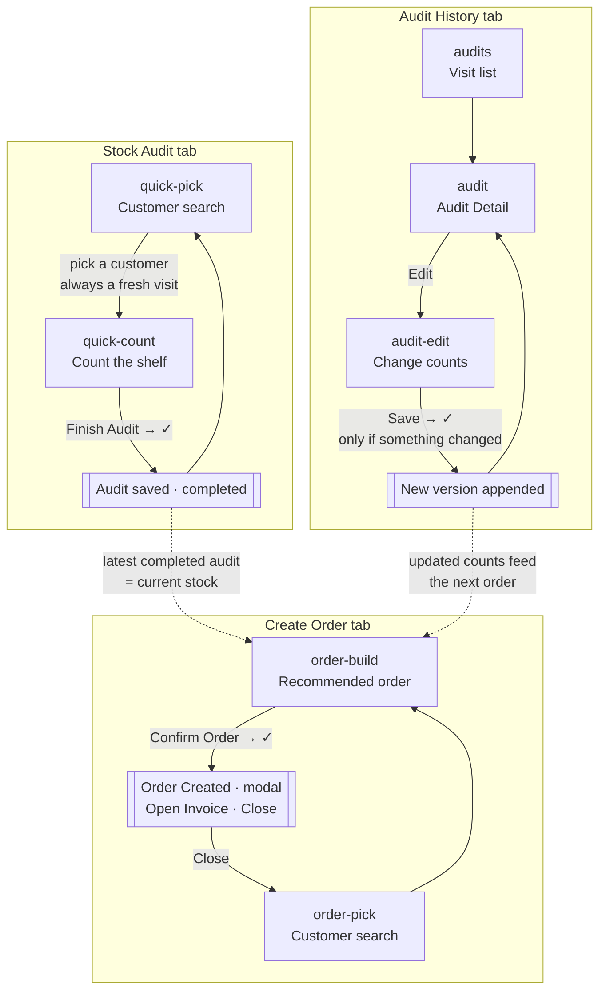
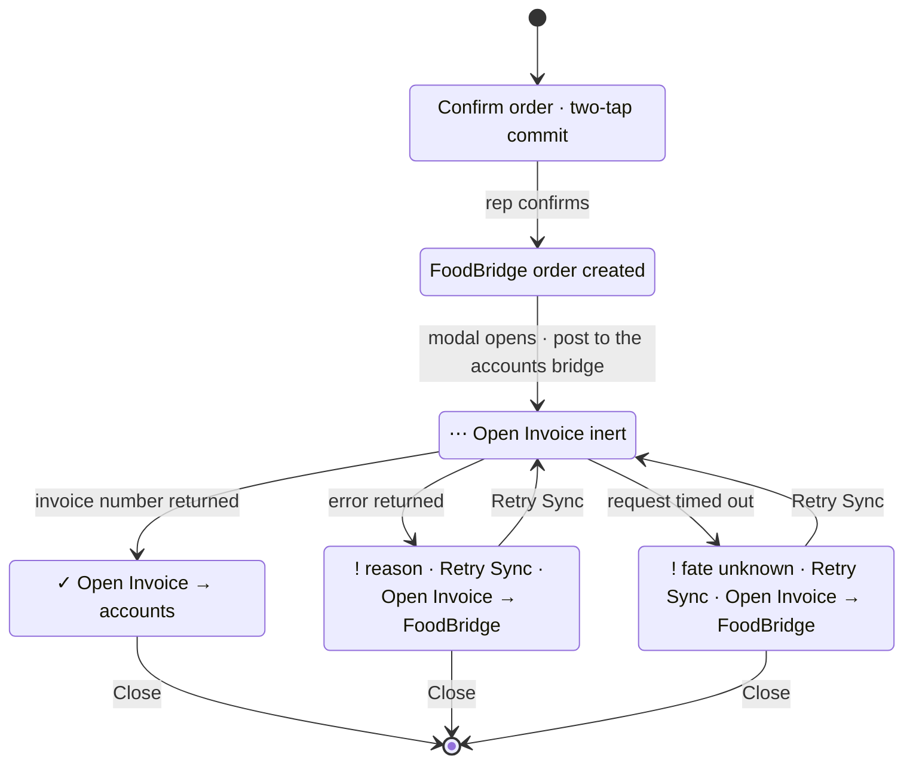
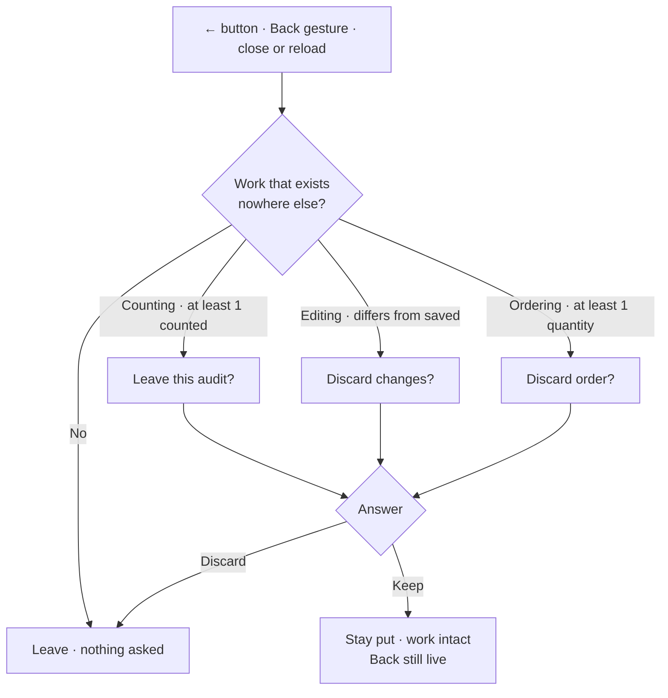

# FoodBridge v4 — Stock Audit & Health: end-to-end UX flow

The complete journey a salesperson walks, screen by screen, with the rules
each screen enforces and what it writes down.

Everything below describes the **v4** cut only, as built in
`v4/modules/foodbridge-customer-mockup/v3/screens/customers/`. (The `v3` in
that path is the *module's* own version folder, nested inside `v4` — not the
repo's frozen `v3/`.)

**Run it:** `foodbridge-v4` launch config → <http://localhost:8003> → open
`/modules/foodbridge-customer-mockup/v3/screens/customers/stock-audit.html`.

---

## 1. The shape of the app

Three tabs in a fixed bottom nav, present on every screen:

| Tab | Entry screen | Purpose |
| --- | --- | --- |
| 🧾 **Stock Audit** | Customer search | Count what is on a customer's shelf |
| 🛒 **Create Order** | Customer search | Turn the latest count into a sales order |
| 🗂️ **Audit History** | Visit list | Read, and correct, past visits |

Seven views in one client-side router — eight until the order result stopped
being a screen and became a modal (§6.3). Every view is also a browser history
entry, so the phone's Back gesture walks the flow instead of leaving the page.



**The actor** is a single hard-coded demo user — `Anupam`, Sales Executive.
There is no login. Every record written stamps this name.

**The catalogue** is 86 products, 40 customers, 5 seeded past audits across 4
customers. All 86 products carry the base unit **`Pc`**.

---

## 2. Units — the one concept to read first

A rep facing sealed cases counts **cases**, not pieces. Every product's base
unit opens onto the pack sizes it actually travels in:

```
Pc  ──►  Tray (12 Pc)  ──►  Carton (144 Pc)
```

The rep picks the unit on the row and types the number they can see. The
record stores **both**: `countQty` × `countUnit` as keyed, and `physical`
converted to base units. Everything downstream — coverage, stock-out risk,
the ordering basis — reads `physical`, so the one scale never drifts.

> `3 Tray` is stored as `countQty: 3, countUnit: "Tray", physical: 36`.

**Changing the unit opens a sheet, not a wheel.** Tapping the unit opens a
bottom sheet of two facts: **what this is** (name and SKU), and then a single
row pairing **what it costs** with **the pack that price belongs to** — the
current unit price beside a dropdown of the pack sizes. The options name the
pack and nothing else; the price for whichever is selected is the figure next to
them, so no number is printed twice. Choosing updates the figure immediately,
which is what makes the packs comparable.

**Saving asks in the footer.** Save turns the button into the same two-tap
question Finish Audit and Confirm Order use, and the detail line states the
actual change — `Pc → Carton · ₹1,36,800.00`, or just the pack and price when
nothing moved. ✗ puts Save back and writes nothing; changing the unit while the
question is open also retracts it, because a pending ✓ the rep already read
would otherwise silently re-point at a different pack. Only ✓ writes, and it
closes the sheet, updates the row's unit, and flashes **Updated** on the row for a
moment — the row changed behind a sheet that just disappeared, and without that
the rep is left hunting for what moved.

A price never wraps mid-number: it holds one line, because "₹1,36,800.0 / 0" is
not a number anyone can read — the picker shrinks first, and an option that
ellipses still reads. Where a product has no MRP the figure reads *No price
set*.

**Where the price comes from — read this before trusting it.** FoodBridge stores
no price. The only price this catalogue has is the **MRP printed in the tenant's
own product names**, which is what `baseMrp` parses, and it is also exactly what
their Zoho items are priced at: 63 of the 86 names carry an MRP and the other 23
sit at zero in Zoho, which is what the parser finds too. So this is a real
configured price, not an invented one — but it is **retail MRP, not the trade
price a distributor charges a shop**, and that gap is the open commercial
question VERSION.md records. A product with no MRP in its name says *No price
set* rather than a confident ₹0. A pack costs its pieces times the ladder, so
the price and the count can never disagree about what a Carton is.

The price is **shown, never sent**. Confirming an order still sends no price at
all — Zoho applies the item's own rate, exactly as before.

---

## 3. Stock Audit — counting a shelf

### 3.1 Customer search (`quick-pick`)

- Search-first. There is **no full customer list** — the box must be tapped
  before anything appears.
- Untouched → empty state. Focused with no query → the first 5 A–Z as a
  bounded preview. Typed → live search across all 40.
- Picking a customer **always starts a fresh visit.** Any half-finished draft
  under that customer is cleared, not offered back.

### 3.2 Counting (`quick-count`)

One screen. The search box **is** the add affordance — there is no separate
"add product" step here.

```
←  Bohagi Store                                   1 / 1 counted
   ▔▔▔▔▔▔▔▔▔▔▔▔▔▔▔▔▔▔▔▔▔▔▔▔▔▔▔▔▔▔▔▔▔▔▔▔▔▔▔▔▔▔▔▔▔▔
   🔍 Search product

   Selected products
   ┌──────────────────────────────────────────────┐
   │                             Pc ⌄             │
   │ TURMERIC - FINGER          ┌──┬────┬──┐  🗑  │
   │                            │ −│  7 │ +│      │
   └──────────────────────────────────────────────┘

                     [ Finish Audit ]
```

**The header — the standard one.** Back, the customer's name, and whatever the
screen puts at the far end, on **one line**, always. This is the shape every
screen that names a customer uses: this one, Edit Audit, both order-build
states, and Audit Detail (§4.2). All five render the name through one helper,
so none of them can drift on the truncation or the tap.

The name takes what is left of the line and is elided: "A N Enterprise (Golden
Mart, Guwahati)" reads as "A N Enterprise (Golden…" where something shares the
line, and whole where nothing does. The header is a place marker, not somewhere
a long name is meant to be read, and holding it to one line keeps the screen's
furniture in the same place whichever shop the rep walked into. A two-line clamp
was tried here and reverted for exactly that: it grew the header to 55px on
precisely the customers with long names.

**Tapping the name opens a sheet with the name in it and nothing else.** That
is what makes the ellipsis a promise the app can keep rather than a loss. No
address, category, status or order count: those live on the customer's own
screens, and any of them here would turn a one-line answer into a card that has
to be read. It answers the one question a clipped header raises — which
customer am I in?

**Where this deliberately does not go.** A customer name that is a row you tap
to *do* something — a picker result, an Audit History card — keeps its single
target; a second one inside a row whose whole job is "select this" is the same
mistake the search thumbnails were removed for (§8). And a name already whole
on the screen — a sheet's eyebrow, the order-done modal's summary — has nothing to
reveal. The rule is: this exists wherever a name is **cut to fit**, and only
there.

**The row.** Product name, then the quantity column — the unit picker sitting
directly above the stepper, outside its border — and a red bin. That is all:
the **SKU was removed** from the row, eighteen digits nobody reads off a phone
costing a line on every card. It is still on the product sheet, still on the
search results that identify a product, and still searchable.

The name gets **two lines**, then ellipsis, and is capped at `NAME_WORDS` (12)
with the full name kept on the `title` and the `aria-label`. The two do
different jobs: the CSS clamp is width-aware and does the truncating on a
phone; the word cap bounds a pathological name — this catalogue's longest is
fifteen words, and a rep can create one of any length. Neither costs the row
height: the quantity column is the taller half (62px against the name's 35),
so a second line is free and a short name still sits on one.

**The unit is bare text and a chevron** — no pill, no border, no background. It
is still a `<button>`, and it still opens the unit sheet (§2); what it lost is
the box around it, which was ~10px of height on the tallest column of every row
spent on decoration. The chevron already says the word opens something. Tapping
the **product name** opens the product sheet (§8). A row with a quantity goes
green — the stepper's border, its number, and the unit above it together, the
unit now tinting its own text since there is no fill left to tint.

The stepper's `−`/`+` are a full **44×44** — the width was the axis still short
of the guideline, and it is the one a thumb misses on a control this narrow.

**Touch targets are separated by construction, not by stacking order.** The
bin's target box never touches the stepper's, so no part of `+` opens a delete
confirmation; the unit's target stops flush at the stepper's top edge rather
than reaching over `−`/`+`, where a mis-tap would silently change a counted
quantity. It buys its height upward instead, which is the one free direction —
28px of target around 12px of text.

Note that painted distance and target distance are different numbers, and both
have to be checked. The bin is 15px of ink inside a 44px box, so the gap the
eye sees is far larger than the gap between the boxes. Measured at 402px: the
column is 62px, the unit's target runs 219→247 against a stepper starting at
247, and the bin's box opens 3px past where the stepper's ends. Every edge of
every control hit-tests to itself.

**Empty ≠ zero.** An untouched stepper is blank, not `0`. Blank means nobody
verified this line; `0` means the rep looked and there were none. Coverage
counts only the lines actually touched.

**Removing** asks inside the row — the ✓/✗ pair replaces the stepper in
place. No dialog.

**Finishing** is a two-tap commit in the footer: `Finish Audit` → `Finish this
audit?` with ✓/✗, reporting coverage. **Finish never opens a modal.** With
nothing counted it says so and stays — `Count at least one product first.` —
the same toast-and-stay Save and Confirm Order use when their own list is
empty.

That reversed a rule. Counting nothing and pressing Finish used to raise the
**leave** confirmation, on the reasoning that nothing counted is an exit rather
than a completion. But the rep did not ask to leave — they pressed Finish — and
being handed `End this visit` for pressing the wrong button is a far worse
surprise than being told to count something. It also made that modal mean two
different things; it now means one, which is what lets it be trusted the other
times it appears (§7).

On save: one audit record, status `completed`, `Audit saved — N products
checked.`, and the rep lands back on a fresh customer search.

---

## 4. Audit History — reading and correcting a visit

### 4.1 The list (`audits`)

Every visit, **newest first**, always — paged with "Load more". One row per
audit; an updated audit does **not** get extra badges or a revision count.

There is no sort control. A Newest/Oldest picker used to sit on the "Recent
Audits" heading, which put a switch for breaking the promise directly under the
screen's own subtitle — and "oldest first" answers a question (what did I do
first, ever) that a rep with a search box does not ask standing in a shop.

The box is labelled **Search customer…** and that is the case it is there for.
It still matches a visit's notes as well, which costs nothing and occasionally
finds the visit a rep remembers by what they wrote rather than by who it was.

### 4.2 Audit Detail (`audit`)

A **view** screen. There is no large call-to-action. It carries the standard
header (§3.2) — so the name truncates and opens the same sheet here as
everywhere else.

That took a change. This screen used to render "← Giriraj Store" as a SINGLE
back link, which made the customer's name the label on the back button and, on
this tenant's longer names, wrapped the header onto two lines. Splitting it —
an arrow that goes back, a name that opens the name — is what let the name
behave the same way on every screen. The rule under the header is a plain
divider here, not the progress track it is on the capture screens: this visit
is finished, and an empty track would read as 0%.

```
←  Giriraj Store                          18 Aug · 10:05 am

Products                                            Edit
┌──────────────────────────────────────────────────────┐
│ BAMBOO SHOOTS PICKLE …                              3 Tray │
│ SKU 405322000007538481                                │
└──────────────────────────────────────────────────────┘

```

- **Edit** is a quiet text action in the *Products* heading row — attached to
  the thing it edits, not a sticky bottom button.
- **Counts** read in the words they were taken in, and only those: `3 Tray`.
  The base-unit total used to follow in brackets — `3 Tray (36 Pc)` — so that
  the row carried both the figure that reconciles against system stock and the
  one a rep can re-count on the shelf. It is gone: reconciling is not what
  anyone is doing while reading a finished visit, so the second number was
  printed on every converted line to be skipped, and the pair read as one
  quantity needing arithmetic. `physical` still holds the conversion and still
  drives everything downstream; the pack ladder is one tap away on the product
  sheet. Lines taken in the base unit never had a bracket and are unchanged.
- **Who last touched it** sits in the header beside the customer's name —
  `Anupam · Created`, or `Anupam · Updated` once it has been edited. Versions
  are still recorded on every edit; the app no longer draws the stack.

```
Created
18 Aug · 10:05 am · Anupam

Products
BAMBOO SHOOTS PICKLE …                              10 Pc
AMLA PICKLE (1000 gm) …                              1 Pc
                     [ Close ]
```

Read-only. Opening it writes nothing. The list scrolls inside the sheet.

### 4.4 Edit Audit (`audit-edit`)

The counting screen again, minus the parts that only make sense on a live
visit — no progress bar, no outcome.

The rep can **change a quantity**, **change a unit**, **add a product**
(footer `+ Add Product`, or just type in the search box), and **remove a
product** (same in-row ✓/✗).

`Save` is a two-tap commit: `Save changes?` with ✓/✗ — **every time it is
tapped**, the same as Finish Audit and Confirm Order.

It used to skip the question when the lines were identical to the ones already
on the record, on the reasoning that a question with no wrong answer is not
worth asking. That reversed, because the rep cannot see which case they are in:
Save asked sometimes and not others, and the difference was a comparison they
had no way to run. A control that behaves differently for reasons invisible to
the person pressing it is worse than one extra tap.

**What ✓ commits is unchanged: if nothing changed, Save writes nothing** — no
version, no timeline entry, no toast. It asks, then returns.

---

## 5. Versioning — how an audit remembers

An audit is a **stack of versions**, newest last. `audit.lines` always mirrors
the newest one.

```jsonc
{
  "id": "aud-c11-2",
  "status": "completed",
  "at": "2026-08-18T10:05:00Z",   // the VISIT date — an update never moves it
  "lines": [ /* … always the current version … */ ],
  "versions": [
    { "id": "aud-c11-2-v1", "action": "created", "at": "…", "by": "Anupam",
      "prev": null,            "lines": [ /* AMLA = 10 */ ] },
    { "id": "aud-c11-2-v2", "action": "updated", "at": "…", "by": "Anupam",
      "prev": "aud-c11-2-v1",  "lines": [ /* AMLA = 25 */ ] }
  ]
}
```


Three consequences worth stating plainly:

1. **Nothing is overwritten.** The 05 Aug count still sits in `versions[0]`
   after the 27 Aug update.
2. **Everything downstream keeps working unchanged.** Coverage, health and
   Predictive Order all read `audit.lines`, which is simply always current.
3. **The visit date never moves.** An update corrects what the 18 Aug visit
   found; it does not relocate the visit to today. That is what keeps Audit
   History's ordering stable.

Audits written before versioning existed are migrated on read into a single
`created` version.

---

## 6. Create Order — the predictive sales order

### 6.1 Customer (`order-pick`)
Same search-first pattern as Stock Audit.

### 6.2 Build (`order-build`)

The engine reads **the latest completed audit** as the current stock position
and combines it with order history. Abandoned visits, incomplete audits and
unsaved edits are ignored — only a saved, completed version counts.

> An audit updated from `AMLA = 10` to `25` makes Predictive Order use **25**.

The history is the tenant's **real** trading record (see `order-history.js`),
and the engine asks two separate questions of it:

| Question | Evidence | Rule |
| --- | --- | --- |
| **Whether** to propose the product | how many of the last **6** orders included it | on fewer than half, it is left off |
| **How much** | mean quantity across the last **3** orders that contained it | `max(0, expected − counted stock)` |

A product held back by that floor is not hidden work — the rep can search the
catalogue and add it like any other. There is no "same period last year"
term: measured against the real history it made the recommendation worse, not
better.

Each row shows the recommended quantity and a stepper, with the unit picker
directly above it — the same quantity column the count screen uses. The
counted stock is **not** on the row — it has already been subtracted to reach
the recommendation, and repeating it there gave the rep a second number to
reconcile against the only one they can act on. It stays on the record, and
on the product's detail sheet, which is where it answers a question the rep
actually asked.

**The provenance is a footnote, not a status.** An `ⓘ` sits against the
**Recommended** heading and opens "How this was calculated" — which inputs
were available, which were not, and two admissions the engine makes about
itself when they apply: that the customer's history is out of date (with how
long since they last ordered), and how many occasional buys the floor kept off
the order. It used to carry a two-word label — `Stock + history` / `History
only` — at the far end of the heading's row. That said what the sheet's first
two lines say with the dates and counts attached, and the far edge made it read
as a status the heading was reporting rather than something to open. The label
is now the button's accessible name, so a screen reader still hears the summary
a sighted rep gets by tapping.

`Confirm Order` is a two-tap commit: `Confirm order?` + `N products · N units`.

### 6.3 Result — the order-done modal

Confirming does **not** open a screen. The rep lands back on a fresh customer
search and the result is stated in a modal over it:

```
        ┌──────────────────────────────┐
        │              ✓               │
        │        Order Created         │
        │        Giriraj Store         │
        │    4 products · 23 units     │
        │                              │
        │       [ Open Invoice ]       │
        │      [     Close      ]      │
        └──────────────────────────────┘
```

There used to be an `order-success` **view** here, listing the FoodBridge
reference and the invoice number side by side with a status tag on each. Both
identifiers are gone from the result: they are still on the stored record, and
the FoodBridge invoice prints the reference, but a rep closing an order acts on
*did it work* and *give me the invoice*, not on either number. A whole screen
whose only exit was `Done` was a step to dismiss rather than a place to be.

| State | Mark | Actions |
| --- | --- | --- |
| In flight | `⋯` | `Open Invoice` (inert) · `Close` |
| Synced | `✓` | `Open Invoice` · `Close` |
| Failed / unresolved | `!` + reason line | `Retry Sync` · `Open Invoice` · `Close` |

**Whether accounts took it did not go.** The state mark, the failure reason and
`Retry Sync` all survive the trim, because a green tick over a failed sync is
the one thing this feature must never show. What was removed is chrome; this is
the truth, and it stays.

**The modal cannot be dismissed except by `Close`.** Not by tapping outside it,
not by the phone's Back gesture or the browser's Back button, not by Escape,
not on a timer, and not by opening the invoice. It is the only report a
confirmed order gets, and Back in particular is far too easy to press by
accident to be an exit here. This is why it is not a `sheet()` — every one of
those dismissals is something `sheet()` provides deliberately, for things the
rep *asked* to see (§7 covers the modals that interrupt, which are a different
job again).

**`Open Invoice` opens a new tab and leaves the modal standing.** Which
invoice depends on whether *this order* reached the accounts system — the only
signal the browser has, since the customer→accounts mapping lives on the server
and is never sent to the page:

- **Synced, with a deep link configured** → the accounting system's own invoice
  flow.
- **Anything else** → FoodBridge's own invoice page (`invoice.html?order=<id>`),
  so a rep is never left holding a confirmed order with no way to invoice it.

While the sync is still unresolved the button is inert, because which of the two
to open is not known yet.

#### The FoodBridge invoice page

A standalone document, opened in its own tab. It loads no seed, no shell and no
icons — only the order, read out of `localStorage` by id. That is deliberate:
it opens precisely when the accounts sync has failed, so it must not depend on
the app's own machinery being healthy.

It prints the tenant, the customer, the order reference and date, who raised it,
and every line with its SKU, confirmed quantity, unit price and line amount,
then **subtotal, tax and grand total**. When the order has not synced it says
so, with the reason, and points at Retry.

Mobile first: below 640px each line is a block — name, SKU, then `10 Pc ×
₹65.00` against the amount — because five columns do not fit on a phone. From
640px up the same markup becomes a real table, which is what a document wants.

**Read this before trusting a total.** FoodBridge stores no prices and no tax,
so two figures on that page are *derived*, not held:

- The **unit price** is the retail MRP parsed out of the product's own name —
  the same parse the product sheet uses (§2) — multiplied up the pack ladder,
  so a Tray costs twelve pieces. It is retail MRP, **not the trade price a
  distributor charges a shop**, which is VERSION.md's open commercial question.
  The 23 catalogue products with no MRP in their name read *No price set* and
  add nothing to the subtotal; the page says how many did.
- The **tax rate** is a placeholder constant in the page (`GST_RATE`), because
  nothing in FoodBridge configures one.

The page states both on its face rather than in a comment, since a document
headed *Invoice* showing a grand total will be read as authoritative unless it
says otherwise. The accounting system remains the authority on what is billed.

To price a pack the page needs to know what one unit is worth in base units,
and it has no catalogue to look that up in — so **the order line carries its own
`unitFactor`**, written at confirm time. Without it `Pallet` alone is ambiguous
across the ladders (144, 480, 20 or 48), and a reader that guesses can silently
misprice a pack. Lines written before this existed fall back to the `Pc` ladder,
which is correct for all 86 catalogue products.

**Print** uses the browser's own dialog against a print stylesheet that drops
the buttons and tints. **Download PDF** builds an actual PDF in the page — no
library may be fetched, so it is assembled from primitives using the base-14
Helvetica faces, which need no embedding. It says `Rs.` rather than `₹`, since
the standard encoding has no rupee glyph and a missing one would print blank.



The FoodBridge order is created **first and independently**; the accounts sync
is a second step that can fail without taking the order with it. `Retry Sync`
re-syncs the existing order — it can never create a second one, and it leaves
the modal open.

---

## 7. Losing work — the rules

Three screens hold work that exists nowhere else. Each guards it **identically
on every exit route**: the ← button, the phone's Back gesture, and closing or
reloading the tab.

**These modals belong to leaving, and to nothing else.** No committing
action — Finish, Save, Confirm — ever raises one; those ask inline in the
footer where the rep is already looking (§10). A modal here means the same
thing every time it appears: you are about to walk away from work that exists
nowhere else.

| Screen | Guard | Fires when |
| --- | --- | --- |
| `quick-count` | **Leave this audit?** | ≥ 1 product counted |
| `audit-edit` | **Discard changes?** | edits differ from the saved version |
| `order-build` | **Discard order?** | ≥ 1 line has a quantity |



These are **small centred modals**, not bottom sheets — the rep did not ask
for them and the screen is waiting on an answer. (Sheets stay sheets for
things the rep *asked* to see: product details, version snapshots, "How this
was calculated".)

Two rules that matter as much as the dialog:

- **It only asks when there is something to lose.** A visit with nothing
  counted, or an edit reverted to its saved value, leaves silently. Asking
  about nothing trains people to dismiss the prompt that matters.
- **Back keeps working.** Cancelling replaces the consumed history entry, so
  the rep stays exactly where they were with Back still live and their count
  intact.

On tab close or reload the browser's own "Leave site?" dialog is raised. A
page teardown cannot run a custom dialog — that wording is the browser's, not
ours.

> **Known gap:** after a reload the in-progress draft is *not* restored. Counts
> are written to `localStorage` as they are typed, but the resume-draft flow
> was deliberately cut from this version, so nothing reads them back. The
> guard prevents the accidental reload; it does not undo a confirmed one.

---

## 8. Product details — the start of the unit/price journey

Any product **name** opens a bottom sheet of **four things**: the full
untruncated name, the SKU, the **unit price**, and the **unit picker** that
changes it. Choosing a pack updates the price on the spot. That is the whole
sheet.

A search result used to be a second way in — its thumbnail was separately
tappable, marked with a small teal ⓘ. Both the thumbnail and that route are
**gone**. Two targets in one row, one of them a 34px picture, is a lot to ask of
a list whose only job is "tap to add", and this catalogue's photos did not earn
it: what separates two entries here is the size and the MRP inside the name —
`(1000 gm) … NEW MRP 660` against `(475 gm) … NEW MRP 325` — and every one of
them is the same jar in the same photo. The picture was taking the width the
distinguishing half of the name needed. No product row in the module carries a
thumbnail now, so the rule has no exceptions to remember; a product's details
are one tap away from the row it lands in once added.

The **customer** search lost its square too — a letter chip, the first
character of the name in a tinted box. It identified nothing a list of names
does not already identify, and it cost every row 34px plus a gap on the side
where the address sits. A search result is text now, on both lists.

It used to carry a picture, a category / sub-category / base-unit / system-stock
table, a "this visit" line and the pack ladder spelled out. All of it was
**removed**: none of it answered the question a rep opens this to ask, and
together they pushed the one that does — what does a pack of this cost —
below the fold. The sheet is a starting point, not a datasheet.

The unit it opens on is the one the record is actually using, read from
`data-product-ctx`: the draft's line when counting, the order's line when
ordering, the audit's line when reading history. A search result nothing holds
a number for yet opens on the base unit, which is the honest answer.

The price-and-picker block is **shared with the unit sheet** (§2), so the two
cannot drift. The difference is what each is for: this one reads, and closes;
the unit sheet changes, and saves.

This works through one delegated listener, so any surface that names a product
inherits it by carrying `data-product-info` — there is no per-screen wiring to
forget. The workspace header's customer name rides the same listener (§3.2).

---

## 9. Where the data lives

Browser `localStorage` only. No backend, no build step, no framework.

| Key | Holds |
| --- | --- |
| `fb-discovery-stock-audits-v1` | audits, including every version |
| `fb-discovery-sales-orders-v1` | confirmed orders + their sync state |
| `fb-discovery-stock-draft-audits-v1` | the in-progress count |
| `fb-discovery-customers-v1` | customers |
| `fb-discovery-stock-locations-v1` | per-customer locations |
| `fb-discovery-device-tag` | per-device tag, so two devices cannot mint the same order reference |

The one network call in the app is the accounts sync, which posts to a small
serverless bridge. The accounting system's **OAuth credentials never reach the
browser** — they live in the bridge's own environment. The bridge's shared key
does travel with the page, because a static page has no way to hide one; it is
a speed bump against scanners, not authentication, and it is deliberately the
same for every browser so that confirming an order never depends on how the app
was opened.

> There is no longer a per-device provisioning step. There used to be, and it
> was a genuine source of failure: the link that carried the key deleted it from
> the address bar, so the URL people kept and shared had none, and those
> browsers only found out at Confirm Order.

---

## 10. Conventions this flow keeps

- **Two-tap commits, never a confirmation screen.** Finish, Save and Confirm
  all ask inline in the footer, against the list the rep is already looking at.
- **Removal asks in the row**, never in a dialog.
- **Toasts, not success pages.** The record is already written by the time the
  toast appears; there is nothing left to decide.
- **Copy is one or two words** wherever a sentence is not doing real work:
  `Edit`, `Save`, `Close`, `Created`, `Updated`, `Retry Sync`.
- **Search-first everywhere.** No screen opens with a full list.
- **Every product search has `+ Add Product`, and it goes all the way.** The
  button sits in the sticky footer of all three screens that pick products —
  counting, Edit Audit, order-build — and is hidden while the dropdown is open,
  where it would offer what the rep is already doing. Tapping it opens the
  search. If nothing matches, the empty state itself carries `+ Add Product`
  again, and that opens **New Product**: name, unit, optional SKU, optional
  photo. What it creates joins the list through the same call a search result
  does, so the row that appears is an ordinary row.

  This took two fixes to become a rule. The counting screen had the create path
  but no footer button — the only way to reach it was to search for the product
  and read the empty state, which asks the rep to prove a product is missing
  before offering to add it. The order screen had the footer button but its
  empty state dead-ended at "No product matches that.", so a rep standing in a
  shop with something the catalogue has never heard of could **count** it but
  not **order** it. A product created on the order screen reaches Accounts
  unmapped, which the sync reports as an error the rep can see and retry — the
  same as any other unmapped product, and better than not being able to record
  the order at all.
- **Tapping a search box opens its options.** Focus alone is enough — before a
  character is typed — and an empty box offers the default set (first 5 A-Z).
  Typing filters from there; tapping away closes it and puts whatever the
  dropdown was covering straight back. This holds even when the screen already
  has a list: the count screen and the order screen used to withhold the
  suggestions once products were selected, so the list underneath could not be
  buried, and both now open like everywhere else. `wireSearchInput` owns the
  whole interaction — a screen supplies only whether its box is open and how to
  set that — so no screen can drift from the rule. Audit History's search
  filters a list already on the page, has no dropdown, and passes nothing.
- **What you add lands on top.** Any product picked out of a search — the
  count, the order, an audit correction — is inserted at the head of the list,
  not appended. The rep went looking for that one, so it belongs where they are
  already looking: they can see the tap landed and set a quantity without
  scrolling to the far end. On the order screen this puts a hand-added product
  above the recommendations, which is the intent — the forecast is still all
  there underneath. A product created on the spot arrives the same way, because
  it joins through the same call a search result does.
- **A quantity of `0` is a default, not an entry.** While a stepper reads
  exactly `0`, the first digit typed REPLACES it rather than landing at the
  caret — so `12` is `12` wherever in the field the rep happened to tap. A
  stepper holding a real quantity is untouched: caret where they put it,
  insertion and deletion ordinary. `+`/`−` are unaffected either way.
- **Thumb targets are 44px**, even where the painted control is smaller — the
  padding is the target, not the paint.
