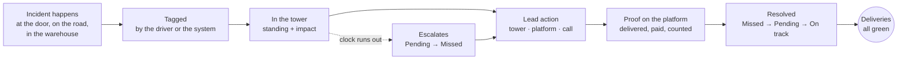
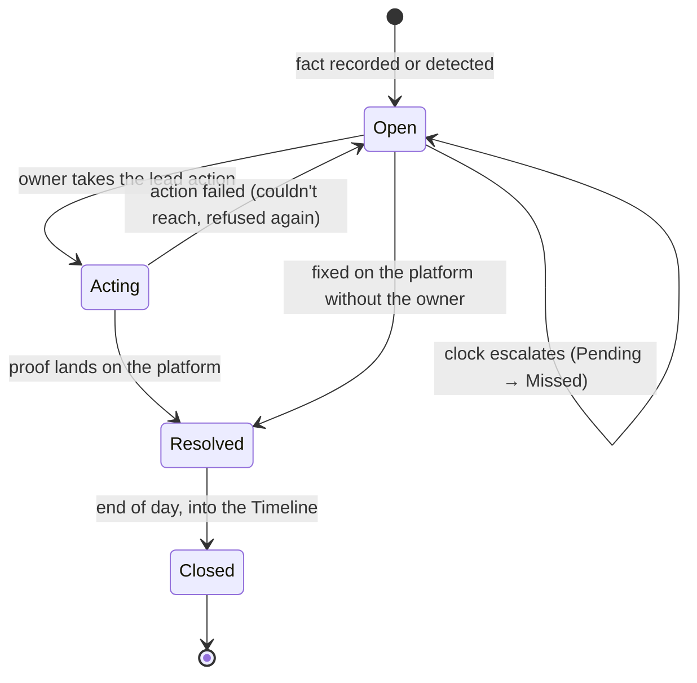
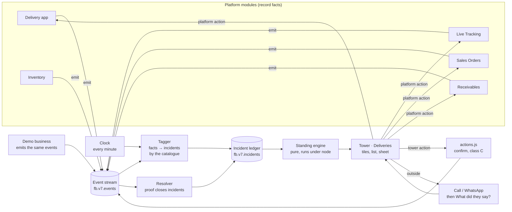

# Deliveries, run on incidents

**Built · 24 Sep 2026 · v7 Control Tower · Deliveries area · branch `ct-incident-engine`.** The
delivery engine in `assets/ct/levers.js` now runs on incidents (`assets/ct/incidents.js`), every
lead action runs in the tower (`assets/ct/incident-actions.js`), the delivery app writes its facts
to the platform's event stream (`assets/fb-events.js`), and the demo business raises and fixes
incidents live. All four phases of §11 are built; the decisions in §12 were taken as recommended
and are the owner's to confirm.

This file and its artifact (https://claude.ai/artifact/DCFtTfeePkveNwFRRJZX6z) are twins: the
artifact is this exact text, rendered by `incidents-artifact/build.py`, with the sketches and the
catalogue made interactive. Edit this file, run the build, republish.

---

## 1. The loop

> **Incident → tag → lead action → lead impact → standing → the area back to green.**

Something goes wrong with a real delivery. It is recorded where the work happens (the driver's
app, Live Tracking, a stock count), or the system spots it on its own. The platform tags it as
one incident from the catalogue. The tower shows it with its **impact** (what it costs) and its
**lead action** (the one thing to do, and where to do it). The owner acts: in the tower, on the
platform screen that fixes it, or outside with a phone call. When the platform records the fix,
the incident closes. The delivery moves from Missed to Pending to On track, and the Deliveries
area turns green with it. The day is a chase to all green.

<!-- fig:loop -->


| Word | Means | Example |
|---|---|---|
| Incident | One thing that went wrong with one delivery, van or order | Shop closed at Best Price Store |
| Tag | The incident's name from the catalogue, set by the platform, one per delivery | "Shop closed" |
| Standing | Where the delivery stands because of it: **Missed** (needs you), **Pending** (in hand), **On track** | Missed |
| Lead impact | What it costs, in the owner's units: ₹, cases, stops, minutes | ₹4,820 not delivered |
| Lead action | The one step that fixes it, and where it is done | Call the shop, then reschedule |
| Proof | The platform event that shows it is fixed | Delivered at 5:10 pm |

---

## 2. What we found on the platform

We walked every Distribution & Logistics screen, action by action, plus the screens next to
them where a delivery problem is also recorded.

| Module | Screen | What a person does there that can raise an incident |
|---|---|---|
| Delivery app (Delivery Management) | Pre-start › Load stock | Loads less than planned (planned vs loaded per product) |
| Delivery app | Pre-start › Opening cash, Sign-off | Route not started by its start time |
| Delivery app | Queue › At customer | Edits the order down or up; stepper hits "Max N loaded" or "Out of stock" |
| Delivery app | At customer › Skip stop ("Why no delivery?") | Shop Closed · Owner Away · Fully Stocked · Refused · Will Order Later · Other + note |
| Delivery app | At customer › Payment | Cash or UPI; pays less, with or without "adjusted as offer"; the rest stays on credit |
| Delivery app | At customer › Product return | Damaged · Expired · Unsold · Wrong Product, with quantities |
| Delivery app | At customer › Manage assets | Crates given vs crates back |
| Delivery app | Restock / Stock requested | Van ran out mid-route and goes back to load |
| Delivery app | Settlement › Stock count | Expected vs actual per product: missing or excess, note required |
| Delivery app | Settlement › Cash handover | Counted cash ≠ expected |
| Live Tracking | Exceptions feed | No ping for 15 min · van idle on route · N min behind · stop skipped · money uncollected · cash handover pending |
| Live Tracking | Route drawer | Call driver · Message driver · Acknowledge · Move up · Mark skipped · Reassign to another van |
| Route Planning | Delivery templates | Customers and staff per route; no van, no capacity |
| Logistic Returns | Asset movement | Crates and trays issued vs returned, per customer |
| Sales Orders | Orders list | In progress → Dispatch created → Delivered / Skipped; partly allocated; dispatch rejected; returns pending |
| Receivables | Invoices and payments | Cash, UPI, cheque; outstanding per customer; no credit limit |
| Inventory | Finished goods | Batches, near expiry, expired |

**Five findings that shape the design:**

1. **The tower does not hear the platform.** The Deliveries area runs on its own simulation
   (`demo.js` writes outcomes straight into `fb.v7.ct.deliveries`). Nothing a driver records in
   the delivery app reaches the tower. The engine must start with one shared event stream.
2. **Capture is real but coarse.** The driver picks from 6 skip reasons and 4 return reasons.
   17 of the 54 incidents are captured exactly today, 22 only partly (under "Other", a broader
   reason, or a signal like "van idle"), and 15 not at all.
3. **Live Tracking is already the fix screen for the road.** It has an exceptions feed and the
   right interventions (reassign, move up, call, message). Route and vehicle incidents should
   hand off to it, not rebuild it in the tower.
4. **Whole families are missing:** vehicle problems (breakdown, accident, fridge), proof of
   delivery, credit limit, cold chain. They need capture points, not tower screens.
5. **The owner's own mockup already has the loop.** The delivery modal reads What happened ·
   Impact · FoodBridge recommends. The engine fills those three lines from the incident; the
   card shows nothing else (owner, 24 Sep 2026: no "So far" section).

---

## 3. Rules of the engine

1. **Modules record facts; the engine names incidents.** The delivery app says "stop skipped,
   reason Shop Closed". The engine turns that into the *Shop closed* incident. A new incident
   type is a catalogue row, not a change to a module.
2. **One tag per delivery.** A delivery shows its worst open incident (Missed before Pending,
   then the larger ₹). The others are lines under What happened. No "+N" (owner, 23 Sep).
3. **Standing is computed, never picked.** Nobody chooses Missed or Pending. The rules in §4
   decide it, and the clock moves it.
4. **Every incident has at most two buttons:** its lead action and one alternative (often the call
   that comes first). Each action is one of sixteen (§6), built the way Reschedule is built, and each
   has a twin on the ground that writes the same fact.
5. **Closed by proof, not by say-so.** Anything about goods or money closes only when the
   platform records the fix (delivered, paid, counted back, reassigned). A talk-only incident
   ("ask why it was late") closes when the owner picks what they heard.
6. **Van-level incidents hold their deliveries.** A breakdown is one row with its held stops
   under it, not nine red rows. Fixing the van frees the stops.
7. **A return is the stock side of its cause.** Damaged goods and the damaged return are one
   event: the tag is the cause (Damaged), and the recorded return is part of the proof.
8. **Owner's words only.** No ids, no "lever", no "incident" on screen: the row says what
   happened ("Shop closed"), the sheet says what it costs and what to do.

---

## 4. The impact indicator: standing

Every open incident gets a standing from three questions, asked in order, and a clock.

| # | Question | If yes |
|---|---|---|
| 1 | Is it a safety or cold-chain problem, or can the drop **not happen today** without you? | **Missed** (needs you) |
| 2 | Is the money or stock at risk above the line (₹2,000 by default, or 5% of the bill)? | **Missed** |
| 3 | Is anything still open about it? | **Pending** (in hand) |
| – | Nothing open, or a small delay still inside its window | **On track** |

**The clock.** Each incident type has a *turns red when* moment (in the catalogue): the van
finishes its route, the delivery window closes, the next trip leaves, the route is settled.
An incident still Pending at that moment escalates to **Missed**.

**Acting.** When the owner takes the lead action, a Missed incident drops to **Pending**
("being fixed") until the proof arrives. When the proof lands, it is **On track** with a tick.

**What moves where:**

| Moment | Standing | Tile the delivery sits under |
|---|---|---|
| Shop closed recorded at 11:20 | Missed | Missed · Need you |
| Owner rescheduled it to Van 1, 4–8 pm | Pending | Pending · In hand |
| Van 1 delivered it at 5:10 pm | On track ✓ | On track · Done |
| Short 4 cases, balance not on the next trip | Pending → Missed | escalates when the next trip leaves |

**The area's standing** comes from its deliveries: **Urgent** while any delivery is Missed,
**Needs work** while any incident is open or deliveries are still to go, **On track** when every
delivery is done and nothing is open. The headline keeps "14 of 32 delivered"; its line adds
the money: "17 to deliver · ₹18,400 at risk".

The tiles keep their names and count deliveries by standing: **On track** (done, nothing
open) · **Pending** (to deliver, or being fixed) · **Missed** (needs you). A delivered drop with
an open problem (damaged, short) now sits under Pending until it is fixed, not under On track.
That is a change from 23 Sep (see §12).

---

## 5. Lifecycle of one incident

<!-- fig:lifecycle -->


| State | Standing shown | Row reads | Trail step added |
|---|---|---|---|
| Open | Missed or Pending (by §4) | "Shop closed · 11:20" | Captured by Kumar in the delivery app |
| Acting | Pending | "Being fixed · Van 1, 4–8 pm" | Rescheduled by you · waiting for delivery |
| Resolved | On track ✓ | "Delivered 5:10 pm · fixed" | Delivered by Ajay |
| Closed | (leaves the list next day) | – | Goes to the Timeline as the day's news |

---

## 6. Lead actions: sixteen actions, one pattern

Reschedule is the only lead action the tower has today. It was built from the owner's pictures
on 23 Sep, and it already has everything an action needs. Every other action copies it. An
incident opens its sheet, the sheet offers **at most two buttons** (an alternative and the lead
action), and the lead action runs in the same card.

**The pattern, taken from Reschedule:**

1. **One button in the sheet.** It shows only while the incident is open, the action hasn't been done from either side, and it can do something (a van with nothing held has nothing to move). When it has been done, the sheet says so instead: "It is on the trip for Fri, morning. Nothing else to do."
2. **A pane slides in on the same card.** It has ← and a centred title ("Reschedule Delivery"). ← or Esc goes back.
3. **Only what the owner decides** (owner, 24 Sep 2026: "be very ruthless"). The choices come filled in from the incident, the call's answer and today's clock. A list with one item, an option that can't be picked, a figure the card already shows: none of them appear. A pane with nothing left to decide opens straight on its confirmation, and Cancel goes back to the card.
4. **No yes/no questions.** Reschedule keeps the owner's optional internal note; no other pane has a note.
5. **Who gets told is not a question:** the customer on WhatsApp and the driver in the delivery app are always told, and the confirm line says so. Messages are queued in the outbox; nothing is sent by itself.
6. **Confirm in place.** One tap turns the button into what will happen ("Move to Fri, 25 Sep · 8am – 12pm") with Cancel and Confirm. Nothing is written until Confirm.
7. **One write, all or nothing.** The fact goes into the event stream, with the note, the outbox, and the audit line. If it fails: "Nothing was changed."
8. **A Done card.** It has an illustration, "Delivery Rescheduled!", a summary card and a status pill, and no buttons. ✕ or a tap outside closes it.
9. **The delivery moves.** Missed becomes Pending ("being fixed"). It becomes On track when the proof lands, or goes back to Missed if the proof doesn't come in time.

**Every action has a twin on the ground.** The same fix can be made by the person on the spot, on
a platform screen: the driver in the delivery app, the office in Live Tracking or Sales Orders.
Both sides write the same fact. Whichever comes first resolves the incident, and the tower says
who did it ("Rescheduled by Kumar in the delivery app · Fri morning").

**When the first step is a call.** For "Call the shop", the tower asks when the owner comes back:
"What did they say?", with 3–4 answers. The answer opens the right action, already filled in.

| Incident | What did they say? | Opens |
|---|---|---|
| Shop closed | Opens later today · Tomorrow · Doesn't want it · Couldn't reach | Try again today (or Move to another van) · Reschedule · Cancel delivery · Reschedule, tomorrow morning |
| Customer unavailable | Back soon · Tomorrow · Couldn't reach | Try again today · Reschedule · Try again today, end of route |
| Customer refused delivery | Another day · Wants changes · Price problem · Doesn't want it | Reschedule · Fix the order · Review adjustment · Cancel delivery |
| Delivery window missed | Still wants it today · Tomorrow | Tell customers · Reschedule |
| Customer disputes order | Order is right · Needs fixing · Cancel it | Close as agreed · Fix the order · Cancel delivery |
| Quality complaint | Replace it · Credit it · Settled on the call | Send on next trip · Raise credit note · Close as settled |
| Cash unavailable, cheque dispute | Pays on a date · Won't pay | Collect later · Decide on credit |

**The sixteen actions, by what they fix:**

| Action | Fixes | Opens from | Done on the ground (twin) | Proof that closes it |
|---|---|---|---|---|
| Reschedule | When | Shop closed, customer unavailable, refused, wrong address, access restriction, window missed, van full | Delivery app › Why no delivery? › When can we come back? (new) | Delivered on the new day |
| Try again today | When | Customer unavailable, shop opens later, address inaccessible, road closure | Live Tracking › Move up; Delivery app › Queue › Try again (new) | Delivered before the route ends |
| Move to another van | When | Breakdown, accident, puncture, fridge failure, van full, driver delayed, insufficient capacity | Live Tracking › Reassign | Every moved stop delivered |
| Tell customers | When | Traffic delay, road closure, driver delayed, missing stock | Delivery app › Queue › Tell the next customers (new) | The van arrives inside the promised time |
| Send on next trip | Goods | Short, stock not loaded, missing stock, wrong SKU, damaged ×4, substitute rejected, quality complaint, wrong batch | Delivery app › Deliver extra items (on the spot); Sales Orders › Create delivery | Items delivered |
| Take it back | Goods | All returns, refused, partial acceptance, excess, expired, temperature | Delivery app › Product return; Settlement › Stock count | Counted back at settlement |
| Cancel delivery | Goods | Refused, order dispute, credit refused | Sales Orders › status Skipped | Goods counted back |
| Write it off | Goods | Missing item, expired, damaged return, temperature | Delivery app › Stock count note; Inventory adjustment | Adjustment recorded |
| Fix the order | Order | Order dispute, changed order, partial acceptance, invoice mismatch | Delivery app › At customer › Edit order | Order and bill match what was delivered |
| Fix customer details | Customer | Wrong address, address inaccessible, no parking, access restriction, GST mismatch | Delivery app › At customer › Save this location (new); Customers › Edit | Details saved (then the next action) |
| Review adjustment | Money | Price dispute, scheme dispute | Delivery app › Payment › "adjusted as offer" (driver proposes) | Approved, or balance collected |
| Raise credit note | Money | Expired, damaged (charged), approved adjustment, POD settled, invoice mismatch | Receivables › Credit note | Credit note recorded |
| Collect later | Money | Cash unavailable, UPI failed, cheque dispute | Delivery app › Payment › left on credit | Payment recorded (Collections takes it over) |
| Decide on credit | Money | Credit limit exceeded, cheque dispute | Delivery app › At customer › "Collect first" banner (new) | Paid down, or allowed once |
| Ask the team | People | Excess, missing item, route deviation, POD missing, wrong loading, wrong batch, near expiry, dispatch papers, puncture | Live Tracking › Message driver; answer in the delivery app (new) | The answer, then the owner closes it or picks the next action |
| Share proof | Proof | POD disputed | Delivery app › Stop summary › photo or signature (new) | Customer accepts |

The **Buttons in the tower** column of the catalogue (§7) gives each incident its pair. The flows
below are what the artifact plays on a phone, one action at a time: the sheet, the pick, the
confirm, the done card, the same fix on the ground, and where the delivery ends up.

<!-- fig:actions -->
### Reschedule
When · Best Price Store · Shop closed · ₹4,820 (exists today)

1. **Opens from** the sheet's buttons: Call the shop · **Reschedule**. It shows only while the delivery is missed and not yet rescheduled.
2. **Pick:** a day from today and the next four (tomorrow by default; a day with no window left is greyed out) and a window (Morning 8–12, Afternoon 12–4, Evening 4–8), plus the owner's optional note. The customer always gets the WhatsApp; the confirm line says so.
3. **Confirm:** "Move to Fri, 25 Sep · 8am – 12pm. Best Price Store will get a WhatsApp confirmation." Cancel · Confirm.
4. **Done:** Delivery Rescheduled! Customer · Date · Time · Order value · Status: Scheduled.
5. **On the ground:** after Shop Closed, the delivery app asks Kumar "When can we come back?" with the same day and window chips, so he can agree it with the shopkeeper at the door. Same fact, by Kumar.
6. **Moves the delivery:** Missed → Pending "Rescheduled · Fri morning" → On track when Friday's van delivers it. Not delivered that day → Missed again.

### Try again today
When · Sai Bakers · Customer unavailable · ₹2,150

1. **Opens from:** Call the shop · **Try again today**, or from the call's answer "Back soon".
2. **Pick:** when the van goes back, from the times it can still make: after the next stop · after 2 stops · at the end of the route · after 4 pm (only when the call said the shop opens later). With one time left, it's a line, not a question.
3. **Confirm:** "Van 2 goes back at about 3:40 pm, after 4 stops. Kumar is told in the app; Sai Bakers gets a WhatsApp." Cancel · Confirm.
4. **Done:** Back on Today's Route! Customer · Van · Expected · Status: On the route.
5. **On the ground:** Live Tracking › Move up, from the office (exists). Or Kumar taps Try again on the skipped stop in his queue (new).
6. **Moves the delivery:** Missed → Pending "Back on Van 2 · about 3:40 pm" → On track when delivered. The route ends without it → Missed.

### Move to another van
When · Van 2 broke down · 9 stops held · ₹38,600

1. **Opens from:** Call the driver · **Move to another van**.
2. **Pick:** which stops (only when there's more than one; the soonest that fit are ticked) and which van (only vans with room; with one, it's a line). Both drivers and the customers are always told.
3. **Confirm:** "Move 3 stops (₹12,400) to Van 1. First drop about 1:05 pm. Ajay and Kumar are told; 3 customers get a WhatsApp." Cancel · Confirm.
4. **Done:** Stops Moved! Stops · To · First drop · Status: On Van 1.
5. **On the ground:** Live Tracking › route drawer › Reassign, from the office (exists). Same fact.
6. **Moves the delivery:** the 3 become ordinary Van 1 deliveries (Pending). The van row stays Pending "6 still held" until Van 2 moves again or the rest are moved.

### Tell customers
When · Van 1 running 35 min behind · Traffic delay

1. **Opens from:** Ask the team · **Tell customers**.
2. **Pick:** who hears (only when there's more than one; each with its new time). With one customer, the pane is just the confirmation.
3. **Confirm:** "Send to 4 customers on WhatsApp: new times 1:40 – 3:10 pm." Cancel · Confirm.
4. **Done:** Customers Told! Customers · New times · Status: Queued.
5. **On the ground:** Kumar taps Tell the next customers in his queue (new). Same message, same fact.
6. **Moves the delivery:** it doesn't close the delay, but each told customer's window becomes the promised time, so it won't escalate while the van keeps it. It closes when the van is back inside its windows.

### Send on next trip
Goods · Cake Corner · Damaged · 6 packs · ₹540

1. **Opens from:** Raise credit note · **Send on next trip**.
2. **Pick:** the items, filled in from the incident, with steppers, and the trip (tomorrow by default). The van is the customer's own; the charge follows the problem (a replacement is free, a balance is charged).
3. **Confirm:** "Add 6 × Britannia Cake 60g to Van 1, Fri 8–12 · no charge. Cake Corner gets a WhatsApp." Cancel · Confirm.
4. **Done:** Added to the Next Trip! Customer · Items · Trip · Charge · Status: Booked.
5. **On the ground:** if the van carries it, Ajay replaces it on the spot with At customer › Deliver extra items (exists), and it closes at once. Otherwise the office uses Sales Orders › Create delivery.
6. **Moves the delivery:** Pending "Being fixed · replacement Fri" → On track when delivered. The trip leaves without it → Missed.

### Take it back
Goods · Fresh Fold · Expired · 8 × Brown Bread 400g · ₹336

1. **Opens from:** **Take it back** · Raise credit note.
2. **Pick:** the items and quantities, filled in, and where they go: back into stock · damaged stock · throw away (expired can't go back into stock, so it isn't offered). They're credited if they paid.
3. **Confirm:** "8 packs to be thrown away at settlement · ₹336 credit to Fresh Fold." Cancel · Confirm.
4. **Done:** Return Recorded! Items · Goes to · Credit · Status: Coming back on Van 1.
5. **On the ground:** Delivery app › Product return (exists), then Settlement › Stock count, where the warehouse counts it in. Same fact.
6. **Moves the delivery:** Pending "Coming back on Van 1" → On track when the settlement count includes it.

### Cancel delivery
Goods · Kanti Sweets · Refused · ₹3,960

1. **Opens from** the call's answer "Doesn't want it", or Call the customer · **Cancel delivery**.
2. **Pick:** why (doesn't want it · ordered by mistake · duplicate order · other). The customer is always told.
3. **Confirm:** "Cancel ₹3,960 for Kanti Sweets. The goods come back on Van 2 and go back into stock." Cancel · Confirm.
4. **Done:** Delivery Cancelled. Customer · Order value · Goods · Status: Cancelled.
5. **On the ground:** Sales Orders › set the order to Skipped, from the office (exists).
6. **Moves the delivery:** it leaves today's count (32 becomes 31) once the goods are counted back; until then it is Pending "Cancelled · goods on Van 2".

### Write it off
Goods · Van 2 stock count · 4 × Parle-G Gold 1kg missing · ₹240

1. **Opens from:** Ask the team · **Write it off**.
2. **Pick:** who bears it (the business · recover from the driver · claim from the supplier). The value is on the button.
3. **Confirm:** "Write off ₹240 of Parle-G Gold 1kg. The business bears it." Cancel · Confirm.
4. **Done:** Written Off. Items · Value · Borne by · Status: Adjusted.
5. **On the ground:** Settlement › Stock count, where the driver's explanation is required (exists), and an Inventory adjustment from the office.
6. **Moves the delivery:** Pending → On track as soon as the adjustment is recorded.

### Fix the order
Order · ASSAM GOVT. MARKETING · Customer disputes order · ₹6,300

1. **Opens from** the call's answer "Needs fixing", or Call the customer · **Fix the order**.
2. **Pick:** the lines, booked vs what they say, with steppers. The new bill goes on WhatsApp, and the driver delivers it if it's still at the door.
3. **Confirm:** "New total ₹5,790 (₹510 less). ASSAM GOVT. MARKETING gets the new bill." Cancel · Confirm.
4. **Done:** Order Updated! Customer · Was · Now · Status: Bill resent.
5. **On the ground:** Delivery app › At customer › Edit order, at the door (exists). Same fact.
6. **Moves the delivery:** Missed → Pending, then On track when it is delivered and paid, or put on credit, at the new total.

### Fix customer details
Customer · ODC-OVER D COUNTER · Wrong address

1. **Opens from:** Call the shop · **Fix customer details**.
2. **Pick:** only the details this problem is about: the address and a landmark (wrong address), where to unload (no parking), the delivery hours (access), the GSTIN (GST). A missed delivery goes on to Reschedule by itself.
3. **Confirm:** "Save the new address for ODC-OVER D COUNTER, then reschedule." Cancel · Confirm.
4. **Done:** Details Saved, then it slides straight on to Reschedule, filled in. One action can lead into the next.
5. **On the ground:** Kumar taps Save this location at the stop (new). Or the office edits the customer in Customers (exists).
6. **Moves the delivery:** it stays Missed until the rescheduled delivery is booked, then follows Reschedule.

### Review adjustment
Money · SSK MART JAYANAGAR · Price dispute · ₹500 short

1. **Opens from:** Call the customer · **Review adjustment**.
2. **Pick:** billed ₹5,200, paid ₹4,700, gap ₹500, and the customer's reason as the driver noted it. Then one of: approve this once · approve and use this price from now · don't approve, collect the ₹500.
3. **Confirm:** "Approve ₹500 once for SSK MART JAYANAGAR. A credit note is raised; the price list doesn't change." Cancel · Confirm.
4. **Done:** Adjustment Approved (or Balance Added to Collections). Customer · Gap · Decision · Status.
5. **On the ground:** Delivery app › Payment › "adjusted as offer" (exists). That is where the driver proposes it; the owner decides here.
6. **Moves the delivery:** Pending → On track when approved, or when the balance is collected. Refused and unpaid past the customer's terms → Collections.

### Raise credit note
Money · Fresh Fold · Expired product · ₹336

1. **Opens from:** Take it back · **Raise credit note**.
2. **Pick:** nothing — the amount and the reason come from the incident, and it comes off their outstanding. The pane opens on its confirmation.
3. **Confirm:** "₹336 credit to Fresh Fold, taken off their ₹3,100 outstanding. Sent on WhatsApp." Cancel · Confirm.
4. **Done:** Credit Note Raised. Customer · Amount · Reason · Status: Adjusted.
5. **On the ground:** Receivables › Credit note, from the office (exists).
6. **Moves the delivery:** the money side closes. The incident is On track once the goods are also back (Take it back).

### Collect later
Money · Cake.in · Cash unavailable · ₹2,780

1. **Opens from:** Call the customer · **Collect later**.
2. **Pick:** when (at the next delivery, by the driver · within the week, at the counter). The reminder with the UPI link always goes.
3. **Confirm:** "Collect ₹2,780 from Cake.in on Fri, by the Van 1 driver. Reminder on WhatsApp." Cancel · Confirm.
4. **Done:** Added to Collections. Customer · Amount · When · Who · Status: Planned.
5. **On the ground:** Delivery app › Payment › left on credit (exists). Recording the payment later in Receivables closes it.
6. **Moves the delivery:** On track for Deliveries (the goods are there). The money now lives in the Collections area, which chases it.

### Decide on credit
Money · Sai Bakers · Credit limit exceeded · ₹4,820 today

1. **Opens from:** Call the customer · **Decide on credit**, before the van reaches them.
2. **Pick:** limit ₹20,000, owed ₹23,400, today ₹4,820. Then one of: collect first, deliver when paid · deliver this once (reason needed) · raise their limit to ₹__.
3. **Confirm:** "Kumar collects ₹3,400 before unloading at Sai Bakers. They get a payment reminder now." Cancel · Confirm.
4. **Done:** Collect First (or Allowed Once, or Limit Raised). Customer · Owed · Decision · Status.
5. **On the ground:** the delivery app shows a "Collect ₹3,400 before unloading" banner at the stop (new). Kumar records the payment, then delivers.
6. **Moves the delivery:** Missed → Pending "Collect first" → On track when paid and delivered, or when allowed once.

### Ask the team
People · Van 2 settlement · 4 cases excess · Parle-G Gold 1kg

1. **Opens from:** **Ask the team** · Take it back.
2. **Pick:** who (the driver · Ravi, warehouse) and the question, from ready ones for this incident ("Where did the 4 extra cases come from?").
3. **Confirm:** "Ask Kumar in the delivery app." Cancel · Confirm.
4. **Done:** Question Sent. The answer appears under What happened, and the sheet then offers Close as explained or the next action.
5. **On the ground:** Live Tracking › Message driver (exists). Kumar answers in the delivery app (new).
6. **Moves the delivery:** it stays Pending while waiting. With the answer it closes as explained, or goes on to Take it back or Write it off.

### Share proof
Proof · Cake.in · says it never came · ₹2,780

1. **Opens from:** Call the customer · **Share proof**.
2. **Pick:** nothing to choose — the photo and signature Ajay took are shown to check, then Send Proof. The bill goes with it.
3. **Confirm:** "Send the proof of delivery at 1:12 pm to Cake.in on WhatsApp." Cancel · Confirm.
4. **Done:** Proof Sent. Customer · Delivered · Proof · Status: Sent.
5. **On the ground:** Delivery app › Stop summary › photo or signature at the door (new). Without it, the lead action is Ask the team.
6. **Moves the delivery:** Missed → Pending "Proof sent" → On track when the customer accepts or pays. Still disputed after 2 days → Raise credit note.

---

## 7. The catalogue: 54 incidents, mapped

**Today:** *Captured* = the platform records it as this exact thing today · *Partly* = recorded
under a broader reason, a note or a signal · *Not captured* = no place records it yet.

**Where:** Delivery app = Delivery Management · Tracking = Live Tracking.

<!-- fig:catalog -->
| Family | Incident | Owner attention | Today | Captured where · by whom | Starts as | Turns Missed when | Buttons in the tower | Closed when |
|---|---|---|---|---|---|---|---|---|
| Customer | Customer unavailable | Sometimes | Captured | Delivery app › Why no delivery? › Owner Away · driver | Pending | The van finishes its route without retrying | Call the shop + Try again today | Delivered or rescheduled |
| Customer | Shop closed | Sometimes | Captured | Delivery app › Why no delivery? › Shop Closed · driver | Missed | At once: no drop today | Call the shop + Reschedule | Rescheduled, then delivered |
| Customer | Customer refused delivery | Yes | Captured | Delivery app › Why no delivery? › Refused · driver | Missed | At once | Call the customer + Reschedule | Rescheduled and delivered, or order cancelled and stock counted back |
| Customer | Customer partially accepted | Yes | Partly | Delivery app › At customer › Edit order below booked, no reason · system | Pending | The route is settled with the balance not counted back | Ask the team + Fix the order | Stock count matches |
| Customer | Customer changed order | Yes | Partly | Delivery app › At customer › Edit order, Deliver extra items · system | Pending | – | Call the customer + Fix the order | Owner confirms, or order edited |
| Customer | Customer disputes order | Yes | Not captured | Proposed: Delivery app › More actions › Customer disputes › Order · driver | Missed | At once: money held | Call the customer + Fix the order | Order confirmed or edited, then paid or on credit |
| Customer | Customer disputes price | Yes | Partly | Delivery app › Payment › paid less, "adjusted as offer" · driver | Pending | The gap is over the line (₹500 or 5%) | Call the customer + Review adjustment | Approved, or balance paid |
| Customer | Customer disputes scheme | Yes | Partly | Delivery app › Payment › paid less, "adjusted as offer" · driver | Pending | The claim is over the line | Call the customer + Review adjustment | Claim approved or refused |
| Location | Wrong address | Yes | Partly | Delivery app › Why no delivery? › Other + note · driver | Missed | At once | Call the shop + Fix customer details | Address fixed and delivered |
| Location | Address inaccessible | Sometimes | Partly | Delivery app › Why no delivery? › Other; Tracking › van idle at stop · driver, system | Pending | The van leaves the area without the drop | Call the shop + Try again today | Delivered |
| Location | No parking/loading access | Sometimes | Partly | Tracking › van idle at stop · system | On track (idle under 15 min) | Idle past the stop's window | Ask the team + Fix customer details | Van moves, or delivered |
| Location | Market/shop access restriction | Sometimes | Partly | Sales Orders › order comments ("gate is locked"); Delivery app › Other · office, driver | Pending | The allowed hours close | Fix customer details + Reschedule | Delivered in hours |
| Order | Wrong SKU | Yes | Captured | Delivery app › Product return › Wrong Product · driver | Pending | The customer's next delivery goes without the right item | Call the customer + Send on next trip | Return recorded and right item delivered |
| Order | Short quantity | Yes | Captured | Delivery app › At customer › stepper "Max N loaded" / "Out of stock" · system | Pending | The next trip leaves without the balance | Call the customer + Send on next trip | Balance delivered |
| Order | Excess quantity | Yes | Captured | Delivery app › Settlement › Stock count (excess) · system | Pending | The route closes unexplained | Ask the team + Take it back | Explained and route closed |
| Order | Missing item | Yes | Captured | Delivery app › Settlement › Stock count (missing) · system | Pending, Missed from ₹1,000 | The route closes unexplained | Ask the team + Write it off | Explained, recovered or written off |
| Order | Substitute rejected | Yes | Not captured | Proposed: Delivery app › Product return › Substitute rejected · driver | Pending | The next delivery goes without the ordered item | Call the customer + Send on next trip | Ordered item delivered |
| Product | Damaged goods | Yes | Captured | Delivery app › Product return › Damaged · driver | Pending, Missed from ₹2,000 | Not replaced by the customer's next delivery | Raise credit note + Send on next trip | Replacement delivered |
| Product | Leaking product | Yes | Partly | Delivery app › Product return › Damaged + note · driver | Pending | Not replaced by the next delivery | Raise credit note + Send on next trip | Replacement delivered |
| Product | Wet/carton damage | Yes | Partly | Delivery app › Product return › Damaged + note · driver | Pending | Not replaced by the next delivery | Raise credit note + Send on next trip | Replacement delivered |
| Product | Broken packaging | Yes | Partly | Delivery app › Product return › Damaged + note · driver | Pending | Not replaced by the next delivery | Raise credit note + Send on next trip | Replacement delivered |
| Product | Wrong batch | Yes | Not captured | Proposed: batch on each line at Load stock, checked against the order · system | Pending | The van leaves with it | Ask the team + Send on next trip | Right batch loaded |
| Product | Near expiry | Yes | Partly | Inventory › near expiry (the van load doesn't know) · system | Pending | Loaded for a customer with less shelf life than their terms | Ask the team | Sold or moved |
| Product | Expired product | Yes | Captured | Delivery app › Product return › Expired; Inventory › expired · driver, system | Missed | At once | Take it back + Raise credit note | Credit note raised and stock written off |
| Product | Quality complaint | Yes | Not captured | Proposed: Delivery app › More actions › Quality complaint + photo; customer on WhatsApp · driver, customer | Missed | At once | Call the customer + Send on next trip | Outcome noted and replacement delivered |
| Product | Temperature issue | Urgent | Not captured | No cold-chain reading anywhere · – | Missed | At once | Call the driver + Take it back | Goods checked, returned or cleared |
| Vehicle | Vehicle breakdown | Urgent | Partly | Tracking › van idle / no ping; driver confirms (proposed: Report a problem) · system, driver | Missed, holds its stops | At once | Call the driver + Move to another van | Every held stop reassigned or delivered |
| Vehicle | Accident | Urgent | Not captured | Proposed: Delivery app › route bar › Report a problem › Accident · driver | Missed, holds its stops | At once | Call the driver + Move to another van | Driver safe and stops reassigned |
| Vehicle | Tyre/puncture | Sometimes | Partly | Tracking › van idle · system | Pending, holds its stops | Idle for 30 min | Ask the team + Move to another van | Van moving again |
| Vehicle | Refrigeration failure | Urgent | Not captured | Proposed: Report a problem › Fridge not cooling · driver | Missed, holds chilled stops | At once | Call the driver + Move to another van | Goods checked, stops reassigned |
| Route | Traffic delay | Sometimes | Partly | Tracking › "N min behind" (cause unknown) · system | Pending | A delivery window is missed | Ask the team + Tell customers | Back inside the windows |
| Route | Road closure | Sometimes | Partly | Tracking › behind + idle · system | Pending | A window is missed | Try again today + Tell customers | Back on plan |
| Route | Route deviation | Yes if material | Not captured | Proposed: Tracking compares GPS to the planned chain · system | Pending (over 2 km or 20 min off) | It repeats, or stays unexplained | Call the driver + Ask the team | Explained |
| Route | Driver delayed | Yes if SLA affected | Captured | Delivery app › route still Ready past start; Tracking › behind · system | Pending | The first delivery window is at risk | Move to another van + Tell customers | Route started, windows held |
| Route | Delivery window missed | Yes | Captured | Tower / Tracking › stop 30 min past its slot · system | Missed | At once | Call the customer + Tell customers | Delivered, or told and then delivered |
| Capacity | Van full | Yes | Partly | Delivery app › Restock / Stock requested; booked beyond the load · system, driver | Missed for the stops that don't fit | At once | Reschedule + Move to another van | Every stop has a van |
| Capacity | Insufficient vehicle capacity | Yes | Not captured | Route Planning has no van capacity · – | Pending (the day before) | The route starts overbooked | Reschedule + Move to another van | The plan fits |
| Warehouse | Wrong loading | Yes | Partly | Delivery app › Load stock › loaded differs from plan · system | Pending | The van leaves with it | Ask the team | Load matches plan |
| Warehouse | Missing stock | Yes | Captured | Sales Orders › order partly allocated · system | Pending (the day before) | Dispatch day, still short | Tell customers + Send on next trip | Order fully allocated |
| Warehouse | Stock not loaded | Yes | Captured | Delivery app › Load stock › loaded less than planned · system | Pending | The van reaches a stop that needs it | Ask the team + Send on next trip | Restocked or delivered |
| Warehouse | Wrong batch loaded | Yes | Not captured | Proposed: batch at Load stock · system | Pending | The van leaves with it | Ask the team | Right batch loaded |
| Warehouse | Dispatch document missing | Yes | Partly | Sales Orders › dispatch not assigned · system | Pending | The van leaves without it | Ask the team | Documents present |
| Payment | Cash unavailable | Yes | Partly | Delivery app › Payment › left on credit · driver | Pending | Unpaid past the customer's terms (hands over to Collections) | Call the customer + Collect later | Payment recorded |
| Payment | UPI/payment failed | Sometimes | Not captured | Proposed: Delivery app › Payment › UPI didn't go through · driver | Pending | Not settled by the time the route closes | Ask the team + Collect later | Payment recorded |
| Payment | Cheque/payment dispute | Yes | Partly | Receivables › cheque payments; bounced not recorded · office | Missed | At once | Call the customer + Decide on credit | Cleared |
| Payment | Credit limit exceeded | Yes | Not captured | No credit limit anywhere; the tower's Fire hold is the nearest · system | Missed (before dispatch) | At once | Call the customer + Decide on credit | Paid down, or approved once |
| Documentation | POD missing | Yes | Not captured | Proposed: Delivery app › Stop summary › photo or signature · system | Pending | The route is settled without it | Ask the team | Proof attached |
| Documentation | POD disputed | Yes | Not captured | Customer says it never came · customer, office | Missed | At once | Call the customer + Share proof | Customer accepts |
| Documentation | Invoice mismatch | Yes | Partly | Delivery app › order edited after invoicing (delivered ≠ invoiced) · system | Pending | The invoice goes out unchanged | Fix the order | Invoice matches delivery |
| Documentation | GST/billing mismatch | Yes | Not captured | Customer GSTIN exists; nothing checks it against the invoice · system | Pending | The invoice goes out | Fix customer details | Fixed |
| Returns | Saleable return | Yes | Captured | Delivery app › Product return › Unsold · driver | On track (goods back) | Not in the settlement count | Take it back | Counted back |
| Returns | Damaged return | Yes | Captured | Delivery app › Product return › Damaged · driver | Pending (tag: Damaged goods) | Not written off or claimed in 7 days | Raise credit note + Write it off | Written off or claimed |
| Returns | Expiry return | Yes | Captured | Delivery app › Product return › Expired · driver | Pending (tag: Expired product) | Credit note not raised in 7 days | Raise credit note + Write it off | Credit note raised |
| Returns | Wrong-product return | Yes | Captured | Delivery app › Product return › Wrong Product · driver | Pending (tag: Wrong SKU) | Not replaced by the next delivery | Take it back + Send on next trip | Replaced |

**Coverage today:** 17 captured · 22 partly · 15 not captured.

The crates tag already in the tower ("Crates not back", from Manage assets and Logistic
Returns) keeps working as a Returns-family incident: information (On track, tagged), with Call
the shop + Ask the team.

---

## 8. Sketches: the flow end to end

Three real cases from the demo day, each one delivery going round the loop. The artifact plays
them step by step on a phone.

<!-- fig:sketches -->
**A · Shop closed (customer) — Missed → Pending → On track**

1. **11:20, delivery app.** Kumar (Van 2) at Best Price Store taps Skip stop › Shop Closed.
2. **Tower.** Missed 1. Row: Best Price Store · "Shop closed · 11:20" · ₹4,820. Deliveries turns Urgent.
3. **Sheet.** What happened: Van 2 found the shop shut at 11:20. Impact: ₹4,820 not delivered;
   they already owe ₹3,100. FoodBridge recommends: call the shop; if they open later, put them on
   Van 1's evening round. Buttons: Call the shop · Reschedule.
4. **Outside.** The owner calls. Back in the tower: "What did they say?" › Opens after 4 pm.
5. **Tower.** Confirm "Move to Van 1 · 4–8 pm". The delivery moves to Pending: "Being fixed · Van 1, 4–8 pm". Deliveries: Needs work.
6. **5:10 pm, delivery app.** Ajay delivers. Proof lands; the row moves to On track ✓ "Delivered 5:10 pm · fixed". Missed 0.

**B · Van 2 stops (vehicle, holds its stops) — one root, nine deliveries**

1. **12:05, Tracking.** Van 2 idle for 20 minutes with 9 stops left. The system opens *Van stopped*; Kumar confirms Breakdown in the delivery app.
2. **Tower.** Missed 9, drawn as one row: "Van 2 broke down · holding 9 stops · ₹38,600". The held deliveries count under Missed (they cannot happen without you) but get no rows of their own.
3. **Sheet.** Impact: 9 stops, ₹38,600, 3 of them due before 2 pm. Recommends: move those 3 to Van 1 now; the rest wait for the mechanic. Buttons: Call the driver · Move to another van.
4. **Tower.** Move to another van: the 3 are ticked, Van 1 has room. Confirm. The 3 are ordinary Van 1 deliveries; the root is Pending: "Being fixed · 6 still held". (The office could do the same in Live Tracking › Reassign: same fact.)
5. **1:30 pm, Tracking.** Van 2 is moving. Proof: pings and speed. The root resolves, the 6 go back on the road, Missed 0.

**C · Damaged goods (delivered, but not finished) — Pending until replaced**

1. **2:40 pm, delivery app.** Ajay at Cake Corner records a return: 6 packs, Damaged (leaking), ₹540.
2. **Tower.** Cake Corner under Pending, tag Damaged: "Replace on the next trip". Not Missed: the drop happened and it is under ₹2,000.
3. **Tower.** Send on next trip: 6 packs filled in, Van 1 Fri morning, no charge. Confirm. Pending: "Being fixed · replacement Fri". (Ajay could have replaced it on the spot with Deliver extra items: same fact.)
4. **Next day, 10:15.** Replacement delivered. Resolved ✓. Had tomorrow's van left without it, it would have escalated to Missed.

---

## 9. Architecture

<!-- fig:architecture -->


| Part | Job | Where it lives (built) |
|---|---|---|
| Catalogue | The 54 types and crates: family, attention, starts as, money line, clock, two buttons, recommendation | `assets/ct/incidents.js` (`CATALOG`, `OUTCOMES`) |
| Event stream | Append-only facts from every module, same origin, so iframes and the tower share it; the `storage` event makes it live | `localStorage["fb.v7.events"]`: `assets/fb-events.js` (the delivery app's emitter), `store.addEvents` (the tower's) |
| Tagger | Turns facts into incidents (driver reasons 1:1; detectors for system incidents) | `derive()` in `assets/ct/incidents.js` |
| Clock | Re-runs the detectors and escalations every minute | `derive()` on every pass; the tower's 60 s refresh and 20 s demo tick |
| Resolver | Matches later facts to open incidents by each type's proof | `derive()`; the demo's proofs in `simulate()` |
| Incident ledger | The incidents and their trails | Not stored: derived from the facts on every pass, so it can never drift from them |
| Standing engine | Pure: incidents + deliveries → standings, tiles, headline, area status | replaces `deliveries()` in `levers.js` |
| Tower UI | List row = delivery with its one tag; card = What happened · Impact · FoodBridge recommends · two buttons (no "So far", owner 24 Sep); action panes; What did they say? | `screens/control-tower.js` (`deliverySheet`), `assets/ct/incident-actions.js` |
| Demo | Richer outcomes at the door, a van problem at midday, a spare van, a credit limit, a disputed delivery, the settlement count; writes the proof for the owner's fixes | `assets/ct/demo.js` |

**An incident record:**

```js
{
  id: "0924-017",                       // never on screen
  type: "shop-closed",                  // catalogue row: family, copy, rules
  subject: { kind: "stop", routeId: "r2", stopId: "s14", customerId: "c88", van: "Van 2" },
  parent: null,                         // a held stop points at its van's incident
  captured: { at: "2026-09-24T11:20", by: "Kumar", where: "Delivery app · Why no delivery?", how: "driver" },
  impact: { rupees: 4820, cases: 12, stops: 1, minutes: 0 },
  state: "open",                        // open · acting · resolved · closed
  due: "2026-09-24T18:00",              // when it escalates (catalogue clock)
  trail: [
    { at: "11:20", step: "captured", text: "Kumar marked the shop closed" },
    { at: "11:20", step: "tagged",   text: "Shop closed" }
  ],
  proof: null                           // { event: "stop.delivered", at, by } once fixed
}
// standing is computed on read (§4), never stored.
```

**Facts the modules emit** (one line each at a place that already saves):

| Fact | Emitted by (existing action) |
|---|---|
| `stop.skipped {reason, note}` | Delivery app › skip-commit |
| `stop.delivered {items, total}` | Delivery app › payment commit |
| `stop.itemsEdited {booked, delivered}` | Delivery app › edit-commit |
| `return.recorded {reason, items, value}` | Delivery app › return commit |
| `payment.recorded {method, paid, due, writeoff}` | Delivery app › payment; Receivables |
| `load.confirmed {planned, loaded}` | Delivery app › Load stock |
| `count.submitted {mismatches, note}` | Delivery app › Stock count |
| `cash.handedOver {expected, counted}` | Delivery app › Cash handover |
| `route.started`, `route.restocking` | Delivery app › Sign-off, Restock |
| `van.ping {speed, at}`, `stop.reassigned`, `stop.movedUp` | Live Tracking |
| `order.allocated {allocated, booked}` | Sales Orders |
| `stop.rescheduled {date, window}` | Tower › Reschedule (exists); Delivery app › When can we come back? (new) |
| `stop.requeued {after}` · `customers.told {stops, times}` | Tower › Try again today, Tell customers; Live Tracking › Move up |
| `order.created {kind: balance or replacement}` · `order.edited` · `order.cancelled` | Tower › Send on next trip, Fix the order, Cancel delivery; Sales Orders; Delivery app › Edit order, Deliver extra items |
| `return.accepted {destination}` · `stock.writtenOff {borneBy}` | Tower › Take it back, Write it off; Settlement › Stock count |
| `customer.updated` · `adjustment.decided` · `creditNote.raised` · `collection.planned` · `credit.decided` | Tower › Fix customer details, Review adjustment, Raise credit note, Collect later, Decide on credit; Receivables; Customers |
| `question.asked` · `question.answered` · `pod.shared` | Tower › Ask the team, Share proof; delivery app (answer, photo) |

---

## 10. What the platform has to add

Must-haves only, in the order they unlock incidents. Every one is a few chips on a screen that
already exists; none is a new screen.

| Add | On | Unlocks |
|---|---|---|
| The event emitter (one line per save) | Delivery app, Live Tracking, Sales Orders | Everything: without it the tower stays a simulation |
| 2 skip reasons: Wrong address · Can't reach the shop | Delivery app › Why no delivery? | Wrong address, Address inaccessible |
| Report a problem: Breakdown · Accident · Puncture · Fridge not cooling | Delivery app › route bar | The whole Vehicle family |
| Customer disputes: Order · Price · Scheme | Delivery app › At customer › More actions | Three disputes, exactly |
| Damaged: Leaking · Wet carton · Broken pack (one more tap) | Delivery app › Product return | Three Product incidents, exactly |
| UPI didn't go through | Delivery app › Payment | UPI failed |
| Photo or signature at the door | Delivery app › Stop summary | POD missing, POD disputed |
| Credit limit per customer | Customers | Credit limit exceeded |
| Van and capacity per route | Route Planning | Van full, Insufficient capacity |

**Built (24 Sep 2026):** the event emitter and the first seven rows, in the delivery app. **Not
built:** a credit limit field in Customers and van capacity in Route Planning; the tower already
reads `creditLimitById` and the route's `vanCases` when they are there (the demo supplies both).

The modules belong to their teams (see `assets/modules.json`). In this prototype the emitter and
the chips go into the copies under `v7/modules/`; each change is listed for its owning team.

---

## 11. Build plan — built

| Phase | Built | Checked by |
|---|---|---|
| 0 · Sign-off | The decisions in §12, taken as recommended | The owner, to confirm |
| 1 · Engine | Catalogue (54 + crates), event stream, derive (tag, clock, resolve, standing), the Deliveries list on incidents (one row per delivery, one row per van problem), the chase line, the incident card with its two buttons, all 16 actions in the card, "What did they say?" after a call; the old tags still read (aliases) | `test/control-tower/incidents.test.js`, `deliveries.test.js`, `levers.test.js` |
| 2 · Detectors | A stop past its window (Missed, grouped under its van when several), the van's clock, van full at the dock, short vs booked, money above the line, a later drop closing a missed one; the demo's van problem, credit limit, disputed delivery and settlement count | the same, and `e2e/control-tower.e2e.js` |
| 3 · Capture chips | Delivery app: 3 more skip reasons and "When can we come back?", damage kinds on returns, "Something wrong here?" (order, price, scheme, quality, never came), "Report a problem" (breakdown, puncture, accident, fridge), UPI didn't go through, "adjusted as offer" to the tower, edit order and stock count mismatches to the tower, proof at the door | the browser: a skip in the app shows in the tower on the next refresh |
| 4 · Money and papers | Review adjustment, Raise credit note, Collect later, Decide on credit, Share proof; credit limits from `creditLimitById` (the demo's from its ledger); GSTIN in Fix customer details | `incidents.test.js` |

## 12. Decisions for the owner

All eight were built as recommended. Each is one line to change if the owner decides otherwise.

1. **Delivered with an open problem sits under Pending, not On track.** On 23 Sep a late, short
   or damaged drop stayed under On track with its tag. For the loop to mean anything, "On track"
   has to mean finished. *Recommended: yes.*
2. **The area's status comes from open incidents** (Urgent while any delivery is Missed), not
   from the 75% health line. *Recommended: yes; the 75% line stays for the other areas.*
3. **The ₹ line for Missed:** ₹2,000 or 5% of the bill, whichever is lower. *Owner to set.*
4. **Closed by proof.** The owner can't tick an incident closed when it is about goods or money.
   *Recommended: yes; it's what makes the tower trustworthy.*
5. **Van-level rows.** A breakdown shows as one row holding its stops. *Recommended: yes.*
6. **Tile words.** On track · Done / Pending · In hand / Missed · Need you. *Owner to confirm.*
7. **Two buttons per sheet, and the owner can do the ground's job.** Every lead action can be
   done in the tower *or* on the ground, and whichever comes first wins. *Recommended: yes; the
   tower shows who did it, so nothing is done twice.*
8. **Money actions need the owner.** Review adjustment, Decide on credit and Write it off are
   never done by the ground alone; the driver can only propose. *Recommended: yes.*

---

## Change log

- **24 Sep 2026, evening (3).** The owner removed the "No order" incident (order not found by the
  customer) and its skip reason in the delivery app. The catalogue is 54; a record that still says
  "No order with them" reads as an order dispute.
- **24 Sep 2026, evening (2).** Ruthless pass on every pane: no notify/tell/remind checkboxes (always
  told, said in the confirm line), no empty or one-option questions, no facts the card already has,
  no options that can't be picked; a pane with nothing to decide opens on its confirmation; an
  action that can't apply isn't offered (and a call's answer falls back to Reschedule). The card
  lost its repeats too: a van row is the van's name, What happened is one sentence, no "0 stops".
- **24 Sep 2026, evening.** The owner removed the card's "So far" section: the card is What
  happened · Impact · FoodBridge recommends and its buttons. The engine still keeps each
  incident's trail (it feeds the Timeline and the notes on what was done), just not on the card.
- **24 Sep 2026, built.** All four phases on branch `ct-incident-engine`: the engine, the 16 actions
  in the tower, the delivery app's capture points, the demo business raising and fixing incidents
  live, the Timeline's fixes as wins. 100 unit tests and 11 browser tests pass.
- **24 Sep 2026, later.** Lead actions: sixteen actions built on the Reschedule pattern, each with
  its twin on the ground, the call outcomes that open them, two buttons for every incident in the
  catalogue, and a flow for each action.
- **24 Sep 2026.** First proposal: loop, standing rules, lifecycle, 55-incident catalogue
  mapped to the platform, three sketched cases, architecture, capture gaps, plan.
