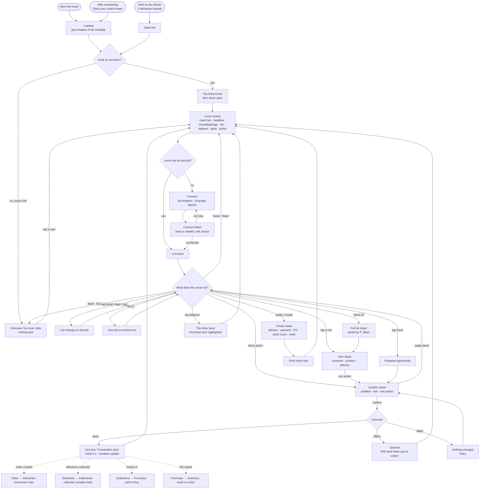
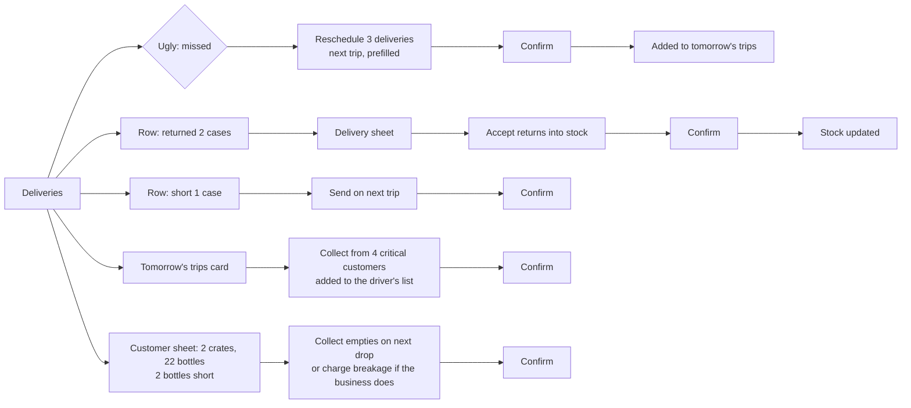
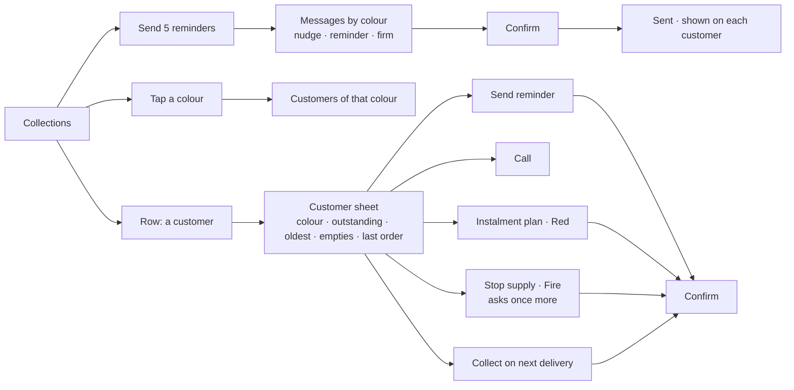
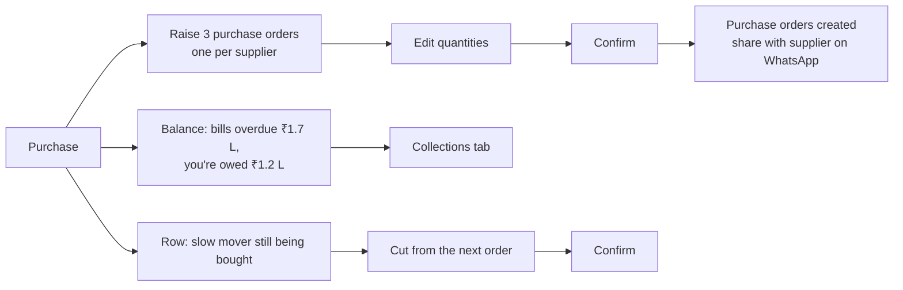
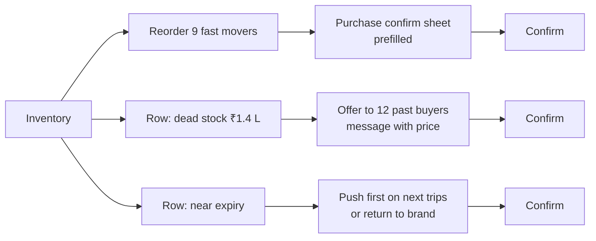
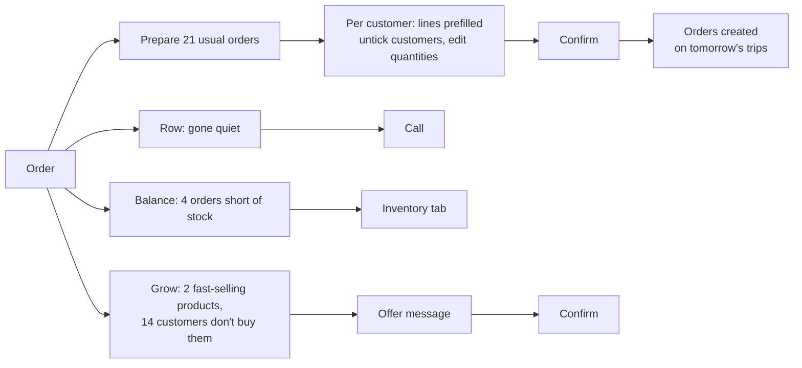
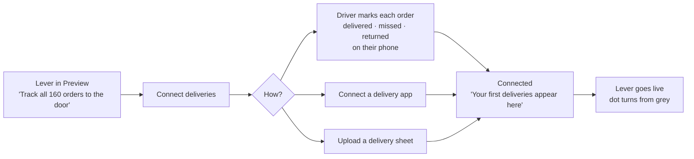

# Control Tower — end-to-end UX flow

22 Sep 2026 · mobile first · the journeys through the tower, start to finish.
The what is in `CONTROL_TOWER_LEVERS.md`; the look is in
`CONTROL_TOWER_DESIGN.md`. This document is how the owner moves.

---

## 1. Master flow

**How to read it:** every visit enters through a tab, every tab is the same
template, and every change goes through one confirm sheet. The dotted lines
are the business loop. An action on one lever shows up on the next one, which
is the balance the tower exists to show.

## 2. Principles of the flow

1. **Two taps to act.** From any lever screen: the sticky action, then
   confirm. Never more than three taps to any action.
2. **Never lose your place.** All detail opens as a sheet over the tab. Back
   (swipe down, or the phone's back) returns to exactly where you were.
3. **One door to change anything.** Every action, from anywhere, goes through
   the confirm sheet. FoodBridge prepares; only the owner confirms.
4. **Every outcome is stated and felt.** A one-line result, the numbers move,
   and the next lever picks it up.
5. **Nothing is lost offline.** The last screen stays; actions queue.

## 3. Entry

| Entry | Lands on |
| --- | --- |
| Open the tower (app or sidebar) | The Overview, the five lever cards, every time |
| Alert on the phone (*"3 deliveries missed"*, *"₹36,000 to collect on tomorrow's trips"*) | That lever, with the item sheet open |
| End of onboarding (*"Open your control tower"*) | Deliveries (Preview if not connected) |

**Alerts** are sent only for Ugly items that need the owner today. At most
one morning digest (*"Yesterday: 3 missed, ₹48,200 collected, 112 empties
back"*) and one at a time for new Ugly items. No alert for Good or Bad.

## 4. Arrive and choose a lever

1. **Loading:** the template's grey shapes (headline, three tiles, five
   rows). No spinner.
2. **The five lever cards appear**, each with its word and colour. The owner
   scans them: Urgent first.
3. **Tap a card** to open that lever, under a bar: ‹ back · name · status.
   **Back** (or Esc, or **Tower** in the footer) returns to the five cards,
   where the owner left them. No tabs, no swiping between levers
   (22 Sep 2026).
4. Data updates on its own; nothing to pull.

## 4a. The footer

The platform's bar: **Tower · Assistant · EXIT DEMO** everywhere, **Timeline**
on the Overview, and on the Deliveries lever the four work screens as well,
which makes the bar scroll sideways. (Create is off for now; what it does is
kept below.)

- **Tower:** closes any sheet and returns to the five lever cards.
- **Assistant:** opens the WhatsApp-style chat over the page (design §4.12).
- **Timeline:** on the **Overview** only, and while it is open — the
  business's news, newest first; tap a line to open its lever where it is
  dealt with (design §4.11). Inside a lever the bar is that lever's.
- **Tracking · Delivery · Planning · Assets:** on the **Deliveries** lever
  only, between Tower and Assistant (which keeps its place beside EXIT DEMO) — the four Distribution & Logistics screens as plain
  footer actions (design §4.13). Seven actions do not fit a phone, so the bar
  scrolls sideways.

  1. Tap one → the platform opens that screen, as the sidebar would.
  2. That screen wears **the same bar**: its own actions first, then Tower
     back to the lever and the other three screens, then Assistant and EXIT
     DEMO. Same look on every screen of the trip — nothing tells the owner
     they have landed somewhere else. The owner toggles between them as long as they like.
  3. Opened from the sidebar instead, a screen is untouched.

- **Tower:** closes any sheet and returns to the top of the current lever.
- **Create:** opens the Create sheet, one quick action per lever in tab order:
  1. **Record a delivery:** pick the customer or trip → delivered · missed
     (reason) · returned (what) → money collected → empties back → done.
     Shows on Deliveries at once; this is how Deliveries fills without an
     integration.
  2. **Receive payment:** pick the customer → amount → cash, UPI or cheque →
     done. Collections updates; the customer's colour is recalculated.
  3. **New purchase order:** pick the supplier → products (prefilled with
     what is short) → confirm.
  4. **Stock count:** pick products → counted quantity → done. Inventory
     updates.
  5. **New order:** pick the customer → their usual order prefilled → confirm.
- **EXIT DEMO:** the platform's exit.

## 5. Read a lever

1. **Headline:** the one number, with its context.
2. **Good / Bad / Ugly:** Ugly is selected when it has anything. Tap another
   tile to change the list under it. A tile at 0 can't be selected.
3. **The list:** five rows, largest ₹ first. *Show all* opens the full list as
   a sheet (Collections adds the colour filter there).
4. **ⓘ** beside the headline: one or two sentences on how the number is
   worked out.
5. **Balance card** (only when out of line): tap to go to the other lever,
   with the linked item highlighted for 2 seconds.
6. **Grow card:** tap to open its prepared action.

## 6. Act

The same five steps for every action, from every door (sticky action, a row's
item sheet, the Grow card, a balance):

1. **Confirm sheet rises.** Its title states the outcome: *"Remind 5
   customers."*
2. **Everything is prefilled and ticked.** The owner can untick a line, change
   a quantity or date, or edit a message.
3. **One button with the live count:** *"Send 4 reminders"* after one untick.
   Anything that can't be undone, or that stops supply to a customer, asks
   once more in the same sheet.
4. **Outcome:**
   - **Done:** the sheet closes; one line at the bottom (*"4 reminders
     sent"*), with **Undo** for 5 seconds where undo is possible; the tiles
     and list update.
   - **Offline:** queued; *"Will send when you're online."* A small pending
     mark on the lever until it goes.
   - **Failed:** the sheet stays; *"Nothing was sent. Retry."*
5. **The next lever picks it up** (section 10).

## 7. The five levers: their flows

### 7.1 Deliveries

- **Reschedule:** the missed deliveries, each with its reason, go to the next
  trip by default; the owner can pick another day.
- **Returns:** accepted into stock (or marked damaged), which updates
  Inventory.
- **Short:** the short products go on the next trip for that customer.
- **Tomorrow's trips:** collections and empties from critical customers are
  added to the driver's list for those stops.
- **Empties:** a kit shortfall becomes "collect on next drop"; a breakage
  charge is offered only when the business charges for breakage.

### 7.2 Collections

- **Reminders** adapt to the colour: a nudge for Yellow, a reminder for Orange,
  a firm reminder for Red. Fire gets no automated message; the owner calls.
- **Call** opens the phone dialler; nothing to confirm.
- **Stop supply** (Fire) holds new orders for that customer and asks once more
  before it applies.
- **Collect on next delivery** adds the amount to that customer's next stop in
  Deliveries.

### 7.3 Purchase

- **Raise purchase orders:** grouped by supplier; quantities cover demand plus
  safety, less stock and what is already on order.
- **Share** sends the purchase order to the supplier after it is created (a
  separate, explicit tap).
- **Cut** removes a slow mover from the next purchase order.

### 7.4 Inventory

- **Reorder** hands the list to Purchase's confirm sheet, so there is one way
  to buy.
- **Offer dead stock** sends one message to the customers who bought it
  before.
- **Near expiry** is pushed first on the next trips (Deliveries upsell), or
  marked for return to the brand.

### 7.5 Order

- **Usual orders** come from each customer's own history; a customer too
  quiet to predict gets a call, not a guessed order.
- **Orders created** are booked on the next trips, so they appear in
  Deliveries' tomorrow's trips.
- **Overdue customer:** preparing an order for a Red or Fire customer shows
  the outstanding in the confirm sheet, with *collect with this order* ticked.

## 8. Preview and connect

- The Preview shows the whole lever with *Example* figures, sized in the
  owner's own numbers where they exist.
- **Connect** names exactly what is needed, and offers each lever's own
  sources (Collections: Zoho Books, Xero or invoice upload; Inventory: stock
  count; Deliveries: driver's phone, a delivery app or a sheet).
- Until the first real record arrives, the lever stays in Preview with
  *"Waiting for your first delivery."*

## 9. States along the way

| Moment | What happens |
| --- | --- |
| First load | Grey shapes, then the content; no spinner |
| Records older than today | "As of 24 Aug" under the tabs |
| Offline | Last screen stays with "As of 9:40 am"; actions queue |
| One lever fails to load | That tab: *"Couldn't load Collections. Retry."*; the rest work |
| Nothing to do | Good selected, headline in plain words ("All 45 delivered"), no action button |
| Something new while the owner is on the screen | Nothing jumps. A small *"New: 1 missed delivery"* bar at the top; tap to update |

## 10. The business loop

What one action does to the next lever, so the owner sees the business move:

| Action | Shows up in |
| --- | --- |
| Usual orders created (Order) | Deliveries: tomorrow's trips |
| Delivered, money and empties collected (Deliveries) | Collections: collected; Deliveries: empties back |
| Returns accepted (Deliveries) | Inventory: stock |
| Reminders sent, money in (Collections) | Collections: Good; Purchase: the cash balance eases |
| Purchase orders raised (Purchase) | Inventory: on order; the reorder leaves Bad |
| Dead stock offered, then ordered (Inventory) | Order; Inventory: dead stock falls |

## 11. Exit

The owner leaves from the platform's own navigation. Any queued action keeps
its pending mark and goes when the network returns; nothing in a confirm sheet
is lost if the owner leaves mid-edit (it reopens as they left it, the same
day).
