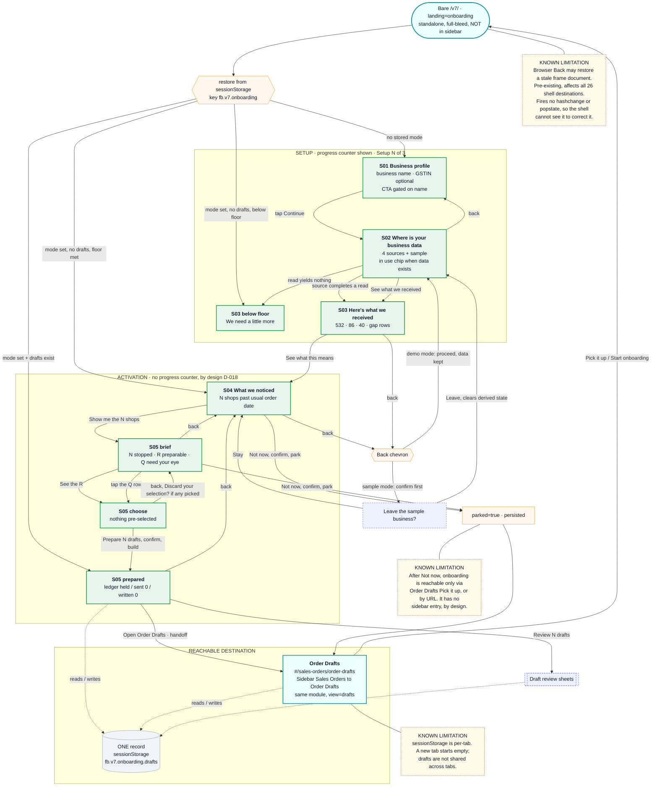
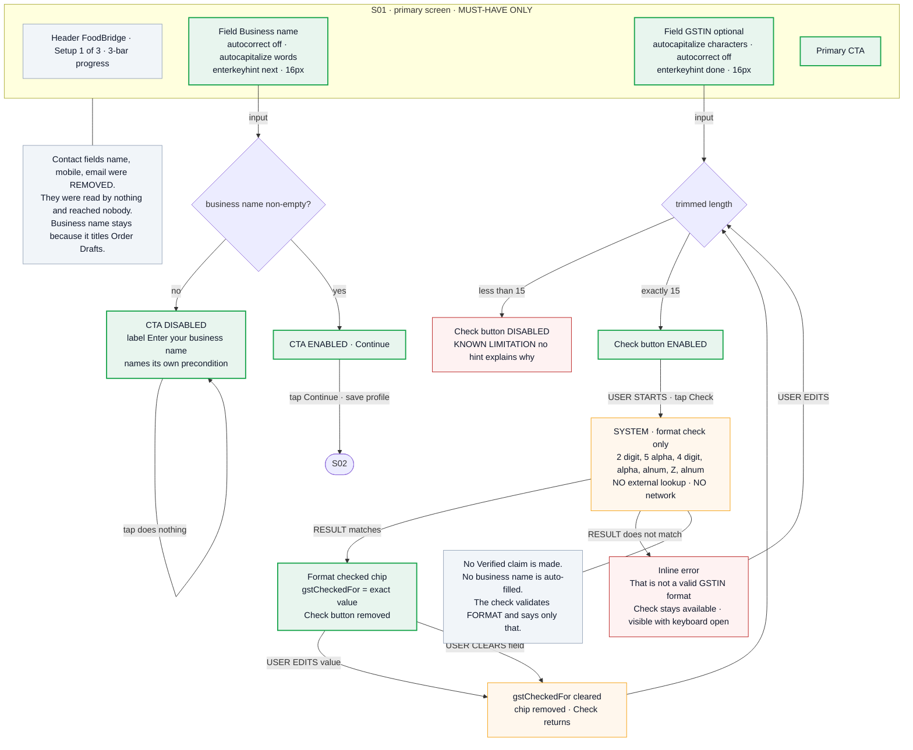
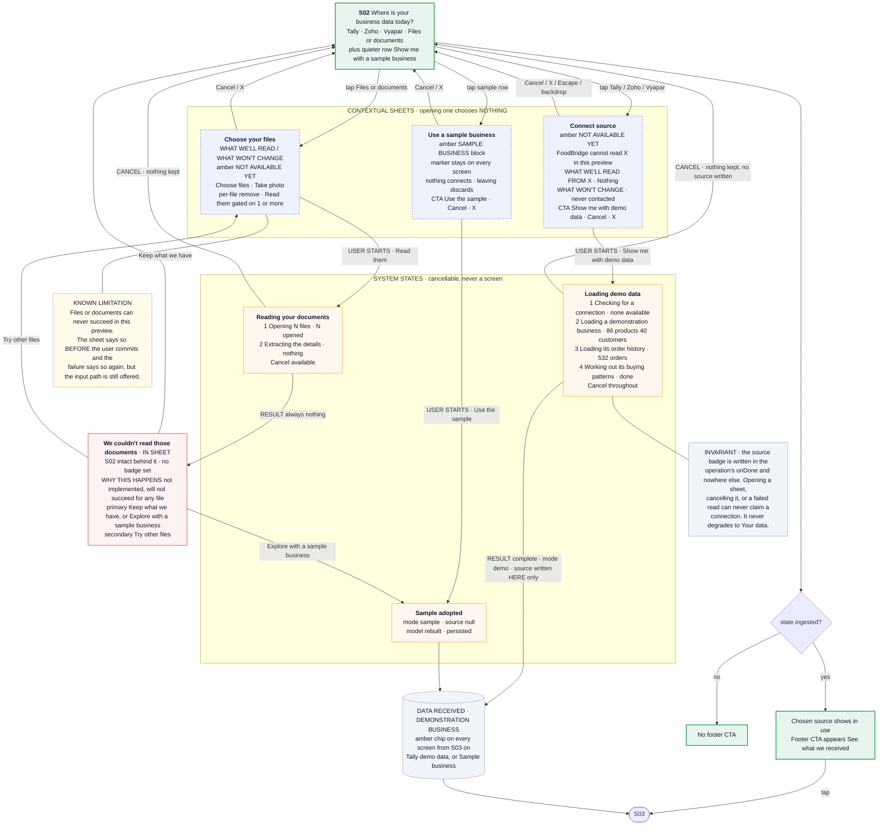
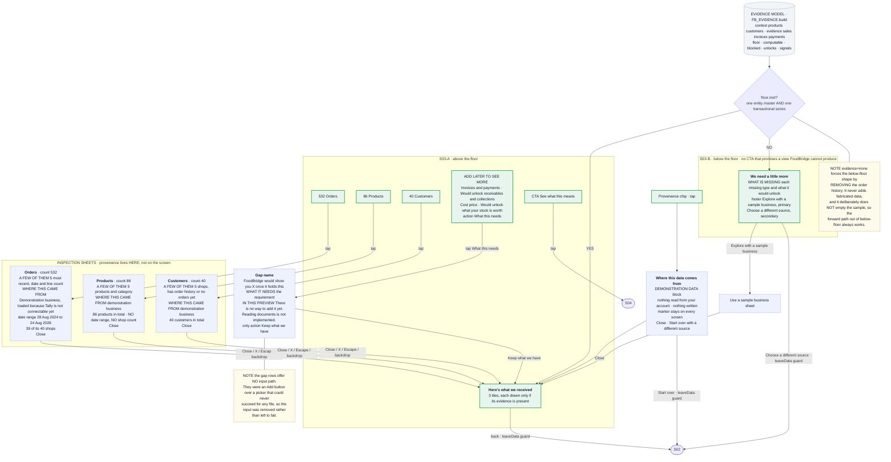
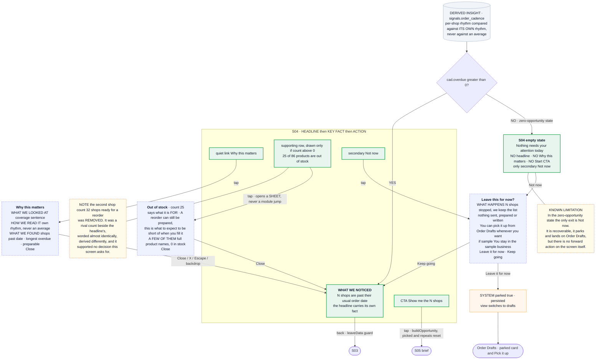
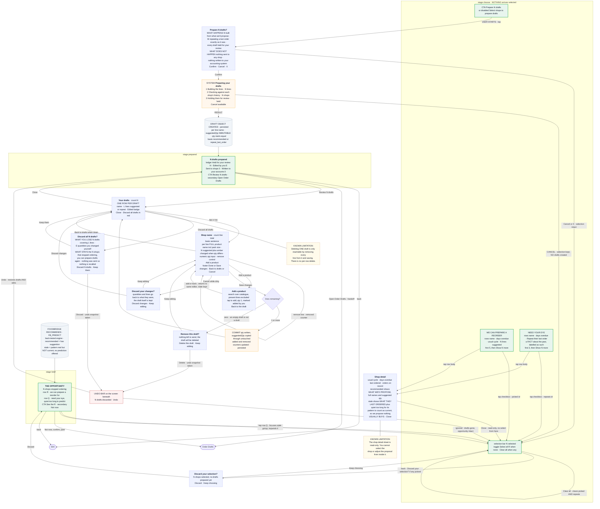
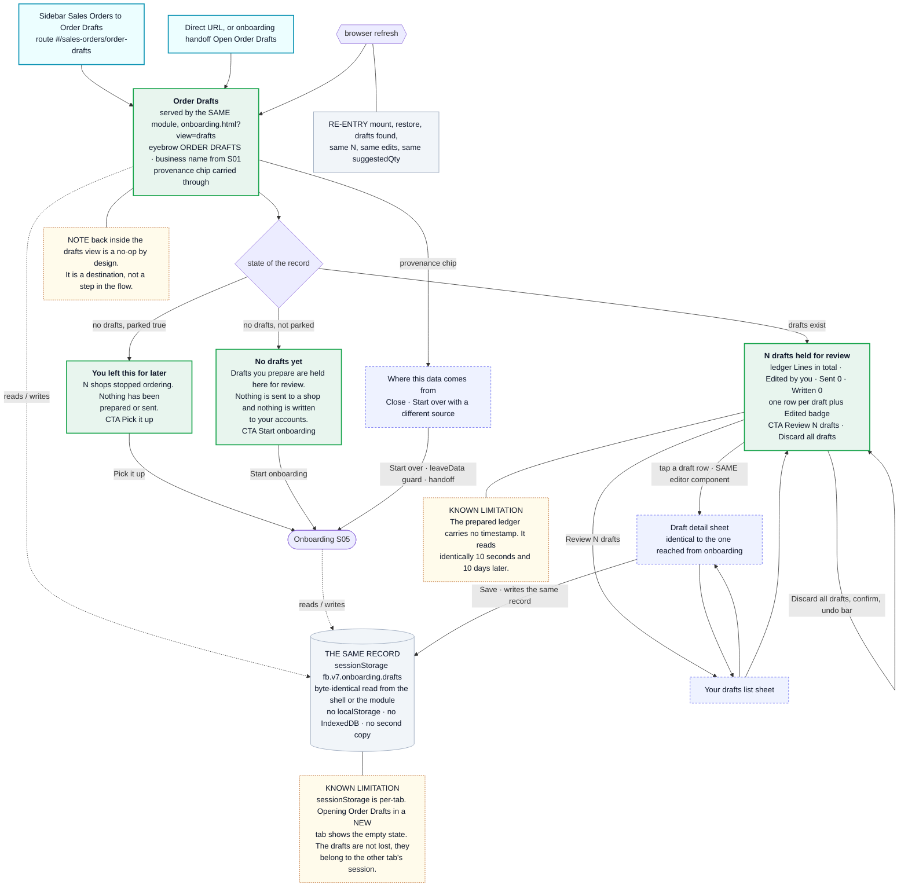
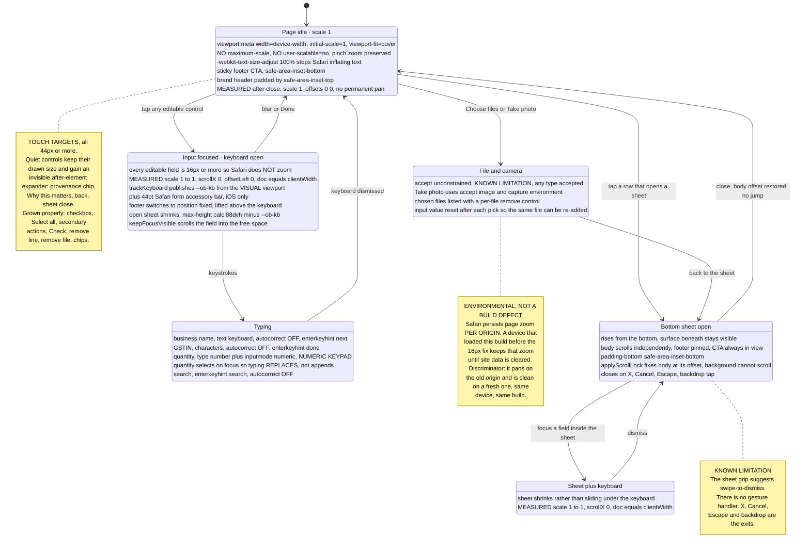
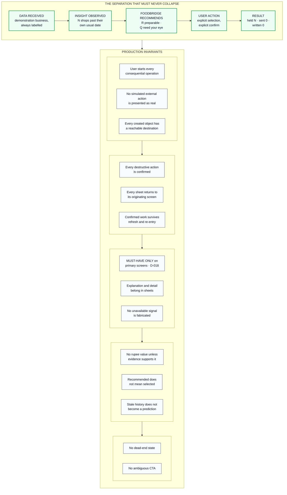

# v7 onboarding — end-to-end UX/UI flow

**Documentation artifact.** Drawn from the implementation as it stands, not from an
intended future flow. Reconciled against `modules/foodbridge-onboarding/screens/onboarding.js`
— the nineteen sheet titles, the `goBack` ladder, `restore()`'s three landing rules,
`leaveData`'s sample-only guard and `supportingSignals`' single remaining row.

Generated 16 September 2026. Regenerate the images with:

```bash
npx @mermaid-js/mermaid-cli -i <source>.mmd -o diagrams/<name>.svg -b white
```

Each section below carries the Mermaid source **and** the rendered diagram, so it reads
the same on GitHub, in an editor that renders Mermaid, and in one that does not.

## How to read these

| Shape / colour | Means |
| --- | --- |
| green, solid border | **primary screen** — carries state, decision and action only |
| indigo, dashed border | **contextual sheet** — opens from a decision in progress, returns where it came from |
| amber | **system state** — started by the user, cancellable, never a screen they chose |
| grey cylinder / slab | **data and provenance** |
| red | **failure state** |
| cyan | **external destination or handoff** |
| amber dashed | **`KNOWN LIMITATION`** — real behaviour, not yet complete |

Counts are written as **N**, **R**, **Q** because they are computed live from the date
the engine runs against. On 16 September 2026 they read 23/16/7; a day later, 24/17/7.

---

## 1 · Main end-to-end journey

Entry, restore, the five screens, the destination, and where the record lives. Everything else in this document is a zoom into one box of this one.

<details>
<summary><b>Mermaid source</b> — click to expand</summary>


```mermaid
flowchart TD
  classDef screen fill:#e8f5ee,stroke:#16a34a,stroke-width:2px,color:#0f172a
  classDef sheet fill:#eef2ff,stroke:#6366f1,stroke-dasharray:4 3,color:#0f172a
  classDef system fill:#fff7ed,stroke:#f59e0b,color:#0f172a
  classDef data fill:#f1f5f9,stroke:#94a3b8,color:#0f172a
  classDef ext fill:#ecfeff,stroke:#0891b2,stroke-width:2px,color:#0f172a
  classDef limit fill:#fffbeb,stroke:#b45309,stroke-dasharray:2 2,color:#0f172a

  ENTRY(["Bare /v7/ · landing=onboarding<br/>standalone, full-bleed, NOT in sidebar"]):::ext
  ENTRY --> RESTORE{{"restore from sessionStorage<br/>key fb.v7.onboarding"}}:::system

  RESTORE -->|"no stored mode"| S01
  RESTORE -->|"mode set + drafts exist"| S05P
  RESTORE -->|"mode set, no drafts, floor met"| S04
  RESTORE -->|"mode set, no drafts, below floor"| S03B

  subgraph SETUP["SETUP · progress counter shown · Setup N of 3"]
    S01["<b>S01 Business profile</b><br/>business name · GSTIN optional<br/>CTA gated on name"]:::screen
    S02["<b>S02 Where is your business data</b><br/>4 sources + sample<br/>in use chip when data exists"]:::screen
    S03A["<b>S03 Here's what we received</b><br/>532 · 86 · 40 · gap rows"]:::screen
    S03B["<b>S03 below floor</b><br/>We need a little more"]:::screen
  end

  subgraph ACTIVATION["ACTIVATION · no progress counter, by design D-018"]
    S04["<b>S04 What we noticed</b><br/>N shops past usual order date"]:::screen
    S05B["<b>S05 brief</b><br/>N stopped · R preparable · Q need your eye"]:::screen
    S05C["<b>S05 choose</b><br/>nothing pre-selected"]:::screen
    S05P["<b>S05 prepared</b><br/>ledger held / sent 0 / written 0"]:::screen
  end

  S01 -->|"tap Continue"| S02
  S02 -->|"source completes a read"| S03A
  S02 -->|"read yields nothing"| S03B
  S02 -->|"See what we received"| S03A
  S03A -->|"See what this means"| S04
  S04 -->|"Show me the N shops"| S05B
  S05B -->|"See the R"| S05C
  S05B -->|"tap the Q row"| S05C
  S05C -->|"Prepare N drafts, confirm, build"| S05P

  S05P -->|"Review N drafts"| DRAFTS[["Draft review sheets"]]:::sheet
  S05P -->|"Open Order Drafts · handoff"| OD

  subgraph DEST["REACHABLE DESTINATION"]
    OD["<b>Order Drafts</b><br/>#/sales-orders/order-drafts<br/>Sidebar Sales Orders to Order Drafts<br/>same module, view=drafts"]:::ext
    STORE[("ONE record<br/>sessionStorage<br/>fb.v7.onboarding.drafts")]:::data
  end

  S05P -.->|"reads / writes"| STORE
  OD -.->|"reads / writes"| STORE
  DRAFTS -.->|"reads / writes"| STORE
  OD -->|"Pick it up / Start onboarding"| ENTRY

  S04 -->|"Not now, confirm, park"| PARK["parked=true · persisted"]:::system
  S05B -->|"Not now, confirm, park"| PARK
  PARK --> OD

  BACK{{"Back chevron"}}:::system
  S02 -->|"back"| S01
  S03A -->|"back"| BACK
  S04 -->|"back"| BACK
  BACK -->|"demo mode: proceed, data kept"| S02
  BACK -->|"sample mode: confirm first"| LEAVE["Leave the sample business?"]:::sheet
  LEAVE -->|"Leave, clears derived state"| S02
  LEAVE -->|"Stay"| S04
  S05B -->|"back"| S04
  S05C -->|"back, Discard your selection? if any picked"| S05B
  S05P -->|"back"| S04

  L4["KNOWN LIMITATION<br/>Browser Back may restore a stale frame document.<br/>Pre-existing, affects all 26 shell destinations.<br/>Fires no hashchange or popstate, so the shell<br/>cannot see it to correct it."]:::limit
  L5["KNOWN LIMITATION<br/>sessionStorage is per-tab. A new tab starts empty;<br/>drafts are not shared across tabs."]:::limit
  L6["KNOWN LIMITATION<br/>After Not now, onboarding is reachable only via<br/>Order Drafts Pick it up, or by URL. It has no<br/>sidebar entry, by design."]:::limit
  OD --- L5
  ENTRY --- L4
  PARK --- L6
```

</details>



---

## 2 · S01 · Business profile

Two fields, because the other three were read by nothing. The GSTIN check is a FORMAT check and says only that.

<details>
<summary><b>Mermaid source</b> — click to expand</summary>


```mermaid
flowchart TD
  classDef screen fill:#e8f5ee,stroke:#16a34a,stroke-width:2px,color:#0f172a
  classDef sys fill:#fff7ed,stroke:#f59e0b,color:#0f172a
  classDef fail fill:#fef2f2,stroke:#b91c1c,color:#0f172a
  classDef note fill:#f1f5f9,stroke:#94a3b8,color:#0f172a

  subgraph SCREEN["S01 · primary screen · MUST-HAVE ONLY"]
    H["Header FoodBridge · Setup 1 of 3 · 3-bar progress"]:::note
    F1["Field Business name<br/>autocorrect off · autocapitalize words<br/>enterkeyhint next · 16px"]:::screen
    F2["Field GSTIN optional<br/>autocapitalize characters · autocorrect off<br/>enterkeyhint done · 16px"]:::screen
    CTA["Primary CTA"]:::screen
  end

  F1 -->|"input"| CTASTATE{"business name non-empty?"}
  CTASTATE -->|"no"| CTA_OFF["CTA DISABLED<br/>label Enter your business name<br/>names its own precondition"]:::screen
  CTASTATE -->|"yes"| CTA_ON["CTA ENABLED · Continue"]:::screen

  F2 -->|"input"| LEN{"trimmed length"}
  LEN -->|"less than 15"| CHK_OFF["Check button DISABLED<br/>KNOWN LIMITATION no hint explains why"]:::fail
  LEN -->|"exactly 15"| CHK_ON["Check button ENABLED"]:::screen

  CHK_ON -->|"USER STARTS · tap Check"| GSTSYS["SYSTEM · format check only<br/>2 digit, 5 alpha, 4 digit, alpha, alnum, Z, alnum<br/>NO external lookup · NO network"]:::sys
  GSTSYS -->|"RESULT matches"| OKCHIP["Format checked chip<br/>gstCheckedFor = exact value<br/>Check button removed"]:::screen
  GSTSYS -->|"RESULT does not match"| ERR["Inline error<br/>That is not a valid GSTIN format<br/>Check stays available · visible with keyboard open"]:::fail

  OKCHIP -->|"USER EDITS value"| INVAL["gstCheckedFor cleared<br/>chip removed · Check returns"]:::sys
  OKCHIP -->|"USER CLEARS field"| INVAL
  INVAL --> LEN
  ERR -->|"USER EDITS"| LEN

  CTA_ON -->|"tap Continue · save profile"| NEXT(["S02"])
  CTA_OFF -->|"tap does nothing"| CTA_OFF

  N1["No Verified claim is made.<br/>No business name is auto-filled.<br/>The check validates FORMAT and says only that."]:::note
  N2["Contact fields name, mobile, email were REMOVED.<br/>They were read by nothing and reached nobody.<br/>Business name stays because it titles Order Drafts."]:::note
  GSTSYS --- N1
  SCREEN --- N2
```

</details>



---

## 3 · S02 · Data source

Four connectors, a file path and a sample. Opening a sheet chooses nothing; the source badge is written in the operation's `onDone` and nowhere else.

<details>
<summary><b>Mermaid source</b> — click to expand</summary>


```mermaid
flowchart TD
  classDef screen fill:#e8f5ee,stroke:#16a34a,stroke-width:2px,color:#0f172a
  classDef sheet fill:#eef2ff,stroke:#6366f1,stroke-dasharray:4 3,color:#0f172a
  classDef sys fill:#fff7ed,stroke:#f59e0b,color:#0f172a
  classDef fail fill:#fef2f2,stroke:#b91c1c,color:#0f172a
  classDef data fill:#f1f5f9,stroke:#94a3b8,color:#0f172a
  classDef limit fill:#fffbeb,stroke:#b45309,stroke-dasharray:2 2,color:#0f172a

  S02["<b>S02</b> Where is your business data today?<br/>Tally · Zoho · Vyapar · Files or documents<br/>plus quieter row Show me with a sample business"]:::screen
  S02 --> INUSE{"state.ingested?"}
  INUSE -->|"yes"| MARK["Chosen source shows in use<br/>Footer CTA appears See what we received"]:::screen
  MARK -->|"tap"| S03(["S03"])
  INUSE -->|"no"| NOFOOT["No footer CTA"]:::screen

  S02 -->|"tap Tally / Zoho / Vyapar"| CONSENT
  S02 -->|"tap Files or documents"| FILES
  S02 -->|"tap sample row"| SAMPLE

  subgraph SHEETS["CONTEXTUAL SHEETS · opening one chooses NOTHING"]
    CONSENT["<b>Connect source</b><br/>amber NOT AVAILABLE YET<br/>FoodBridge cannot read X in this preview<br/>WHAT WE'LL READ FROM X · Nothing<br/>WHAT WON'T CHANGE · never contacted<br/>CTA Show me with demo data · Cancel · X"]:::sheet
    FILES["<b>Choose your files</b><br/>WHAT WE'LL READ / WHAT WON'T CHANGE<br/>amber NOT AVAILABLE YET<br/>Choose files · Take photo<br/>per-file remove · Read them gated on 1 or more"]:::sheet
    SAMPLE["<b>Use a sample business</b><br/>amber SAMPLE BUSINESS block<br/>marker stays on every screen<br/>nothing connects · leaving discards<br/>CTA Use the sample · Cancel · X"]:::sheet
  end

  CONSENT -->|"Cancel / X / Escape / backdrop"| S02
  FILES -->|"Cancel / X"| S02
  SAMPLE -->|"Cancel / X"| S02

  CONSENT -->|"USER STARTS · Show me with demo data"| OPCON
  FILES -->|"USER STARTS · Read them"| OPFILE
  SAMPLE -->|"USER STARTS · Use the sample"| USESAMPLE

  subgraph SYS["SYSTEM STATES · cancellable, never a screen"]
    OPCON["<b>Loading demo data</b><br/>1 Checking for a connection · none available<br/>2 Loading a demonstration business · 86 products 40 customers<br/>3 Loading its order history · 532 orders<br/>4 Working out its buying patterns · done<br/>Cancel throughout"]:::sys
    OPFILE["<b>Reading your documents</b><br/>1 Opening N files · N opened<br/>2 Extracting the details · nothing<br/>Cancel available"]:::sys
    USESAMPLE["<b>Sample adopted</b><br/>mode sample · source null<br/>model rebuilt · persisted"]:::sys
  end

  OPCON -->|"CANCEL · nothing kept, no source written"| S02
  OPFILE -->|"CANCEL · nothing kept"| S02

  OPCON -->|"RESULT complete · mode demo · source written HERE only"| PROV
  USESAMPLE --> PROV
  OPFILE -->|"RESULT always nothing"| DOCFAIL

  PROV[("DATA RECEIVED · DEMONSTRATION BUSINESS<br/>amber chip on every screen from S03 on<br/>Tally demo data, or Sample business")]:::data
  PROV --> S03

  DOCFAIL["<b>We couldn't read those documents</b> · IN SHEET<br/>S02 intact behind it · no badge set<br/>WHY THIS HAPPENS not implemented, will not succeed for any file<br/>primary Keep what we have, or Explore with a sample business<br/>secondary Try other files"]:::fail
  DOCFAIL -->|"Keep what we have"| S02
  DOCFAIL -->|"Explore with a sample business"| USESAMPLE
  DOCFAIL -->|"Try other files"| FILES

  L1["KNOWN LIMITATION<br/>Files or documents can never succeed in this preview.<br/>The sheet says so BEFORE the user commits and the<br/>failure says so again, but the input path is still offered."]:::limit
  FILES --- L1

  INV["INVARIANT · the source badge is written in the<br/>operation's onDone and nowhere else. Opening a sheet,<br/>cancelling it, or a failed read can never claim a<br/>connection. It never degrades to Your data."]:::data
  OPCON --- INV
```

</details>



---

## 4 · S03 · What we received, and inspection

Two shapes decided by the evidence floor. Provenance lives in the inspect sheets, beside the rows it describes, and is per record type.

<details>
<summary><b>Mermaid source</b> — click to expand</summary>


```mermaid
flowchart TD
  classDef screen fill:#e8f5ee,stroke:#16a34a,stroke-width:2px,color:#0f172a
  classDef sheet fill:#eef2ff,stroke:#6366f1,stroke-dasharray:4 3,color:#0f172a
  classDef data fill:#f1f5f9,stroke:#94a3b8,color:#0f172a
  classDef limit fill:#fffbeb,stroke:#b45309,stroke-dasharray:2 2,color:#0f172a

  MODEL[("EVIDENCE MODEL · FB_EVIDENCE.build<br/>context products customers · evidence sales invoices payments<br/>floor · computable · blocked · unlocks · signals")]:::data
  MODEL --> FLOOR{"floor.met?<br/>one entity master AND one transactional series"}

  FLOOR -->|"YES"| S03A
  FLOOR -->|"NO"| S03B

  subgraph ABOVE["S03-A · above the floor"]
    S03A["<b>Here's what we received</b><br/>3 tiles, each drawn only if its evidence is present"]:::screen
    T1["532 Orders"]:::screen
    T2["86 Products"]:::screen
    T3["40 Customers"]:::screen
    GAPS["ADD LATER TO SEE MORE<br/>Invoices and payments · Would unlock receivables and collections<br/>Cost price · Would unlock what your stock is worth<br/>action What this needs"]:::screen
    CTA3["CTA See what this means"]:::screen
  end

  T1 -->|"tap"| INS1
  T2 -->|"tap"| INS2
  T3 -->|"tap"| INS3

  subgraph INSPECT["INSPECTION SHEETS · provenance lives HERE, not on the screen"]
    INS1["<b>Orders</b> · count 532<br/>A FEW OF THEM 5 most recent, date and line count<br/>WHERE THIS CAME FROM<br/>Demonstration business, loaded because Tally is not connectable yet<br/>date range 28 Aug 2024 to 24 Aug 2026<br/>39 of its 40 shops<br/>Close"]:::sheet
    INS2["<b>Products</b> · count 86<br/>A FEW OF THEM 5 products and category<br/>WHERE THIS CAME FROM demonstration business<br/>86 products in total · NO date range, NO shop count<br/>Close"]:::sheet
    INS3["<b>Customers</b> · count 40<br/>A FEW OF THEM 5 shops, has order history or no orders yet<br/>WHERE THIS CAME FROM demonstration business<br/>40 customers in total<br/>Close"]:::sheet
  end

  INS1 -->|"Close / X / Escape / backdrop"| S03A
  INS2 -->|"Close / X / Escape / backdrop"| S03A
  INS3 -->|"Close / X / Escape / backdrop"| S03A

  GAPS -->|"tap What this needs"| GAPSHEET
  GAPSHEET["<b>Gap name</b><br/>FoodBridge would show you X once it holds this<br/>WHAT IT NEEDS the requirement<br/>IN THIS PREVIEW There is no way to add it yet.<br/>Reading documents is not implemented.<br/>only action Keep what we have"]:::sheet
  GAPSHEET -->|"Keep what we have"| S03A

  CHIP["Provenance chip · tap"]:::screen
  CHIP --> PROVSHEET["<b>Where this data comes from</b><br/>DEMONSTRATION DATA block<br/>nothing read from your account · nothing written<br/>marker stays on every screen<br/>Close · Start over with a different source"]:::sheet
  PROVSHEET -->|"Close"| S03A
  PROVSHEET -->|"Start over · leaveData guard"| S02(["S02"])

  CTA3 -->|"tap"| S04(["S04"])
  S03A -->|"back · leaveData guard"| S02

  subgraph BELOW["S03-B · below the floor · no CTA that promises a view FoodBridge cannot produce"]
    S03B["<b>We need a little more</b><br/>WHAT IS MISSING each missing type and what it would unlock<br/>footer Explore with a sample business, primary<br/>Choose a different source, secondary"]:::screen
  end
  S03B -->|"Explore with a sample business"| SAMPSHEET["Use a sample business sheet"]:::sheet
  SAMPSHEET --> S03A
  S03B -->|"Choose a different source · leaveData guard"| S02

  L2["NOTE the gap rows offer NO input path.<br/>They were an Add button over a picker that could never<br/>succeed for any file, so the input was removed rather<br/>than left to fail."]:::limit
  GAPSHEET --- L2

  L3["NOTE evidence=none forces the below-floor shape by<br/>REMOVING the order history. It never adds fabricated data,<br/>and it deliberately does NOT empty the sample, so the<br/>forward path out of below-floor always works."]:::limit
  FLOOR --- L3
```

</details>



---

## 5 · S04 · Business pulse

One dominant insight that carries its own fact, one supporting row, one action. Both the zero-opportunity state and the park path are shown.

<details>
<summary><b>Mermaid source</b> — click to expand</summary>


```mermaid
flowchart TD
  classDef screen fill:#e8f5ee,stroke:#16a34a,stroke-width:2px,color:#0f172a
  classDef sheet fill:#eef2ff,stroke:#6366f1,stroke-dasharray:4 3,color:#0f172a
  classDef data fill:#f1f5f9,stroke:#94a3b8,color:#0f172a
  classDef sys fill:#fff7ed,stroke:#f59e0b,color:#0f172a
  classDef limit fill:#fffbeb,stroke:#b45309,stroke-dasharray:2 2,color:#0f172a

  SIG[("DERIVED INSIGHT · signals.order_cadence<br/>per-shop rhythm compared against ITS OWN rhythm,<br/>never against an average")]:::data
  SIG --> OVER{"cad.overdue greater than 0?"}

  OVER -->|"NO · zero-opportunity state"| S04Z["<b>S04 empty state</b><br/>Nothing needs your attention today<br/>NO headline · NO Why this matters · NO Start CTA<br/>only secondary Not now"]:::screen
  OVER -->|"YES"| S04

  subgraph SCREEN["S04 · HEADLINE then KEY FACT then ACTION"]
    S04["<b>WHAT WE NOTICED</b><br/>N shops are past their usual order date<br/>the headline carries its own fact"]:::screen
    WHY["quiet link Why this matters"]:::screen
    SUPP["supporting row, drawn only if count above 0<br/>25 of 86 products are out of stock"]:::screen
    CTA4["CTA Show me the N shops"]:::screen
    SKIP["secondary Not now"]:::screen
  end

  WHY -->|"tap"| WHYSHEET
  WHYSHEET["<b>Why this matters</b><br/>WHAT WE LOOKED AT coverage sentence<br/>HOW WE READ IT own rhythm, never an average<br/>WHAT WE FOUND shops past date · longest overdue · preparable<br/>Close"]:::sheet
  WHYSHEET -->|"Close / X / Escape / backdrop"| S04

  SUPP -->|"tap · opens a SHEET, never a module jump"| STOCK
  STOCK["<b>Out of stock</b> · count 25<br/>says what it is FOR · A reorder can still be prepared,<br/>this is what to expect to be short of when you fill it<br/>A FEW OF THEM full product names, 0 in stock<br/>Close"]:::sheet
  STOCK -->|"Close"| S04

  CTA4 -->|"tap · buildOpportunity, picked and repeats reset"| S05(["S05 brief"])

  SKIP -->|"tap"| PARKSHEET
  S04Z -->|"Not now"| PARKSHEET
  PARKSHEET["<b>Leave this for now?</b><br/>WHAT HAPPENS N shops stopped, we keep the list<br/>nothing sent, prepared or written<br/>You can pick it up from Order Drafts whenever you want<br/>if sample You stay in the sample business<br/>Leave it for now · Keep going"]:::sheet
  PARKSHEET -->|"Keep going"| S04
  PARKSHEET -->|"Leave it for now"| PARKSYS["SYSTEM parked true · persisted<br/>view switches to drafts"]:::sys
  PARKSYS --> OD(["Order Drafts · parked card and Pick it up"])

  S04 -->|"back · leaveData guard"| S03(["S03"])

  L1["NOTE the second shop count 32 shops ready for a reorder<br/>was REMOVED. It was a rival count beside the headline's,<br/>worded almost identically, derived differently, and it<br/>supported no decision this screen asks for."]:::limit
  SUPP --- L1

  L2["KNOWN LIMITATION<br/>In the zero-opportunity state the only exit is Not now.<br/>It is recoverable, it parks and lands on Order Drafts,<br/>but there is no forward action on the screen itself."]:::limit
  S04Z --- L2
```

</details>



---

## 6 · S05 · Opportunity, selection, drafts

Brief, choose, prepared — then the draft review hierarchy: list, editor, add/remove, save, discard, undo.

<details>
<summary><b>Mermaid source</b> — click to expand</summary>


```mermaid
flowchart TD
  classDef screen fill:#e8f5ee,stroke:#16a34a,stroke-width:2px,color:#0f172a
  classDef sheet fill:#eef2ff,stroke:#6366f1,stroke-dasharray:4 3,color:#0f172a
  classDef sys fill:#fff7ed,stroke:#f59e0b,color:#0f172a
  classDef data fill:#f1f5f9,stroke:#94a3b8,color:#0f172a
  classDef fail fill:#fef2f2,stroke:#b91c1c,color:#0f172a
  classDef limit fill:#fffbeb,stroke:#b45309,stroke-dasharray:2 2,color:#0f172a

  OPP[("FOODBRIDGE RECOMMENDS · FB_PREDICT<br/>back-tested engine · recommended = has suggestion<br/>stale = pattern real but NOT current, no prediction offered")]:::data

  OPP --> BRIEF
  subgraph B["stage brief"]
    BRIEF["<b>THE OPPORTUNITY</b><br/>N shops stopped ordering<br/>row R · we can prepare a reorder for<br/>row Q · need your eye, quiet too long to predict<br/>CTA See the R · secondary Not now"]:::screen
  end
  BRIEF -->|"tap row R or CTA"| CHOOSE
  BRIEF -->|"tap row Q · focuses stale group, expands it"| CHOOSE
  BRIEF -->|"Not now, confirm, park"| OD(["Order Drafts"])
  BRIEF -->|"back"| S04(["S04"])

  subgraph C["stage choose · NOTHING arrives selected"]
    CHOOSE["selection bar N selected<br/>toggle Select all R when none · Clear all when any"]:::screen
    REC["WE CAN PREPARE A REORDER<br/>rows name · days overdue · usual cycle · N lines suggested<br/>first 5, then Show N more"]:::screen
    STALE["NEED YOUR EYE<br/>rows name · days overdue · Repeat their last order<br/>a FACT about the past, labelled as such<br/>first 3, then Show N more"]:::screen
    FOOT5["CTA Prepare N drafts<br/>or disabled Select shops to prepare drafts"]:::screen
  end

  REC -->|"tap checkbox · picked id"| CHOOSE
  STALE -->|"tap checkbox · repeats id"| CHOOSE
  CHOOSE -->|"Select all R · recommended group only"| CHOOSE
  CHOOSE -->|"Clear all · clears picked AND repeats"| CHOOSE
  REC -->|"tap row body"| SHOPD
  STALE -->|"tap row body"| SHOPD

  SHOPD["<b>Shop detail</b><br/>usual cycle · days overdue · last ordered · orders on record<br/>recommended shows WHAT WE'D PROPOSE, full names and suggested qty<br/>stale shows WHAT THEY LAST ORDERED plus quiet too long for its<br/>pattern to count as current, so we propose nothing<br/>USUALLY BUYS · Close"]:::sheet
  SHOPD -->|"Close · read-only, no select from here"| CHOOSE

  CHOOSE -->|"back · Discard your selection? if any picked"| DISCSEL["<b>Discard your selection?</b><br/>N shops selected, no drafts prepared yet<br/>Discard · Keep choosing"]:::sheet
  DISCSEL -->|"Keep choosing"| CHOOSE
  DISCSEL -->|"Discard"| BRIEF

  FOOT5 -->|"USER STARTS · tap"| CONF
  CONF["<b>Prepare N drafts?</b><br/>WHAT HAPPENS N built from what we'd propose ·<br/>M repeating a last order exactly as it was ·<br/>every draft held for your review<br/>WHAT DOES NOT HAPPEN nothing sent to any shop ·<br/>nothing written to your accounting system<br/>Confirm · Cancel · X"]:::sheet
  CONF -->|"Cancel or X · selection intact"| CHOOSE
  CONF -->|"Confirm"| BUILD

  BUILD["SYSTEM <b>Preparing your drafts</b><br/>1 Building the lines · N lines<br/>2 Checking against each shop's history · N shops<br/>3 Holding them for review · held<br/>Cancel available"]:::sys
  BUILD -->|"CANCEL · selection kept, NO drafts created"| CHOOSE
  BUILD -->|"RESULT"| MADE

  MADE[("DRAFT OBJECT CREATED · persisted<br/>per line name · suggestedQty IMMUTABLE · qty starts equal<br/>basis recommended or repeat_last_order")]:::data
  MADE --> PREP

  subgraph P["stage prepared"]
    PREP["<b>N drafts prepared</b><br/>ledger Held for your review N · Edited by you E<br/>Sent to shops 0 · Written to your accounts 0<br/>CTA Review N drafts · secondary Open Order Drafts"]:::screen
  end
  PREP -->|"back"| S04
  PREP -->|"Open Order Drafts · handoff"| OD

  PREP -->|"Review N drafts"| LIST
  LIST["<b>Your drafts</b> · count N<br/>ONE ROW PER DRAFT name · L lines suggested or repeat · Edited badge<br/>Close · Discard all drafts in red"]:::sheet
  LIST -->|"Close"| PREP
  LIST -->|"tap a row"| EDITOR

  EDITOR["<b>Shop name</b> · count line total<br/>basis sentence<br/>per line FULL product name incl pack size ·<br/>N suggested plus amber changed when qty differs ·<br/>numeric qty input · remove control<br/>Add a product<br/>footer Done or Save changes · Back to drafts or Cancel"]:::sheet

  EDITOR -->|"edit qty · working copy, dirty"| EDITOR
  EDITOR -->|"remove line · removed counter"| EDITOR
  EDITOR -->|"Add a product"| PICKER
  PICKER["<b>Add a product</b><br/>search over catalogue, present lines excluded<br/>tap to add, qty 1, marked added by you<br/>Back to the draft"]:::sheet
  PICKER -->|"add or back · returns to same editor, state kept"| EDITOR

  EDITOR -->|"Save changes"| SAVE{"lines remaining?"}
  SAVE -->|"1 or more"| COMMIT["COMMIT qty written, suggestedQty copied through untouched<br/>added and removed counters updated · persisted"]:::sys
  COMMIT --> LIST
  SAVE -->|"zero · an empty draft is not a draft"| RMDRAFT["<b>Remove this draft?</b><br/>nothing left to send, the draft will be deleted<br/>Delete this draft · Keep editing"]:::sheet
  RMDRAFT -->|"Keep editing"| EDITOR
  RMDRAFT -->|"Delete · undo snapshot taken"| UNDO

  EDITOR -->|"Cancel while dirty"| DROPEDIT["<b>Discard your changes?</b><br/>quantities and lines go back to what they were,<br/>the draft itself is kept<br/>Discard changes · Keep editing"]:::sheet
  DROPEDIT -->|"Keep editing"| EDITOR
  DROPEDIT -->|"Discard changes"| LIST
  EDITOR -->|"Back to drafts when clean"| LIST

  LIST -->|"Discard all drafts"| DISCALL
  DISCALL["<b>Discard all N drafts?</b><br/>WHAT YOU LOSE N drafts covering L lines ·<br/>E quantities you changed yourself<br/>WHAT STAYS the N shops that stopped ordering,<br/>you can prepare drafts again · nothing was sent so nothing is recalled<br/>Discard N drafts · Keep them"]:::sheet
  DISCALL -->|"Keep them"| LIST
  DISCALL -->|"Discard · undo snapshot taken"| UNDO

  UNDO["UNDO BAR on the screen beneath<br/>N drafts discarded · Undo"]:::fail
  UNDO -->|"Undo · restores drafts AND edits"| PREP
  UNDO -->|"ignored · drafts gone, opportunity intact"| CHOOSE

  L1["KNOWN LIMITATION<br/>Deleting ONE draft is only reachable by removing every<br/>line from it and saving. There is no per-row delete."]:::limit
  LIST --- L1
  L2["KNOWN LIMITATION<br/>The shop detail sheet is read-only. You cannot select the<br/>shop or adjust the proposal from inside it."]:::limit
  SHOPD --- L2
```

</details>



---

## 7 · Order Drafts · the destination

The same module under `?view=drafts`, reading the same record. Three states: drafts held, opportunity parked, nothing yet.

<details>
<summary><b>Mermaid source</b> — click to expand</summary>


```mermaid
flowchart TD
  classDef screen fill:#e8f5ee,stroke:#16a34a,stroke-width:2px,color:#0f172a
  classDef sheet fill:#eef2ff,stroke:#6366f1,stroke-dasharray:4 3,color:#0f172a
  classDef data fill:#f1f5f9,stroke:#94a3b8,color:#0f172a
  classDef ext fill:#ecfeff,stroke:#0891b2,stroke-width:2px,color:#0f172a
  classDef limit fill:#fffbeb,stroke:#b45309,stroke-dasharray:2 2,color:#0f172a

  NAV["Sidebar Sales Orders to Order Drafts<br/>route #/sales-orders/order-drafts"]:::ext
  URL["Direct URL, or onboarding handoff Open Order Drafts"]:::ext
  NAV --> OD
  URL --> OD

  OD["<b>Order Drafts</b><br/>served by the SAME module, onboarding.html?view=drafts<br/>eyebrow ORDER DRAFTS · business name from S01<br/>provenance chip carried through"]:::screen

  STORE[("THE SAME RECORD<br/>sessionStorage fb.v7.onboarding.drafts<br/>byte-identical read from the shell or the module<br/>no localStorage · no IndexedDB · no second copy")]:::data
  OD -.->|"reads / writes"| STORE
  FLOW(["Onboarding S05"]) -.->|"reads / writes"| STORE

  OD --> STATE{"state of the record"}
  STATE -->|"drafts exist"| HAS["<b>N drafts held for review</b><br/>ledger Lines in total · Edited by you · Sent 0 · Written 0<br/>one row per draft plus Edited badge<br/>CTA Review N drafts · Discard all drafts"]:::screen
  STATE -->|"no drafts, parked true"| PARKED["<b>You left this for later</b><br/>N shops stopped ordering. Nothing has been<br/>prepared or sent.<br/>CTA Pick it up"]:::screen
  STATE -->|"no drafts, not parked"| EMPTY["<b>No drafts yet</b><br/>Drafts you prepare are held here for review.<br/>Nothing is sent to a shop and nothing is written<br/>to your accounts.<br/>CTA Start onboarding"]:::screen

  HAS -->|"tap a draft row · SAME editor component"| EDITOR["Draft detail sheet<br/>identical to the one reached from onboarding"]:::sheet
  HAS -->|"Review N drafts"| LIST["Your drafts list sheet"]:::sheet
  LIST --> EDITOR
  EDITOR -->|"Save · writes the same record"| STORE
  EDITOR --> LIST
  LIST --> HAS

  HAS -->|"Discard all drafts, confirm, undo bar"| HAS
  PARKED -->|"Pick it up"| FLOW
  EMPTY -->|"Start onboarding"| FLOW

  OD -->|"provenance chip"| PROV["Where this data comes from<br/>Close · Start over with a different source"]:::sheet
  PROV -->|"Start over · leaveData guard · handoff"| FLOW

  REFRESH{{"browser refresh"}}
  REFRESH --> OD
  RE["RE-ENTRY mount, restore, drafts found,<br/>same N, same edits, same suggestedQty"]:::data
  REFRESH --- RE

  L1["KNOWN LIMITATION<br/>The prepared ledger carries no timestamp. It reads<br/>identically 10 seconds and 10 days later."]:::limit
  HAS --- L1
  L2["KNOWN LIMITATION<br/>sessionStorage is per-tab. Opening Order Drafts in a NEW<br/>tab shows the empty state. The drafts are not lost, they<br/>belong to the other tab's session."]:::limit
  STORE --- L2
  L3["NOTE back inside the drafts view is a no-op by design.<br/>It is a destination, not a step in the flow."]:::limit
  OD --- L3
```

</details>



---

## 8 · Failure and recovery

Every failure path and where it converges. No path terminates without a way on.

<details>
<summary><b>Mermaid source</b> — click to expand</summary>


```mermaid
flowchart TB
  classDef fail fill:#fef2f2,stroke:#b91c1c,color:#0f172a
  classDef rec fill:#e8f5ee,stroke:#16a34a,stroke-width:2px,color:#0f172a
  classDef sheet fill:#eef2ff,stroke:#6366f1,stroke-dasharray:4 3,color:#0f172a
  classDef limit fill:#fffbeb,stroke:#b45309,stroke-dasharray:2 2,color:#0f172a

  subgraph G1["S01 · identity"]
    direction LR
    F1["Invalid GSTIN format"]:::fail
    F2["GSTIN edited or cleared<br/>after a check"]:::fail
    R1["S01 · field editable<br/>error stays visible with<br/>the keyboard open"]:::rec
    F1 -->|"inline error, Check stays"| R1
    F2 -->|"check invalidated, Check returns"| R1
  end

  subgraph G2["S02 · source and documents"]
    direction LR
    F3["Consent cancelled · X ·<br/>Escape · backdrop"]:::fail
    F4["Connection cancelled<br/>mid-run"]:::fail
    F5["File selection cancelled"]:::fail
    R2["S02 unchanged<br/>NO source written · NO badge"]:::rec
    F3 --> R2
    F4 -->|"nothing kept"| R2
    F5 --> R2

    F6["Unsupported or<br/>unreadable file"]:::fail
    F7["File read yields nothing<br/>ALWAYS in this preview"]:::fail
    R3["<b>Failure reported INSIDE the sheet</b><br/>screen beneath intact · no badge claimed<br/>primary Keep what we have, or<br/>Explore with a sample business<br/>secondary Try other files"]:::sheet
    F6 --> R3
    F7 --> R3
    R3 --> R2
    R3 --> R4["Sample adopted, then S03"]:::rec
  end

  subgraph G3["S03 · evidence"]
    direction LR
    F8["Optional evidence unavailable<br/>invoices or cost price"]:::fail
    R5["What this needs sheet<br/>only action Keep what we have"]:::rec
    F8 -->|"no input offered at all"| R5

    F9["Below the evidence floor"]:::fail
    R6["S03-B names what is missing<br/>and what it would unlock<br/>forward Explore with a sample<br/>lateral Choose a different source<br/>NOT a loop, the sample always succeeds"]:::rec
    F9 --> R6
  end

  subgraph G4["S04 and S05 · opportunity and drafts"]
    direction LR
    F10["Zero opportunity<br/>overdue equals 0"]:::fail
    R7["Nothing needs your attention today<br/>exit Not now, park, Order Drafts"]:::rec
    F10 --> R7

    F11["Draft preparation<br/>cancelled mid-run"]:::fail
    R8["S05 choose<br/>selection intact, no drafts created"]:::rec
    F11 --> R8

    F12["Discard all drafts"]:::fail
    F13["Last line removed<br/>from a draft"]:::fail
    R9["undo bar<br/>Undo restores drafts AND edits"]:::rec
    F12 -->|"confirm names drafts, lines, edits lost"| R9
    F13 -->|"Remove this draft? confirm"| R9

    F14["Cancel a dirty draft edit"]:::fail
    R10["drafts list<br/>the draft itself is kept"]:::rec
    F14 -->|"Discard your changes?"| R10
  end

  subgraph G5["session and navigation"]
    direction LR
    F15["Browser refresh, any point"]:::fail
    R11["restore · prepared if drafts exist,<br/>else S04 if floor met, else S03<br/>profile, mode, source, parked survive"]:::rec
    F15 --> R11

    F16["Leave the sample business"]:::fail
    R12["all derived state cleared, then S02"]:::rec
    F16 -->|"confirm lists exactly what is discarded,<br/>including prepared draft count"| R12

    F17["Browser Back"]:::fail
    L1["KNOWN LIMITATION<br/>Back may restore a stale frame document, so the sidebar<br/>and address bar name one destination while the frame<br/>shows another. Fires neither hashchange nor popstate on<br/>the shell window. PRE-EXISTING, affects all 26<br/>destinations. Recovery navigate again, or reload."]:::limit
    F17 --> L1

    F18["Re-entry in a NEW tab"]:::fail
    L2["KNOWN LIMITATION<br/>sessionStorage is per-tab so a new tab starts clean.<br/>Deliberate, unconfirmed work is never resurrected.<br/>Recovery return to the original tab."]:::limit
    F18 --> L2
  end

  G1 --> G2 --> G3 --> G4 --> G5
```

</details>



---

## 9 · Mobile interaction states

Keyboard, focus, scale, sheets, scroll lock, touch targets and the file/camera path, with the measured values from the device runs.

<details>
<summary><b>Mermaid source</b> — click to expand</summary>


```mermaid
stateDiagram-v2
  direction TB

  [*] --> Idle

  state "Page idle · scale 1" as Idle
  Idle : viewport meta width=device-width, initial-scale=1, viewport-fit=cover
  Idle : NO maximum-scale, NO user-scalable=no, pinch zoom preserved
  Idle : -webkit-text-size-adjust 100% stops Safari inflating text
  Idle : sticky footer CTA, safe-area-inset-bottom
  Idle : brand header padded by safe-area-inset-top
  Idle : MEASURED after close, scale 1, offsets 0 0, no permanent pan

  Idle --> InputFocus : tap any editable control
  state "Input focused · keyboard open" as InputFocus
  InputFocus : every editable field is 16px or more so Safari does NOT zoom
  InputFocus : MEASURED scale 1 to 1, scrollX 0, offsetLeft 0, doc equals clientWidth
  InputFocus : trackKeyboard publishes --ob-kb from the VISUAL viewport
  InputFocus : plus 44pt Safari form accessory bar, iOS only
  InputFocus : footer switches to position fixed, lifted above the keyboard
  InputFocus : open sheet shrinks, max-height calc 88dvh minus --ob-kb
  InputFocus : keepFocusVisible scrolls the field into the free space

  InputFocus --> Typing : keystrokes
  state "Typing" as Typing
  Typing : business name, text keyboard, autocorrect OFF, enterkeyhint next
  Typing : GSTIN, characters, autocorrect OFF, enterkeyhint done
  Typing : quantity, type number plus inputmode numeric, NUMERIC KEYPAD
  Typing : quantity selects on focus so typing REPLACES, not appends
  Typing : search, enterkeyhint search, autocorrect OFF

  Typing --> Idle : keyboard dismissed
  InputFocus --> Idle : blur or Done

  Idle --> SheetOpen : tap a row that opens a sheet
  state "Bottom sheet open" as SheetOpen
  SheetOpen : rises from the bottom, surface beneath stays visible
  SheetOpen : body scrolls independently, footer pinned, CTA always in view
  SheetOpen : padding-bottom safe-area-inset-bottom
  SheetOpen : applyScrollLock fixes body at its offset, background cannot scroll
  SheetOpen : closes on X, Cancel, Escape, backdrop tap
  SheetOpen --> Idle : close, body offset restored, no jump

  SheetOpen --> SheetKeyboard : focus a field inside the sheet
  state "Sheet plus keyboard" as SheetKeyboard
  SheetKeyboard : sheet shrinks rather than sliding under the keyboard
  SheetKeyboard : MEASURED scale 1 to 1, scrollX 0, doc equals clientWidth
  SheetKeyboard --> SheetOpen : dismiss

  Idle --> FilePicker : Choose files or Take photo
  state "File and camera" as FilePicker
  FilePicker : accept unconstrained, KNOWN LIMITATION, any type accepted
  FilePicker : Take photo uses accept image and capture environment
  FilePicker : chosen files listed with a per-file remove control
  FilePicker : input value reset after each pick so the same file can be re-added
  FilePicker --> SheetOpen : back to the sheet

  note right of Idle
    TOUCH TARGETS, all 44px or more.
    Quiet controls keep their drawn size and gain an
    invisible after-element expander: provenance chip,
    Why this matters, back, sheet close.
    Grown properly: checkbox, Select all, secondary
    actions, Check, remove line, remove file, chips.
  end note

  note right of SheetOpen
    KNOWN LIMITATION
    The sheet grip suggests swipe-to-dismiss.
    There is no gesture handler. X, Cancel,
    Escape and backdrop are the exits.
  end note

  note right of FilePicker
    ENVIRONMENTAL, NOT A BUILD DEFECT
    Safari persists page zoom PER ORIGIN. A device that
    loaded this build before the 16px fix keeps that zoom
    until site data is cleared. Discriminator: it pans on
    the old origin and is clean on a fresh one, same
    device, same build.
  end note
```

</details>



---

## 10 · Legend · the separation, and the invariants

The chain that must never collapse, and the fifteen rules the flow is built under.

<details>
<summary><b>Mermaid source</b> — click to expand</summary>


```mermaid
flowchart TB
  classDef rule fill:#f8fafc,stroke:#334155,color:#0f172a
  classDef chain fill:#ecfdf5,stroke:#16a34a,stroke-width:2px,color:#0f172a

  subgraph CHAIN["THE SEPARATION THAT MUST NEVER COLLAPSE"]
    direction LR
    D1["DATA RECEIVED<br/>demonstration business,<br/>always labelled"]:::chain
    D2["INSIGHT OBSERVED<br/>N shops past their<br/>own usual date"]:::chain
    D3["FOODBRIDGE RECOMMENDS<br/>R preparable ·<br/>Q need your eye"]:::chain
    D4["USER ACTION<br/>explicit selection,<br/>explicit confirm"]:::chain
    D5["RESULT<br/>held N · sent 0 ·<br/>written 0"]:::chain
    D1 --> D2 --> D3 --> D4 --> D5
  end

  subgraph RULES["PRODUCTION INVARIANTS"]
    direction TB
    subgraph RA[" "]
      direction LR
      R1["User starts every<br/>consequential operation"]:::rule
      R2["No simulated external action<br/>is presented as real"]:::rule
      R3["Every created object has<br/>a reachable destination"]:::rule
    end
    subgraph RB[" "]
      direction LR
      R4["Every destructive action<br/>is confirmed"]:::rule
      R5["Every sheet returns to<br/>its originating screen"]:::rule
      R6["Confirmed work survives<br/>refresh and re-entry"]:::rule
    end
    subgraph RC[" "]
      direction LR
      R7["MUST-HAVE ONLY on<br/>primary screens · D-018"]:::rule
      R8["Explanation and detail<br/>belong in sheets"]:::rule
      R9["No unavailable signal<br/>is fabricated"]:::rule
    end
    subgraph RD[" "]
      direction LR
      R10["No rupee value unless<br/>evidence supports it"]:::rule
      R11["Recommended does<br/>not mean selected"]:::rule
      R12["Stale history does not<br/>become a prediction"]:::rule
    end
    subgraph RE[" "]
      direction LR
      R13["No dead-end state"]:::rule
      R14["No ambiguous CTA"]:::rule
    end
    RA --> RB --> RC --> RD --> RE
  end

  CHAIN --> RULES
```

</details>



---

## Known limitations, collected

Each is marked in the diagram where it occurs.

| # | Where | Limitation |
| --- | --- | --- |
| 1 | S02 · Files or documents | The path can never succeed in this preview. The sheet says so before the user commits and the failure says so again, but the input is still offered. |
| 2 | S01 · GSTIN | `Check` is disabled below 15 characters with no hint explaining why. |
| 3 | S04 · zero opportunity | The only exit is `Not now`. Recoverable — it parks and lands on Order Drafts — but there is no forward action on the screen. |
| 4 | S05 · shop detail | Read-only. You cannot select the shop or adjust the proposal from inside the sheet. |
| 5 | S05 · drafts list | Deleting **one** draft is only reachable by removing every line from it and saving. There is no per-row delete. |
| 6 | Order Drafts | The prepared ledger carries no timestamp. It reads identically ten seconds and ten days later. |
| 7 | Session | `sessionStorage` is per-tab, so a new tab starts clean. Deliberate — unconfirmed work is never resurrected — but the drafts appear missing until you return to the original tab. |
| 8 | Shell · browser Back | Back may restore a stale frame document, so the sidebar and address bar name one destination while the frame shows another. Fires neither `hashchange` nor `popstate` on the shell window. **Pre-existing, affects all 26 destinations.** |
| 9 | Mobile · sheets | The sheet grip suggests swipe-to-dismiss. There is no gesture handler; X, Cancel, Escape and backdrop are the exits. |
| 10 | Mobile · file input | `accept` is unconstrained, so any file type is accepted without comment. |
| 11 | After `Not now` | Onboarding is reachable only via Order Drafts → *Pick it up*, or by URL. It has no sidebar entry, by design. |

**Not a build defect, but it looks like one:** Safari persists page zoom **per origin**.
A device that loaded this build before the 16px input fix keeps that zoom until its site
data is cleared. It reproduces on the old origin and is clean on a fresh one, same device,
same build — that is how to tell it apart in seconds.

## Related

- [`onboarding-machine.md`](onboarding-machine.md) — the earlier state-machine notes.
  **They predate the September correction pass** and still describe the `F01`–`F13`
  node ids, a profile carrying name/mobile/email, and a full-screen failure state.
  Where the two disagree, this document and the source are right.
- [`../VERSION.md`](../VERSION.md) — the dated change log, including what each pass changed and why.
- [`../ux/FLOW-MAP.md`](../ux/FLOW-MAP.md) — the canonical UX artifact the flow was approved against.
- [`../context/`](../context/README.md) — the opportunity, the learnings and the eight decisions, each keeping what was rejected.
