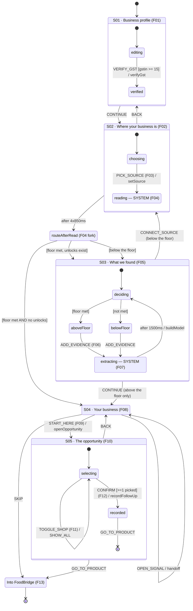

# Onboarding — the state machine, end to end

**Implementation notes for v5's onboarding flow.** Extracted from
`modules/foodbridge-onboarding/screens/onboarding.js` and `evidence.js` as
built — not a design document. The canonical UX is `versions/v5/ux/FLOW-MAP.md`
(lock `0ff5a4347c695a6b`); where this disagrees with that, the Flow Map wins and
this file is wrong.

`F01`…`F13` below are the locked Flow Map's node ids, so every implementation
state can be traced back to what was approved at GATE B.

---

## 1 · Context

```ts
interface OnboardingContext {
  // S01 — the business profile. Nothing here is read from the tenant except
  // the business name, and only after a GST verify.
  profile: {
    business: string;   // "" until typed, or filled by verifyGst
    name:     string;
    mobile:   string;
    email:    string;
    gstin:    string;   // ALWAYS starts empty. The seeded orgGstNumber is the
  };                    // wrong state (27=MH vs 18=AS shops) and is never shown
  gstVerified: boolean;

  // S02 — which source was chosen, and whether it yielded anything
  source:    { id: string; label: string; kind: 'connect' | 'files' } | null;
  connected: boolean;   // true only after a `connect` read completes

  // S03/S04 — the evidence model, rebuilt on every read and every extract
  model: EvidenceModel | null;
  note:  string;        // an honest message from a simulated boundary; cleared on go()

  // S05 — the opportunity
  opp:      MissedOrders | null;
  picked:   Record<string, boolean>;  // shopId -> in the follow-up
  showAll:  boolean;                  // false = first 4 shops only
  recorded: { shops: number; withSuggestion: number } | null;
}
```

**Withholding, not faking.** `WITHHOLD = ?evidence=none` is read once at load.
While `WITHHOLD && !connected`, the machine hands the evidence layer an **empty
order history** so the below-floor branch can be walked. It removes real data;
it never adds fabricated data.

### EvidenceModel (from `evidence.js` → `build()`)

```ts
{
  generatedAt: string,
  context:  { products, customers, suppliers, staff }   // each { present, count }
  evidence: { sales: {present, customers, orders}, invoices: {present}, payments: {present} },
  stock:    { quantities: boolean, cost: boolean },
  floor:    { met, hasMaster, hasSeries, hypothesis: 'UNVALIDATED — …' },
  computable: string[],      // order_cadence · stock_position · reorder_prediction · slow_stock_count
  blocked:    { id, needs }[],// receivables · collections · overdue_value · capital_tied · margin · purchase_exposure
  unlocks:    { evidence, label, unlocks[], say, short }[],
  signals:    { order_cadence?, stock_position?, reorder_prediction? },
  coverageSentence: string,  // words, never a percentage
}
```

### MissedOrders (from `evidence.js` → `missedOrders()`)

```ts
{
  id: 'missed_orders',
  total: 23, withSuggestion: 16,
  scope: { withHistory: 39, totalCustomers: 40 },
  shops: [{
    id, name,                 // name resolved from SEED.b2b[].name.en
    cycleDays, daysOverdue,   // that shop's OWN median cycle
    lastOrderAt, orderCount,
    usualProducts: string[],  // top 3 by frequency in its own orders — factual
    suggestion: { lines: number } | null,   // ONLY when ok && !historyIsStale
  }]  // sorted daysOverdue DESC
}
```

---

## 2 · The machine

```ts
createMachine({
  id: 'onboarding',
  initial: 's01Profile',
  context: initialContext,

  states: {

    /* ───────────────────────────── F01 ───────────────────────────── */
    s01Profile: {
      initial: 'editing',
      states: {
        editing: {
          on: {
            FIELD_INPUT: { actions: 'setField' },          // business|name|mobile|email|gstin
            VERIFY_GST:  { target: 'verified', guard: 'gstinLooksComplete',
                           actions: 'verifyGst' },
          },
        },
        verified: {},            // GSTIN row locked + green; Verify replaced by "Verified"
      },
      on: { CONTINUE: 's02Source' },
    },

    /* ───────────────────────── F02 · F03 · F04 ───────────────────── */
    s02Source: {
      initial: 'choosing',
      states: {
        choosing: {
          on: {
            PICK_SOURCE: { target: 'reading', actions: 'setSource' },   // F03
            BACK:        { target: '#onboarding.s01Profile' },
          },
        },
        // F04 — SYSTEM. Replaces the list IN PLACE. No decision is available
        // here, which is why the locked UX gives it no screen of its own.
        reading: {
          initial: 'step0',
          states: {
            step0: { after: { 850: 'step1' } },
            step1: { after: { 850: 'step2' } },
            step2: { after: { 850: 'step3' } },
            step3: { after: { 850: '#onboarding.routeAfterRead' } },
          },
          entry: 'renderReadSteps',   // connect: Connecting → products/customers → orders → Organising
        },                            // files:   documents → extracting → matching → Organising
      },
    },

    // F04's three-way fork, evaluated after the read completes.
    routeAfterRead: {
      entry: ['markConnectedIfConnect', 'noteIfDocuments', 'buildModel'],
      always: [
        { target: 's04Pulse', guard: 'floorMetAndNothingToAdd' },  // enough, nothing worth adding
        { target: 's03Check' },                                    // both other routes land here
      ],
    },

    /* ────────────────────────── F05 · F06 · F07 ──────────────────── */
    s03Check: {
      initial: 'deciding',
      states: {
        deciding: {
          always: [
            { target: 'aboveFloor', guard: 'floorMet' },
            { target: 'belowFloor' },
          ],
        },

        // S03-A. Already-supplied first, then only gaps that name what they buy.
        aboveFloor: {
          on: {
            ADD_EVIDENCE: { target: 'extracting', actions: 'setPendingGap' },   // F06
            CONTINUE:     { target: '#onboarding.s04Pulse' },  // offered ONLY here
          },
        },

        // S03-B. NO Continue exists — offering one would promise a view
        // FoodBridge cannot produce.
        belowFloor: {
          on: {
            CONNECT_SOURCE: { target: '#onboarding.s02Source.reading',
                              actions: 'setSourceTally' },
            ADD_EVIDENCE:   { target: 'extracting', actions: 'setPendingGap' },
          },
        },

        // F07 — SYSTEM. Extract → map → validate, then recompute in place.
        // Always returns to `deciding`: the floor is re-evaluated each time.
        extracting: {
          after: { 1500: { target: 'deciding',
                           actions: ['buildModel', 'noteCouldNotRead'] } },
        },
      },
    },

    /* ───────────────────────────── F08 · F09 ─────────────────────── */
    s04Pulse: {
      entry: 'ensureModel',
      on: {
        START_HERE:  { target: 's05Opportunity', guard: 'leadIsOpportunity',
                       actions: 'openOpportunity' },
        OPEN_SIGNAL: { actions: 'handoff' },   // a supporting row → existing destination
        SKIP:        { target: 'exited', actions: 'handoffDashboard' },
      },
    },

    /* ──────────────────────── F10 · F11 · F12 ────────────────────── */
    s05Opportunity: {
      initial: 'selecting',
      states: {
        selecting: {
          on: {
            TOGGLE_SHOP: { actions: 'toggleShop' },        // F11 — adjust the list
            SHOW_ALL:    { actions: 'showAllShops' },
            CONFIRM:     { target: 'recorded', guard: 'atLeastOnePicked',
                           actions: 'recordFollowUp' },    // F12
            BACK:        { target: '#onboarding.s04Pulse' },
          },
        },
        // F12's result. A STATE of S05, not a sixth screen: nothing is decided
        // on it, by the same rule that made S03 conditional.
        recorded: {
          on: {
            GO_TO_PRODUCT: { target: '#onboarding.exited', actions: 'handoffStockAudit' },
            BACK:          { target: '#onboarding.s04Pulse', actions: 'clearRecorded' },
          },
        },
      },
    },

    /* ───────────────────────────── F13 ───────────────────────────── */
    exited: { type: 'final' },   // the platform shell owns the window from here
  },
})
```

---

## 3 · Guards

| Guard | Expression | Where it bites |
| --- | --- | --- |
| `gstinLooksComplete` | `profile.gstin.trim().length >= 15` | Verify stays disabled until then |
| `floorMet` | `model.floor.met` | S03-A vs S03-B; decides whether Continue exists at all |
| `floorMetAndNothingToAdd` | `model.floor.met && !model.unlocks.length` | the only route that skips S03 entirely |
| `leadIsOpportunity` | `lead && lead.opportunity === true` | only `order_cadence` sets it, so only it gets **Start here** |
| `atLeastOnePicked` | `pickedCount() > 0` | CTA disabled and relabelled otherwise |
| *(inside `missedOrders`)* | `r.ok && !r.context.historyIsStale` | **16 of 23** shops get a suggested order |

---

## 4 · Actions

| Action | Effect |
| --- | --- |
| `setField` | `profile[k] = value`; re-evaluates `gstinLooksComplete` |
| `verifyGst` | **SIMULATED** — sets `gstVerified`, and fills `profile.business` from `SEED.tenant.name` **only if empty**. Nothing is looked up |
| `setSource` / `setSourceTally` | records the chosen source |
| `markConnectedIfConnect` | `connected = true` only for `kind === 'connect'` |
| `noteIfDocuments` | for `kind === 'files'`, sets the honest note: nothing was added from them |
| `buildModel` | `FB_EVIDENCE.build({ seed, history, predict })` — history withheld while `WITHHOLD && !connected` |
| `noteCouldNotRead` | "We couldn't read *x*. Nothing changed, and your data is untouched." |
| `openOpportunity` | `missedOrders(...)`, then **pre-selects every shop**, `showAll=false`, `recorded=null` |
| `toggleShop` | flips `picked[shopId]` |
| `showAllShops` | `showAll = true` (first render shows 4 of 23) |
| `recordFollowUp` | **SIMULATED** — `recorded = { shops, withSuggestion }` counted from what was actually selected. Nothing is stored beyond the session |
| `clearRecorded` | `recorded = null` on the way back to S04 |
| `handoff*` | sets `top.location.hash = '#/<route>'` when embedded, else loads `../../../index.html#/<route>` |

**`go(screen)` clears `note`** — a message from one step never bleeds into the next.

---

## 5 · Diagram



---

## 6 · Components, per state

| State | Components rendered |
| --- | --- |
| **chrome** (every state) | `.ob-brand` wordmark + `Step n of 4` · `.ob-prog` 4 segments · `.ob-navrow > .ob-back` where a back edge exists |
| **S01** | 2 × `.ob-fs` grouped field sets · 5 × `.ob-fr` rows with lucide icon + floating label · `.ob-verify` button → `.ob-fr-ok` once verified · `.ob-cta` Continue |
| **S02 choosing** | 4 × `.ob-source` with `.ob-mark` tinted glyph (db / cloud / store / doc) + `.ob-chev`. **No CTA** — the row is the action |
| **S02 reading** | `.ob-proc` rail · 4 × `.ob-pstep` with `.ob-pdot` (outlined → `.ob-spin` → filled green check). **No CTA, no percentage** |
| **S03 aboveFloor** | `.ob-ev` 3-cell evidence grid · `.ob-ev-note` "Ready to use in FoodBridge" · `.ob-optional` muted panel of `.ob-orow` + `.ob-addlink` · `.ob-cta` Continue |
| **S03 belowFloor** | 2 × `.ob-need` cards with `.ob-mark` + `.ob-chip` actions (Connect / Upload / Take photo). **No CTA by design** |
| **S03 extracting** | `.ob-proc` with 3 steps |
| **S04** | `.ob-eyebrow` · `.ob-lead-h` dominant headline · 2 × `.ob-lead-s` (why, where) · `.ob-support` rows · `.ob-unlock` one line per unlock · `.ob-coverage` · `.ob-cta` **Start here** · `.ob-skip` text link |
| **S05 selecting** | `.ob-opp-sum` count · N × `.ob-shop` with `.ob-box` checkbox, name, cadence + days overdue, usual products, optional `.ob-sugg` badge · `.ob-morebtn` · `.ob-caveat` · `.ob-cta` "Follow up with N shops" |
| **S05 recorded** | `.ob-done-ring` · `.ob-done-h` · `.ob-done-list` 3 rows · `.ob-next` what-happens-next · `.ob-cta` + `.ob-skip` |

---

## 7 · What is simulated

| Boundary | Machine effect |
| --- | --- |
| Tally / Zoho / Vyapar connect | `reading` runs 4 timed steps; `markConnectedIfConnect` reveals records this repository already holds. Nothing is contacted |
| Documents · extraction · mapping · validation | `extracting` always returns to `deciding` with `noteCouldNotRead`. **No result is ever invented** |
| GST verification | `verifyGst` accepts any 15-char input. Nothing is looked up |
| Recording the follow-up | `recordFollowUp` counts what was selected. Nothing persists; the next snapshot is not built |

None of it is captioned in the customer UI — that record lives in
`version.json` and `STATUS.md`, so **a session operator has to say it out loud.**
