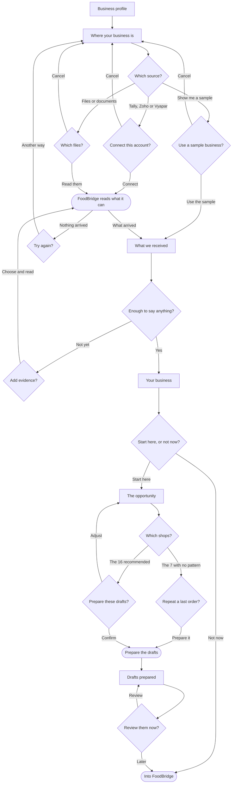

# Flow map — A new distributor's business is mostly in FoodBridge before they have to enter it manually

**One canonical UX artifact, and the diagram is the middle of it.** Three stages
live here and stay told apart — **ideal**, **mapping**, **refined** — and they
lead to one flow the user can be walked through.

## User goal

*"I've just signed up. My customers, products and suppliers are already in Tally
— or in Zoho, or Vyapar, or a folder of invoices. Pick that up, show me you got
my business right, and let me do one useful thing with it. Don't make me type it
all in again."*

Done, to them, is not "setup complete". It is **FoodBridge holding enough real
evidence to produce a useful first view, saying plainly what it is working from,
and giving them one thing worth doing.**

---

> ### STAGE 1 — IDEAL · written before you open the product

## Ideal UX

One sitting, on a phone, one decision at a time — and at no point does it ask for
something it could have fetched.

1. **"Yes, that's my business."** The account already exists — they signed up
   before they got here. What onboarding needs is the *business* confirmed: its
   name, who they are, how to reach them, and the GSTIN that identifies it.

2. **"My business is in Tally."** One question: where does the business live
   today? The answer is a tap, not a form. And for someone who wants to see
   what this is before handing anything over: **"show me with a sample
   business"** — a real answer to the same question, never a hidden mode.

3. **FoodBridge takes what it can.** Progress, and only progress. How it is done
   is FoodBridge's problem, not the owner's.

4. **"Here's what I have, here's what I can already tell you, and here's what
   would make it better."** One moment, three things at once — never three steps.
   Every gap is shown with **what it would unlock**, and with the fastest way to
   close it: connect it, upload it, or photograph it, without leaving.

5. **The strongest truthful view the evidence allows.** Not the view the product
   would like to show.

6. **"Here's what needs attention, and here's one thing you can do."**

7. **The action** — which opens the loop: action → outcome → the next view,
   built only from what changed.

**Four things the ideal refuses, however good they would look:**

- **A signal without its evidence.** What cannot be computed is **absent**, not
  zero and not estimated. An empty Receivables card reading ₹0 is a lie; no
  Receivables card is the truth. L-005 is the record of what that costs.
- **A gate disguised as a checklist.** Missing data reduces what can be said. It
  does not stop the journey — unless there is genuinely nothing true to say yet.
- **A second setup process.** Building the view is a system state, never a
  destination, and never a screen the user has to get through.
- **Coverage as a score to fill in.** It is a disclosure — *this is what I am
  working from* — not a progress bar, and never "complete your setup".

### The evidence floor — an explicit, unvalidated hypothesis

> **FoodBridge has enough evidence to produce a useful first view when it holds
> at least one entity master** (customers or products) **and at least one
> transactional series over time** (orders, invoices or payments).

Masters alone are a directory; transactions alone cannot be attributed to anyone.

**This is a hypothesis and is deliberately not phrased as understanding.**
FoodBridge does not claim to *understand a business* — that is a product promise
nobody has earned yet and no customer has confirmed. It claims only that it can
produce a **useful first view**, which is a thing a customer can look at and
disagree with. The floor itself is reasoned from the Control Tower reference and
from what this repository holds; **no customer has been watched hitting it, and
nothing here validates it.**

**Amended 16 September 2026 — four times, each a premise or a fact, never a
compromise.** Step 2 gained *"show me with a sample business"*: someone who has
not decided to trust us yet still has a real answer to "where does your
business live", and hiding it behind a URL flag made it invisible to the person
who most needs it (D-018).

**Amended 16 September 2026 — three times before that, and each was a premise,
not a compromise.** Step 1 originally read *"Make me an account"*; the owner corrected
the premise that onboarding starts at signup (D-014). Step 4 originally checked
four master-data rows and blocked on missing ones; the evidence model replaced it
(D-015). The floor was originally written as *"can honestly say I understand your
business"*; that overclaims, and it now reads as a useful first view. Stage 1 is
never edited to fit what the product turned out to have — that is Stage 3's job.

The first order is deliberately **not** here. It is what activation is measured
by afterwards, not a step walked through so the flow has an ending.

---

> ### STAGE 2 — MAPPING · now read the product

## Product mapping

Every row was read out of the repository. The promoted Stock Audit page under
`master/modules/foodbridge-customer-mockup/v3/screens/customers/` is the
reference surface: the product's newest and only phone-tested one.

| Ideal element | Existing FoodBridge | Verdict | Decision | Note |
| --- | --- | --- | --- | --- |
| Confirm the business profile | **nothing.** No profile, settings or company destination in any of the 26 — `modules.json` has none, no `*profile*` or `*setting*` screen exists | MISSING | NEW | the account exists before onboarding; the business behind it has nowhere to be stated |
| The business's identity fields | `seed.inline.js:510` — `orgGstNumber`; customers carry `gstType`/`gstNumber` (`:69-70`) | PARTIAL | REWIRE | GSTIN is established across procurement, dashboard and retails-overview. Nothing renders the tenant's own — **and the seeded value is the wrong state, see Open questions** |
| Verify the GSTIN, inline | **nothing** | MISSING | NEW | simulated (D-014) |
| Say where the business lives | nothing | MISSING | NEW | no import or connection surface in any of the 26 |
| Read from a connected system | `integrations/zoho/zoho.js` — `POST /salesorders`, `GET /salesorders/{id}`; a contacts/items `listAll` exists in `audit-mappings.js` | PARTIAL | NEW | the bridge **writes** orders; reading was never a product surface. Simulated (D-012) |
| Supply evidence by upload or photograph | **working precedent** — `procurement/screens/screen-02.html:808` multi-file, `accept=".pdf,.jpg,.jpeg,.png,image/*"`, drag-drop, Save gated on amount + files | PARTIAL | REWIRE | `image/*` opens the camera on a phone, so upload · photo · scan is **one control, not three** |
| Parse a spreadsheet | `procurement/screens/screen-09.html:341` CSV import is **cosmetic** — its change handler only closes a dropdown | MISSING | NEW | simulated |
| Extract · map · validate | nothing anywhere | MISSING | NEW | simulated, behaving like the eventual contract |
| Products, understood | `seed.inline.js` — **86**, Miha's real catalogue with real Zoho `artNo`s | EXISTS | REUSE | **25 of 86 at `systemStock: 0`** |
| Customers, understood | `seed.inline.js` — **40 B2B**, Miha's real Guwahati shops | EXISTS | REUSE | plus 12 synthesized retail |
| Suppliers / Staff, understood | **nothing for this tenant** — 5 sellers and 13 staff exist, belonging to other demo stores | MISSING | NEW | D-013: never borrowed. D-015: **and never blocking** — they are context, not evidence |
| Sales evidence | `order-history.js` — **real**, from the tenant's own Zoho export | EXISTS | REUSE | **39 of 40 customers · 532 orders · 3,931 lines · 2024-08-28 → 2026-08-24**. Loaded at `stock-audit.html:95`, adopted at `seed.inline.js:368` |
| Cadence signal | `orderingStatusFor()`, `stock-audit.js:1061` | EXISTS | REUSE | buckets Overdue (>5 days past expected) / Slipping / On Track from each customer's median cycle |
| Reorder signal | `FB_PREDICT.generatePredictiveOrder()` | EXISTS | REUSE | UI-free, deterministic, back-tested at 66.5% precision / 69.6% recall on 171 unseen 2026 orders |
| Evidence & coverage metadata | nothing | MISSING | NEW | the model below; internal, never rendered as a score |
| The opportunity, opened narrowly | nothing. The 26 destinations are modules, not opportunities — Stock Audit & Health is a rep's field tool, not "these 23 shops stopped ordering" | MISSING | NEW | the reference's own rule: recommend a narrow workflow rather than ask the user to configure a module |
| Which shops, and why each one | `order-history.js` + the evidence layer's cadence rule | EXISTS | REUSE | per shop: its own median cycle, last order date, days past due, order count |
| What each shop usually buys | `order-history.js` — `orders[].lines[]` | EXISTS | REUSE | frequency across that shop's own orders. Factual, not predicted |
| A proposed reorder | `FB_PREDICT.generatePredictiveOrder()` | EXISTS | REUSE | **only where `ok && !historyIsStale`** — 16 of the 23 overdue. The other 7 get what they used to buy and no proposed quantities |
| Connection consent, before anything is read | nothing | MISSING | NEW | what is read, what never changes, and an explicit Connect. Nothing starts on a tap of a logo |
| Choosing files, and a camera | **working precedent** — `procurement/screen-02.html:808`: multi-file, `accept=".pdf,.jpg,.jpeg,.png,image/*"`, drag-drop, gated save | PARTIAL | REWIRE | `image/*` is the camera on a phone. The precedent has been sitting unused |
| Sample business | nothing | MISSING | NEW | the same fixture records under an unmistakable amber provenance. Never mixed with a connection, never switched silently |
| Inspecting what arrived | nothing | MISSING | NEW | ~5 representative records + total + provenance, in a sheet. Not a browser |
| Why FoodBridge thinks this | `orderingStatusFor` fields + `FB_PREDICT.context` | EXISTS | REWIRE | cycle, last order, order count, source dates — already computed, never shown |
| A draft reorder | `FB_PREDICT.generatePredictiveOrder()` lines, each carrying its own `basis` | EXISTS | REUSE | `suggestedQty` is kept immutable beside an editable `qty`, so what FoodBridge proposed stays legible next to what a human changed |
| Repeating a shop's last order | `order-history.js` — `orders[0].lines[]` | EXISTS | REUSE | a fact, not a prediction. It is what gives the stale shops a real action |
| Sheets, drawers, toasts | `window.FB_SHELL` — `openDrawer`, `openModal`, `toast` | EXISTS | REUSE | the product's own overlay layer, unused until now |
| Surviving a reload | nothing | MISSING | NEW | `sessionStorage` for mode and prepared drafts only. A refresh must not destroy confirmed work |
| In-app history | nothing | MISSING | NEW | one hash per primary screen, so browser-back maps to in-app back |
| Recording the action, and the outcome | nothing | MISSING | NEW | simulated. Drafts are prepared and held; nothing is sent, and the next snapshot is not built |
| Action → outcome → next view | nothing | MISSING | NEW | the loop is named in the journey; only the first action is built here |

### The two kinds of evidence this tenant does not have

Neither is a row above, because neither is an ideal element waiting to be built —
they are evidence that does not exist, and that is a fact about the business
rather than a gap in the product:

- **Invoices.** `invoice.html` is marked *"VIEWS, NEVER CREATES"* — it renders an
  order that was already raised. There is no invoice dataset, for any tenant.
- **Payments.** The only payments data is
  `invoice-payment-overview/seed-data/seed.json`: a bakery business (Brown Bread,
  Milk Bread; Nishant, Kunal Sweet Shop) with **zero name overlap** against
  Miha's 40 shops, and 8 of its 12 rows entirely empty. Not this business's, and
  barely a dataset even for its own.

Together they are why the whole receivables half of the Control Tower is absent
below, and they are the single most valuable thing a fresh Zoho export would add.

### What the evidence allows — the capability matrix

This is not a mapping table — it is what the evidence *permits*, which is a
different question from what the product already has.

```
SIGNAL                        NEEDS                        MIHA'S HAS      VERDICT
receivables outstanding       invoices + payments          neither         not computable
overdue payments, customers   invoices + payments          neither         not computable
collections due               invoices + payments          neither         not computable
purchase exposure             purchase orders              no              not computable
capital tied in stock, in Rs  stock qty + cost             qty only        not computable in Rs
slow-moving stock, in Rs      stock + movement + cost      no cost         not computable in Rs
slow-moving stock, by SKU     systemStock + order lines    yes             COMPUTABLE
out of stock                  systemStock                  yes             COMPUTABLE - 25 of 86
expiry risk                   batch / expiry detail        4 customers     too thin to use
shops overdue an ORDER        order-history.js             yes, 39 of 40   COMPUTABLE
what a shop should reorder    order history + stock        yes             COMPUTABLE
order-value trend             order value                  yes             COMPUTABLE - matched
                                                                           lines only, never an
                                                                           invoice total
```

**Every rupee figure the Control Tower reference leads with is unavailable to
Miha's.** Everything computable is about order cadence and stock position. That
is not a lesser story: *"nine shops have not ordered when they normally would"*
is working capital, said in evidence we actually hold.

### The internal evidence model — and it is never rendered

```
evidence    sales REAL(532 orders · 39/40 · 2y) · invoices ABSENT ·
            payments ABSENT · inventory QTY_ONLY · cost ABSENT
context     products 86 · customers 40 · suppliers 0 · staff 0
computable  order_cadence · stock_position · reorder_prediction · slow_stock_count
blocked     receivables · collections · capital_tied · margin · purchase_exposure
floor       met — one master (products, customers) + one series (sales, 2y)
unlocks     invoices + payments -> receivables, collections, overdue_value
            cost               -> capital_tied, slow_stock_value, margin
```

`unlocks` is what keeps the gap list honest rather than nagging: nothing is shown
as missing unless it buys the user something nameable. **A field existing in the
backend is not a reason to ask for it.**

`MISSING` → `NEW` means a new screen, component or interaction **inside**
FoodBridge — never, by itself, a new module, API or domain model.

---

> ### STAGE 3 — REFINED · the ideal UX, in the product's language

## Refined UX

In FoodBridge's existing mobile language, under one hard rule that governs
every primary surface (D-018):

> **MUST-HAVE ONLY.** Every visible element must explain the current state,
> support the current decision, or enable the current action. Anything else
> moves to a sheet or is cut. One dominant message, one dominant action,
> minimal supporting data. **HEADLINE → KEY FACT → ACTION** — never headline,
> paragraph, explanation, cards, CTA. Ambiguity is solved by cutting, never by
> adding copy.

**Five primary screens, and nine contextual sheets that carry everything else.**

**S01 Business profile.** Two groups — the business, and how to reach you —
five icon-led rows, GSTIN empty with Verify beside it. Verified changes the
field; no sentence explains that it did.

**S02 Where your data is.** The question, four sources, and one quieter row:
*explore with a sample business*. No instruction line — the rows are the
decision. Tapping one opens its **consent sheet**; nothing is read until the
user says so.

**S03 What we received.** Three tappable figures. Each opens an **inspect
sheet** carrying five representative records, the total and the provenance.
Gaps are one short label each with their unlock named. The transition is
semantic: **See what this means**.

**S04 Your business.** A headline that carries its own fact — *23 shops are
past their usual order date* — and one action. **Usual is per shop**, and the
word does that work in the headline, so no key-fact line sits under it. How the
date is derived, the rhythm, the coverage and the method all live behind **Why
this matters**. Two compact secondary opportunities, one line each.

**S05 The opportunity.** Four states of one screen, entered on a **brief** —
never on a selection task: *23 stopped · 16 we can prepare · 7 need your eye*.
Then the recommended list with **nothing selected**, because a recommendation
must never become a choice the user did not make. Then an explicit confirm
naming exactly what changes, then the prepared state whose primary action is
**Review 16 drafts**.

**What it is built out of.** S01 is `NEW` — no profile surface exists anywhere —
but its GSTIN field `REWIRE`s `orgGstNumber` and `gstType`/`gstNumber`, which no
screen has ever rendered; its Verify is `NEW` and simulated. S02 is `NEW`, and
the connected read behind it is `NEW` and simulated. S03's evidence upload
`REWIRE`s the procurement module's working multi-file attach — including the
camera, since `image/*` already opens it — while extraction, mapping and
validation are `NEW` and simulated. S04 `REUSE`s two engines that already ship,
`orderingStatusFor()` and `FB_PREDICT.generatePredictiveOrder()`, and `REWIRE`s
their output from a rep's working screen into an owner's first view. Every action
`REUSE`s an existing destination. **Nothing here needs a new domain model, a new
API or a new module.**

**What changed from the ideal, and why:**

- **Every consequential operation is now started by the user.** Timers
  simulate backend work only *after* an explicit start, and each is
  cancellable. Tapping a source used to begin reading; it now opens consent.
- **Eleven elements moved off primary screens into the sheet that owns them,
  and seven were cut outright** as reassurance, instruction or duplication —
  most of them copy added in earlier passes while trying to make screens feel
  considered. Explanation is the easiest thing to add and the hardest to
  justify.
- **"Follow up" became "prepare draft reorders".** An action nobody had defined
  became one the product actually performs, with a stated effect: drafts built
  from real predicted lines, held for review, sent to nobody.
- **The post-S03 journey was rebuilt to meet the ideal, not to change it.**
  Steps 6 and 7 of Stage 1 always said *"here's one thing you can do"* and
  *"the action — which opens the loop"*. The first refined pass under-delivered
  that: it named an insight and handed the user to an existing module to work
  out what to do for themselves. FoodBridge now does the reasoning. **The ideal
  did not move; the refinement finally reached it.**
- **A proposed reorder appears for 16 of the 23 overdue shops, not all.** A shop
  is overdue *because* it stopped ordering, which is exactly what makes its
  history stale — so the contract that protects the prediction silences it on
  the very shops this opportunity is about. Those 7 show what they factually
  used to buy, and no proposed quantities.
- The ideal's "strongest truthful view" is, for this tenant, **a view with no
  money in it**. No cost and no trade price on the 86 products, no invoices and
  no payments anywhere — so receivables, collections, capital-tied and margin are
  absent. The ideal was not weakened; it was applied, and this is the bill.
- Two of the four context rows are empty for Miha's, and under D-015 that is
  **disclosed rather than blocking**. They are context, not evidence.
- The evidence check and the first view stayed two screens, not one. Showing an
  insight above a gap the user has not closed means the insight rewrites itself
  while they read it.
- The check screen became **conditional**, and when it does appear it has two
  different shapes depending on the floor. A confirmation with no decision in it
  is a tap tax; a Continue offered below the floor is a lie about readiness.
- The "nowhere yet" source stays out (D-013) — a different journey, and one that
  lands below the evidence floor by definition.
- Extraction, mapping, validation and view computation are **system states**.
  None becomes a screen; none is named in the UI.

## Screen budget

Answer both, in writing, on their own lines. Start at one screen and argue your
way up — never start high and tidy down.

One screen: it fails on a dependency, not on length. The evidence view cannot be
rendered until the read has run, and the read cannot start until the source is
chosen, so a single surface has to blank and repaint itself three times. That is
three screens wearing one name, and on a 390px phone the progress state has
nothing to replace.

Two screens: (A) profile and source, (B) everything after. Closer than it looks,
and I built it — but B then carries two genuinely different decisions: *do I
supply more evidence, or continue?* and *which action do I take?* The first
changes what the second is able to say. An insight sitting above an unclosed gap
silently rewrites itself as the gap closes, which is the trust ordering D-012
fixed, failing in a new way.

Why more than two: five moments carry a real user decision — **identity**,
**source**, **what arrived**, **the first view**, and **the opportunity** — and
the count has not moved since D-017. What changed in D-018 is where everything
*else* lives.

Nine contextual sheets now carry consent, file choice, sample confirmation,
record inspection, added evidence, the reasoning behind the insight, shop
detail, the action confirmation, and the drafts themselves. **None of them is a
screen**: each is opened from a decision the user is already making, returns to
where it was opened from, and closes on back.

That is the whole budget argument under the must-have rule: a sixth primary
screen would mean a decision that does not fit any of the five, and there is
none. Every candidate — *review what arrived*, *understand why*, *confirm the
action*, *inspect a draft* — is a deeper look at a decision already in
progress, which is what a sheet is for.

**The count is a consequence, not a target.**

## Flow

One diagram. What the user does, what they see, what they decide, where they go
next — and nothing else.



The F05 → F07 → F05 loop **recomputes in place**: the user watches the view
improve rather than being sent somewhere, and the floor is re-evaluated each
time, so Continue appears the moment there is enough to say.

## Screens

| Screen | Flow node | Purpose | Must-have only |
| --- | --- | --- | --- |
| S01 | F01 | Confirm the business the account already belongs to | Two groups, five icon-led rows, GSTIN with Verify, Continue. **No lede, no reassurance line** |
| S02 | F02 | Say where the business lives — or ask to be shown | The question, four sources, one quieter sample row. **No instruction line.** Consent opens in a sheet |
| S03 | F08 | Show what actually arrived, and let it be checked | Three tappable figures, gaps as one short label each, **See what this means**. Provenance lives in the inspect sheet |
| S04 | F12 | One true thing, and one way in | A headline carrying its own fact, two compact opportunities, **Start here**, *Why this matters*. **No key-fact line — the headline is the fact. Reasoning and coverage live in the drawer** |
| S05 | F15 F20 | Open the opportunity, act on it, and hold the result | Brief first, never a selection task. Recommended list with **nothing pre-selected**. Explicit confirm. Prepared state whose primary action is **Review drafts** |

*Every `["…"]` node in the diagram has a row here; decisions and system steps do
not.*

**MUST HAVE only.** There is no good-to-have. If content is not needed to
complete the task, make the decision, or understand the state — remove it.

## UX decisions

- **Missing evidence never blocks the first useful view** (D-015, superseding
  D-013). Rejected: blocking Continue on missing rows. Missing data reduces what
  can honestly be computed; it does not stop the journey. The only stop is the
  evidence floor.
- **Below the floor there is no Continue.** Rejected: an ambiguous "Go on" that
  behaved the same either way. Above the floor the action is **Continue** and it
  means *proceed without the optional evidence*; below it, no such action exists,
  because offering one would promise a view FoodBridge cannot produce. Two states
  of one screen, and they must look different.
- **FoodBridge claims a useful first view, not understanding.** Rejected: *"we
  understand your business"* as internal or external framing. Understanding is a
  product promise nobody has earned; a useful first view is a claim the customer
  can inspect and reject. The floor stays marked as an unvalidated hypothesis.
- **The GSTIN field starts empty.** Rejected: pre-filling the tenant's seeded
  `orgGstNumber`. It is `27…` (Maharashtra) against Assam shops, so showing it
  back would be the product asserting something false on the screen that asks to
  be believed. Verified is a *resulting* state, never the drawn default.
- **Two axes, never one list** (D-015). Business context *describes*; snapshot
  evidence *proves*. Rejected: one checklist of six equal rows.
- **Absent, never zero.** Rejected: rendering a blocked signal as ₹0, greyed, or
  as a promise; borrowing another tenant's numbers; generic "complete your setup"
  language.
- **Every gap states what it unlocks.** Rejected: listing a gap because the
  backend has a field for it.
- **The check screen is conditional.** Rejected: a confirmation screen that
  always appears.
- **Upload, photo and scan are one control.** Rejected: separate screens. The
  procurement module already proves one input handles files, PDFs and the camera.
- **A file says what it holds; the user is asked only when it cannot** (17
  September 2026). Rejected: a "what's in this file?" label on every file
  before anything is read — the columns already answer, and Stage 1 refuses
  to ask for what could have been fetched. Rejected too: reading the name,
  which is cheap and often wrong; and reading on add, before *Read*, which
  would make choosing a file a consequential act. The one genuine ambiguity —
  a bare *Name* column, products or customers — is asked after the read, in
  the row, narrowed to those two. Each file's row then carries what came out
  of it, in S03's own numbers, so F05 → F07 → F08 has the same shape as
  F04 → F07 → F08.
- **Coverage is stated in words, not as a percentage.** Rejected: the reference's
  `82%`. A score invites optimisation and reads as unfinished setup.
- **Extraction, mapping, validation and computation are system states.**
  Rejected: a screen for any of them.
- **Business Pulse is not three fixed cards**, and the first action is chosen
  from the signals the evidence produced — never a fixed onboarding card.
- **MUST-HAVE ONLY on every primary screen** (D-018). Each visible element
  explains the current state, supports the current decision, or enables the
  current action — or it moves to a sheet. Rejected: solving ambiguity with a
  subtitle, a paragraph, reassurance, methodology or a second metric. Eleven
  elements moved into sheets and seven were cut; most were copy added in
  earlier passes to make screens feel considered, which is exactly the habit
  this rule exists to stop.
- **Nothing consequential starts on its own** (D-018). Rejected: a tap on a
  source beginning a read. A source opens consent; the user connects; only then
  does a timer stand in for the backend, and it can be cancelled.
- **The product's front door opens on F01** (D-019). Rejected: leaving a bare
  `/v5/` on the shell's default destination and handing testers a deep link.
  The flow always began at the business profile; until 5.2 the URL did not.
  Onboarding claims the landing **without joining the sidebar** — rejected as
  well was adding it there, which would make it look like a place the user can
  come back to.
- **Sample mode is a first-class answer, and unmistakable** (D-018). Rejected:
  a hidden URL flag, which made the option invisible to the person who most
  needs it. Rejected too: any silent switch between modes — leaving the sample
  discards everything derived from it, and says so first. Persistent amber
  provenance, never green, because green is this product's affirmative colour.
- **`suggestedQty` and `qty` are separate fields** (D-018). Rejected: editing
  the proposal in place. What FoodBridge proposed must stay legible beside what
  a human changed — that difference is the most useful thing a session can
  teach us about whether the prediction is trusted.
- **A recommendation never arrives pre-selected** (D-018). Rejected: the 23
  pre-ticked shops of the previous design, which presented the machine's
  opinion as the user's choice. Recommended is *marked*; selecting all sixteen
  is one deliberate tap.
- **The stale shops get a real action, not a label** (D-018). Rejected: a
  "needs review" bucket with nothing in it. Their last actual order is a fact,
  so *repeat their last order* is offered — never described as a
  recommendation, because it is not one.
- **Completion states describe what actually happened** (D-018). Rejected:
  "Started Today", which claimed an external action over a prototype that
  persisted nothing. Drafts are *prepared*, and the screen says so.
- **Confirmed work survives** (D-018). Rejected: Back quietly discarding
  prepared drafts. Mode and drafts persist across a reload; discarding is
  explicit and confirmed.
- **Onboarding progress is not activation** (D-018). Rejected: "Step 5 of 5".
  Setup is Steps 1–3; S04 and S05 carry no counter because the setup is over.
- **Start here opens an opportunity, never a module** (D-017). Rejected: the
  previous behaviour, which sent the user to Stock Audit & Health and left them
  to work out which 23 shops and what to do. A module is a place; an
  opportunity is a decision already reasoned through. The reference is explicit
  about this and it was the right correction.
- **A proposed reorder only where the engine's own contract allows it** —
  `ok === true` **and** `historyIsStale === false`. Rejected: showing predicted
  quantities for every overdue shop. The 7 shops most overdue are precisely the
  ones whose pattern has gone stale, and presenting an old pattern as a current
  proposal is the trust failure L-005 records, dressed as helpfulness. They get
  what they factually used to buy instead.
- **Shops arrive pre-selected, and stay adjustable.** Rejected: an empty list
  the user has to build. FoodBridge did the reasoning; making them redo it is
  the thing this screen exists to prevent.
- **The outcome is a state of S05, not a sixth screen.** Rejected: a separate
  confirmation page. Nothing is decided on it, and a screen with no decision is
  a tap tax — the same rule that made S03 conditional.
- **Suppliers and Staff are never borrowed** (D-013), and never block (D-015).
- **No first order in onboarding** (D-012). **No "Nothing yet" source** (D-013).

## Open questions

- **Sample mode reuses the same fixture records as a connection.** The amber
  provenance makes the labelling unmistakable, but the underlying data is
  identical — the honest consequence of refusing both to borrow another
  tenant's data (D-013) and to fabricate a business. A sharp customer could
  notice. The alternative is building a synthetic sample business, which is
  fabrication of a different kind, and that is a product decision.
- **`sessionStorage` is a new persistence mechanism** in a prototype that has
  held everything in memory until now. It is small and exists only so a reload
  cannot destroy confirmed work — but it is a real addition rather than an
  implementation detail.
- **Recording the follow-up is simulated, and the next snapshot is not built.**
  The journey names the loop — action → outcome → next snapshot — because the
  design must not foreclose it, but only the first action exists in this
  version. What a second snapshot compares against is undecided.
- **Whether a follow-up is even the right action** for a shop that stopped
  ordering. Calling, messaging and proposing an order are three different
  moves, and no customer has been watched choosing between them.
- **The evidence floor is an unvalidated hypothesis.** One master plus one
  transactional series. Reasoned from the reference and from what this repository
  holds; no customer has been watched hitting it, and nothing validates it.
- **What a customer below the floor is actually offered**, beyond "supply
  evidence". They cannot leave, so what holds them there has to be worth staying
  for — and it is undesigned.
- **Whether Miha's should get real invoice and payment evidence.** A fresh Zoho
  export would unlock the entire receivables half of the Control Tower. Today the
  strongest truthful signal is cadence, not cash.
- **The tenant's seeded GSTIN is the wrong state** — `27…` (Maharashtra) against
  `18…` (Assam) shops. The field starting empty avoids showing it, but the
  underlying record is still wrong.
- **This flow sits before the product's own model of a user.** master has no user
  model, no session and no tenant creation. `MISSING → NEW` means new screens,
  never by itself a new module — and which it should be here is **not decided,
  and not mine to decide.**
- **master's runtime is a desktop iframe shell** with measured per-destination
  clip offsets. A mobile-first flow does not sit inside it;
  `experiments/shell-free-app/` is the worked alternative.
- **Both hypotheses behind this are still `INFERRED`, `LOW` confidence, with no
  customer heard** (L-012, L-013).
